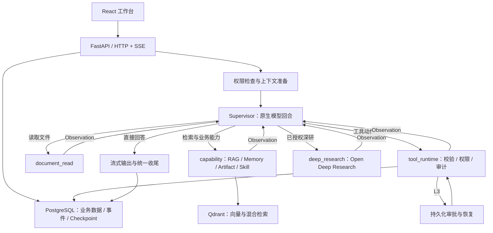

# InsightGap-Agent · 信息差 Agent 工作台

> 发现信息差，验证判断，把研究转化为可保存、可复用的成果。


InsightGap-Agent 是一个基于 FastAPI、React 和 LangGraph 的全栈 Agent 应用，围绕「发现 → 解释 → 验证 → 行动 → 沉淀」组织信息流、对话、文档检索、深度研究和工具执行。

深度研究能力集成自 [LangChain Open Deep Research](https://github.com/langchain-ai/open_deep_research)。本项目在其基础上扩展 Web 工作台、单一原生 Supervisor、模型连接管理、工具权限与人工审批、RAG、长期记忆和运行审计。Python 包名仍保留 `open_deep_research`。


## 目录

- [核心能力](#核心能力)
- [运行架构](#运行架构)
- [文档与检索](#文档与检索)
- [工具治理与审批](#工具治理与审批)
- [本地启动](#本地启动)
- [配置参考](#配置参考)
- [项目结构](#项目结构)
- [测试与验证](#测试与验证)
- [界面预览](#界面预览)
- [进一步阅读](#进一步阅读)
- [开源许可与致谢](#开源许可与致谢)

## 核心能力

| 能力 | 当前实现 |
| --- | --- |
| 信息差发现 | 汇集 GitHub、arXiv、RSS、DuckDuckGo、Tavily、SerpAPI 和手动种子，进行去重、评分和卡片生成；结合画像解释显性相关、邻近机会与远域启发 |
| Agent 对话 | 同一 Supervisor 直接流式回答或发起原生工具调用，读取结果后继续；支持运行记录、进展事件、取消和适用阶段的追加指令 |
| 模型连接 | 在设置页管理供应商连接、协议、地址、加密密钥与自定义 Headers；获取或手动添加模型，测试生成并选择会话模型 |
| 会话文件 | 读取已发送附件，同一会话跨轮追问；直接读取与按需检索结合，记录文件范围、证据与内容覆盖情况 |
| RAG 验证 | 结构化 Parent / Child 切分、文档摘要、Dense + Sparse/BM25 检索、RRF 融合、可选模型重排与证据组装 |
| 深度研究 | 经授权调用 Open Deep Research 子系统，生成研究报告；研究服务保留降级路径，并记录是否使用 fallback |
| 受控工具 | 通过工具注册、JSON Schema 参数校验、权限分级、审批和审计执行搜索、本地文件、邮件等能力 |
| 成果与记忆 | 管理 Artifact、长期 Memory 和 Skill 草稿；运行时对显式成果保存、记忆写入和技能创建检查授权 |
| 上下文管理 | 结合近期消息、运行摘要、历史片段、记忆、文档证据和页面上下文，通过 GSSC 控制上下文选择与预算 |

典型使用流程：从信息差卡片进入对话，上传自己的材料验证判断，按需发起研究或工具行动，再把结果保存为报告、记忆或可复用技能。

## 运行架构

当前运行时采用**单一原生工具调用 Supervisor**。入口先做权限检查和轻量上下文准备；模型直接输出文本，或选择一个动作。动作结果以 Observation 返回同一 Supervisor，由它决定继续还是结束。



实际运行图包含七个节点：`permission_guard`、`bootstrap_context`、`supervisor`、`capability`、`deep_research`、`tool_runtime` 和 `document_read`。独立入口分类、旧 Planner / dispatcher / evaluator、JSON 正文转工具调用和独立回答模型已移除。

- **模型选择固定**：当前任务使用选定模型，不会静默切换到另一个供应商或用 JSON 解析替代原生工具协议。工具任务需要模型支持原生 tool calling。
- **有界执行**：默认最多 12 次 Supervisor 决策、8 次工具执行、1 次深度研究，连续失败上限为 3 次；单个原生模型回合默认超时 60 秒。
- **流式可追踪**：通过 `agent_text_started/delta/completed` 发布文本，结合事件账本恢复展示；使用 `text_id` 去重，断流时保留部分答案。
- **控制有边界**：普通聊天和直接文档读取支持运行中追加指令；进入其他业务能力前关闭该类控制。
- **版本有边界**：新任务记录 `runtime_version=2`、`loop_protocol_version=1`；旧历史仍可读取，旧 checkpoint 不转换、不恢复到新循环。

实现入口见 [运行图](src/web_app/agent/runtime/graph_builder.py)、[Supervisor](src/web_app/agent/runtime/nodes.py) 和 [原生模型流协议](src/web_app/agent/llm/native_turn.py)。详细边界见 [原生运行架构](docs/native_runtime.md)。

## 文档与检索

会话文件读取与知识库检索是两种互补路径。已随消息发送的文件会进入会话文件清单，后续追问可再次引用；文件读取受当前用户、会话文件范围和上下文预算约束，超出读取范围的内容会标注覆盖限制。

知识库检索流程：

```text
上传与解析
  → 结构化 Parent / Child 切分
  → 可选 Section Summary / Overview
  → PostgreSQL 保存 Chunk，Qdrant 建立检索索引
  → 查询分析与 Dense + Sparse/BM25 召回
  → RRF 融合与可选重排
  → 回查 Parent，组装证据与来源
  → 返回 Supervisor 生成回答
```

- Child 用于精准召回，Parent 补足段落上下文；Section Summary 和 Overview 支持总览类问题。
- 检索结果区分正常、降级、无证据和检索失败，避免把缺失证据当成已验证结论。
- 未配置 Qdrant 时可以走 BM25 降级路径；完整向量检索需要有效的 Embedding 服务和匹配的集合维度。
- `.env.example` 选择 `qdrant_hybrid`，而代码未配置时默认 `python_bm25`；请按实际服务条件明确设置。
- 模型重排默认关闭（`RAG_RERANK_MODE=off`），可通过 Jina 配置启用；检索效果和耗时需要在自己的文档集上评估。
- 聊天长文档上传不等待可选 LLM 摘要；纯图片直答保留多模态路径，混合附件可将图片理解结果加入上下文。

检索实现见 [RagService](src/web_app/services/rag_service.py)、[检索器](src/web_app/rag/retriever.py) 和 [证据组装](src/web_app/rag/evidence.py)。

## 工具治理与审批

工具调用经过 `ToolSpec → 参数校验 → 权限与风险检查 → ToolCall 审计 → 执行或审批`。执行层也会校验参数，避免绕过运行时直接调用产生未校验的动作。

| 等级 | 类型 | 策略 |
| --- | --- | --- |
| L0 | 纯计算 / 内部读取 | 直接执行 |
| L1 | 公开或本地信息读取 | 执行并记录 |
| L2 | 本地写入 / 草稿 | 受限执行 |
| L3 | 外部写入 | 人工审批后执行 |
| L4 | 高危不可逆动作 | 默认阻断 |

L3 动作通过 LangGraph `interrupt()` 暂停，保存 ToolCall、Approval 和 PostgreSQL checkpoint；用户批准或拒绝后，通过 `Command(resume=...)` 恢复已冻结动作，结果返回 Supervisor。

持久化审批恢复使用 PostgreSQL。内存 checkpoint 仅适合开发测试，重启后丢失；当前 Supervisor 不支持 Redis 恢复配置。若外部动作已成功、但本地结果提交前进程崩溃，缺少供应方幂等支持时仍可能出现「结果未知」；此时停止自动重试，不承诺任意外部系统的绝对 exactly-once。

## 本地启动

以下命令从仓库根目录执行，以 PowerShell 为例。macOS / Linux 可将 `Copy-Item .env.example .env` 替换为 `cp .env.example .env`；使用 `uv run` 无需手动激活虚拟环境。

### 1. 准备依赖

- Python 3.10+、[uv](https://github.com/astral-sh/uv) 和 Git。
- Node.js `^20.19.0 || >=22.12.0`（与前端 `engines` 一致）。
- 可连接的 PostgreSQL 数据库。
- 可用于文本生成的模型服务；工具任务还需要原生工具调用能力。
- Qdrant 与 Embedding 服务按需配置，用于完整文档与记忆向量检索。

```powershell
git clone https://github.com/Ordish-cell/InsightGap-Agent.git
cd InsightGap-Agent
uv sync
Copy-Item .env.example .env
```

### 2. 配置数据库与凭据加密

编辑 `.env` 中的基础配置：

```dotenv
APP_ENV=local
SECRET_KEY=<随机应用签名密钥>
MODEL_CREDENTIALS_ENCRYPTION_KEY=<下方命令生成的 Fernet 密钥>

POSTGRES_HOST=127.0.0.1
POSTGRES_PORT=5432
POSTGRES_USER=postgres
POSTGRES_PASSWORD=<数据库密码>
POSTGRES_DATABASE=agent_os

AGENT_CHECKPOINTER_BACKEND=postgres
AGENT_CHECKPOINTER_REQUIRE_DURABLE=true
CORS_ORIGINS=http://localhost:5173,http://127.0.0.1:5173

EMAIL_PROVIDER=mock
LOCAL_TOOLS_WORKSPACE_DIR=./agent_workspace
LOCAL_TOOLS_ALLOW_DELETE=false
ENABLE_NEO4J=false
```

分别生成应用签名密钥与模型凭据加密密钥，将输出填入对应项：

```powershell
uv run python -c "import secrets; print(secrets.token_urlsafe(48))"
uv run python -c "from cryptography.fernet import Fernet; print(Fernet.generate_key().decode())"
```

`MODEL_CREDENTIALS_ENCRYPTION_KEY` 用于加密数据库中保存的模型连接凭据，生成后应稳定保存；随意替换会导致已有凭据无法解密。真实密钥保存在本地 `.env` 或部署环境中。

如果暂不启用向量服务，覆盖模板中的配置：

```dotenv
QDRANT_URL=
RAG_HYBRID_BACKEND=python_bm25
RAG_RERANK_MODE=off
```

在 PostgreSQL 中创建数据库，再执行迁移：

```sql
CREATE DATABASE agent_os;
```

```powershell
uv run alembic upgrade head
```

### 3. 启动后端与前端

在仓库根目录启动后端（Windows 入口已处理 asyncio 事件循环设置）：

```powershell
uv run python run_server.py
```

新开终端，在仓库的 `frontend` 目录启动前端：

```powershell
cd frontend
npm ci
npm run dev
```

| 入口 | 默认地址 |
| --- | --- |
| Web 工作台 | http://127.0.0.1:5173 |
| API 文档 | http://127.0.0.1:8000/docs |
| 基础健康检查 | http://127.0.0.1:8000/api/v1/health |
| 依赖状态 | http://127.0.0.1:8000/api/v1/health/dependencies |

前端默认连接 `http://127.0.0.1:8000/api/v1`，可在设置页修改 API 地址。若前端端口变化，同时更新后端 `CORS_ORIGINS`。基础健康检查只表示接口可响应，外部服务状态需要查看依赖检查。

### 4. 配置模型并开始使用

1. 注册或登录，进入「设置 → 管理模型连接」。
2. 新增连接，选择供应商预设，填写协议、API 地址和密钥；需要时配置自定义 Headers。
3. 获取模型列表，或手动添加模型 ID；保存连接本身不会调用供应商。
4. 对模型执行「测试生成」，通过后设为新会话默认模型，也可在聊天输入栏选择本次模型。
5. 发起普通对话，再尝试上传文件并跨轮追问；配置搜索服务后可进一步使用信息流和深度研究。

「测试生成」会发出真实文本请求，可能产生供应商费用；通过不代表该模型已验证工具调用或视觉能力。Embedding、视觉与搜索服务按下表单独配置。

## 配置参考

完整模板见 [.env.example](.env.example)，配置默认值见 [Settings](src/web_app/core/config.py)。模板显式值可能覆盖代码默认值。

| 模块 | 主要配置 | 说明 |
| --- | --- | --- |
| 模型连接 | `MODEL_CREDENTIALS_ENCRYPTION_KEY` | 聊天模型的连接与选择在应用设置页管理 |
| Embedding | `EMBED_MODEL_TYPE`、`EMBED_MODEL_NAME`、`EMBED_API_KEY`、`EMBED_BASE_URL` | 模板使用 DashScope `text-embedding-v4`；向量维度需与索引一致 |
| Qdrant | `QDRANT_URL`、`QDRANT_API_KEY`、`QDRANT_VECTOR_SIZE`、`QDRANT_HYBRID_COLLECTION` | 完整向量与混合检索依赖实际可用的集合 |
| 检索 | `RAG_HYBRID_BACKEND`、`QDRANT_SPARSE_ENCODER`、`QDRANT_HYBRID_FALLBACK` | 模板使用 `qdrant_hybrid`、`hashing_sparse` 并允许降级 |
| 重排 | `RAG_RERANK_MODE`、`JINA_API_KEY`、`JINA_RERANK_MODEL`、`JINA_RERANK_URL` | 默认关闭；模型重排使用 `model` 模式 |
| 图片理解 | `QWEN_VISION_API_KEY`、`QWEN_VISION_BASE_URL`、`QWEN_VISION_MODEL` | 图片与混合附件按需配置 |
| 搜索与 Feed | `TAVILY_API_KEY`、`SERPAPI_API_KEY`、`GITHUB_TOKEN`、`FEED_RSS_URLS` | 按所需来源配置，部分来源无需密钥 |
| 深度研究 | `ENABLE_OPEN_DEEP_RESEARCH`、`ODR_SEARCH_API`、`ODR_TIMEOUT_SECONDS` | 默认搜索为 Tavily，需要对应 API Key |
| 恢复 | `AGENT_CHECKPOINTER_BACKEND`、`AGENT_CHECKPOINTER_REQUIRE_DURABLE`、`AGENT_CHECKPOINTER_DATABASE_URL` | 默认 PostgreSQL；独立连接地址留空时使用业务数据库 |
| 循环预算 | `AGENT_MAX_SUPERVISOR_STEPS`、`AGENT_MAX_TOOL_CALLS`、`AGENT_MAX_DEEP_RESEARCH_CALLS` | 分别限制决策、工具与深研次数 |
| 邮件与文件 | `EMAIL_PROVIDER`、`SMTP_*`、`LOCAL_TOOLS_WORKSPACE_DIR`、`LOCAL_TOOLS_ALLOW_DELETE` | 邮件默认为 mock；本地工具使用专用目录 |
| 可选服务 | `REDIS_URL`、`ENABLE_NEO4J`、`NEO4J_*` | 按需启用；Redis 不能代替当前 Supervisor 的 PostgreSQL 恢复后端 |

常见问题：数据库连接或迁移失败时先检查服务、库名与连接信息；模型连接无法保存时检查加密密钥；生成失败时检查所选连接、协议、地址和模型 ID；审批恢复失败时检查 PostgreSQL checkpoint；邮件未实际发送时确认是否仍为 `EMAIL_PROVIDER=mock`。

## 项目结构

```text
InsightGap-Agent/
├── frontend/                  # React 19 + TypeScript + Vite 8
│   ├── src/pages/             # 对话、信息流、研究、审批、成果、记忆、技能、设置
│   ├── src/components/agent/  # Agent 对话、流式文本与进展展示
│   └── tests/                 # 事件投影、模型选择及浏览器验证脚本
├── src/open_deep_research/    # 上游深度研究图与配置
├── src/web_app/
│   ├── agent/llm/             # 模型接入与原生流协议
│   ├── agent/runtime/         # Supervisor、动作、事件账本、checkpoint 与恢复
│   ├── api/v1/                # FastAPI 接口
│   ├── context/               # GSSC 上下文选择与压缩
│   ├── feed/                  # 信息源、评分与卡片生成
│   ├── mcp/                   # 工具注册、路由、执行与审计
│   ├── rag/                   # 文档解析、切分、检索、重排与证据
│   ├── research/              # Open Deep Research 适配与研究结果处理
│   ├── services/              # 业务编排与持久化服务
│   └── tests/                 # 后端回归与集成测试
├── alembic/                   # PostgreSQL schema 迁移
├── scripts/                   # 隔离测试、检索评估与索引维护
├── docs/                      # 架构与功能说明
├── images/                    # 界面截图
├── .env.example               # 环境变量模板
└── run_server.py              # 本地后端入口
```

## 测试与验证

推荐使用仓库提供的隔离测试入口。它使用临时目录和 SQLite，禁用外部网络，并将真实供应商、持久化后端集成用例分开，避免离线回归连接开发数据库：

```powershell
uv run python scripts/run_offline_tests.py
```

可只验证原生 Supervisor 与模型流协议：

```powershell
uv run python scripts/run_offline_tests.py src/web_app/tests/test_native_supervisor.py src/web_app/tests/test_native_turn.py -q
```

前端事件、控制与模型选择测试，以及类型检查和构建：

```powershell
cd frontend
node --test tests/chatStream.test.mjs tests/chat-control.test.mjs tests/model-selection.test.mjs tests/live-progress.test.mjs
npm run build
```

`npm run build` 已包含 TypeScript 类型检查。浏览器验证脚本另需可用的浏览器、Playwright 和前端开发服务，不能直接视为上述 Node 测试的一部分。

历史回归记录和验证边界见 [原生运行架构](docs/native_runtime.md)。离线通过不代表真实模型、ODR 外部调用、向量检索效果或跨进程恢复已在当前部署环境验证；这些需要单独配置并测试。

## 界面预览

截图展示已有界面，实际布局以当前前端为准。

<details>
<summary>信息流与信息差卡片</summary>


</details>

<details>
<summary>深度研究与成果库</summary>


</details>

<details>
<summary>长期记忆与技能库</summary>


</details>

## 进一步阅读

- [原生 Supervisor 架构与验证边界](docs/native_runtime.md)
- [模型连接、测试生成与会话选择](docs/model_connections.md)
- [信息差产品定位](docs/gap_identity.md)
- [信息流架构](docs/info_flow_architecture.md)
- [会话删除与数据清理](docs/conversation_deletion.md)

部分早期设计文档保留了迁移前的节点名或开关；当前运行时以源码和 `docs/native_runtime.md` 为准。

## 开源许可与致谢

本项目采用 [MIT License](LICENSE)，保留原项目的版权与许可声明。感谢 [LangChain Open Deep Research](https://github.com/langchain-ai/open_deep_research) 提供的深度研究工作流，以及 LangGraph、FastAPI、React 和 Qdrant 等开源项目。
