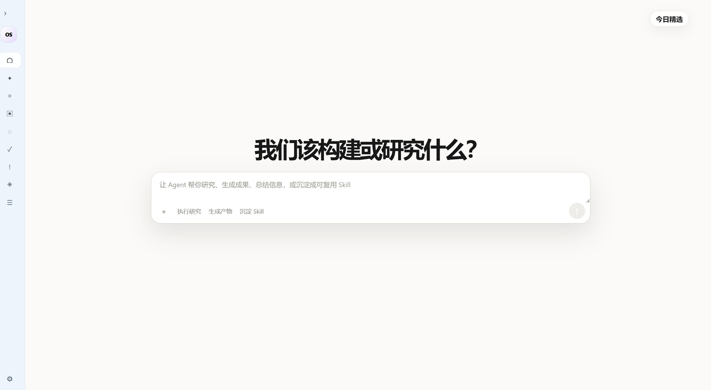
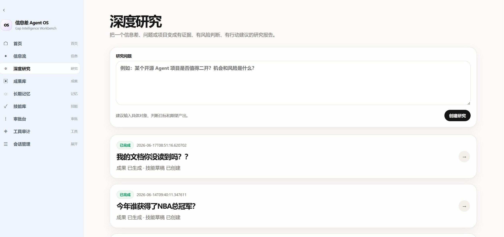
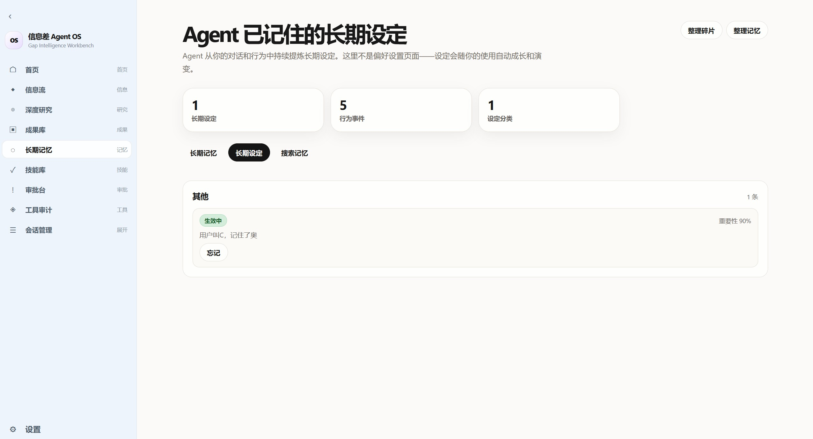
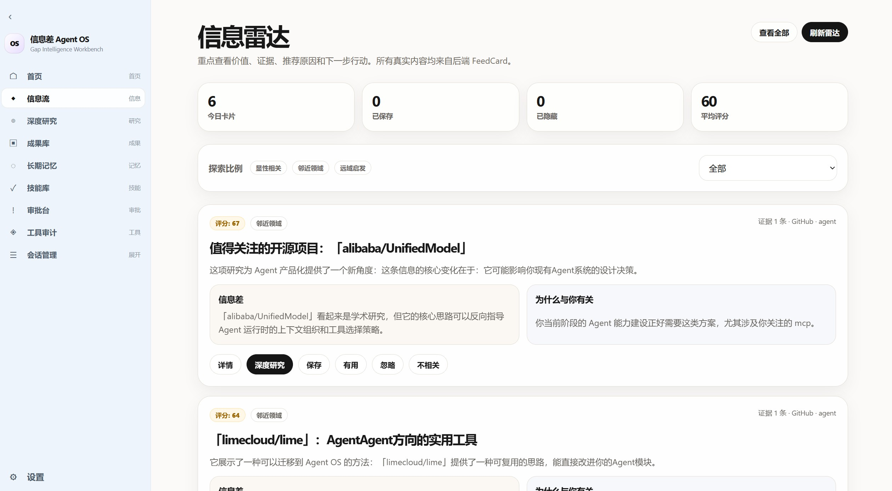
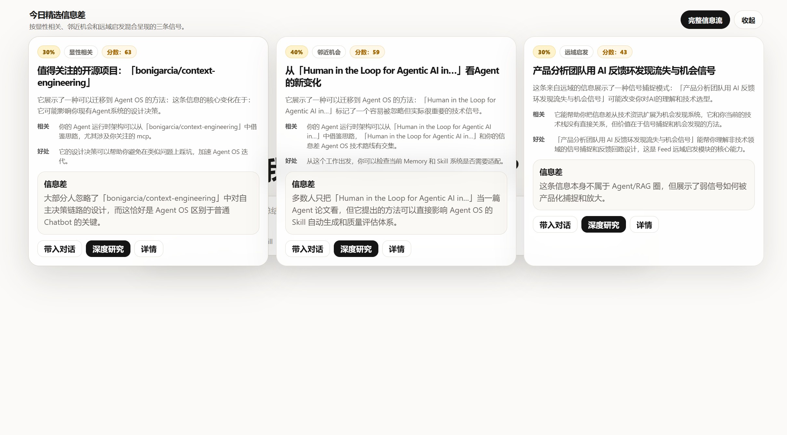
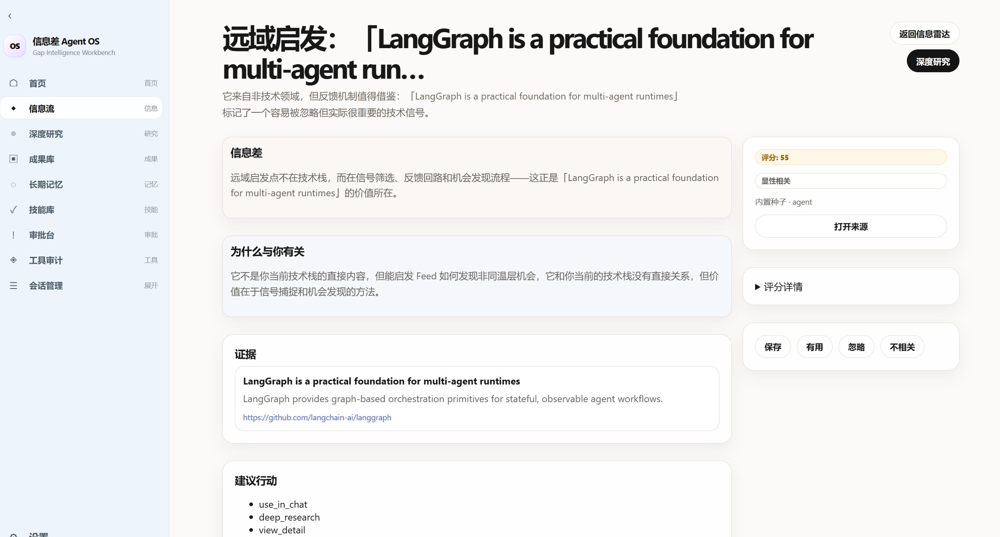
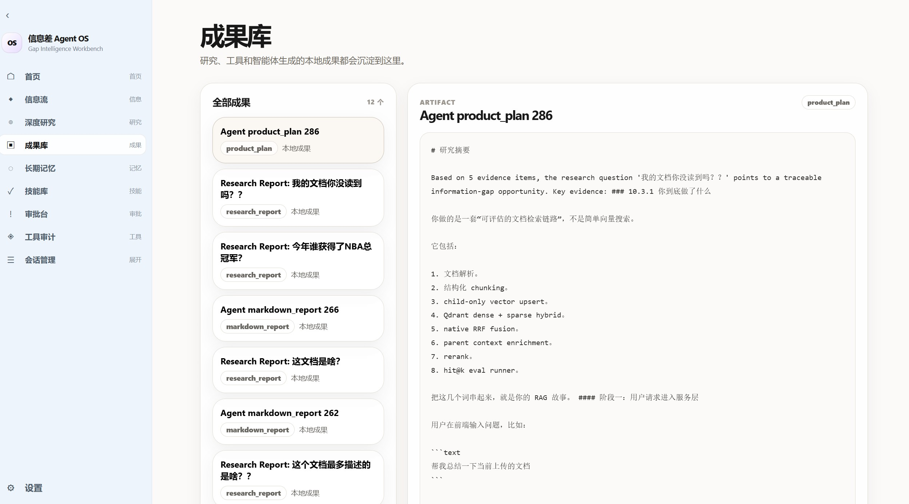
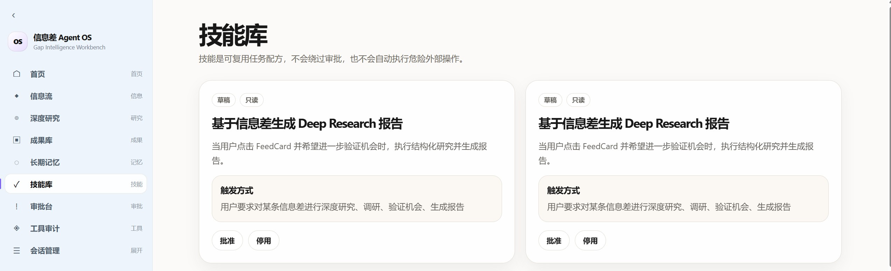
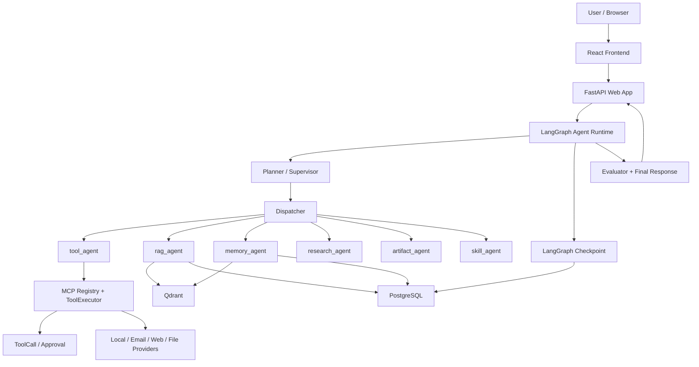
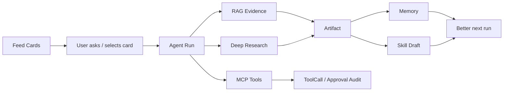

# Agent OS / Open Deep Research

一个面向真实 Agent 产品化场景的全栈研究型智能体项目。项目基于 `langchain-ai/open_deep_research` 二次开发，在原始深度研究能力之上补齐了 Web App、LangGraph Runtime、MCP 工具治理、RAG 检索、Memory/GSSC 上下文管理、人工审批恢复、审计记录和前端可视化。

它不是一个“只会聊天”的 Demo，而是一套可以解释、可恢复、可审计、可扩展的 Agent OS 原型：用户可以从信息流发现机会，发起研究，上传文档做 RAG 问答，生成 Artifact，把经验沉淀为 Memory / Skill，并在高风险工具调用前进入审批。



## 目录

- [项目定位](#项目定位)
- [核心能力](#核心能力)
- [架构概览](#架构概览)
- [核心业务闭环](#核心业务闭环)
- [功能模块详解](#功能模块详解)
- [技术栈](#技术栈)
- [本地启动](#本地启动)
- [环境变量与密钥整理](#环境变量与密钥整理)
- [数据库与外部服务](#数据库与外部服务)
- [测试与验证](#测试与验证)
- [系统截图清单](#系统截图清单)
- [提交前安全清单](#提交前安全清单)

## 项目定位

传统 Agent 应用原型往往只有一个 prompt、一组工具和一次性回答。这个项目关注的是 Agent 真正产品化时会遇到的问题：

- 工具不能让模型想调就调，必须有参数校验、风险分级、审批和审计。
- 高风险动作不能同步阻塞在内存里等待用户确认，必须可以跨请求、跨进程恢复。
- RAG 不能只做向量相似度，要处理文档结构、关键词、编号、parent context 和可评估的召回质量。
- 长对话不能只把最近消息塞进 prompt，需要 summary、segment、memory 和上下文选择。
- 前端不能只显示最终答案，要能看到运行轨迹、工具调用、审批状态、Artifacts、Memory 和历史任务。

因此，这个项目更接近一个 Agent 应用底座，而不是单次问答脚本。

## 核心能力

### 1. 可恢复的 LangGraph Agent Runtime

项目将 Agent 拆成多个职责明确的节点，而不是让一个大函数完成全部逻辑：

- `planner`：理解用户意图并生成 route plan。
- `dispatcher`：根据 route plan 调度具体 agent 节点。
- `tool_agent`：处理工具调用、审批和工具结果。
- `rag_agent`：处理文档检索和证据回答。
- `memory_agent`：处理长期记忆写入和召回。
- `research_agent`：接入 Open Deep Research 做深度研究。
- `artifact_agent`：生成可持久化成果。
- `skill_agent`：识别可复用工作流。
- `post_agent_gate`：每个 agent 后做质量门判断，决定继续、重试当前 agent 或降级。
- `evaluator`：在最终回答前做全局一致性检查。
- `final_response`：聚合结构化结果，生成用户可读回答。

工程价值：

- 每个节点输入输出可记录，便于 debug。
- Agent 失败不是直接崩溃，而是写入 state、事件和 AgentResult。
- 高风险工具可用 LangGraph `interrupt()` 暂停，再通过 checkpoint 恢复。
- `post_agent_gate` 防止错误结果继续污染后续节点。



### 2. MCP 工具治理：注册、校验、分级、审批、审计

工具不是直接暴露给 LLM，而是先注册成 Tool spec：

```text
ToolSpec
  - name
  - description
  - input_schema
  - output_schema
  - permission_level
  - approval_required
  - enabled
```

项目中的工具调用链路：

```text
tool_agent
  -> ToolRouter 规范化工具名
  -> JSON Schema 参数校验
  -> ToolExecutor 执行前兜底校验
  -> 风险分级
  -> ToolCall 审计
  -> 低风险执行 / L3 审批 / L4 阻断
```

亮点：

- `input_schema` 是工具参数契约。
- ToolRouter 做工具名规范化和参数校验。
- ToolExecutor 在执行或创建审批前再次校验，防止直接 API 调用绕过 Runtime。
- JSON Schema 校验覆盖 `required`、类型、枚举、范围、数组/对象结构、`additionalProperties` 和常见 `format`。
- L3 外部写入会进入人工审批。
- L4 高危操作默认 blocked。
- 所有工具调用写入 ToolCall，方便审计和问题复盘。

工具审计页面可用于查看每次工具调用的工具名、输入参数摘要、权限等级、状态、错误信息和执行时间。

### 3. L3 人工审批闭环，而不是简单确认框

很多工具只是在前端弹一个确认框。这个项目的重点是：确认前后整个 Agent 执行链路都能恢复。

审批流程：

```text
tool_agent 判断 L3
  -> 创建或复用 ToolCall / Approval
  -> LangGraph interrupt 暂停
  -> PostgresSaver 保存 checkpoint
  -> 前端展示 approval_required
  -> 用户 approve / reject
  -> Command(resume={action: approved})
  -> graph 回到 interrupt 点
  -> tool_agent 执行 execute_approved_tool_once
  -> 写回工具结果并继续 final_response
```

工程价值：

- 审批是人参与的异步流程，不依赖进程内存等待。
- 服务重启后仍可通过 checkpoint 恢复。
- 真实副作用放在 interrupt 返回之后，避免重复执行。
- ToolCall / Approval 可以追踪“谁批准了什么、最终有没有执行”。

审批页面可用于展示待审批工具名、风险等级、参数预览、安全提示以及批准/拒绝操作。

### 4. RAG：不是简单向量库，而是结构化文档检索链路

项目的 RAG 目标不是“把文档切 chunk 后 embedding”，而是解决真实文档问答中的几个问题：

- chunk 太小会丢上下文。
- chunk 太大召回不准。
- dense embedding 不擅长编号、字段名、金额、表格列名。
- BM25 不擅长语义改写。
- 没有 eval 就不知道优化是否有效。

当前设计：

```text
上传文档
  -> DocumentService 保存文件
  -> DocumentParser 解析
  -> StructuredChunker 生成 Overview / Parent / Child
  -> Child 写入 Qdrant
  -> Parent / Overview 写入 PostgreSQL
  -> Query Analyzer
  -> Dense + Sparse / BM25 检索
  -> RRF 融合
  -> 命中 child
  -> 回查 parent context
  -> evidence 交给 final_response
```

亮点：

- child 用于精准召回。
- parent 用于最终回答补上下文。
- overview 用于文档整体摘要和总览类问题。
- dense 处理语义相似，sparse/BM25 处理关键词、编号、字段名。
- Qdrant Hybrid + RRF 用排名融合降低分数不可比问题。
- synthetic eval 对比不同 backend 的 hit@k、keyword hit rate、latency 和 fallback。

文档上传页和 RAG 问答页可以展示上传后的文档列表、解析状态、chunk 数量、检索状态、回答引用证据和 chunk/source 信息。

### 5. Memory / GSSC：上下文不是越多越好，而是要选择

长对话和长期记忆的难点不是“都存下来”，而是每一轮回答时选择什么进入 prompt。

项目中有几类上下文来源：

- 最近对话消息。
- running conversation summary。
- conversation segments。
- semantic / episodic / working memory。
- RAG evidence。
- feed card / page context。
- skill match 结果。

GSSC 的作用是把这些上下文组织成可控的 prompt sections，避免把不相关信息全部塞给模型。

亮点：

- 支持长期记忆写入和召回。
- 支持历史 conversation segment recall。
- 支持 memory 与 RAG evidence 同时进入上下文。
- 支持通过配置限制召回数量和 token budget。
- 可以调试 `gssc_debug`，观察上下文选择原因。



上下文调试页可以继续补充展示 recent messages、summary、memory、RAG evidence 如何组合。

### 6. Feed -> Research -> Artifact -> Memory / Skill 的产品闭环

项目不仅能回答用户问题，还把信息处理流程做成闭环：

```text
Feed 信息接入
  -> 用户选择高价值卡片
  -> Agent 发起 research / RAG / tool
  -> 生成 Artifact
  -> 写入 Memory
  -> 判断是否沉淀为 Skill
  -> 下次任务复用上下文和工作流
```

亮点：

- Feed 可接入 arXiv、GitHub、DuckDuckGo、Tavily、SerpAPI、手动种子。
- Research 结果可生成 artifact。
- Memory 保存用户偏好和任务结论。
- Skill 记录可复用 workflow。
- 前端能查看 Research Runs、Artifacts、Skills 和 Memory。

> 截图建议 9：Feed 页面。
>








### 7. 前端不是壳子，而是 Agent 运维工作台

前端页面包括：

- Home / Agent Chat
- Agent Run Detail
- Approvals
- MCP Tool Calls
- Research Runs
- Research Run Detail
- Artifacts
- Memory
- Feed
- Feed Card Detail
- Skills
- Profile
- Settings

这些页面让用户不仅看到最终答案，还能看到 Agent 为什么这么做、调用了什么工具、哪里需要审批、哪些结果被持久化。

> 截图建议 11：完整导航侧边栏。
>


## 架构概览

> 截图建议 12：系统架构图。
>
> 可补充文件：`images/architecture.jpg`
>
> 截图内容：前端、FastAPI、LangGraph Runtime、MCP、RAG、Memory、PostgreSQL、Qdrant、Checkpoint、外部 LLM 服务之间的关系。



## 核心业务闭环



## 功能模块详解

### Agent Runtime

关键文件：

```text
src/web_app/agent/runtime/graph_builder.py
src/web_app/agent/runtime/dispatch.py
src/web_app/agent/runtime/node_groups/
src/web_app/agent/runtime/graph_registry.py
src/web_app/agent/runtime/graph_manifest.py
src/web_app/agent/runtime/recovery.py
```

实现重点：

- StateGraph 负责可恢复流程。
- Runtime state 作为节点之间的数据总线。
- 每个节点写自己的结构化结果。
- post-agent gate 做局部质量控制。
- evaluator 做全局一致性检查。
- 服务层负责 SSE 事件和 run 状态持久化。

### MCP 工具治理

关键文件：

```text
src/web_app/mcp/registry.py
src/web_app/mcp/tool_router.py
src/web_app/mcp/tool_executor.py
src/web_app/mcp/local_provider.py
src/web_app/services/mcp_service.py
src/web_app/api/v1/mcp.py
```

工具风险等级：

| 等级 | 类型 | 示例 | 策略 |
|---|---|---|---|
| L0 | 纯计算 / 内部读取 | 计算、时间、格式化 | 直接执行 |
| L1 | 读公开或本地信息 | web search、读文件 | 执行并记录 |
| L2 | 本地写入 / 草稿 | 创建 artifact、草稿 | 受限执行 |
| L3 | 外部写入 | 发邮件、提交表单 | 人工审批 |
| L4 | 高危不可逆 | 删除、危险命令、支付 | 默认阻断 |

### RAG

关键文件：

```text
src/web_app/services/document_service.py
src/web_app/services/rag_service.py
src/web_app/rag/document_parser.py
src/web_app/rag/structured_chunker.py
src/web_app/rag/vector_store.py
src/web_app/rag/retriever.py
src/web_app/rag/bm25.py
```

chunk 分工：

| Chunk | 作用 | 是否入 Qdrant | 是否用于回答上下文 |
|---|---|---:|---:|
| Overview | 文档整体摘要 | 否 | 可选 |
| Parent | 完整段落 / 章节上下文 | 否 | 是 |
| Child | 精准检索单元 | 是 | 命中后回查 parent |

### Memory / GSSC

关键文件：

```text
src/web_app/services/memory_service.py
src/web_app/context/builder.py
src/web_app/context/packets.py
src/web_app/context/compression.py
src/web_app/services/conversation_summary_service.py
```

上下文来源：

- recent messages
- running summary
- historical segments
- user memory
- RAG evidence
- feed card / page context
- skill match

### Frontend

关键目录：

```text
frontend/src/pages/
frontend/src/components/
frontend/src/api/
```

页面能力：

- 运行 Agent。
- 查看审批。
- 查看工具调用审计。
- 查看研究任务。
- 管理 artifacts。
- 查看 memory。
- 浏览 feed。
- 管理 skills。

## 技术栈

### Backend

- Python 3.10+
- FastAPI
- SQLAlchemy / Alembic
- PostgreSQL
- LangGraph
- Qdrant
- Redis 可选
- Neo4j 可选
- DashScope / OpenAI-compatible LLM API

### Frontend

- React
- TypeScript
- Vite
- React Router
- React Markdown

## 本地启动

下面以 Windows + PowerShell 为例。macOS / Linux 只需要把虚拟环境激活命令换成 `source .venv/bin/activate`。

### 1. 准备基础依赖

需要先安装：

- Python 3.10 或更高版本，推荐 Python 3.11。
- Node.js 20.19+ 或 22.12+。
- PostgreSQL 14+。
- Git。
- `uv`，用于 Python 依赖安装。

安装 `uv`：

```powershell
pip install uv
```

检查版本：

```powershell
python --version
node --version
npm --version
uv --version
git --version
```

### 2. 克隆项目

```powershell
git clone https://github.com/<your-github-name>/<your-repo-name>.git
cd open_deep_research
```

如果项目已经在本机，直接进入项目目录：

```powershell
cd D:\pythonproject\open_deep_research
```

### 3. 创建并激活 Python 虚拟环境

```powershell
uv venv
.venv\Scripts\activate
```

安装后端依赖：

```powershell
uv sync
```

如果 `uv sync` 不适合当前环境，也可以使用：

```powershell
pip install -e .
```

### 4. 配置环境变量

复制模板：

```powershell
copy .env.example .env
```

编辑 `.env`。最小可运行配置通常需要：

```env
APP_ENV=local
SECRET_KEY=<生成一个强随机字符串>

POSTGRES_HOST=127.0.0.1
POSTGRES_PORT=5432
POSTGRES_USER=postgres
POSTGRES_PASSWORD=<你的本地数据库密码>
POSTGRES_DATABASE=agent_os

AGENT_LLM_ENABLED=true
AGENT_LLM_PROVIDER=aliyun
DASHSCOPE_API_KEY=<你的 DashScope Key>
ALIYUN_BAILIAN_API_KEY=<你的阿里云百炼 Key，可与 DashScope 相同或按实际配置>
ALIYUN_BAILIAN_BASE_URL=https://dashscope.aliyuncs.com/compatible-mode/v1

AGENT_CHECKPOINTER_BACKEND=postgres
AGENT_CHECKPOINTER_REQUIRE_DURABLE=true

EMAIL_PROVIDER=mock
LOCAL_TOOLS_ENABLED=true
LOCAL_TOOLS_WORKSPACE_DIR=./agent_workspace
LOCAL_TOOLS_ALLOW_DELETE=false
```

可选服务可以先关闭或留空：

```env
ENABLE_NEO4J=false
QDRANT_URL=
QDRANT_API_KEY=
TAVILY_API_KEY=
SERPAPI_API_KEY=
GITHUB_TOKEN=
SMTP_PASSWORD=
```

说明：

- `.env` 只保存在本地，不要提交到 Git。
- `EMAIL_PROVIDER=mock` 时不会真的发送邮件。
- 如果没有 Qdrant，RAG 可以先走 fallback 能力；完整向量检索需要配置 Qdrant。
- 生产环境不要使用默认 `SECRET_KEY`，必须换成强随机值。

### 5. 初始化 PostgreSQL 数据库

进入 PostgreSQL 后创建数据库：

```sql
CREATE DATABASE agent_os;
```

确认 `.env` 中的数据库连接信息和本地 PostgreSQL 一致：

```env
POSTGRES_HOST=127.0.0.1
POSTGRES_PORT=5432
POSTGRES_USER=postgres
POSTGRES_PASSWORD=<你的本地数据库密码>
POSTGRES_DATABASE=agent_os
```

执行 Alembic 迁移：

```powershell
alembic upgrade head
```

如果迁移失败，优先检查：

- PostgreSQL 服务是否启动。
- 数据库名是否存在。
- `POSTGRES_PASSWORD` 是否正确。
- 当前虚拟环境是否已激活。

### 6. 启动后端服务

在项目根目录执行：

```powershell
python run_server.py
```

默认后端地址：

```text
http://127.0.0.1:8000
```

接口文档：

```text
http://127.0.0.1:8000/docs
```

健康检查：

```text
http://127.0.0.1:8000/api/v1/health
```

如果端口被占用，可以修改 `run_server.py` 中的 `port=8000`，或用 uvicorn 自己指定端口：

```powershell
uvicorn src.web_app.main:app --host 127.0.0.1 --port 8001
```

### 7. 启动前端服务

新开一个 PowerShell 窗口：

```powershell
cd D:\pythonproject\open_deep_research\frontend
npm install
npm run dev
```

默认前端地址：

```text
http://127.0.0.1:5173
```

前端会通过 API 调用后端。默认 CORS 配置在 `.env` 中：

```env
CORS_ORIGINS=http://localhost:5173,http://127.0.0.1:5173
```

### 8. 首次运行检查

启动完成后建议按顺序检查：

1. 打开 `http://127.0.0.1:8000/docs`，确认 FastAPI 文档可访问。
2. 打开 `http://127.0.0.1:5173`，确认前端页面可访问。
3. 注册或登录账号。
4. 在 Home / Agent Chat 发起一个普通问题。
5. 查看 Agent Run Detail 是否有运行步骤。
6. 打开 MCP Tool Calls 页面，确认工具调用审计记录可查看。
7. 如果配置了文档上传，上传一个脱敏测试文档，测试 RAG 问答。

### 9. 常见启动问题

| 问题 | 可能原因 | 处理方式 |
|---|---|---|
| 后端无法连接数据库 | PostgreSQL 未启动或密码不对 | 检查 PostgreSQL 服务和 `.env` |
| `alembic upgrade head` 失败 | 数据库不存在或迁移环境未激活 | 创建 `agent_os` 数据库并激活 `.venv` |
| 前端请求失败 | 后端没启动或 CORS 不匹配 | 检查后端端口和 `CORS_ORIGINS` |
| Agent 无法调用模型 | API Key 未配置或模型名不可用 | 检查 `DASHSCOPE_API_KEY`、`ALIYUN_BAILIAN_API_KEY` 和模型配置 |
| 审批恢复失败 | checkpoint 后端不可用 | 本地确认 PostgreSQL 可用，生产保持 `AGENT_CHECKPOINTER_REQUIRE_DURABLE=true` |
| 邮件工具没有真实发送 | `EMAIL_PROVIDER=mock` | 这是默认安全行为；需要 SMTP 时再配置 smtp 变量 |

## 环境变量与密钥整理

不要把 `.env` 提交到 GitHub。仓库只提交 `.env.example`，真实密钥只放本机、服务器环境变量或 GitHub Actions Secrets。

### 必填基础项

| 变量 | 用途 | 是否敏感 | 建议 |
|---|---|---:|---|
| `SECRET_KEY` | JWT / 应用签名密钥 | 是 | 生产必须换成强随机字符串 |
| `POSTGRES_HOST` | PostgreSQL 地址 | 否 | 本地可用 `127.0.0.1` |
| `POSTGRES_PORT` | PostgreSQL 端口 | 否 | 默认 `5432` |
| `POSTGRES_USER` | PostgreSQL 用户名 | 视情况 | 不要用生产 root/superuser |
| `POSTGRES_PASSWORD` | PostgreSQL 密码 | 是 | 不要提交 |
| `POSTGRES_DATABASE` | 数据库名 | 否 | 默认 `agent_os` |

### LLM / Embedding

| 变量 | 用途 | 是否敏感 |
|---|---|---:|
| `DASHSCOPE_API_KEY` | DashScope / Qwen 调用 | 是 |
| `ALIYUN_BAILIAN_API_KEY` | 阿里云百炼调用 | 是 |
| `AGENT_LLM_API_KEY` | Agent LLM 自定义 API Key | 是 |
| `AGENT_LLM_BASE_URL` | OpenAI-compatible base URL | 否 |
| `EMBED_API_KEY` | Embedding API Key | 是 |
| `EMBED_BASE_URL` | Embedding base URL | 否 |

### RAG / Memory

| 变量 | 用途 | 是否敏感 |
|---|---|---:|
| `QDRANT_URL` | Qdrant 地址 | 可能 |
| `QDRANT_API_KEY` | Qdrant Cloud Key | 是 |
| `QDRANT_COLLECTION` | 文档向量集合 | 否 |
| `MEMORY_QDRANT_COLLECTION` | 记忆向量集合 | 否 |

### Checkpoint / Cache

| 变量 | 用途 | 是否敏感 |
|---|---|---:|
| `AGENT_CHECKPOINTER_BACKEND` | checkpoint 后端，生产建议 `postgres` | 否 |
| `AGENT_CHECKPOINTER_DATABASE_URL` | 独立 checkpoint 数据库 URL | 是 |
| `REDIS_URL` | Redis 地址 | 是，如果包含密码 |
| `REDIS_PASSWORD` | Redis 密码 | 是 |

### Search / Feed

| 变量 | 用途 | 是否敏感 |
|---|---|---:|
| `TAVILY_API_KEY` | Tavily 搜索 | 是 |
| `SERPAPI_API_KEY` | SerpAPI 搜索 | 是 |
| `GITHUB_TOKEN` | GitHub feed / API | 是 |

### Email

| 变量 | 用途 | 是否敏感 |
|---|---|---:|
| `EMAIL_PROVIDER` | `mock` 或 `smtp` | 否 |
| `EMAIL_FROM` | 发件人 | 否 |
| `SMTP_HOST` | SMTP 地址 | 否 |
| `SMTP_USERNAME` | SMTP 用户名 | 是 |
| `SMTP_PASSWORD` | SMTP 密码 | 是 |

### 本地工具

| 变量 | 用途 | 建议 |
|---|---|---|
| `LOCAL_TOOLS_WORKSPACE_DIR` | 本地文件工具允许访问的目录 | 使用专用目录，不要指向项目根或用户主目录 |
| `LOCAL_TOOLS_ALLOW_DELETE` | 是否允许删除文件 | 默认 `false` |
| `LOCAL_TOOLS_MAX_READ_CHARS` | 单次读取字符上限 | 按需调小 |
| `LOCAL_TOOLS_MAX_WRITE_CHARS` | 单次写入字符上限 | 按需调小 |

## 数据库与外部服务

### PostgreSQL

生产环境建议使用托管 PostgreSQL，并开启备份。审批恢复依赖 durable checkpoint，生产不要使用纯内存 checkpoint。

### Qdrant

本地开发可以先用 fallback 检索；需要完整 RAG 效果时再配置 Qdrant。

### Redis

当前项目中 Redis 可用于部分缓存或实验性 checkpoint。生产 checkpoint 建议优先 PostgreSQL。

### Neo4j

Neo4j 是可选图谱能力，默认可以关闭：

```env
ENABLE_NEO4J=false
```

## 测试与验证

后端测试：

```bash
pytest
```

运行重点模块测试：

```bash
pytest src/web_app/tests/test_mcp_stage7.py
pytest src/web_app/tests/test_rag_stage3.py
pytest src/web_app/tests/test_memory_system.py
pytest src/web_app/tests/test_postgres_checkpoint_e2e.py
```

前端类型检查与构建：

```bash
cd frontend
npm run type-check
npm run build
```

## License

本项目保留原始 Open Deep Research 的开源许可。发布到 GitHub 前请确认 `LICENSE` 与你的二次开发发布方式一致。
