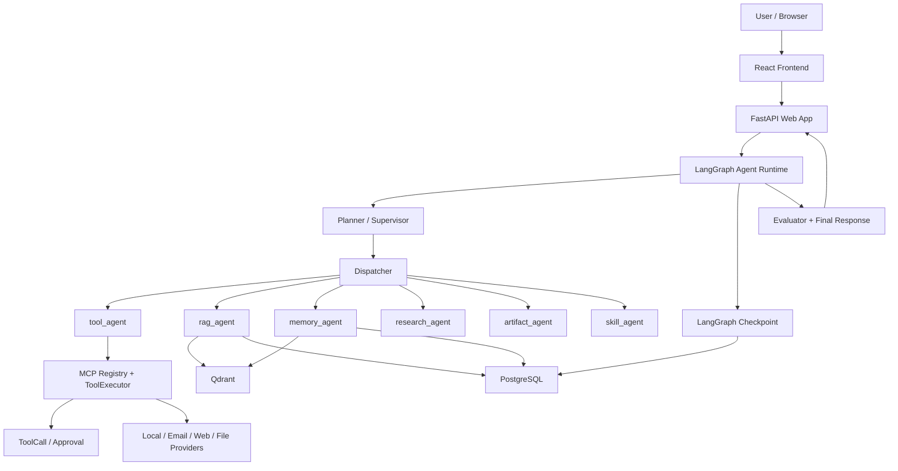

# Agent OS / Open Deep Research

一个面向真实 Agent 产品化场景的全栈研究型智能体项目。它在 Open Deep Research 的基础上扩展了 Web App、LangGraph Runtime、MCP 工具治理、RAG 检索、Memory/GSSC 上下文管理、审批恢复、审计记录和前端可视化。

> 建议放图：在这里放一张项目首页截图或总览图。图片文件建议放在 `docs/images/hero.png`，然后把下面这行取消注释。
>
> ``

## 目录

- [项目亮点](#项目亮点)
- [架构概览](#架构概览)
- [功能模块](#功能模块)
- [技术栈](#技术栈)
- [本地启动](#本地启动)
- [环境变量与密钥整理](#环境变量与密钥整理)
- [数据库与外部服务](#数据库与外部服务)
- [测试与验证](#测试与验证)
- [上传到 GitHub 教程](#上传到-github-教程)
- [截图与图片放置建议](#截图与图片放置建议)
- [提交前安全清单](#提交前安全清单)

## 项目亮点

- **LangGraph Agent Runtime**：用 StateGraph 拆分 planner、dispatcher、tool_agent、rag_agent、memory_agent、evaluator、final_response 等节点，支持 checkpoint、interrupt 和审批恢复。
- **MCP 工具治理**：工具统一注册为 spec，包含 `input_schema`、`output_schema`、`permission_level`、`approval_required`、enabled 等元信息；执行前做 JSON Schema 参数校验、风险分级、审批和审计。
- **L3 工具审批闭环**：外部写入、发邮件等高风险动作会创建 ToolCall 和 Approval，通过 LangGraph interrupt 暂停；用户批准后用 Command(resume) 回到 graph 内执行真实 provider。
- **RAG 检索体系**：支持文档上传、结构化解析、Parent-Child Chunking、Qdrant Hybrid Search、BM25/sparse 信号、parent context enrichment 和 eval runner。
- **Memory / GSSC 上下文管理**：结合短期上下文、长期记忆、conversation summary、conversation segments、feed/page context，控制进入 LLM 的上下文质量。
- **前端可视化**：React + Vite 管理 Agent 对话、运行轨迹、审批、工具调用、Memory、Feed、Artifacts、Research Runs、Skills 和设置页。

## 架构概览

> 建议放图：在这里放系统架构图，文件建议为 `docs/images/architecture.png`。
>
> ``



## 功能模块

### Agent Runtime

- `planner` 生成 route plan。
- `dispatcher` 按 route plan 调度 agent 节点。
- `post_agent_gate` 在每个 agent 后做质量门判断，决定继续、重试当前 agent 或降级。
- `evaluator` 做最终全局检查。
- `final_response` 聚合结构化结果，生成用户可读回答。

### MCP 工具治理

- 工具通过 registry 管理，避免 agent 节点直接调用任意函数。
- `input_schema` 是工具参数契约，ToolRouter 和 ToolExecutor 都会执行校验。
- JSON Schema 校验覆盖 `required`、类型、枚举、范围、数组/对象结构、`additionalProperties` 和常见 `format`。
- L0/L1 低风险工具可直接执行；L3 外部写入进入审批；L4 高危操作默认阻断。

### RAG

- 支持 Markdown、TXT、CSV、PDF-like 文档处理。
- 使用 Overview / Parent / Child 分层 chunk。
- child 用于精准召回，parent 用于补全回答上下文。
- Qdrant 可作为向量检索后端，BM25/sparse 信号用于补足编号、字段名、关键词类查询。

### Memory / Context

- 支持 conversation summary、conversation segment recall、working / episodic / semantic memory。
- GSSC 将 RAG evidence、记忆、历史对话、页面上下文和 feed card 统一组织进最终上下文。

### 前端页面

- Home / Agent Chat
- Agent Run Detail
- Approvals
- MCP Tool Calls
- Research Runs
- Artifacts
- Memory
- Feed
- Skills
- Profile / Settings

## 技术栈

### Backend

- Python 3.10+
- FastAPI
- SQLAlchemy / Alembic
- PostgreSQL
- LangGraph
- Qdrant
- Redis 可选
- Neo4j 可选
- DashScope / OpenAI-compatible LLM API

### Frontend

- React
- TypeScript
- Vite
- React Router
- React Markdown

## 本地启动

### 1. 克隆项目

```bash
git clone https://github.com/<your-github-name>/<your-repo-name>.git
cd open_deep_research
```

### 2. 创建 Python 环境

推荐使用 `uv`：

```bash
uv venv
.venv\Scripts\activate
uv sync
```

如果不用 `uv`：

```bash
python -m venv .venv
.venv\Scripts\activate
pip install -e .
```

### 3. 准备环境变量

```bash
copy .env.example .env
```

然后编辑 `.env`，至少填写：

```env
SECRET_KEY=<生成一个强随机字符串>
POSTGRES_HOST=127.0.0.1
POSTGRES_PORT=5432
POSTGRES_USER=postgres
POSTGRES_PASSWORD=<你的本地数据库密码>
POSTGRES_DATABASE=agent_os

DASHSCOPE_API_KEY=<你的 DashScope Key>
ALIYUN_BAILIAN_API_KEY=<你的阿里云百炼 Key，可与 DashScope 相同或按实际配置>
AGENT_LLM_API_KEY=<如果使用 OpenAI-compatible 自定义入口则填写>
```

### 4. 初始化数据库

确保 PostgreSQL 已启动，并创建数据库：

```sql
CREATE DATABASE agent_os;
```

执行迁移：

```bash
alembic upgrade head
```

### 5. 启动后端

```bash
python run_server.py
```

默认地址：

```text
http://127.0.0.1:8000
```

接口文档：

```text
http://127.0.0.1:8000/docs
```

### 6. 启动前端

```bash
cd frontend
npm install
npm run dev
```

默认地址：

```text
http://127.0.0.1:5173
```

## 环境变量与密钥整理

不要把 `.env` 提交到 GitHub。仓库只提交 `.env.example`，真实密钥只放本机、服务器环境变量或 GitHub Actions Secrets。

### 必填基础项

| 变量 | 用途 | 是否敏感 | 建议 |
|---|---|---:|---|
| `SECRET_KEY` | JWT / 应用签名密钥 | 是 | 生产必须换成强随机字符串 |
| `POSTGRES_HOST` | PostgreSQL 地址 | 否 | 本地可用 `127.0.0.1` |
| `POSTGRES_PORT` | PostgreSQL 端口 | 否 | 默认 `5432` |
| `POSTGRES_USER` | PostgreSQL 用户名 | 视情况 | 不要用生产 root/superuser |
| `POSTGRES_PASSWORD` | PostgreSQL 密码 | 是 | 不要提交 |
| `POSTGRES_DATABASE` | 数据库名 | 否 | 默认 `agent_os` |

### LLM / Embedding

| 变量 | 用途 | 是否敏感 |
|---|---|---:|
| `DASHSCOPE_API_KEY` | DashScope / Qwen 调用 | 是 |
| `ALIYUN_BAILIAN_API_KEY` | 阿里云百炼调用 | 是 |
| `AGENT_LLM_API_KEY` | Agent LLM 自定义 API Key | 是 |
| `AGENT_LLM_BASE_URL` | OpenAI-compatible base URL | 否 |
| `EMBED_API_KEY` | Embedding API Key | 是 |
| `EMBED_BASE_URL` | Embedding base URL | 否 |

### RAG / Memory

| 变量 | 用途 | 是否敏感 |
|---|---|---:|
| `QDRANT_URL` | Qdrant 地址 | 可能 |
| `QDRANT_API_KEY` | Qdrant Cloud Key | 是 |
| `QDRANT_COLLECTION` | 文档向量集合 | 否 |
| `MEMORY_QDRANT_COLLECTION` | 记忆向量集合 | 否 |

### Checkpoint / Cache

| 变量 | 用途 | 是否敏感 |
|---|---|---:|
| `AGENT_CHECKPOINTER_BACKEND` | checkpoint 后端，生产建议 `postgres` | 否 |
| `AGENT_CHECKPOINTER_DATABASE_URL` | 独立 checkpoint 数据库 URL | 是 |
| `REDIS_URL` | Redis 地址 | 是，如果包含密码 |
| `REDIS_PASSWORD` | Redis 密码 | 是 |

### Search / Feed

| 变量 | 用途 | 是否敏感 |
|---|---|---:|
| `TAVILY_API_KEY` | Tavily 搜索 | 是 |
| `SERPAPI_API_KEY` | SerpAPI 搜索 | 是 |
| `GITHUB_TOKEN` | GitHub feed / API | 是 |

### Email

| 变量 | 用途 | 是否敏感 |
|---|---|---:|
| `EMAIL_PROVIDER` | `mock` 或 `smtp` | 否 |
| `EMAIL_FROM` | 发件人 | 否 |
| `SMTP_HOST` | SMTP 地址 | 否 |
| `SMTP_USERNAME` | SMTP 用户名 | 是 |
| `SMTP_PASSWORD` | SMTP 密码 | 是 |

### 本地工具

| 变量 | 用途 | 建议 |
|---|---|---|
| `LOCAL_TOOLS_WORKSPACE_DIR` | 本地文件工具允许访问的目录 | 使用专用目录，不要指向项目根或用户主目录 |
| `LOCAL_TOOLS_ALLOW_DELETE` | 是否允许删除文件 | 默认 `false` |
| `LOCAL_TOOLS_MAX_READ_CHARS` | 单次读取字符上限 | 按需调小 |
| `LOCAL_TOOLS_MAX_WRITE_CHARS` | 单次写入字符上限 | 按需调小 |

## 数据库与外部服务

### PostgreSQL

生产环境建议使用托管 PostgreSQL，并开启备份。审批恢复依赖 durable checkpoint，生产不要使用纯内存 checkpoint。

### Qdrant

本地开发可以先用 fallback 检索；需要完整 RAG 效果时再配置 Qdrant。

### Redis

当前项目中 Redis 可用于部分缓存或实验性 checkpoint。生产 checkpoint 建议优先 PostgreSQL。

### Neo4j

Neo4j 是可选图谱能力，默认可以关闭：

```env
ENABLE_NEO4J=false
```

## 测试与验证

后端测试：

```bash
pytest
```

运行重点模块测试：

```bash
pytest src/web_app/tests/test_mcp_stage7.py
pytest src/web_app/tests/test_rag_stage3.py
pytest src/web_app/tests/test_memory_system.py
pytest src/web_app/tests/test_postgres_checkpoint_e2e.py
```

前端类型检查与构建：

```bash
cd frontend
npm run type-check
npm run build
```

## 上传到 GitHub 教程

### 1. 提交前检查

确认 `.env` 没有被 Git 跟踪：

```bash
git ls-files .env
```

如果没有输出，说明 `.env` 没有被跟踪。

检查疑似密钥：

```bash
git grep -n "API_KEY\\|SECRET_KEY\\|PASSWORD\\|TOKEN" -- .
```

只允许 `.env.example`、README 或说明文档里出现变量名和空占位，不要出现真实值。

查看工作区变化：

```bash
git status
git diff
```

### 2. 创建 GitHub 仓库

1. 打开 GitHub。
2. 点击 New repository。
3. 仓库名建议：`agent-os-open-deep-research` 或 `open-deep-research-agent-os`。
4. Visibility 可选 Public 或 Private。
5. 不要勾选自动生成 README、`.gitignore`、license，因为本地已经有。

### 3. 绑定远程仓库

```bash
git remote add origin https://github.com/<your-github-name>/<your-repo-name>.git
```

如果已经有 origin：

```bash
git remote -v
git remote set-url origin https://github.com/<your-github-name>/<your-repo-name>.git
```

### 4. 第一次提交

```bash
git add README.md .env.example docs/images/README.md
git add .
git commit -m "docs: prepare project for GitHub"
```

如果你不想把当前所有代码改动都一起提交，就不要使用 `git add .`，改为逐个 `git add <file>`。

### 5. 推送到 GitHub

```bash
git branch -M main
git push -u origin main
```

### 6. 推送后检查

打开 GitHub 页面确认：

- README 首页展示正常。
- 图片链接没有 404。
- `.env` 没有出现在仓库。
- `.env.example` 没有真实密码、token、API key。
- Issues / Discussions / Actions 是否按需开启。

## 截图与图片放置建议

建议把 GitHub 展示图片统一放到：

```text
docs/images/
```

推荐图片清单：

| 文件 | 放什么 | README 位置 |
|---|---|---|
| `docs/images/hero.png` | 首页或聊天主界面截图 | README 顶部 |
| `docs/images/architecture.png` | 系统架构图 | 架构概览 |
| `docs/images/runtime-flow.png` | LangGraph / Runtime 流程图 | Agent Runtime 模块 |
| `docs/images/approval-flow.png` | L3 审批弹窗和恢复链路 | MCP 工具治理模块 |
| `docs/images/rag-flow.png` | 文档上传、chunk、检索、证据回答 | RAG 模块 |
| `docs/images/tool-calls.png` | MCP ToolCall 审计页面 | MCP 模块 |
| `docs/images/memory.png` | Memory 页面 | Memory / Context 模块 |

截图建议：

- 图片宽度控制在 1400px 左右。
- 不要截到真实 API Key、邮箱、数据库地址或用户隐私。
- GitHub README 中使用相对路径，例如：

```md

```

## 提交前安全清单

- [ ] `.env` 没有被 Git 跟踪。
- [ ] `.env.example` 只保留空值或明显占位符。
- [ ] README 和截图中没有真实 token、邮箱密码、数据库密码。
- [ ] `uploads/`、`storage/uploads/` 中没有敏感用户文件；如果要开源，建议清理或只保留脱敏样例。
- [ ] `ARTIFACT_STORAGE_PATH` 指向的历史产物没有隐私内容。
- [ ] GitHub token、DashScope key、SMTP 密码已在服务商后台确认可随时轮换。
- [ ] 如果曾经把密钥提交进 Git 历史，必须先吊销密钥，再用 `git filter-repo` 或 BFG 清理历史，不要只删除最新提交。

## License

本项目保留原始 Open Deep Research 的开源许可。发布到 GitHub 前请确认 `LICENSE` 与你的二次开发发布方式一致。
