# Deep Research 信息差 Agent OS：面试深度讲解手册

> 更新日期：2026-06-20  
> 使用方式：这不是简历上的短项目描述，而是你面试前用来“把项目讲透”的底稿。面试时先用 60 秒版本开场，再按面试官追问进入 Runtime、MCP、RAG、Memory/GSSC 四个核心模块。  
> 审计原则：以当前代码、测试、迁移和评估产物为准；能讲的讲透，不能夸的地方明确边界。

---

## 0. 先给你一个总判断

这个项目最适合被讲成一个 **工程化 Agent OS 原型**，而不是“我做了一个 RAG 问答”。它有四个最能打的模块：

1. **Agent Runtime 编排**：用 LangGraph StateGraph 把一次用户请求拆成可观察、可恢复、可路由的多节点执行链路。
2. **MCP 工具治理**：把工具注册、参数校验、风险分级、人工审批、审计记录和执行恢复串成闭环。
3. **结构化 RAG 检索**：用 Parent-Child Chunking、Qdrant dense/sparse hybrid、RRF 和 parent context enrichment 解决检索精度与回答完整性的矛盾。
4. **Memory / GSSC 上下文工程**：用三层 Memory、最近对话、running summary、conversation segment、GSSC 选择器和 Skill 复用雏形解决长上下文污染、token 膨胀和多轮连续性。

你面试时的核心表达应该是：

> 我不是只调了一个 LLM 接口，而是把 Agent 平台里最容易出事故的四件事做成了工程闭环：执行流程可控、工具调用安全、文档检索可评估、上下文记忆可治理。Runtime 管流程，MCP 管工具，RAG 管知识，Memory/GSSC 管上下文；它们通过 AgentRun、AgentRuntimeState、ContextBuilder 和持久化表连接起来。

---

## 1. 项目一句话与简历写法

### 1.1 一句话版本

> 基于 LangGraph + FastAPI 构建 Deep Research Agent OS 原型，支持任务规划、RAG 问答、MCP 工具治理、人类审批、Checkpoint 恢复、长期记忆与 Skill 复用；围绕 Agent 执行可控性、工具安全、长上下文管理和文档检索效果做工程化闭环。

### 1.2 简历项目描述建议

```text
Deep Research 信息差 Agent 平台

基于 LangGraph + FastAPI 构建 Deep Research Agent OS 原型，支持任务规划、RAG 问答、
MCP 工具治理、人类审批、Checkpoint 恢复、长期记忆与 Skill 复用；围绕 Agent 执行
可控性、工具安全、长上下文管理和文档检索效果做工程化闭环。

- Agent Runtime 编排：基于 LangGraph StateGraph 构建可恢复 Agent Runtime，由 LLM Supervisor
  接管 route_plan，实现多 Agent 动态路由、审批安全、checkpoint 恢复与链路可观测。
- MCP 工具治理：抽象工具注册、参数校验、风险分级、人工审批与审计记录流程，对 L3/L4
  高风险工具调用进行阻断或审批，降低 Agent 外部操作风险。
- 结构化 RAG 检索：采用 Parent-Child Chunking + Qdrant Hybrid Search + RRF 融合排序，
  child 负责精准召回、parent 回填回答上下文；在自建 RAG eval 中将 hit@5 从 0.54 提升至 0.92。
- Memory 上下文工程：构建三层记忆 + GSSC 动态上下文选择，接入 conversation running summary
  + 可检索历史段，缓解百轮对话中早期事实丢失、上下文污染和 token 浪费问题。
```

### 1.3 面试开场 60 秒版

> 这个项目是一个 Deep Research Agent OS 原型。用户进来后，服务层会创建 conversation、AgentRun 和 chat message，然后交给 LangGraph Runtime 执行。Runtime 不是一个大 if/else，而是把任务拆成 permission、intent、planner、parallel read、context builder、LLM supervisor、RAG、tool、memory、skill、evaluator 和 final response。  
> 工具侧，我做了 MCP 治理：工具统一注册成 spec，执行前做参数校验和 L0-L4 风险分级，L3 进入人工审批，L4 直接阻断；审批用 LangGraph interrupt 暂停，用 PostgresSaver checkpoint 保存状态，再用 Command(resume) 恢复。  
> 知识侧，我做了 Parent-Child + Qdrant Hybrid RAG。child chunk 负责精准命中，parent chunk 负责补回答上下文；dense 负责语义，sparse/RRF 负责关键词和编号类精确匹配。  
> 上下文侧，我做了 Memory/GSSC：working、episodic、semantic 三层记忆，结合最近对话、running summary、可检索 historical segment、RAG evidence 和 FeedCard，根据 route 和 answer_mode 选择注入，避免 token 爆炸和上下文污染。

---

## 2. 全项目端到端工作流

这一节是最重要的“总图”。你要先让面试官知道这个项目不是几个功能散点，而是一条完整链路。

### 2.1 总体架构图

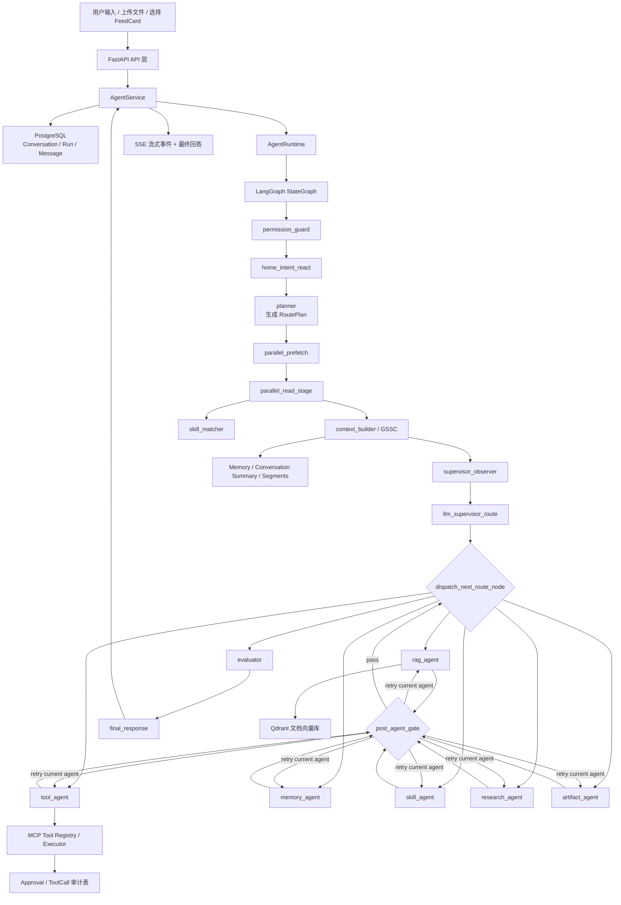
```mermaid
flowchart TD
    U["用户输入 / 上传文件 / 选择 FeedCard"] --> API["FastAPI API 层"]
    API --> AS["AgentService"]
    AS --> DB1["PostgreSQL<br/>Conversation / Run / Message"]
    AS --> RT["AgentRuntime"]

    RT --> LG["LangGraph StateGraph"]
    LG --> P0["permission_guard"]
    P0 --> I0["home_intent_react"]
    I0 --> PL["planner<br/>生成 RoutePlan"]
    PL --> PR["parallel_prefetch"]
    PR --> RS["parallel_read_stage"]
    RS --> CB["context_builder / GSSC"]
    RS --> SKM["skill_matcher"]
    CB --> SUP["supervisor_observer"]
    SUP --> LSUP["llm_supervisor_route"]
    LSUP --> DSP{"dispatch_next_route_node"}

    DSP --> RAG["rag_agent"]
    DSP --> TOOL["tool_agent"]
    DSP --> MEM["memory_agent"]
    DSP --> SK["skill_agent"]
    DSP --> RES["research_agent"]
    DSP --> ART["artifact_agent"]

    RAG --> GATE{"post_agent_gate"}
    TOOL --> GATE
    MEM --> GATE
    SK --> GATE
    RES --> GATE
    ART --> GATE
    GATE -->|retry current agent| RAG
    GATE -->|retry current agent| TOOL
    GATE -->|retry current agent| MEM
    GATE -->|retry current agent| SK
    GATE -->|retry current agent| RES
    GATE -->|retry current agent| ART
    GATE -->|pass| DSP
    DSP --> EVAL["evaluator"]
    EVAL --> FINAL["final_response"]
    FINAL --> AS
    AS --> OUT["SSE 流式事件 + 最终回答"]

    CB --> MEMDB["Memory / Conversation Summary / Segments"]
    RAG --> QD["Qdrant 文档向量库"]
    TOOL --> MCP["MCP Tool Registry / Executor"]
    MCP --> APPROVAL["Approval / ToolCall 审计表"]
```

### 2.2 请求从进入到返回的 12 步

| 步骤 | 发生什么 | 关键产物 |
|---|---|---|
| 1 | 前端发起用户请求 | `user_input`、`page_context`、附件信息 |
| 2 | `AgentService` 创建或复用 conversation | `conversation_id` |
| 3 | 创建本次运行记录 | `AgentRun`、`run_id` |
| 4 | 写入用户消息和 assistant thinking 消息 | `AgentChatMessage` |
| 5 | 构造初始 `AgentRuntimeState` | `user_id`、`run_id`、`thread_id`、`conversation_id` |
| 6 | LangGraph 从 `permission_guard` 进入 | 风险、权限初筛 |
| 7 | planner 生成 `RoutePlan` | intent、route、risk_level、answer_mode |
| 8 | parallel read 阶段加载上下文 | memory、history、RAG evidence、feed、segments |
| 9 | GSSC 选择并组织上下文 | `gssc_context`、`gssc_debug` |
| 10 | dispatcher 路由到能力节点 | rag/tool/memory/skill/research/artifact |
| 11 | 每个 agent 执行后进入 post_agent_gate，通过才继续下一个节点；最后 evaluator 做全局检查并由 final_response 生成回答 | `post_agent_gate_decision`、`evaluation_result`、`final_payload` |
| 12 | 服务层持久化结果并流式返回 | `answer_delta`、`run_completed` |

### 2.3 AgentRuntimeState 是模块交互的“总线”

项目里各模块不是互相乱调，而是通过 state 传递信息。可以这样理解：

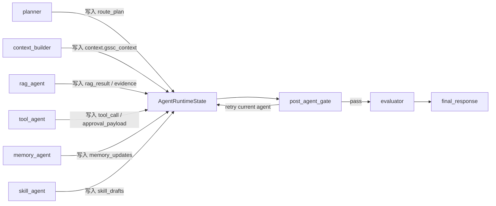
```mermaid
flowchart LR
    A["planner"] -->|写入 route_plan| S["AgentRuntimeState"]
    B["context_builder"] -->|写入 context.gssc_context| S
    C["rag_agent"] -->|写入 rag_result / evidence| S
    D["tool_agent"] -->|写入 tool_call / approval_payload| S
    E["memory_agent"] -->|写入 memory_updates| S
    F["skill_agent"] -->|写入 skill_drafts| S
    S --> G["post_agent_gate"]
    G -->|retry current agent| S
    G -->|pass| H["evaluator"]
    H --> I["final_response"]
```

面试解释：

> 我把 AgentRuntimeState 当成所有节点共享的执行上下文。planner 不直接执行工具，它只写 route_plan；context_builder 不负责回答，它只写 gssc_context；rag_agent 不改 route，它只写 evidence 和 rag_result；tool_agent 只处理工具调用和审批状态。这样每个节点职责单一，运行轨迹也能通过 AgentStep、AgentEvent、LLMCall、ToolCall 追踪。

---

## 3. 四个核心模块总览

### 3.1 四模块职责边界

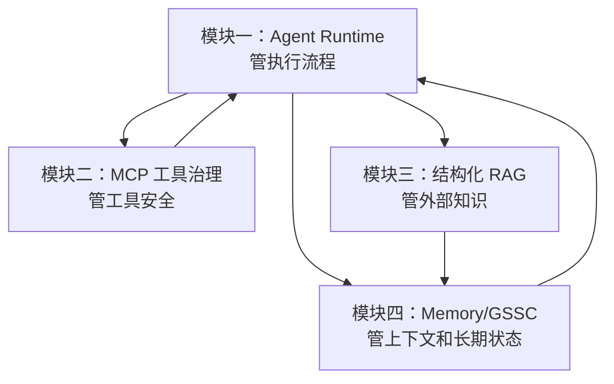
```mermaid
flowchart TD
    Runtime["模块一：Agent Runtime<br/>管执行流程"]
    MCP["模块二：MCP 工具治理<br/>管工具安全"]
    RAG["模块三：结构化 RAG<br/>管外部知识"]
    Memory["模块四：Memory/GSSC<br/>管上下文和长期状态"]

    Runtime --> MCP
    Runtime --> RAG
    Runtime --> Memory
    MCP --> Runtime
    RAG --> Memory
    Memory --> Runtime
```

| 模块 | 一句话职责 | 解决的问题 |
|---|---|---|
| Runtime | 把请求拆成可控节点并驱动执行 | Agent 不可控、流程不可观测、失败不可恢复 |
| MCP | 工具调用前做治理和审批 | Agent 误写文件、误发邮件、误删数据 |
| RAG | 从用户文档中找可靠证据 | LLM 幻觉、文档问答不准、编号类问题漏召回 |
| Memory/GSSC | 选择该给模型看的上下文 | 多轮遗忘、上下文污染、token 爆炸、偏好丢失 |

### 3.2 四模块之间的交互

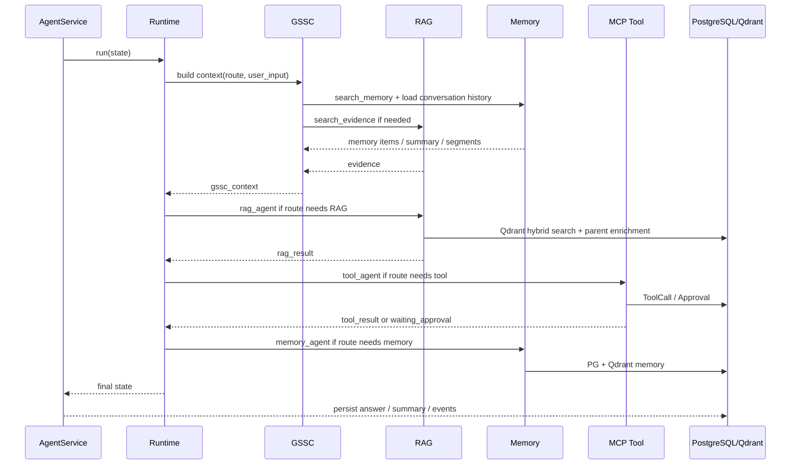
```mermaid
sequenceDiagram
    participant AS as AgentService
    participant RT as Runtime
    participant G as GSSC
    participant R as RAG
    participant M as Memory
    participant T as MCP Tool
    participant DB as PostgreSQL/Qdrant

    AS->>RT: run(state)
    RT->>G: build context(route, user_input)
    G->>M: search_memory + load conversation history
    G->>R: search_evidence if needed
    M-->>G: memory items / summary / segments
    R-->>G: evidence
    G-->>RT: gssc_context
    RT->>R: rag_agent if route needs RAG
    R->>DB: Qdrant hybrid search + parent enrichment
    R-->>RT: rag_result
    RT->>T: tool_agent if route needs tool
    T->>DB: ToolCall / Approval
    T-->>RT: tool_result or waiting_approval
    RT->>M: memory_agent if route needs memory
    M->>DB: PG + Qdrant memory
    RT-->>AS: final state
    AS-->>DB: persist answer / summary / events
```

---

# 模块一：Agent Runtime 编排

## 3.5 Runtime 模块要怎么“讲透”

Runtime 是整个项目的骨架。你可以把它理解成“Agent 的执行操作系统”。如果没有 Runtime，项目里其他能力都会变成松散函数：RAG 是一个检索函数，MCP 是一个工具执行函数，Memory 是一个保存偏好的函数，Skill 是一个匹配函数。Runtime 的价值在于，它把这些函数组织成一次完整、可观测、可恢复的 Agent 执行过程。

面试官听 Runtime 时，真正想知道的不是“你用了 LangGraph”，而是下面几个问题：

1. 你为什么要把 Agent 拆成节点？
2. 节点之间怎么传状态？
3. 谁决定下一步走哪个 agent？
4. 工具审批这种中途暂停怎么恢复？
5. 出错以后怎么知道错在哪？

你的项目对这几个问题都有工程回答：

- 节点拆分：用 `StateGraph(AgentRuntimeState)` 注册 permission、planner、read、agent、eval、final 节点。
- 状态传递：用 `AgentRuntimeState` 作为共享状态总线。
- 路由决策：由 `planner` 生成 route_plan，`llm_supervisor_route` 可选改写，`dispatch_next_route_node` 做条件跳转。
- 审批恢复：用 `interrupt()` 暂停，用 PostgresSaver checkpoint 保存，用 `Command(resume=...)` 恢复。
- 可观测性：用 AgentRun、AgentStep、AgentEvent、ToolCall、LLMCall、runtime_latency_trace 记录每一步。

所以 Runtime 模块的面试核心不是“LangGraph 会用”，而是：

> 我把 Agent 执行抽象成一个可恢复的状态机，每个节点只做一类状态变更，所有副作用都能被记录和审计，高风险操作可以在图中暂停并恢复。

## 3.6 Runtime 为什么不能写成一个大函数

如果把整个 Agent 写成一个大函数，大概会是这样：

```python
def run_agent(user_input):
    intent = classify(user_input)
    context = build_context(user_input)
    if intent == "rag":
        result = rag(user_input, context)
    elif intent == "tool":
        result = call_tool(user_input)
    elif intent == "memory":
        result = save_memory(user_input)
    return final_answer(result)
```

这种写法短期能跑，但工程上有四个问题：

第一，状态不可见。你只知道函数最后失败了，但不知道是 planner 失败、RAG 检索失败、工具参数失败，还是 final_response 失败。  
第二，恢复困难。工具审批卡住时，大函数已经执行到一半，你很难把 Python 调用栈持久化到数据库，服务重启后更没法从中间继续。  
第三，副作用难控。比如工具节点已经写文件，后面 final_response 失败，如果从头重跑，可能重复写。  
第四，扩展困难。新增 skill_agent、artifact_agent、replanner、supervisor 时，大函数会越来越像一坨不可测试的流程脚本。

LangGraph StateGraph 的价值就是把“大函数调用栈”变成“显式状态图”：

```text
节点 = 明确职责
边 = 明确执行顺序
state = 明确数据载体
checkpoint = 明确恢复点
event = 明确观测记录
```

你可以这样讲：

> 我一开始如果用普通函数编排，确实能更快跑通 demo，但后面加审批、恢复、并行预取、LLM supervisor、Skill 和 Memory 时会非常难维护。所以我把 Runtime 设计成 StateGraph。每个节点可以独立测试，节点输出会写入 state 和 AgentStep，条件边只负责下一步跳转。这样系统复杂度上升时，结构仍然可控。

## 3.7 Runtime 的分层设计

Runtime 不是一堆节点平铺，而是有阶段分层：

### 第一层：Setup 阶段

Setup 阶段负责回答“这个请求要不要继续、属于什么大类、初步路线是什么”。

- `permission_guard`：最早做安全/权限粗筛。如果输入明显不允许继续，可以直接走 final_response。
- `home_intent_react`：结合首页、FeedCard、页面上下文判断用户意图。
- `planner`：生成结构化 route_plan。

这一层的输出是 RoutePlan。它不是最终答案，而是执行计划。

### 第二层：Read 阶段

Read 阶段负责回答“执行前需要准备哪些上下文”。

- `parallel_prefetch`：提前并行拿 memory、RAG、skill、graph context 等候选数据。
- `parallel_read_stage`：把预取结果整合，执行 context_builder 和 skill_matcher。
- `supervisor_observer`：记录当前 state，用于可观测和后续调度判断。
- `llm_supervisor_route`：可选让 LLM supervisor 检查或改写 route_plan。

这一层的输出是 `context.gssc_context`、`matched_skill`、`rag_evidence` 等。

### 第三层：Agent 阶段

Agent 阶段负责真正执行能力节点：

- `rag_agent`：回答文档问题。
- `tool_agent`：执行工具或进入审批。
- `memory_agent`：写入记忆。
- `skill_agent`：生成 Skill 草稿。
- `research_agent`：执行研究任务。
- `artifact_agent`：生成文件或成果。

Agent 节点不一定只执行一个。RoutePlan 可以让多个 agent 串起来。例如一个研究任务可能先 research，再 artifact，再 skill。

### 第四层：Gate / Eval / Final 阶段

Agent 执行后先进入 gate，全部关键节点通过后再进入最终检查：

- `post_agent_gate`：检查刚执行完的 agent 是否满足继续条件，不通过就重试当前 agent 或终止/降级，避免错误传播到后续节点。
- `evaluator`：在所有关键节点通过后做全局一致性、完整性和最终约束检查。
- `final_response`：把结构化结果转成用户能读的自然语言回答。

你可以这样讲：

> Runtime 的执行不是“用户问什么就直接回答”，而是分成 setup、read、agent、final 四层。setup 负责规划，read 负责准备上下文，agent 负责执行能力，final 负责聚合和输出。这样职责很清晰，任何一层出问题都能定位。

## 3.8 Runtime 的状态流怎么走

一次普通请求进入后，状态大概这样演化：

```text
初始 state:
  user_id / run_id / conversation_id / user_input

permission_guard 后:
  permission / risk hints

planner 后:
  route_plan / execution_plan / route / answer_mode

parallel_read_stage 后:
  context.gssc_context / memory_context / rag_evidence / matched_skill

agent 节点后:
  rag_result / tool_result / memory_result / skill_result / agent_results

post_agent_gate 后:
  post_agent_gate_decision / gate_retry_attempts / gate_history

evaluator 后:
  evaluation_result / final_response_constraints / final_warnings

final_response 后:
  final_answer / final_payload / status
```

这条状态流特别适合面试讲，因为它能体现你不是只会“调包”，而是理解 Agent 系统里的信息如何流动。

面试官如果问“不同模块怎么交互”，你可以回答：

> 它们主要不是互相直接耦合，而是通过 state 交互。planner 写 route_plan，context_builder 写 context，RAG 写 rag_result，tool_agent 写 tool_call/tool_result，memory_agent 写 memory_updates，final_response 统一读取这些字段。这种 state bus 的设计让模块边界更清楚，也方便记录每个节点的输入输出。

## 3.9 Runtime 的失败处理思路

Runtime 不是保证每个节点永远成功，而是要保证失败可观测、可降级、可恢复。

常见失败场景：

| 失败点 | 可能原因 | 当前处理思路 |
|---|---|---|
| planner 失败 | LLM 输出格式异常、意图不明确 | fallback route / 默认 chat |
| RAG 失败 | Qdrant 不可用、文档未入库、evidence 为空 | fallback BM25；`post_agent_gate` 立即拦截并重试 `rag_agent`，仍失败则终止依赖链或降级 |
| tool 失败 | 参数缺失、审批拒绝、provider 异常 | ToolCall 记录失败；可恢复失败由 `post_agent_gate` 重试当前 tool/tool_agent，审批/拒绝/L4 不自动重试 |
| artifact 失败 | 文件未生成、artifact_result 异常 | `post_agent_gate` 立即重试 `artifact_agent`，仍失败则 final_response 明确说明未生成 |
| memory 失败 | LLM 抽取失败、Qdrant 写入失败 | regex fallback 或 PG 成功、Qdrant best-effort；写入失败由 `post_agent_gate` 重试 `memory_agent` |
| final_response 失败 | LLM 异常 | 服务层 fallback 用户可读回答 |
| checkpoint 失败 | PostgresSaver 不可用 | 生产 fail-fast，不静默降级 |

面试可以这样讲：

> 我没有假设 Agent 每步都会成功。Runtime 的设计是：失败要写入 state 和事件，每个 agent 执行后先经过 post_agent_gate，gate 判断当前节点是否满足继续条件；像 RAG 没证据、tool provider 失败、artifact 没生成这类问题会在进入下一个依赖节点前被拦截并重试。审批等待、用户拒绝和 L4 高风险不会自动重跑，超过重试预算后才进入 final_response 做诚实降级。最后 evaluator 负责全局一致性和最终约束检查。对于高风险审批恢复这种能力，生产环境要求 durable checkpointer，不允许静默降级到内存。

## 4. Runtime 要解决什么问题

如果只把用户输入直接扔给 LLM，有几个问题：

1. 模型不知道什么时候该 RAG、什么时候该工具、什么时候该写记忆。
2. 高风险工具可能被误调用。
3. 执行到一半需要人工审批时，状态容易丢。
4. 多个能力混在一个 prompt 里，难以观测、测试、恢复。
5. 失败后不知道卡在哪个节点。

Runtime 的目标是把 Agent 运行变成一个可控的状态机。

## 5. Runtime 内部图

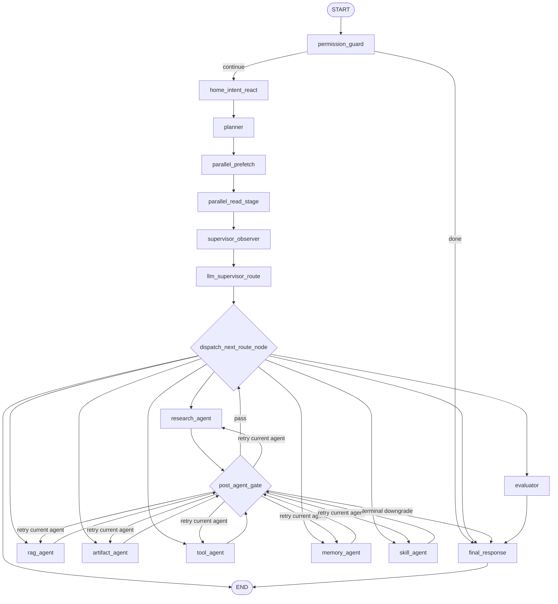
```mermaid
flowchart TD
    START(["START"]) --> PG["permission_guard"]
    PG -->|continue| HIR["home_intent_react"]
    PG -->|done| FR["final_response"]
    HIR --> PL["planner"]
    PL --> PF["parallel_prefetch"]
    PF --> PRS["parallel_read_stage"]
    PRS --> SO["supervisor_observer"]
    SO --> LSR["llm_supervisor_route"]
    LSR --> D{"dispatch_next_route_node"}

    D --> RA["research_agent"]
    D --> RG["rag_agent"]
    D --> AA["artifact_agent"]
    D --> TA["tool_agent"]
    D --> MA["memory_agent"]
    D --> SA["skill_agent"]
    D --> EV["evaluator"]
    D --> FR
    D --> END(["END"])

    RA --> G{"post_agent_gate"}
    RG --> G
    AA --> G
    TA --> G
    MA --> G
    SA --> G
    G -->|pass| D
    G -->|retry current agent| RA
    G -->|retry current agent| RG
    G -->|retry current agent| AA
    G -->|retry current agent| TA
    G -->|retry current agent| MA
    G -->|retry current agent| SA
    G -->|terminal downgrade| FR
    EV --> FR
    FR --> END
```

对应代码：

- `src/web_app/agent/runtime/graph_builder.py`
- `src/web_app/agent/runtime/graph_registry.py`
- `src/web_app/agent/runtime/dispatch.py`
- `src/web_app/agent/runtime/graph.py`
- `src/web_app/agent/runtime/post_agent_gate.py`

## 6. Runtime 的节点分层

| 节点组 | 节点 | 作用 |
|---|---|---|
| Setup | `permission_guard` | 权限和安全入口 |
| Setup | `home_intent_react` | 识别首页/页面上下文意图 |
| Setup | `planner` | 生成 RoutePlan |
| Read | `parallel_prefetch` | 并行预取 RAG、Memory、Skill、Graph context |
| Read | `parallel_read_stage` | 构建上下文和匹配 skill |
| Read | `supervisor_observer` | 观察运行状态 |
| Read | `llm_supervisor_route` | 可选 LLM 接管 route_plan |
| Agent | `rag_agent` | 文档问答和证据回答 |
| Agent | `tool_agent` | 工具调用或审批暂停 |
| Agent | `memory_agent` | 写入和固化记忆 |
| Agent | `skill_agent` | 生成 Skill 草稿 |
| Agent | `research_agent` | 研究任务 |
| Agent | `artifact_agent` | 生成 artifact |
| Gate | `post_agent_gate` | agent 后置质量门，决定通过、重试当前 agent 或终止降级 |
| Final | `evaluator` | 全局结果约束和一致性检查 |
| Final | `final_response` | 聚合最终回答 |

## 7. RoutePlan 是 Runtime 的核心控制对象

`planner` 的核心产物是 `route_plan`。它告诉 Runtime：

- 用户意图是什么。
- 要走哪些 agent。
- 风险等级是什么。
- 是否需要审批。
- 回答模式是什么。

示例：

```python
{
    "intent": "document_qa",
    "route": ["rag_agent", "evaluator", "final_response"],
    "risk_level": "L1",
    "needs_approval": False,
    "answer_mode": "rag_qa"
}
```

工具动作可能是：

```python
{
    "intent": "tool.email",
    "route": ["tool_agent", "evaluator", "final_response"],
    "risk_level": "L3",
    "needs_approval": True,
    "answer_mode": "tool_action"
}
```

这里的 `final_response` 是正常收尾路径；实际执行时每个 agent 后都会先过 `post_agent_gate`。gate 通过才继续 route 里的下一个节点；如果当前 agent 输出不达标，就重试当前 agent，或者在审批拒绝、L4、高风险/预算耗尽时终止依赖链并进入降级回答。最后 evaluator 只做全局一致性和最终约束检查。

## 8. LLM Supervisor 为什么存在

Planner 是初始规划，LLM Supervisor 是运行时复核/接管。

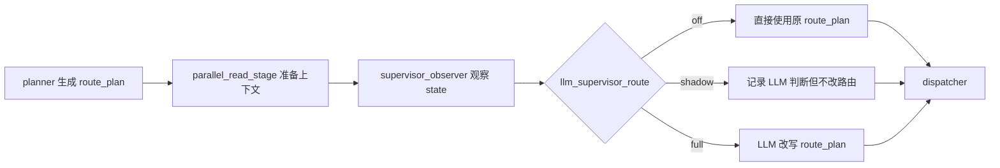
```mermaid
flowchart LR
    A["planner 生成 route_plan"] --> B["parallel_read_stage 准备上下文"]
    B --> C["supervisor_observer 观察 state"]
    C --> D{"llm_supervisor_route"}
    D -->|off| E["直接使用原 route_plan"]
    D -->|shadow| F["记录 LLM 判断但不改路由"]
    D -->|full| G["LLM 改写 route_plan"]
    E --> H["dispatcher"]
    F --> H
    G --> H
```

面试讲法：

> 我把路由拆成 planner、supervisor、dispatcher 三层。planner 做初始决策，supervisor 可以在上下文准备后根据 state 复核甚至改写 route_plan，dispatcher 保持简单，只按 route_plan 和 completed_nodes 跳转。这样既有可解释性，又保留了运行时动态调整能力。

## 9. Runtime 的 checkpoint 与恢复

普通运行时，graph 可以无 checkpoint 编译；但高风险审批恢复必须有 checkpointer。当前生产路径使用 PostgresSaver / AsyncPostgresSaver。

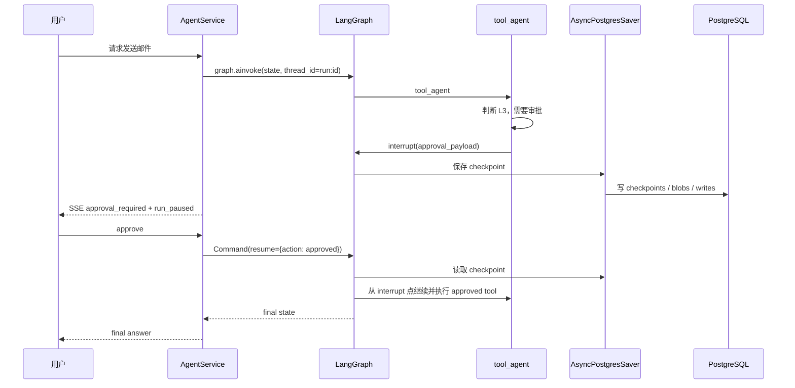
```mermaid
sequenceDiagram
    participant User as 用户
    participant AS as AgentService
    participant G as LangGraph
    participant TA as tool_agent
    participant CP as AsyncPostgresSaver
    participant DB as PostgreSQL

    User->>AS: 请求发送邮件
    AS->>G: graph.ainvoke(state, thread_id=run:id)
    G->>TA: tool_agent
    TA->>TA: 判断 L3，需要审批
    TA->>G: interrupt(approval_payload)
    G->>CP: 保存 checkpoint
    CP->>DB: 写 checkpoints / blobs / writes
    AS-->>User: SSE approval_required + run_paused
    User->>AS: approve
    AS->>G: Command(resume={action: approved})
    G->>CP: 读取 checkpoint
    G->>TA: 从 interrupt 点继续并执行 approved tool
    G-->>AS: final state
    AS-->>User: final answer
```

关键讲点：

1. 不是从头 replay graph。
2. 工具审批前不会执行真实外部写入。
3. 审批后服务层先执行工具，再把结果 resume 回 graph。
4. `thread_id=run:{run_id}` 是 checkpoint 的稳定 key。
5. PostgresSaver 支持跨进程恢复。

## 10. Runtime 模块面试话术

> Runtime 是这个项目的执行内核。我没有让模型自由决定所有行为，而是用 LangGraph StateGraph 把请求拆成权限、意图、规划、上下文、能力节点、评估、最终回复。每个节点只负责一类状态变更，所有节点通过 AgentRuntimeState 共享数据。高风险工具通过 interrupt 暂停，PostgresSaver 保存 checkpoint，用户审批后 Command(resume) 从暂停点继续。这样 Runtime 具备可观测、可恢复和可治理的特点。

---

# 模块二：MCP 工具治理

## 10.5 MCP 模块要怎么“讲透”

MCP 这一块不要只讲“我接了 MCP 工具”。这样说太浅，听起来像只是把一个 tool list 塞进 LLM。你真正要讲的是：**当 Agent 具备调用外部工具的能力后，系统如何防止模型越权、误操作、乱填参数、绕过审批，以及如何在审批后恢复执行。**

普通 Agent demo 里，工具调用往往是这样的：

```text
LLM 生成 tool_name + tool_args -> 后端直接执行 -> 把结果返回给模型
```

这在演示环境里可以跑，但工程上风险很大。因为模型可能会：

1. 把用户一句“帮我看看能不能发”理解成“立刻发送邮件”。
2. 漏掉必填参数，比如收件人、文件路径、确认字段。
3. 对高风险工具生成看似合理但实际上危险的参数。
4. 在上下文污染时调用完全不相关的工具。
5. 执行失败后没有审计记录，出了问题无法复盘。

所以你项目里的 MCP 治理层，本质上是给 Agent 工具调用加了一层“操作系统权限模型”。模型可以提出工具调用意图，但不能绕过工具注册表、参数校验、风险等级、人类审批和审计表。面试时可以这样概括：

> MCP 模块不是简单 tool calling，而是把工具从“LLM 的自由动作”改造成“有注册、有 schema/参数约束、有风险等级、有审批状态、有审计记录、有恢复链路”的受控执行系统。

这里最能体现工程能力的点有四个：

1. **工具抽象统一**：所有工具先进入 registry，用统一 spec 描述名称、参数、权限等级、provider 和执行入口。
2. **执行边界统一**：tool_agent 不直接碰具体工具实现，而是通过 ToolRouter/ToolExecutor 走统一执行路径。
3. **风险控制统一**：L0-L4 风险等级控制工具是否直接执行、是否需要审批、是否直接阻断。
4. **状态恢复统一**：L3 审批不是简单返回一句“等用户确认”，而是结合 LangGraph interrupt、Approval 表、ToolCall 表和 checkpoint resume 继续原来的 run。

## 10.6 MCP 在整体项目里的位置

MCP 模块位于 Runtime 和外部世界之间。Runtime 负责决定“下一步可能要调用工具”，但 MCP 负责决定“这个工具是否能被调用、怎么调用、是否要审批、调用结果如何记录”。

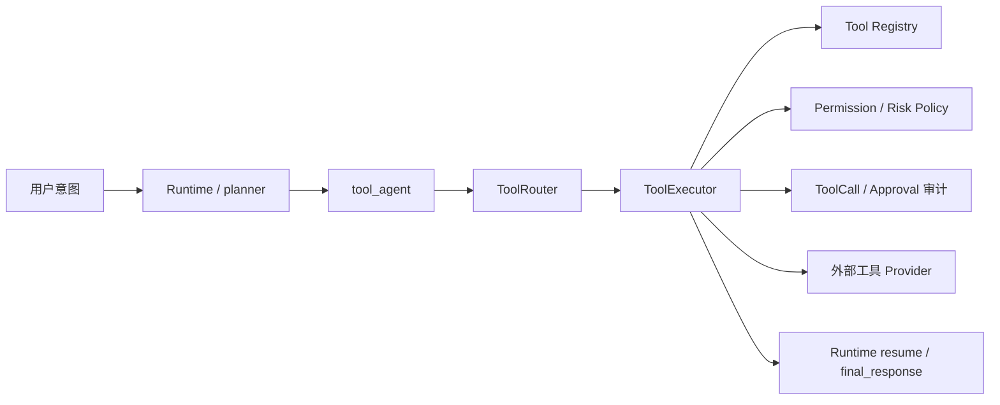
```mermaid
flowchart LR
    U["用户意图"] --> RT["Runtime / planner"]
    RT --> TA["tool_agent"]
    TA --> TR["ToolRouter"]
    TR --> TE["ToolExecutor"]
    TE --> REG["Tool Registry"]
    TE --> PERM["Permission / Risk Policy"]
    TE --> AUDIT["ToolCall / Approval 审计"]
    TE --> EXT["外部工具 Provider"]
    TE --> RT2["Runtime resume / final_response"]
```

这张图可以这么讲：

> tool_agent 只负责把当前任务转成候选工具调用，真正的执行权在 ToolExecutor。ToolExecutor 会回查 registry，确认工具存在、参数满足 input_schema 的 JSON Schema 约束、风险等级允许，然后根据 L0-L4 决定直接执行、审批等待或阻断。这样 Runtime 和工具实现解耦，安全策略也不会散落在每个工具函数里。

这也是为什么 MCP 是你项目里很适合面试展开的模块。它不是“为了用 MCP 而 MCP”，而是在解决 Agent 产品化最现实的问题：**模型可以很聪明，但模型不能被默认信任。**

## 10.7 工具注册表的价值

工具注册表的核心作用，是把“工具函数”升级成“可治理资源”。如果没有 registry，每个工具可能只是一个 Python function，名字、参数、风险、权限、描述都散落在代码里。这样会带来几个问题：

1. Runtime 不知道有哪些工具能用。
2. LLM 不知道每个工具的真实边界。
3. 参数校验逻辑容易重复或遗漏。
4. 新增工具时很难统一接入审批和审计。
5. 删除、发邮件、外部写入这类动作没有统一入口。

你的项目里，工具被抽象成类似下面的治理对象：

```text
ToolSpec
  - name: 工具名
  - description: 给模型/系统看的能力说明
  - input_schema: JSON Schema 参数契约
  - permission_level: L0/L1/L2/L3/L4
  - provider: 具体执行方
  - metadata: 工具分类、审计信息、展示信息
```

面试时你可以强调：

> 我没有让 agent 节点直接 import 某个工具函数执行，而是通过 registry 统一拿 tool spec。这样工具能力、权限边界和执行入口是数据化的，后面做 UI 展示、人工审批、工具审计、权限收敛和灰度开关都会更容易。

注意措辞：现在可以说工具输入已经按 JSON Schema 做统一校验，但不要把它夸成完整 MCP 生态或外部工具信任体系。更稳的说法是：

> 当前实现把 Tool spec 的 input_schema 作为工具参数契约，在 ToolRouter 做工具名规范化和 JSON Schema 校验；缺 required 字段时由 tool_agent 追问用户。ToolExecutor 在执行或创建审批前会再次校验，防止直接 API 调用绕过 Runtime。校验覆盖 required、类型、枚举、范围、数组/对象结构、additionalProperties 和常见 format。

这样讲既真实，又体现边界：它解决的是工具输入参数合法性，不等于外部 MCP server trust policy、参数级数据权限和全部安全治理都已经完成。

## 10.8 风险等级为什么要分 L0-L4

Agent 工具风险不是二元的，不是“能调”和“不能调”。不同工具的风险差异很大：

| 等级 | 典型能力 | 风险特点 | 处理方式 |
|---|---|---|---|
| L0 | 纯计算、格式化、无外部副作用 | 不读敏感数据、不写外部系统 | 可直接执行 |
| L1 | 读本地或读公开数据 | 有信息读取，但副作用低 | 可执行并记录 |
| L2 | 本地写入、生成草稿、内部状态修改 | 有副作用，但影响范围可控 | 受限执行并审计 |
| L3 | 发邮件、外部系统写入、提交审批类动作 | 影响用户或外部系统 | 必须人工审批 |
| L4 | 删除关键数据、危险命令、不可逆外部操作 | 高危或不可接受 | 阻断 |

这一层最关键的面试表达是：

> 我不是把所有工具都放到人工审批后面，因为那会让 Agent 很难用；也不是全部放开，因为那不安全。所以我按副作用和外部影响做风险分级。低风险工具直接跑，高风险工具走审批，不可接受风险直接阻断。

这背后是一个非常典型的工程取舍：

```text
全部放开：体验好，但安全差
全部审批：安全高，但体验差
风险分级：在体验和安全之间做可解释折中
```

你可以举例：

- 查询天气、格式化文本：L0/L1。
- 生成邮件草稿但不发送：L2。
- 真正发送邮件、提交外部系统：L3。
- 删除用户数据、执行任意 shell、覆盖重要文件：L4。

## 10.9 L3 审批为什么是闭环能力

很多项目会说“高风险工具需要用户确认”，但真实工程里最难的不是弹一个确认框，而是确认之后怎么继续原来的执行链路。

你的项目应该这样讲：

> L3 工具调用到达 ToolExecutor 后，不会直接执行。系统会用幂等 key 创建或复用 ToolCall 和 Approval 记录，把当前 Runtime 通过 LangGraph interrupt 暂停，并依赖 PostgresSaver 保存 checkpoint。前端收到 approval_required 事件后展示工具名、参数和风险说明。用户 approve 后，服务层只用 Command(resume={action: approved}) 恢复 graph；tool_agent 会从 interrupt 点继续，并在 interrupt 返回之后调用 execute_approved_tool_once 执行真实 provider。

这个链路很重要，因为它把三个系统串起来了：

1. **MCP**：识别工具风险并创建审批。
2. **Runtime**：在安全边界处暂停执行。
3. **Checkpoint**：保证审批跨请求、跨时间后还能恢复。

可以用这段话解释“为什么不是简单同步等待”：

> 审批是人参与的异步流程，用户可能几秒后点确认，也可能几分钟后才回来。如果只是内存里 await，一个进程重启就丢了。所以我把等待状态持久化成 Approval/ToolCall，再用 LangGraph checkpoint 保存图状态，审批后 resume。

这会让面试官明显感觉你是在按生产系统思考。

## 10.10 ToolCall 与 Approval 审计为什么重要

工具调用不是只要成功就行。Agent 一旦能操作外部系统，就一定要回答四个问题：

1. 谁触发了这个工具？
2. 当时模型给了什么参数？
3. 系统为什么允许或拒绝？
4. 最终工具有没有执行，执行结果是什么？

所以 ToolCall/Approval 记录不是“多余日志”，而是安全系统的一部分。你可以这样讲：

> ToolCall 记录的是工具调用事实，Approval 记录的是人工决策事实。两者结合后，系统可以复盘一次高风险动作：用户说了什么、Agent 规划了什么、工具参数是什么、风险等级是什么、谁批准了、批准后实际执行结果是什么。

如果面试官追问“这和普通 log 有什么区别”，你可以回答：

> 普通 log 是运行时副产物，不一定结构化，也不一定能被业务查询。ToolCall/Approval 是业务审计实体，有明确状态机，可以被 UI 展示、被审批流程引用、被恢复逻辑引用，也可以后续用于合规和风控统计。

## 10.11 MCP 与 Runtime 的边界

这一点也很容易被问。你要说清楚：Runtime 不应该知道每个工具的细节，MCP 也不应该决定整个 Agent 的任务规划。

| 模块 | 负责什么 | 不负责什么 |
|---|---|---|
| Runtime | 任务流程、节点路由、checkpoint、resume、最终回答 | 每个工具的具体安全策略 |
| tool_agent | 把任务转成工具调用意图 | 绕过审批直接执行外部工具 |
| MCP Registry | 管理工具元信息和能力边界 | 生成最终自然语言答案 |
| ToolExecutor | 参数校验、风险分级、执行、审批状态 | 决定整个任务要不要做 RAG 或 Memory |
| PermissionService | 记录审批、权限状态 | 替代 LangGraph 状态机 |

面试话术：

> Runtime 管流程，MCP 管工具边界。Runtime 只知道现在进入 tool_agent，需要一个工具结果；MCP 负责判断这个工具是否存在、参数是否合法、风险等级是什么、是否需要审批。这样工具安全策略集中在 MCP 层，而不是散落在 Runtime 各个节点里。

## 10.12 MCP 的失败路径怎么处理

工具系统一定会失败。面试官很可能问“如果工具不存在、参数错、审批拒绝、执行异常怎么办”。你要能按路径回答：

1. **工具不存在**：ToolRouter/Registry 查不到 spec，返回结构化错误，Runtime 不应继续假装执行成功。
2. **参数不完整**：validate 阶段拦截，提示缺少哪些字段，必要时让 final_response 询问用户补充。
3. **风险 L4**：直接阻断，写审计，不进入执行。
4. **风险 L3**：进入 waiting_approval，不直接执行。
5. **用户拒绝审批**：ToolCall/Approval 标记 rejected，Runtime resume 后告诉用户未执行，并可给替代方案。
6. **provider 执行失败**：记录 error，`post_agent_gate` 可在预算内重试当前 tool/tool_agent；如果是审批拒绝、等待审批、L4 或重试耗尽，再由 final_response 做降级说明。
7. **checkpoint 恢复失败**：服务层返回恢复失败，保留审批记录和错误信息方便排查。

你可以总结成一句：

> MCP 的失败不是异常散落，而是尽量结构化进入状态和审计记录。可恢复的 provider 失败会先被 post_agent_gate 拦截并重试当前工具节点；审批拒绝、高风险阻断或重试耗尽时，Runtime 再降级回答，而不是让用户看到一串后端 traceback。

## 10.13 MCP 模块的面试亮点和诚实边界

**可以重点讲：**

- 工具 registry/spec 抽象。
- ToolRouter + ToolExecutor 统一执行路径。
- L0-L4 风险分级。
- L3 人工审批。
- L4 高危阻断。
- ToolCall/Approval 审计。
- interrupt + checkpoint + resume 的审批恢复闭环。

**不要夸大：**

- 不要说“完整 MCP 生态平台”，更稳是“围绕 MCP 工具调用做了一层治理能力”。
- JSON Schema 可以说已经用于工具输入校验，但不要说“完整 MCP 生态平台”或“所有外部工具都天然可信”；更稳是“input_schema 作为参数契约，执行前双层校验，外部 server trust policy 和更细粒度数据权限仍可继续增强”。
- 不要说“所有危险操作都绝对安全”，更稳是“按风险等级降低误操作概率，并保留审计和人工审批”。
- 不要说“工具调用可以完全自动修复”，更稳是“失败会结构化返回；可恢复失败由 post_agent_gate 按预算重试当前工具节点，审批拒绝、高风险或重试耗尽后再由 final_response 降级说明或追问用户”。

## 11. MCP 模块要解决什么问题

Agent 工具调用最怕三件事：

1. 模型误调用危险工具。
2. 参数不完整或格式错误。
3. 外部写入、删除、发邮件这类操作无法追踪和回滚。

MCP 治理层的任务是：**让工具调用从“模型想调就调”变成“注册、校验、分级、审批、审计”的工程流程。**

## 12. MCP 工具治理流程图

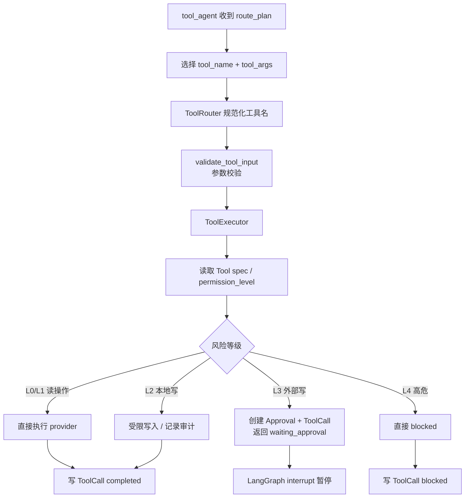
```mermaid
flowchart TD
    A["tool_agent 收到 route_plan"] --> B["选择 tool_name + tool_args"]
    B --> C["ToolRouter 规范化工具名"]
    C --> D["validate_tool_input<br/>参数校验"]
    D --> E["ToolExecutor"]
    E --> F["读取 Tool spec / permission_level"]
    F --> G{"风险等级"}
    G -->|L0/L1 读操作| H["直接执行 provider"]
    G -->|L2 本地写| I["受限写入 / 记录审计"]
    G -->|L3 外部写| J["创建 Approval + ToolCall<br/>返回 waiting_approval"]
    G -->|L4 高危| K["直接 blocked"]
    J --> L["LangGraph interrupt 暂停"]
    H --> M["写 ToolCall completed"]
    I --> M
    K --> N["写 ToolCall blocked"]
```

## 13. 风险等级怎么讲

| 等级 | 类型 | 示例 | 策略 |
|---|---|---|---|
| L0 | 纯对话 / 内部推理 | 闲聊、解释概念 | 直接执行 |
| L1 | 读取信息 | 搜索、RAG、读取文件 | 直接执行但记录 |
| L2 | 本地低风险写 | 生成 artifact、写草稿 | 限制目录或上下文 |
| L3 | 外部写入 | 发邮件、提交表单、发布内容 | 人工审批 |
| L4 | 高危不可逆 | 删除、支付、权限修改 | 默认阻断 |

## 14. ToolCall 和 Approval 的关系

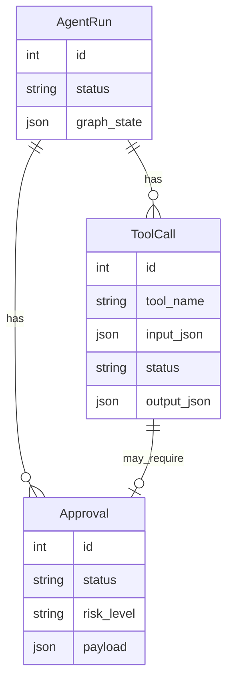
```mermaid
erDiagram
    AgentRun ||--o{ ToolCall : has
    AgentRun ||--o{ Approval : has
    ToolCall ||--o| Approval : may_require

    AgentRun {
        int id
        string status
        json graph_state
    }
    ToolCall {
        int id
        string tool_name
        json input_json
        string status
        json output_json
    }
    Approval {
        int id
        string status
        string risk_level
        json payload
    }
```

解释：

> ToolCall 是工具调用事实记录，Approval 是人工审批记录。L3 工具会先用幂等 key 创建或复用 ToolCall 和 Approval，但不执行真实 provider。用户批准后，AgentService 只负责把 approved decision 通过 Command(resume) 交回 LangGraph；真实工具由 tool_agent 在 interrupt 返回之后执行，并通过 execute_approved_tool_once 防止重复执行。

## 15. MCP 与 Runtime 的交互

MCP 不是孤立模块，它和 Runtime 的 checkpoint 深度结合。

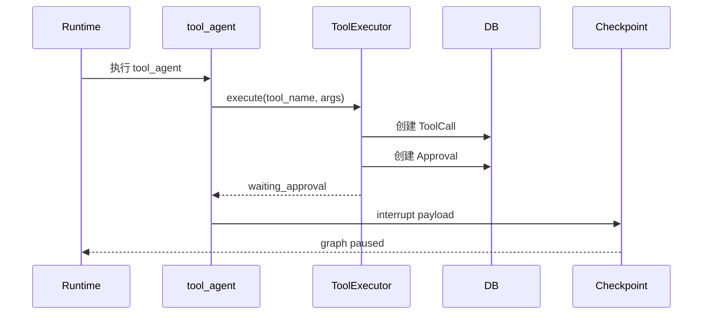
```mermaid
sequenceDiagram
    participant RT as Runtime
    participant TA as tool_agent
    participant EX as ToolExecutor
    participant DB as DB
    participant CP as Checkpoint

    RT->>TA: 执行 tool_agent
    TA->>EX: execute(tool_name, args)
    EX->>DB: 创建 ToolCall
    EX->>DB: 创建 Approval
    EX-->>TA: waiting_approval
    TA->>CP: interrupt payload
    CP-->>RT: graph paused
```

## 16. MCP 模块面试话术

> 我把 MCP 工具调用做成了一个治理链路。工具不是让 LLM 直接执行，而是先注册成 spec，包括 input_schema、output_schema、permission_level 和 approval_required。tool_agent 选择工具后先经过 ToolRouter 做工具名规范化和 JSON Schema 参数校验，再进入 ToolExecutor 做执行前兜底校验和风险判断。L3 外部写入会创建 ToolCall 和 Approval，并通过 LangGraph interrupt 暂停；L4 高危操作直接 blocked。这样工具调用有前置约束、人工审批和审计记录。

边界要讲清：

> 参数校验现在以 Tool spec 的 input_schema 为准，覆盖 required、类型、枚举、范围、数组/对象结构、additionalProperties 和常见 format。边界是：这是工具输入 JSON Schema 校验，不等于完整 MCP 生态、外部工具 trust policy 或更细粒度数据权限全部完成。

---

# 模块三：结构化 RAG 检索

## 16.5 RAG 模块要怎么“讲透”

RAG 这一块面试时最容易讲浅。很多人只会说“我把文档切 chunk，然后 embedding，最后相似度搜索”。你要讲得更工程化：**文档检索不是只做向量相似度，而是要解决切分粒度、召回信号、上下文完整性、证据可用性和效果评估这五个问题。**

普通 RAG 的链路是：

```text
文档 -> 切 chunk -> embedding -> top-k 相似度 -> 塞给 LLM
```

这个链路的问题在真实文档里很明显：

1. chunk 太大：一个 chunk 包含太多主题，向量会被平均化，召回不准。
2. chunk 太小：命中了某句话，但缺少前后条件，回答容易断章取义。
3. dense embedding 不擅长合同编号、表格字段、专有名词、代码、数字。
4. 只用 BM25 又不擅长语义改写和同义表达。
5. 没有 eval 时，优化只能靠主观感觉。

所以你项目的 RAG 要讲成一套组合方案：

```text
结构化解析
-> Parent-Child Chunking
-> child dense/sparse indexing
-> Qdrant Hybrid Search
-> Fusion.RRF
-> parent context enrichment
-> evidence 进入 GSSC / final_response
-> synthetic eval 量化对比
```

面试时可以先用这句话压住全局：

> RAG 模块的核心不是“向量库接入”，而是把“精准召回”和“完整回答上下文”拆开处理。child chunk 用来提高命中精度，parent chunk 用来补足回答上下文；dense 处理语义，sparse 处理关键词、编号和字段；最后用 RRF 融合，并用 eval 检查 hit@k。

## 16.6 RAG 在整体链路里的位置

RAG 不是孤立服务，它和 Runtime、GSSC、Memory 都有关系：

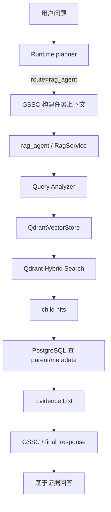
```mermaid
flowchart TD
    U["用户问题"] --> RT["Runtime planner"]
    RT -->|route=rag_agent| GSSC["GSSC 构建任务上下文"]
    GSSC --> RAG["rag_agent / RagService"]
    RAG --> AN["Query Analyzer"]
    AN --> VS["QdrantVectorStore"]
    VS --> QD["Qdrant Hybrid Search"]
    QD --> HIT["child hits"]
    HIT --> PG["PostgreSQL 查 parent/metadata"]
    PG --> EV["Evidence List"]
    EV --> GSSC2["GSSC / final_response"]
    GSSC2 --> OUT["基于证据回答"]
```

这里可以这样解释：

> Runtime 判断这是文档问题后，把任务路由到 rag_agent。rag_agent 不直接把全部文档塞给模型，而是调用检索服务。检索服务先分析 query，再走 Qdrant hybrid 召回 child chunk，命中后回查 parent chunk 和文档 metadata，最后把 evidence list 交给 final_response。GSSC 在中间负责把 RAG evidence 和最近对话、用户偏好等其他上下文一起组织进 prompt。

这句话里体现了两个重点：

1. RAG 只负责证据检索，不负责整个 Agent 编排。
2. RAG evidence 不是直接裸塞，而是进入上下文治理层。

## 16.7 为什么要做结构化解析与层级 chunk

真实文档不是一整块自然语言。它可能包含标题、章节、列表、表格、编号、脚注、代码块、附件说明。直接按固定字符数切分，会破坏文档结构。

举个例子：

```text
2.4 违约责任
甲方未按时付款，应按每日 0.05% 支付违约金。
但因不可抗力导致延期的，不适用本条。
```

如果 chunk 切得太小，只命中“每日 0.05%”，模型可能回答“违约金是每日 0.05%”，但漏掉“不可抗力不适用”的限制条件。如果 chunk 切得太大，这一节和前后很多无关条款混在一起，向量相似度又会变差。

Parent-Child 的解决思路是：

```text
Parent: 保留完整语义单元，例如一个章节、一个段落组、一个表格上下文
Child: 从 Parent 内部切出更小片段，用来做精准召回
```

你可以这样讲：

> child 是检索粒度，parent 是回答粒度。检索时要小，回答时要完整。这是 RAG 里非常关键的粒度解耦。

## 16.8 Overview / Parent / Child 三类 chunk 怎么分工

你的文档里可以把三类 chunk 讲得更细：

| chunk 类型 | 主要作用 | 是否适合作为检索点 | 是否适合作为回答上下文 |
|---|---|---|---|
| Overview | 表示文档整体摘要、主题、来源 | 适合粗召回或文档级判断 | 可作为背景 |
| Parent | 保留完整段落、章节、表格上下文 | 不一定直接向量检索 | 非常适合回答 |
| Child | 小片段、语义焦点清晰 | 非常适合检索 | 单独回答可能不完整 |

更直白的面试表达：

> Overview 解决“这个文档大概是什么”，Parent 解决“回答时上下文够不够”，Child 解决“向量空间里能不能准命中”。

这三者形成的链路是：

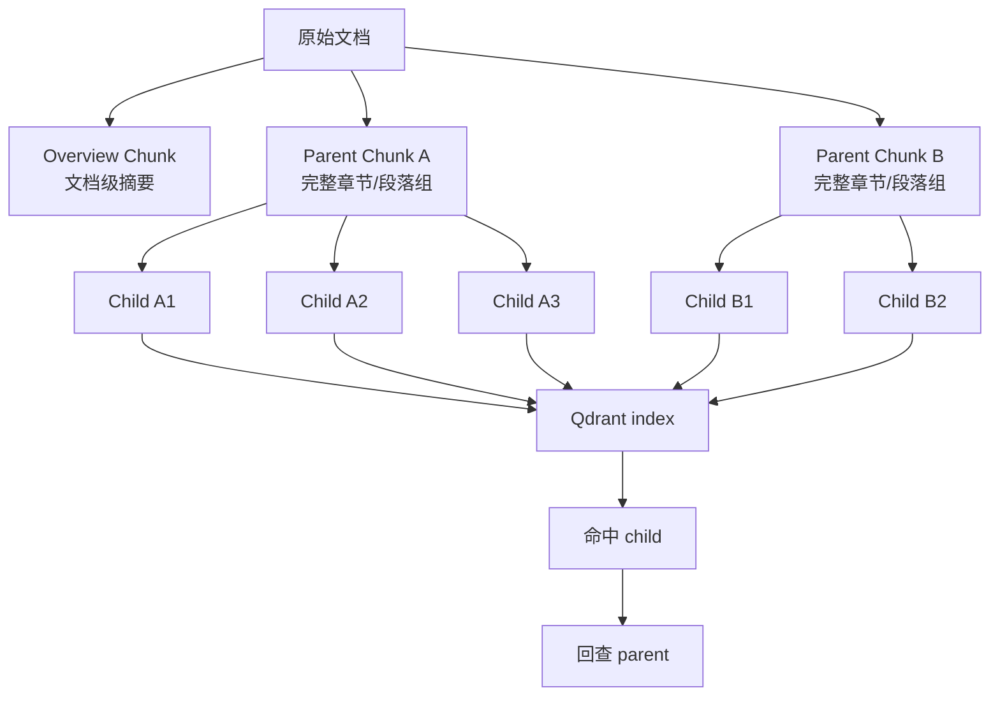
```mermaid
flowchart TD
    D["原始文档"] --> O["Overview Chunk<br/>文档级摘要"]
    D --> P1["Parent Chunk A<br/>完整章节/段落组"]
    D --> P2["Parent Chunk B<br/>完整章节/段落组"]
    P1 --> C11["Child A1"]
    P1 --> C12["Child A2"]
    P1 --> C13["Child A3"]
    P2 --> C21["Child B1"]
    P2 --> C22["Child B2"]
    C11 --> IDX["Qdrant index"]
    C12 --> IDX
    C13 --> IDX
    C21 --> IDX
    C22 --> IDX
    IDX --> HIT["命中 child"]
    HIT --> BACK["回查 parent"]
```

## 16.9 为什么 dense + sparse 都要有

只用 dense embedding 的问题是，它擅长语义相似，但对精确 token 不稳定。比如：

```text
“HT-2026-001 的付款期限是什么？”
“第 3.2.1 条的责任上限是多少？”
“CSV 里的 inventory_count 字段是什么意思？”
```

这些问题里，编号、字段名、合同号非常关键。dense 可能知道“付款期限”和“责任上限”的语义，但可能漏掉具体编号。sparse/BM25 对这些 token 更敏感。

只用 sparse 的问题是，它对语义改写不友好。比如：

```text
用户问：这家公司什么时候可以不赔偿？
文档写：因不可抗力导致延期的，不承担违约责任。
```

这时候 dense 更容易把“可以不赔偿”和“不承担违约责任”连起来。

所以 hybrid 的价值是互补：

| 查询类型 | dense 价值 | sparse 价值 |
|---|---|---|
| 语义改写问题 | 高 | 中 |
| 合同号/编号/字段名 | 中或低 | 高 |
| 表格列名/代码符号 | 中 | 高 |
| 长自然语言问题 | 高 | 中 |
| 用户关键词很明确 | 中 | 高 |

面试时可以说：

> dense 负责“意思像不像”，sparse 负责“字面上有没有”。真实企业文档里编号、字段、金额、条款号很多，所以只用 dense 不够稳。

## 16.10 RRF 融合为什么比简单加权好讲

Qdrant native hybrid 里使用 Fusion.RRF。RRF 的直觉是：不直接比较 dense score 和 sparse score 的绝对值，而是根据两个列表里的排名做融合。

为什么这有价值？

1. dense score 和 sparse score 的分布不同，直接相加不一定合理。
2. RRF 更关注“在多个检索器里排名都靠前”的结果。
3. 对分数尺度不敏感，更适合多路召回融合。

可以这样讲：

> RRF 不是问“两个分数怎么相加”，而是问“这个候选在多个召回列表里是不是都排得靠前”。这样避免 dense/sparse 分数尺度不同导致融合不稳定。

你不需要在面试里推公式，但可以知道它的直觉：

```text
如果一个 chunk 在 dense 排第 2，在 sparse 排第 3，
通常比一个只在 dense 排第 1、sparse 完全没命中的 chunk 更值得保留。
```

## 16.11 Parent context enrichment 为什么是回答质量关键

命中 child 后，如果直接把 child 发给 LLM，会有两个风险：

1. **证据碎片化**：只有一句话，没有前后限制条件。
2. **引用不可解释**：最终回答无法说明来自哪个文档、哪个章节。

所以需要 parent context enrichment：

```text
child hit
-> child.parent_id
-> PostgreSQL 查询 parent chunk
-> 合并 parent text / metadata / document source
-> evidence item
```

这一步要讲成“RAG 证据可用性”的增强，而不只是“多查一次数据库”。

面试话术：

> 检索命中的是 child，但最终给模型的是带 parent context 的 evidence。这样能同时保证召回时的精度和回答时的完整性，尤其适合合同、报告、长章节和表格上下文。

## 16.12 RAG 与 GSSC 的关系

RAG 检索出的 evidence 不是最终 prompt 的唯一来源。用户可能刚刚说过“只看第二份文档”，Memory 里可能记录了“用户喜欢中文回答”，conversation summary 里可能有前文约束。因此 evidence 要进入 GSSC，由上下文选择器统一组织。

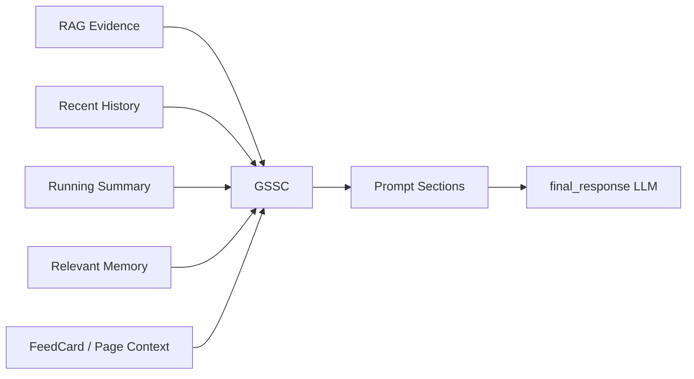
```mermaid
flowchart LR
    RAG["RAG Evidence"] --> G["GSSC"]
    H["Recent History"] --> G
    S["Running Summary"] --> G
    M["Relevant Memory"] --> G
    F["FeedCard / Page Context"] --> G
    G --> P["Prompt Sections"]
    P --> LLM["final_response LLM"]
```

这点可以这样讲：

> RAG 解决“外部文档证据”，GSSC 解决“这些证据和当前对话、用户偏好、任务约束如何一起进入 prompt”。如果没有 GSSC，RAG evidence 可能和用户最新要求冲突，或者把不相关证据塞进去造成污染。

## 16.13 RAG eval 该怎么解释

RAG 优化最怕“感觉变好了”。你的项目里有 synthetic eval runner，所以面试时要把它讲成工程闭环：

```text
固定文档集
固定 query 集
固定 expected evidence / keyword
跑不同 backend
比较 hit@1 / hit@3 / hit@5 / keyword_hit_rate / fallback_count / latency
```

你可以说：

> 我用 synthetic eval 来比较不同检索 backend，不是只看最终生成回答，而是先看 evidence 能不能命中。因为 RAG 如果证据没召回，后面模型再强也只能胡编或答偏。

关于 `hit@5 0.54 -> 0.92`，一定要加边界：

> 这是自建 synthetic eval 集上的 backend 对比指标，不是线上真实用户 A/B 指标。

这样讲非常稳。面试官通常不怕你指标小，怕你乱讲指标来源。

## 16.14 RAG 的失败与降级

面试官可能问“如果没检索到怎么办”。你要把失败路径说清楚：

1. **Qdrant 不可用**：走 fallback backend 或返回检索失败信息。
2. **dense/sparse 某一路失败**：优先使用另一条路径或 fallback。
3. **top-k 分数太低 / evidence 为空**：`post_agent_gate` 会在进入后续 artifact/research synthesis 前先重试 `rag_agent`；如果仍没有证据，final_response 明确说明“未找到足够证据”，不要编。
4. **命中 child 但 parent 缺失**：返回 child text，同时标记上下文不完整。
5. **用户问题超出文档范围**：回答边界，提示需要更多资料。
6. **多文档证据冲突**：把冲突交给 evaluator/final_response，让回答说明不同来源。

工程话术：

> RAG 的底线是宁可说证据不足，也不要把低置信证据包装成确定答案。检索失败或 evidence 为空时，Runtime 会先通过 post_agent_gate 重新进入 rag_agent，避免错误证据继续传给 artifact 或后续节点；如果仍失败，再进入可解释降级，而不是让模型自由发挥。

## 16.15 RAG 模块的面试亮点和诚实边界

**可以重点讲：**

- 结构化文档解析。
- Overview/Parent/Child 层级 chunk。
- child 用于精准召回，parent 用于回答上下文。
- Qdrant dense/sparse hybrid。
- Fusion.RRF 融合排序。
- parent context enrichment。
- synthetic eval 和 hit@k 指标。
- 与 GSSC 结合，避免证据裸塞 prompt。

**不要夸大：**

- 不要说“所有文档格式都完美解析”，说“支持常见格式并保留结构化扩展”更稳。
- 不要说“线上 hit@5 提升”，说“自建 synthetic eval 集”。
- 不要说“RAG 可以完全避免幻觉”，说“通过 evidence 和低置信降级降低幻觉风险”。
- 不要说“RRF 是我发明的算法”，说“使用 Qdrant native Fusion.RRF 做多路召回融合”。

## 17. RAG 模块要解决什么问题

普通 RAG 的问题：

1. chunk 太大，召回不准。
2. chunk 太小，回答缺上下文。
3. dense embedding 对合同号、编号、表字段不敏感。
4. 单纯 BM25 又不理解语义。
5. 没有 eval，就不知道优化有没有效果。

你的方案是：

```text
Parent-Child Chunking + Qdrant Hybrid Search + RRF + Parent Context Enrichment + Eval
```

## 18. RAG 写入链路

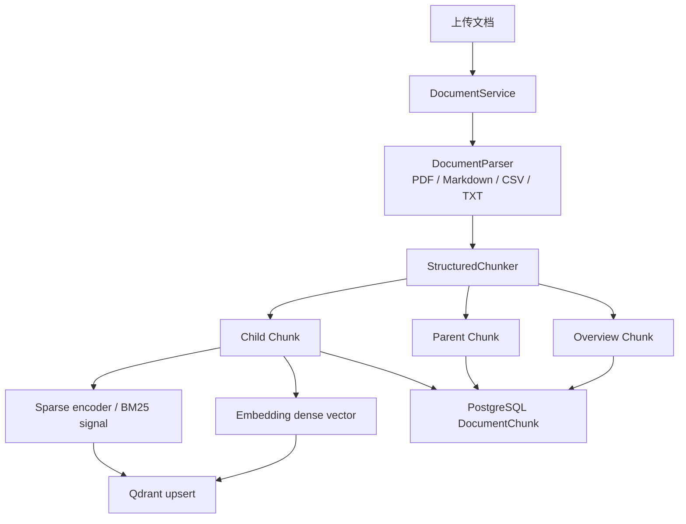
```mermaid
flowchart TD
    A["上传文档"] --> B["DocumentService"]
    B --> C["DocumentParser<br/>PDF / Markdown / CSV / TXT"]
    C --> D["StructuredChunker"]
    D --> E["Overview Chunk"]
    D --> F["Parent Chunk"]
    D --> G["Child Chunk"]
    G --> H["Embedding dense vector"]
    G --> I["Sparse encoder / BM25 signal"]
    H --> J["Qdrant upsert"]
    I --> J
    E --> PG["PostgreSQL DocumentChunk"]
    F --> PG
    G --> PG
```

核心设计：

- Overview：适合文档整体摘要。
- Parent：适合给回答补上下文。
- Child：适合做向量检索命中。
- 只有 child 需要进 Qdrant 检索。
- parent/overview 保存在 PG，检索命中 child 后回查。

## 19. RAG 查询链路

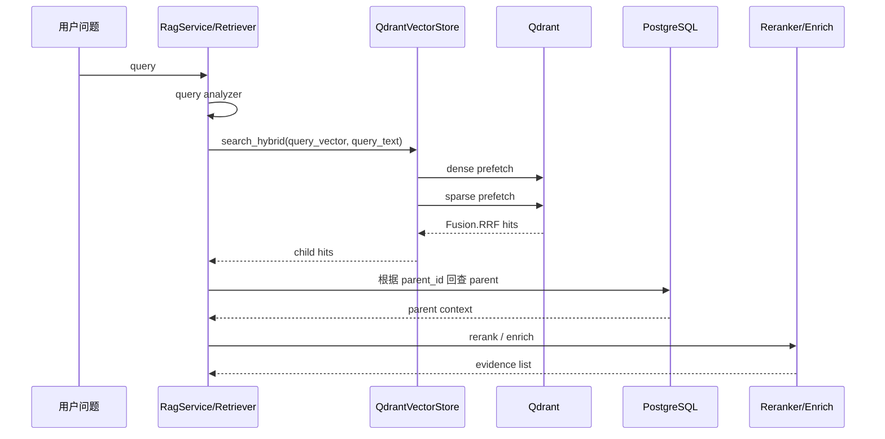
```mermaid
sequenceDiagram
    participant User as 用户问题
    participant RAG as RagService/Retriever
    participant VS as QdrantVectorStore
    participant Q as Qdrant
    participant PG as PostgreSQL
    participant RR as Reranker/Enrich

    User->>RAG: query
    RAG->>RAG: query analyzer
    RAG->>VS: search_hybrid(query_vector, query_text)
    VS->>Q: dense prefetch
    VS->>Q: sparse prefetch
    Q-->>VS: Fusion.RRF hits
    VS-->>RAG: child hits
    RAG->>PG: 根据 parent_id 回查 parent
    PG-->>RAG: parent context
    RAG->>RR: rerank / enrich
    RR-->>RAG: evidence list
```

## 20. Parent-Child 为什么重要

可以用这个图讲：

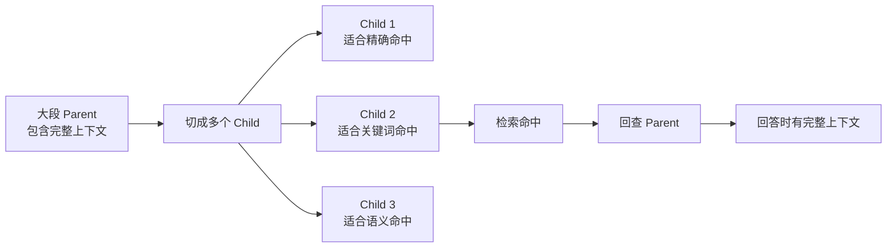
```mermaid
flowchart LR
    A["大段 Parent<br/>包含完整上下文"] --> B["切成多个 Child"]
    B --> C1["Child 1<br/>适合精确命中"]
    B --> C2["Child 2<br/>适合关键词命中"]
    B --> C3["Child 3<br/>适合语义命中"]
    C2 --> D["检索命中"]
    D --> E["回查 Parent"]
    E --> F["回答时有完整上下文"]
```

面试讲法：

> child chunk 小，向量空间里更容易准确命中；parent chunk 大，包含完整段落、表格上下文或前后约束。检索只命中 child 的话回答容易断章取义，所以我在返回 evidence 前根据 parent_id 回查 parent，把命中精度和回答完整性分开处理。

## 21. Qdrant Hybrid 和 RRF

当前 native hybrid 路径使用 Qdrant 的 Fusion.RRF。

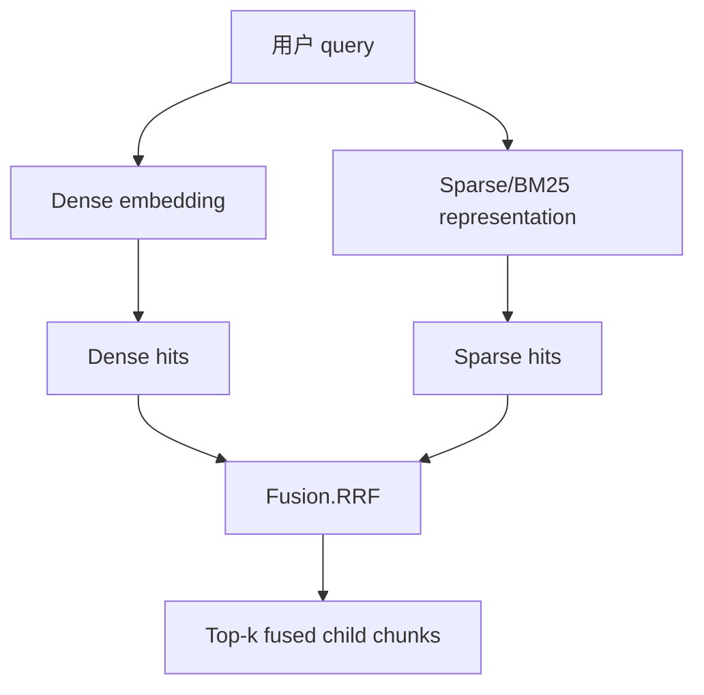
```mermaid
flowchart TD
    Q["用户 query"] --> D["Dense embedding"]
    Q --> S["Sparse/BM25 representation"]
    D --> DH["Dense hits"]
    S --> SH["Sparse hits"]
    DH --> RRF["Fusion.RRF"]
    SH --> RRF
    RRF --> TOP["Top-k fused child chunks"]
```

为什么要 hybrid：

| 查询类型 | dense 强项 | sparse 强项 |
|---|---|---|
| “这份合同的风险是什么” | 好 | 一般 |
| “合同编号 HT-2026-001 是多少” | 可能漏 | 强 |
| “表里库存字段是多少” | 一般 | 强 |
| “这段话表达的核心问题” | 强 | 一般 |

## 22. RAG eval 怎么讲

项目里有 synthetic RAG eval runner。你可以说：

> 我没有只靠主观感觉调 RAG，而是写了 eval runner，对固定测试文档和 query 跑不同 backend，输出 hit@1、hit@3、hit@5、keyword_hit_rate、fallback_count 和 latency。当前可以说在自建 synthetic eval 中，Qdrant hybrid 相比 baseline hit@5 有明显提升。

注意措辞：

- 可以说“自建 synthetic RAG eval”。
- 不要说“线上真实用户指标”。
- 如果说 hit@5 0.54 到 0.92，要补一句“在自建评估集上”。

## 23. RAG 模块面试话术

> RAG 这块我重点解决两个矛盾：精确召回和完整上下文。切分时我用了 Parent-Child Chunking：child 小，负责检索；parent 大，负责回答时补上下文。检索时优先 Qdrant native hybrid，dense 负责语义，sparse 负责编号、关键词、表字段等精确信号，最后用 RRF 融合。命中 child 后再回查 parent context，保证 evidence 不是碎片。为了避免凭感觉优化，我还做了 synthetic eval runner，比较不同 backend 的 hit@5、keyword_hit_rate 和 fallback_count。

---

# 模块四：Memory / GSSC 上下文工程

## 23.5 Memory/GSSC 模块要怎么“讲透”

Memory/GSSC 是四个模块里最容易讲出差异化的一块，因为很多 Agent 项目只做两件事：

```text
取最近 N 条对话 + 检索一点历史记忆
```

这只能解决很轻的多轮对话。一旦对话超过几十轮，就会出现三类问题：

1. **早期事实丢失**：用户第 3 轮说的约束，到第 100 轮已经不在最近窗口里。
2. **上下文污染**：把所有历史、所有记忆、所有 RAG 证据都塞进 prompt，模型反而分不清重点。
3. **token 浪费**：大量无关历史占据上下文，真正证据和当前任务被挤掉。

你这个模块要讲成“上下文治理系统”，而不是“记忆表”。核心思想是：

```text
不要把所有东西都塞给模型；
先分层存储，再按任务动态选择，再结构化组织，再在预算内压缩。
```

这就是 GSSC：

```text
Gather: 收集候选上下文
Select: 按 route / answer_mode / budget 选择
Structure: 组织成 prompt section
Compress: 超预算时压缩或裁剪
```

面试时可以用这句话开场：

> Memory/GSSC 解决的不是“如何存一条记忆”，而是“每次模型调用前，哪些历史事实、用户偏好、对话摘要、RAG 证据和任务约束应该进入上下文”。我把上下文当成一种有限预算资源来治理，而不是无限堆 prompt。

## 23.6 为什么不能只靠最近消息窗口

项目里现在配置 `conversation_recent_message_limit=24`，这代表每次只保留最近 24 条原文消息。这个窗口很必要，因为最近消息保留了最完整的指代关系和交互细节，比如：

```text
用户：这个方案按刚才第二版来
助手：第二版指的是……
用户：对，继续扩展
```

这种“刚才”“第二版”“继续”如果没有最近原文，很难理解。

但只靠最近窗口不够。原因是：

```text
100 轮对话 = 大约 200 条 message
最近 24 条只能覆盖最后一小段
早期需求、约束、用户偏好、阶段性结论会自然消失
```

所以正确设计不是把窗口无限放大，而是做分层：

| 层 | 解决什么 | 为什么需要 |
|---|---|---|
| Recent messages | 最近指代、短期上下文 | 保留原文细节 |
| Running summary | 全局连续摘要 | 覆盖被窗口挤出去的主线 |
| Historical segments | 可检索历史片段 | 找回某个早期具体事实 |
| Long-term memory | 稳定偏好和事实 | 跨会话复用 |
| GSSC selection | 控制注入哪些内容 | 避免污染和 token 爆炸 |

可以这样讲：

> 最近消息解决“刚才说了什么”，summary 解决“这段对话整体进行到哪”，segment 解决“很久以前某个具体事实怎么找回”，long-term memory 解决“跨任务稳定偏好和事实怎么沉淀”。这几层职责不同，不能互相替代。

## 23.7 三层 Memory 的工程含义

三层 Memory 不是为了概念好听，而是为了区分不同生命周期的信息。

### Working Memory

Working memory 是当前任务里的临时状态，比如：

- 当前正在分析哪份文档。
- 本次 run 里已经完成哪些步骤。
- 用户刚刚指定“先不要写最终报告”。
- 当前工具审批正在等待。

它的特点是短期、任务内有效，不一定要长期沉淀。面试可以说：

> working memory 更像 run 内状态，不是所有临时信息都应该变成长期记忆，否则会污染用户画像。

### Episodic Memory

Episodic memory 记录历史事件和任务经历，比如：

- 用户上次让系统分析了某个竞品报告。
- 某次任务生成过一份研究结论。
- 用户在某个项目阶段采用了 A 方案而放弃 B 方案。

它的价值是“以后提到上次那个任务时能接得上”。但它不一定是永久事实，因为任务会过期。

面试表达：

> episodic memory 解决的是“历史发生过什么”。它比 summary 更结构化，比 semantic memory 更事件化。

### Semantic Memory

Semantic memory 记录稳定事实和偏好，比如：

- 用户偏好中文回答。
- 用户项目技术栈是 LangGraph + FastAPI + PostgreSQL + Qdrant。
- 用户面试方向偏 Agent 工程化。
- 用户希望简历表述不要夸大。

它最适合跨会话、跨任务复用。

面试表达：

> semantic memory 解决的是“长期稳定的用户事实和偏好”。这类信息应该有 importance、confidence、evidence_count、last_seen 等字段辅助治理，不能一抽取就永久相信。

## 23.8 Memory 写入为什么要抽取、过滤、去重、固化

记忆写入不能等于“用户说了什么就全部存”。如果全部存，会出现：

1. 临时闲聊变成长期偏好。
2. 错误事实被长期引用。
3. 重复记忆越来越多。
4. 旧偏好和新偏好冲突。
5. 检索出来的 memory 噪声很大。

所以写入流程应当是：

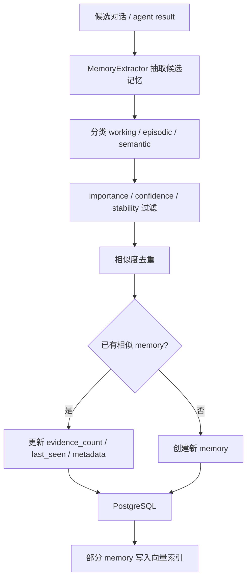
```mermaid
flowchart TD
    A["候选对话 / agent result"] --> B["MemoryExtractor 抽取候选记忆"]
    B --> C["分类 working / episodic / semantic"]
    C --> D["importance / confidence / stability 过滤"]
    D --> E["相似度去重"]
    E --> F{"已有相似 memory?"}
    F -->|是| G["更新 evidence_count / last_seen / metadata"]
    F -->|否| H["创建新 memory"]
    G --> I["PostgreSQL"]
    H --> I
    I --> J["部分 memory 写入向量索引"]
```

这里可以讲一个核心工程原则：

> Memory 写入的关键不是多存，而是控制什么值得长期影响后续回答。

如果面试官问“怎么判断值得存”，你可以回答：

- 明确用户偏好的，优先存 semantic。
- 明确历史任务产物的，存 episodic。
- 临时过程状态，不长期固化。
- 低置信、低重要性、语义重复的候选过滤或合并。
- 同一偏好多次出现时提高 evidence_count，而不是生成很多重复行。

## 23.9 Conversation Running Summary 的作用

Running summary 是对当前 conversation 的连续压缩。它不是某一轮摘要，而是随对话推进不断更新的“主线状态”。

它适合保存：

- 用户最初的问题背景。
- 已经达成的阶段性结论。
- 当前方案的关键约束。
- 中途被修改过的方向。
- 后续回答必须遵守的要求。

它不适合保存：

- 每一句原文。
- 所有工具调用细节。
- 需要精确引用的证据原文。
- 可以从 RAG 重新检索的文档内容。

面试话术：

> running summary 是为了解决最近消息窗口之外的“对话主线丢失”。它保留的是压缩后的连续状态，不替代最近原文，也不替代可检索 segment。

需要诚实说明当前状态：

> 当前普通 completed/failed 路径已经接入 summary 更新；segment 服务、表、召回和 GSSC 注入也具备，但普通 completed path 的 segment creation hook 还需要补齐，不能夸成每轮普通对话都自动切 segment。

这句话虽然暴露边界，但反而显得你很懂工程真实状态。

## 23.10 Historical Segment 为什么不同于 Summary

Summary 是全局压缩，优点是短，缺点是细节会损失。Segment 是历史片段压缩和索引，优点是可按 query 找回具体段落。

可以这样类比：

```text
Running Summary = 这本书到目前为止的剧情梗概
Historical Segment = 某几章的压缩片段，可以按问题检索
Recent Messages = 最新几页原文
```

三者都需要：

| 机制 | 优点 | 缺点 |
|---|---|---|
| Recent messages | 精确、保留原文 | 覆盖范围短 |
| Running summary | 覆盖全局主线 | 会丢细节 |
| Historical segments | 能找回早期具体事实 | 需要切分、索引和触发策略 |

segment 适合解决这种问题：

```text
第 5 轮用户说：我的目标岗位是 Agent 工程化方向。
第 130 轮用户问：按照我最开始说的岗位方向重写。
```

如果只看最近 24 条，这个信息可能消失。summary 可能保留“用户在准备面试”，但未必保留“Agent 工程化方向”。segment 检索可以按 query 找回早期片段。

面试表达：

> summary 解决连续性，segment 解决可检索历史事实。summary 是全局压缩，segment 是局部历史索引，两者互补。

## 23.11 GSSC 的 Gather 阶段

Gather 阶段不是把所有内容直接塞进 prompt，而是收集候选上下文。候选来源包括：

- 当前 task。
- 最近 conversation history。
- conversation running summary。
- relevant historical segments。
- relevant memory。
- RAG evidence。
- FeedCard/page context。
- graph/checkpoint context。
- dynamic preferences。
- skill match 结果。

Gather 的输出可以理解为一堆候选 section：

```text
CandidateContext[]
  - source: memory / evidence / conversation_summary / ...
  - content: 文本或结构化内容
  - score: 相关性
  - token_estimate: 预计 token
  - priority: 初始优先级
  - metadata: 来源、时间、文档、run 等
```

你可以说：

> Gather 阶段要尽量全，但还不代表全部进入 prompt。它只是把可能相关的信息拿到桌面上，后面的 Select 再决定谁进上下文。

## 23.12 GSSC 的 Select 阶段

Select 是 GSSC 的核心。不同 route 对上下文需求不同：

- RAG 问答：evidence 最高优先级。
- 普通聊天：最近对话和用户偏好更重要。
- 工具调用：task、确认信息、审批状态更重要。
- Memory 写入：用户表达和历史记忆冲突更重要。
- Skill 复用：历史 workflow 和 context contract 更重要。

可以这样讲：

> 我没有用一个固定 prompt 模板处理所有任务，而是按 route-aware weights 对上下文来源加权。RAG route 会优先 evidence，tool route 会优先 task 和 approval context，chat route 会更重 history/summary/memory。

Select 需要解决的是“有限预算下的排序问题”：

```text
候选上下文很多
LLM context budget 有限
不同任务需要的信息不同
所以需要按 route、answer_mode、相关性、来源权重和 token 预算选择
```

这也解释了为什么 GSSC 比“直接拼 prompt”更工程化。

## 23.13 GSSC 的 Structure 阶段

Structure 是把选中的上下文组织成稳定 section，而不是杂乱拼接。比如：

```text
## Task
当前用户问题

## Conversation Summary
对话主线摘要

## Relevant History
召回的历史片段

## Relevant Memory
用户偏好和长期事实

## Evidence
RAG 检索证据

## Constraints
工具审批、安全边界、回答格式
```

结构化的好处：

1. LLM 更容易区分证据、偏好、历史和任务。
2. evaluator/final_response 可以明确使用哪些 section。
3. debug 时能看出是哪个 source 污染了回答。
4. 后续做 prompt 评估和 ablation 更容易。

面试表达：

> Structure 的价值是降低上下文歧义。模型不只需要内容，还需要知道这些内容属于什么角色：是证据、偏好、历史，还是当前任务约束。

## 23.14 GSSC 的 Compress 阶段

Compress 不是简单截断最后几段，而是在 token 超预算时有策略地压缩：

- 低优先级 section 先裁剪。
- 冗余 memory 合并。
- 过长 history 用 summary 替代。
- RAG evidence 保留高分证据，低分证据裁剪。
- 保留来源标识，避免压缩后无法解释。

你可以这样讲：

> 直接截断 prompt 的风险是把最重要的约束截掉。GSSC 的 compress 至少知道每段上下文的 source 和优先级，可以更有策略地牺牲低价值内容。

这也是为什么“上下文工程”不是简单 prompt engineering。它更像一个小型调度器：

```text
信息来源 = 任务
token budget = 资源
route weights = 调度策略
selected prompt = 调度结果
```

## 23.15 Memory/GSSC 与 SummarizationMiddleware 的区别

用户前面问过百轮记忆丢失。这里可以把区别讲清楚：

**普通 SummarizationMiddleware** 通常解决的是：

```text
当消息太多时，把历史对话压缩成一个 summary，继续放进上下文。
```

它的优点是简单、通用、容易接入。缺点是：

1. 主要是线性压缩，不一定支持按 query 找回某个早期事实。
2. summary 会逐轮丢细节，尤其是数字、偏好、边界条件。
3. 它通常不区分 memory、RAG evidence、tool approval、feed context 的不同角色。
4. 它解决的是“历史太长”，不是完整的“上下文选择”问题。

你的方法更像：

```text
recent messages + running summary + retrievable segments + long-term memory + GSSC route-aware selection
```

所以可以这样回答：

> SummarizationMiddleware 是一个摘要中间件，主要解决上下文长度问题；我现在这套是上下文工程链路，除了 running summary，还把历史切成可检索 segment，把稳定偏好沉淀成 memory，再由 GSSC 按任务路线选择注入。它更复杂，但能解决 summary 单点压缩导致的早期事实丢失和上下文污染。

但也要诚实：

> 如果只是简单聊天，SummarizationMiddleware 更轻量；如果是长任务、多工具、RAG、用户偏好和历史事实都要参与的 Agent 平台，GSSC + summary + segment + memory 的组合更适合。

## 23.16 Memory/GSSC 的失败路径和治理

Memory 系统也会出错。你要能讲这些风险：

1. **错误记忆写入**：模型误抽取，把临时话当长期偏好。
2. **记忆冲突**：用户以前喜欢中文，现在要求英文。
3. **记忆过期**：旧项目事实不再成立。
4. **召回噪声**：相似但不相关的 memory 被选中。
5. **summary 漂移**：连续摘要逐渐偏离原始对话。
6. **segment 缺失**：切分触发不完整，某些历史没被索引。

对应治理方式：

- importance/confidence/stability 过滤。
- evidence_count/last_seen 辅助判断稳定性。
- 最近用户明确表达优先于旧 memory。
- GSSC 用 route 权重和 token 预算控制注入。
- debug 信息记录哪些 source 被选中。
- 对关键事实尽量使用 segment/RAG 原文，而不是只信 summary。

面试话术：

> Memory 不是越多越好，它本身也会污染上下文。所以我把 memory 作为候选上下文，而不是绝对指令；最终是否注入由 GSSC 决定，并且要考虑时效、置信度和当前用户显式要求。

## 23.17 Memory/GSSC 模块的面试亮点和诚实边界

**可以重点讲：**

- 三层 memory：working / episodic / semantic。
- MemoryExtractor 抽取候选，写入前过滤和去重。
- semantic/episodic memory 可进入向量召回。
- 最近消息窗口使用配置 `conversation_recent_message_limit=24`。
- running summary 缓解长对话主线丢失。
- historical segment 用于早期事实可检索召回。
- GSSC 按 Gather/Select/Structure/Compress 组织上下文。
- route-aware weights 根据任务选择不同上下文。
- 与 RAG、Tool、Skill、Runtime 都有交互。

**不要夸大：**

- 不要说“彻底解决百轮记忆”，说“缓解百轮对话早期事实丢失，并通过 summary/segment/memory 多层兜底”。
- 不要说“GSSC 是学习型最优上下文选择器”，说“启发式 route-aware 上下文选择器”。
- 不要说“segment 每轮普通对话都已自动创建”，当前普通 completed path 的 creation hook 还需要补。
- 不要说“memory 永远正确”，说“通过过滤、去重、置信度和当前上下文优先级降低污染”。

## 24. Memory/GSSC 要解决什么问题

Agent 的上下文问题通常有四类：

1. 用户偏好丢失。
2. 历史任务不可复用。
3. 早期对话事实在百轮后消失。
4. 把所有东西塞进 prompt 导致 token 爆炸和上下文污染。

你的解决思路不是“全部塞进去”，而是“分层存储 + 按任务选择”。

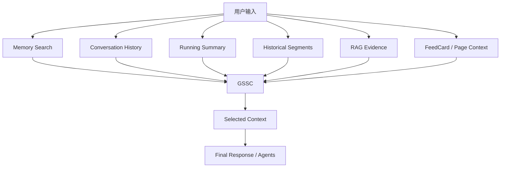
```mermaid
flowchart TD
    A["用户输入"] --> B["Memory Search"]
    A --> C["Conversation History"]
    A --> D["Running Summary"]
    A --> E["Historical Segments"]
    A --> F["RAG Evidence"]
    A --> G["FeedCard / Page Context"]
    B --> H["GSSC"]
    C --> H
    D --> H
    E --> H
    F --> H
    G --> H
    H --> I["Selected Context"]
    I --> J["Final Response / Agents"]
```

## 25. 三层 Memory

| 类型 | 存什么 | 例子 | 生命周期 |
|---|---|---|---|
| working | 当前任务临时状态 | 当前正在分析某个文档 | 短 |
| episodic | 历史任务和事件 | 用户上次生成了研究报告 | 中 |
| semantic | 稳定偏好和事实 | 用户喜欢中文回答、项目技术栈 | 长 |

写入流程：

```mermaid
flowchart TD
    A["memory_agent"] --> B["MemoryExtractor"]
    B --> C{"LLM 抽取成功?"}
    C -->|是| D["结构化 candidates"]
    C -->|否| E["Regex fallback"]
    D --> F["importance / confidence / stability 过滤"]
    E --> F
    F --> G["相似度去重"]
    G --> H{"已有相似 memory?"}
    H -->|是| I["更新 evidence_count / last_seen"]
    H -->|否| J["创建新 memory"]
    I --> K["PostgreSQL"]
    J --> K
    K --> L["semantic / episodic 写 Qdrant"]
```

## 26. GSSC：Gather / Select / Structure / Compress

GSSC 是上下文选择器：

```mermaid
flowchart LR
    A["Gather<br/>收集所有候选上下文"] --> B["Select<br/>按 route 权重和预算选择"]
    B --> C["Structure<br/>组织成固定 section"]
    C --> D["Compress<br/>超预算压缩"]
```

### 26.1 Gather 收什么

| source | section |
|---|---|
| `task` | Task |
| `profile` | User Profile |
| `conversation_history` | Conversation History |
| `conversation_segments` | Conversation Continuity |
| `conversation_summary` | Conversation Summary |
| `memory` | Relevant Memory |
| `evidence` | Evidence |
| `feed_card` | Feed Card Context |
| `dynamic_preferences` | Dynamic Preferences |
| `graph_context` | Graph Context |
| `checkpoint_summary` | Checkpoint Summary |

### 26.2 Select 怎么选

不同 route 权重不同。比如：

| route | 高优先级上下文 |
|---|---|
| chat | conversation_history、conversation_summary、memory |
| rag | evidence、task、conversation_history |
| tool | task、conversation_history、checkpoint_summary |
| skill | memory、conversation_history、conversation_segments |
| research | feed_card、evidence、checkpoint_summary |

解释：

> RAG 问答时 evidence 最重要，普通聊天时最近对话和用户偏好更重要，工具动作时 task 和 tool boundary 更重要。GSSC 用 route-aware weights 控制不同上下文进入 prompt 的概率。

## 27. Conversation Summary 与 Segment

### 27.1 为什么需要长对话记忆

100 轮对话 = 200 条 message。如果只取最近 24 条，早期事实一定会消失。所以当前方案分三层：

```mermaid
flowchart TD
    A["长对话消息"] --> B["最近 24 条原文<br/>Conversation History"]
    A --> C["Running Summary<br/>全局连续摘要"]
    A --> D["Historical Segments<br/>旧消息分段压缩"]
    D --> E["PG 权威存储"]
    D --> F["Qdrant 向量索引"]
    B --> G["GSSC"]
    C --> G
    F --> H["按 query 召回相关 segment"]
    E --> H
    H --> G
```

### 27.2 当前真实状态

已实现：

- 最近消息窗口读取 `conversation_recent_message_limit=24`。
- `update_after_turn()` 服务已实现。
- `agent_service.py` 已在 completed / failed / resume finalize 后调用 running summary 更新。
- segment 表、服务、Qdrant 索引、PG fallback、GSSC 注入、测试已实现。
- 100-turn regression 覆盖早期事实召回。

需要诚实说明：

- 当前普通 completed path 已接 running summary。
- segment creation trigger 在 `_finalize_resume()` 中存在；普通 completed path 还需要补一处 `create_segment_if_needed()` 调用，才能说“每轮普通对话自动冻结 segment”。

面试不要怕讲边界：

> 这反而显得你知道代码真实状态。你可以说服务、表、召回和测试已经完成，普通完成路径的触发 hook 是下一步补强点。

## 28. Skill 复用怎么归入 Memory/GSSC

Skill 不是四大模块之一，但它挂在上下文复用层。

```mermaid
flowchart TD
    A["成功 Agent Run"] --> B["skill_agent 评估可复用性"]
    B --> C{"reusable_score 足够?"}
    C -->|是| D["生成 Skill 草稿"]
    C -->|否| E["不沉淀"]
    D --> F["人工/系统 approved"]
    F --> G["后续请求 skill_matcher 匹配"]
    G --> H["注入 GSSC<br/>tool_plan / context_recipe / output_contract"]
```

准确说法：

> 当前 Skill 是 workflow memory 和 context contract，不是可自动重放的 DAG 执行引擎。

## 29. Memory/GSSC 模块面试话术

> 上下文工程这块我没有采用“所有历史全塞进 prompt”的方式，而是做了分层和选择。Memory 层负责抽取 working、episodic、semantic 三类记忆，写入前做过滤和相似去重，semantic/episodic 额外写 Qdrant 召回。Conversation 层保留最近 24 条原文，同时更新 running summary，历史消息可以压缩成 segment 并按 query 召回。最后 GSSC 统一收集 task、history、summary、segments、memory、RAG evidence、FeedCard 等候选上下文，按 route 权重、answer_mode policy 和 token budget 选择注入。这样能减少上下文污染和 token 浪费，也能缓解百轮对话早期事实丢失。

---

## 30. 四个模块如何一起完成一个真实任务

### 30.1 场景一：用户问文档问题

```mermaid
sequenceDiagram
    participant U as 用户
    participant RT as Runtime
    participant G as GSSC
    participant R as RAG
    participant Q as Qdrant
    participant F as Final

    U->>RT: 问上传文档里的合同编号
    RT->>RT: planner -> route=rag_agent
    RT->>G: 构建上下文
    G->>G: 加载最近对话 / memory / segments
    RT->>R: rag_agent
    R->>Q: dense + sparse hybrid search
    Q-->>R: child hits
    R->>R: parent context enrichment
    R-->>RT: rag_result + evidence
    RT->>F: final_response
    F-->>U: 基于证据回答
```

四模块角色：

| 模块 | 做了什么 |
|---|---|
| Runtime | 判断这是 RAG 任务，路由到 rag_agent |
| MCP | 不参与或只参与只读工具 |
| RAG | 检索文档证据 |
| Memory/GSSC | 给 RAG 和 final_response 提供最近对话、偏好、历史上下文 |

### 30.2 场景二：用户要求发邮件

```mermaid
sequenceDiagram
    participant U as 用户
    participant RT as Runtime
    participant T as MCP Tool
    participant CP as Checkpoint
    participant AS as AgentService

    U->>RT: 帮我发邮件
    RT->>RT: planner -> route=tool_agent, risk=L3
    RT->>T: tool_agent 选择 email tool
    T->>T: 参数校验 + 风险分级
    T-->>RT: waiting_approval
    RT->>CP: interrupt + checkpoint
    RT-->>U: approval_required
    U->>AS: approve
    AS->>RT: Command(resume={action: approved})
    RT->>T: interrupt 返回 approved，tool_agent 执行 execute_approved_tool_once
    RT-->>U: 告知执行结果
```

四模块角色：

| 模块 | 做了什么 |
|---|---|
| Runtime | 进入 tool_agent，审批后恢复 |
| MCP | 参数校验、L3 审批、ToolCall/Approval |
| RAG | 通常不参与 |
| Memory/GSSC | 提供用户偏好、上下文、邮件草稿信息 |

### 30.3 场景三：用户说“以后都用中文回答”

```mermaid
flowchart TD
    A["用户表达偏好"] --> B["planner 判断 memory intent"]
    B --> C["memory_agent"]
    C --> D["MemoryExtractor"]
    D --> E["semantic memory candidate"]
    E --> F["过滤 + 去重"]
    F --> G["PostgreSQL + Qdrant Memory"]
    G --> H["后续请求"]
    H --> I["GSSC baseline memory"]
    I --> J["final_response 按偏好回答"]
```

四模块角色：

| 模块 | 做了什么 |
|---|---|
| Runtime | 路由到 memory_agent |
| MCP | 不参与 |
| RAG | 不参与 |
| Memory/GSSC | 抽取长期偏好，后续注入 |

---

## 31. 代码地图

| 领域 | 文件 |
|---|---|
| AgentService | `src/web_app/services/agent_service.py` |
| Runtime graph | `src/web_app/agent/runtime/graph.py` |
| Graph builder | `src/web_app/agent/runtime/graph_builder.py` |
| Node registry | `src/web_app/agent/runtime/graph_registry.py` |
| Dispatcher | `src/web_app/agent/runtime/dispatch.py` |
| Planner | `src/web_app/agent/runtime/planner.py` |
| Runtime nodes | `src/web_app/agent/runtime/node_groups/*.py` |
| Checkpointer | `src/web_app/agent/runtime/checkpointers.py` |
| Checkpoint cleanup | `src/web_app/agent/runtime/checkpoint_cleanup.py` |
| MCP registry | `src/web_app/mcp/registry.py` |
| MCP router | `src/web_app/mcp/tool_router.py` |
| MCP executor | `src/web_app/mcp/tool_executor.py` |
| Permission | `src/web_app/services/permission_service.py` |
| RAG retriever | `src/web_app/rag/retriever.py` |
| RAG vector store | `src/web_app/rag/vector_store.py` |
| RAG chunker | `src/web_app/rag/structured_chunker.py` |
| Memory service | `src/web_app/services/memory_service.py` |
| Memory extractor | `src/web_app/memory/extractor.py` |
| Conversation summary | `src/web_app/services/conversation_summary_service.py` |
| GSSC | `src/web_app/context/builder.py` |
| Skill service | `src/web_app/services/skill_service.py` |

---

# 32. 面试官可能追问的 100 个工程问题与回答

下面这 100 题不是让你死背，而是让你知道“面试官从哪里打”。每个答案都按工程面试口吻写，尽量短但有信息密度。

## A. 项目总览与架构

### Q1：这个项目一句话是什么？

这是一个 Deep Research Agent OS 原型，用 LangGraph 编排多节点 Agent，用 MCP 治理工具，用 Qdrant Hybrid RAG 做文档检索，用 Memory/GSSC 管理长期上下文和多轮连续性。

### Q2：它和普通 RAG Demo 最大区别是什么？

普通 RAG Demo 主要是“检索文档然后回答”。这个项目多了 Runtime、工具治理、审批恢复、Memory、Skill 和上下文选择。也就是说它解决的是 Agent 平台工程问题，不只是知识问答。

### Q3：四个核心模块是什么？

Runtime 管执行流程，MCP 管工具安全，RAG 管文档证据，Memory/GSSC 管上下文和长期记忆。四者通过 AgentRuntimeState、数据库和 GSSC 连接。

### Q4：为什么叫 Agent OS？

因为它不是单个 agent function，而是提供了运行时、工具权限、状态持久化、上下文管理、记忆、检索和事件观测等基础能力，有点像 Agent 应用的操作系统层。

### Q5：项目里最硬的工程点是什么？

我会选三个：LangGraph interrupt + PostgresSaver 的审批恢复，Parent-Child + Qdrant Hybrid RAG，Memory/GSSC 的上下文选择机制。它们分别解决执行恢复、知识检索和上下文治理。

### Q6：这个项目现在最不能夸大的地方是什么？

Skill 还不是自动执行 DAG；GSSC 是启发式选择器，不是学习型 optimizer；工具输入校验已经走 JSON Schema，但外部 MCP server trust policy 和更细粒度数据权限还需要继续增强；Conversation Segment 普通 completed path 的自动创建触发点还需要补齐。

### Q7：项目的数据主线是什么？

服务层创建 Conversation、AgentRun、AgentChatMessage；Runtime 节点通过 AgentRuntimeState 传递执行状态；工具调用写 ToolCall/Approval；RAG 文档写 Document/DocumentChunk/Qdrant；Memory 写 Memory/Memory vectors；最终回答写回 run 和 assistant message。

### Q8：怎么证明项目不是空壳？

可以看 `graph_builder.py` 的 StateGraph、`tool_executor.py` 的审批逻辑、`retriever.py` 和 `vector_store.py` 的 hybrid 检索、`memory_service.py` 的记忆处理、`conversation_summary_service.py` 的 summary/segment，以及大量 `test_agent_runtime_*`、RAG、Memory、Checkpoint 测试。

### Q9：如果只给 30 秒介绍，你讲什么？

我会说：这是一个 LangGraph Agent OS，四层闭环分别是 Runtime 编排、MCP 工具治理、Qdrant Hybrid RAG、Memory/GSSC 上下文管理；高风险工具可审批恢复，文档检索可评估，长对话可通过 summary 和 segments 缓解遗忘。

### Q10：项目的核心取舍是什么？

我没有追求模型自由发挥，而是牺牲一部分灵活性，换取流程可控、工具安全、状态可恢复和上下文可解释。这更适合真实 Agent 平台。

## B. Runtime 编排

### Q11：为什么用 LangGraph？

因为这个项目需要把 Agent 拆成多个有状态节点，并且支持 conditional edge、interrupt、checkpoint 和 resume。LangGraph 比手写 if/else 更适合表达可恢复的状态机。

### Q12：StateGraph 里有哪些节点？

主要有 permission_guard、home_intent_react、planner、parallel_prefetch、parallel_read_stage、supervisor_observer、llm_supervisor_route、rag_agent、tool_agent、memory_agent、skill_agent、research_agent、artifact_agent、evaluator、final_response。

### Q13：有没有独立 router 节点？

没有独立叫 router 的 StateGraph 节点。路由由 planner 生成 route_plan，LLM supervisor 可选改写，dispatch_next_route_node 负责 conditional edge 跳转。

### Q14：为什么拆成 planner 和 dispatcher？

planner 负责“决定要做什么”，dispatcher 负责“按计划跳到哪里”。这样 planner 可解释，dispatcher 简单稳定，也便于测试和观察。

### Q15：LLM Supervisor 有什么用？

它在上下文准备后观察当前 state，可以在 shadow 模式记录建议，也可以在 full 模式改写 route_plan。它解决初始 planner 在信息不足时可能规划不准的问题。

### Q16：parallel_prefetch 和 parallel_read_stage 区别是什么？

parallel_prefetch 偏低风险预取，比如 memory、RAG、skill、graph context 的候选结果；parallel_read_stage 把这些结果整合，构造最终上下文、匹配 skill，并写入 state。

### Q17：context_builder 为什么不是直接独立节点执行？

代码里保留了兼容节点，但主链路在 parallel_read_stage 里执行 context_builder 和 skill_matcher，这样读阶段可以集中完成上下文准备，减少节点间重复查询。

### Q18：AgentRuntimeState 里最关键字段有哪些？

`user_id`、`run_id`、`thread_id`、`conversation_id`、`user_input`、`route_plan`、`context`、`rag_result`、`tool_result`、`memory_updates`、`skill_drafts`、`final_payload`。

### Q19：怎么避免一个节点乱改别的节点状态？

工程上通过节点职责划分、StateDelta 记录、record_node_result 和测试约束。比如 rag_agent 写 rag_result，tool_agent 写 tool_call/tool_result，final_response 聚合最终输出。

### Q20：Runtime 如何做链路可观测？

通过 AgentStep、AgentEvent、LLMCall、ToolCall、visible_thoughts、pipeline_steps、runtime_latency_trace 和 gssc_debug 记录执行过程。

### Q21：为什么需要 evaluator？

evaluator 现在主要做最后的全局验收：检查 agent results、rag/tool/memory/artifact 输出、跨节点一致性和 final_response 约束，生成 final_response_constraints 和 warnings。局部纠错不放到最后才做，而是由 post_agent_gate 在每个 agent 后立刻判断，避免第一步错了还继续执行第二步、第三步。

### Q22：如果某个 agent 节点失败怎么办？

节点会把错误写入 state 或 AgentResult，随后进入 post_agent_gate。gate 读取当前 agent 的结构化结果、错误和依赖关系：可恢复就重试当前 agent，通过才继续 route 里的下一个节点；不可恢复、审批等待、用户拒绝、L4 高风险或重试耗尽时，不再继续后续依赖节点，而是进入终止/降级路径。最后 evaluator 只做全局检查；服务层也会捕获异常，把 run 标记 failed 并写回错误信息。

### Q23：Runtime 怎么支持流式返回？

AgentService 使用 stream_queue 推送 SSE 事件，运行过程中会发送 visible_progress_delta、answer_delta、approval_required、run_completed 等事件。

### Q24：为什么不直接让 LLM 一次性返回全部计划和答案？

因为工具调用、RAG 检索、审批、记忆写入都需要真实系统状态。拆节点后每一步可验证、可暂停、可恢复，也方便审计。

### Q25：Runtime 最大的改进空间是什么？

可以进一步强化节点输入输出协议，减少 state 字段松散问题；也可以把 Skill tool_plan 编译成受权限控制的可执行子图。

## C. Checkpoint 与审批恢复

### Q26：checkpoint 解决了什么问题？

解决审批暂停和服务重启后的状态恢复。如果 L3 工具需要用户确认，graph 在 interrupt 点暂停，checkpoint 保存当前状态，审批后从原点继续。

### Q27：为什么不用 DB graph_state 直接恢复？

DB graph_state 可以保存快照，但恢复时容易从头 replay，可能重复执行节点或产生副作用。LangGraph checkpoint + Command(resume) 可以从 interrupt 点继续。

### Q28：为什么使用 PostgresSaver？

PostgresSaver 是持久化后端，适合跨进程恢复。内存 saver 服务重启就丢，RedisSaver 当前代码里标记 experimental，不作为生产主路径。

### Q29：审批流程具体怎么走？

tool_agent 判断 L3 后用 deterministic idempotency_key 创建或复用 ToolCall/Approval，然后 interrupt。用户 approve 后，AgentService 不再图外执行工具，只发送 Command(resume={action: approved})；graph 从 interrupt 点继续，tool_agent 在 interrupt 返回之后调用 execute_approved_tool_once 执行真实 provider。

### Q30：拒绝审批怎么办？

拒绝时不会执行工具，resume payload 会带 rejected 信息，graph 从 interrupt 点继续，最终回答告诉用户操作未执行。

### Q31：审批前工具会不会已经执行？

不会。L3 分支只幂等创建审批记录和 pending ToolCall，然后 interrupt；真实 provider 只会在用户批准、Command(resume) 回到 interrupt 调用点之后，由 tool_agent 执行。

### Q32：为什么 approved tool 放回 graph 内执行？

因为 LangGraph 官方建议是：调用 interrupt() 的节点 resume 时会从 interrupt 点继续，interrupt 前的副作用必须幂等，真实不可重复副作用应该放在 interrupt 返回之后。服务层只处理用户审批动作和 Command(resume)，真实 provider 执行回到 tool_agent 内完成，这样审批、checkpoint、ToolCall 审计和执行状态都落在同一条 graph 恢复链路里。

### Q33：如何防止悬挂审批永久占资源？

有 approval expiry 逻辑，过期后同步更新 run/message/tool_call/approval 状态；checkpoint cleanup 也会按 TTL 清理完成、失败、过期的 checkpoint。

### Q34：waiting_approval 的 checkpoint 会不会被清理？

清理逻辑要保护 waiting_approval、paused、resuming 状态，避免用户还没处理审批时 checkpoint 被删。

### Q35：跨进程恢复怎么验证？

`test_postgres_checkpoint_e2e.py` 里构造了 PostgresSaver checkpoint 测试，验证 approve/reject 和 restart recovery。

### Q36：checkpoint 表有哪些？

PostgresSaver 通常涉及 `checkpoints`、`checkpoint_blobs`、`checkpoint_writes`、`checkpoint_migrations` 四类表。

### Q37：thread_id 为什么重要？

LangGraph 用 thread_id 定位 checkpoint。当前使用 `run:{run_id}` 作为稳定 key，避免不同 run 的 checkpoint 混淆。

### Q38：checkpoint 和 AgentRun graph_state 是什么关系？

checkpoint 是 LangGraph 恢复执行用；AgentRun graph_state 是业务侧保存状态、展示、兼容和审计用。两者不是一回事。

### Q39：如果 PostgresSaver 不可用怎么办？

生产配置应该 require_durable fail-fast，不应该静默降级到内存。开发环境可以降级，但生产审批恢复必须持久化。

### Q40：这个模块怎么在简历上体现？

写“接入 AsyncPostgresSaver + interrupt() + Command(resume)，实现 L3 工具审批暂停、跨进程恢复和链路可观测”，这比泛泛写 checkpoint 强。

## D. MCP 工具治理

### Q41：MCP 工具治理的核心是什么？

核心是工具调用不能只由 LLM 决定，必须经过 registry、参数校验、风险分级、审批和审计。

### Q42：工具注册里有什么信息？

工具名、描述、input_schema、output_schema、permission_level、approval_required、enabled 等。

### Q43：ToolRouter 做什么？

规范化工具名、选择工具、校验输入参数，并把规范化后的 tool_name/tool_args 交给执行器。

### Q44：ToolExecutor 做什么？

读取工具 spec，判断 permission/risk，创建 ToolCall，必要时创建 Approval；低风险工具则调用具体 provider 执行。

### Q45：参数校验有多完整？

参数校验现在以工具注册表里的 input_schema 为准，走 JSON Schema 校验，覆盖 required、类型、枚举、范围、数组/对象结构、additionalProperties 和常见 format。tool_agent 会在缺 required 字段时追问用户；ToolExecutor 在执行或创建审批前还会兜底校验，避免直接 API 调用绕过 Runtime。

### Q46：L3 和 L4 区别是什么？

L3 是外部写入或需要用户确认的操作，进入人工审批；L4 是高危不可逆操作，默认直接阻断。

### Q47：为什么写文件也是风险？

写文件会改变用户工作区状态，可能覆盖或污染文件。即使是本地写，也需要限制路径、记录审计，高风险写入需要审批。

### Q48：如何防止 prompt injection 让工具乱执行？

文档内容只作为 evidence，不直接控制工具。工具是否执行由 planner、permission_service、ToolExecutor 和 risk policy 决定，不因文档里写“请删除文件”就执行。

### Q49：工具执行结果怎么进入最终回答？

tool_agent 把 tool_result 写入 state，post_agent_gate 先检查工具状态：成功才继续后续节点；provider 失败这类可恢复问题会按预算重试当前 tool/tool_agent；审批等待、用户拒绝或 L4 阻断不会自动重跑，最终由 final_response 给用户可读说明。

### Q50：ToolCall 记录有什么价值？

它能审计工具名、参数、状态、输出和错误；审批恢复时也能根据 pending tool_call_id 找回要执行的工具。

### Q51：Approval 记录有什么价值？

它记录风险等级、审批状态、审批 payload 和用户动作，是人类在环和审计的核心。

### Q52：如果用户批准后工具执行失败怎么办？

服务层会把失败结果写入 tool_result，resume 回 graph，最终回答不能假装成功，而要明确告诉用户执行失败和错误摘要。

### Q53：如果工具参数缺失怎么办？

validate_tool_input 返回 missing 字段，tool_agent 不应执行工具，而是给出需要补充的信息或失败状态。

### Q54：为什么不让 LLM 自己判断风险？

LLM 可以参与意图识别，但最终风险策略必须由代码控制。安全边界不能交给概率模型。

### Q55：MCP 模块的下一步是什么？

继续补外部 MCP server trust policy、工具 dry-run preview、参数级数据权限和更细粒度权限策略。

## E. RAG 检索

### Q56：为什么做 Parent-Child Chunking？

child 小，适合精准检索；parent 大，适合回答补上下文。这样把“检索精度”和“回答完整性”拆开解决。

### Q57：为什么只让 child 入 Qdrant？

因为 child 粒度小，更适合向量检索。parent/overview 留在 PG，命中 child 后再回查 parent，减少向量库噪声。

### Q58：Overview chunk 有什么用？

Overview 适合文档整体摘要和“总结这份文档”类问题，可以避免只从局部 child 拼凑全局回答。

### Q59：Qdrant Hybrid 解决什么问题？

Dense embedding 擅长语义相似，Sparse/BM25 擅长编号、关键词、表字段。Hybrid 让两类信号互补。

### Q60：RRF 是什么？

RRF 是 Reciprocal Rank Fusion，用排名而不是原始分数融合 dense 和 sparse 结果，适合不同检索器分数不可比的场景。

### Q61：为什么不用单纯 dense search？

单纯 dense 对“HT-2026-001”“字段名”“精确数字”这类 token 容易不稳定，hybrid 能补这个短板。

### Q62：为什么不用单纯 BM25？

BM25 不理解语义表达，比如用户换一种说法问同一问题时可能召回不到。dense 能补语义泛化能力。

### Q63：parent enrichment 怎么做？

检索命中 child 后，根据 metadata 里的 parent_id 回查 parent chunk，把 parent content 作为更完整上下文放进 evidence。

### Q64：RAG eval 怎么设计？

构造固定文档和 query，定义 expected evidence 或 expected answer，分别跑不同 backend，统计 hit@1、hit@3、hit@5、keyword_hit_rate、fallback_count 和 latency。

### Q65：hit@5 从 0.54 到 0.92 怎么讲才稳？

必须说是在自建 synthetic RAG eval 上，不是线上真实流量。它证明方案在该评估集上有效，但不能泛化成所有场景。

### Q66：Qdrant 不可用怎么办？

检索层有 fallback 到 Python BM25 hybrid 的路径，结果里也会记录 retrieval_warning 或 fallback_count。

### Q67：文档解析失败怎么办？

DocumentService 会记录文档状态和错误，前端/回答中应该提示文档尚未就绪或解析失败，而不是胡乱回答。

### Q68：如何处理用户上传多个文档？

检索时可以带 document_ids filter，确保只在当前会话附件或用户指定文档范围内搜索。

### Q69：如何避免跨用户数据泄漏？

Qdrant payload 和 PG 查询都带 user_id；文档、chunk、memory、segment 召回都要按 user_id 隔离。

### Q70：RAG 模块下一步怎么优化？

引入线上 query log eval、人工标注集、cross-encoder reranker、更强表格解析、增量索引和更细粒度 chunk quality metrics。

## F. Memory / GSSC / Conversation

### Q71：为什么需要 Memory？

因为用户偏好、长期目标、历史任务经验不能每轮都靠最近对话保存。Memory 让 Agent 能跨会话记住稳定信息。

### Q72：三层 Memory 分别是什么？

working 是当前任务状态，episodic 是历史事件和任务经验，semantic 是长期偏好和稳定事实。

### Q73：Memory 怎么写入？

memory_agent 收集用户输入、agent 输出、page_context、skill 信息，MemoryExtractor 抽取 candidates，然后按 importance、confidence、stability 过滤，最后去重保存。

### Q74：为什么要去重？

用户可能多次表达同一偏好。如果每次新增，会污染长期记忆。去重后更新 evidence_count 和 last_seen，更稳定。

### Q75：semantic memory 为什么要写 Qdrant？

长期事实数量增加后，不能每次全扫。写 Qdrant 可以按 query 语义召回相关记忆。

### Q76：GSSC 是什么？

GSSC 是 Gather、Select、Structure、Compress。它收集候选上下文，按 route 权重和 token budget 选择，再结构化成 prompt sections。

### Q77：GSSC 和 Memory 是什么关系？

Memory 负责存和搜，GSSC 负责决定哪些 memory 进入当前 prompt。Memory 是材料库，GSSC 是上下文编排器。

### Q78：answer_mode policy 有什么用？

它控制不同回答模式允许注入哪些 memory category，避免普通闲聊被 project_goal、tech_stack 等长期项目上下文污染。

### Q79：最近对话窗口为什么默认 24？

24 条消息大约覆盖最近 12 轮对话，能保留近端原文，又不至于把 prompt 撑爆。更早的信息交给 summary 和 segment。

### Q80：running summary 解决什么？

它给对话提供全局连续摘要，保留事实、偏好、决策、open threads 和 key entities，避免只靠最近窗口。

### Q81：Conversation Segment 解决什么？

它把旧消息分批压缩成可检索历史段，写 PG 并可写 Qdrant。后续按 query 召回相关段，解决第 100 轮找回第 5 轮事实的问题。

### Q82：Segment 和 running summary 区别是什么？

running summary 是一份滚动全局摘要；segment 是多个冻结历史片段。summary 适合连续性，segment 适合按问题精确召回历史。

### Q83：Qdrant segment 召回失败怎么办？

fallback 到 PostgreSQL ILIKE 关键词搜索。Qdrant 是加速和语义召回，PG 是权威存储。

### Q84：segment 会不会挤掉最近消息？

GSSC 给 conversation_history 更高权重，segment 还有独立 token budget；冲突时输出指令要求以最近消息为准。

### Q85：当前 Conversation Segment 的边界是什么？

表、服务、召回、GSSC 注入和测试都已实现；普通 completed run 的 segment creation trigger 还需要补齐，不能夸成每轮普通对话自动冻结。

### Q86：Skill 和 Memory 有什么关系？

Skill 可以看成 workflow memory。Memory 记事实和偏好，Skill 记可复用流程、上下文配方和输出契约。

### Q87：Skill 当前做到哪一步？

当前能生成草稿、匹配 approved skill、注入 GSSC、记录使用统计。还不是自动执行 tool_plan 的 DAG 引擎。

### Q88：如何排查 Memory 注入错误？

看 memory extraction、memory metadata、search result、answer_mode policy、GSSC selected_sources/dropped_sources 和最终 prompt。

### Q89：如何避免上下文污染？

靠 memory category policy、route weights、token budget、recent-over-history 的优先级和 final output consistency instruction。

### Q90：Memory/GSSC 下一步怎么优化？

做 memory eval、冲突检测、过期策略、用户可编辑记忆、segment creation 普通路径触发、以及更强的上下文质量评分。

## G. 工程质量与排障

### Q91：如何排查一次 Agent 执行失败？

先看 AgentRun 状态和 graph_state，再看 AgentStep/AgentEvent，确认停在哪个节点；工具问题看 ToolCall/Approval，RAG 问题看 evidence 和 retrieval_warning，LLM 问题看 LLMCall。

### Q92：如何排查 RAG 召回效果下降？

检查文档解析状态、chunk 数量、child 是否入库、Qdrant collection schema、dense/sparse 是否写入、query filter、fallback_count 和 eval report。

### Q93：如何排查审批恢复失败？

检查 run_id 对应 thread_id、checkpoint 表是否存在、Approval/ToolCall 状态、pending_tool_call_id、resume payload 和 PostgresSaver 健康状态。

### Q94：如何排查工具误调用？

看 planner route_plan、tool selection、validate_tool_input、permission decision、ToolCall input_json 和 approval payload。

### Q95：如何排查 final answer 和 evidence 不一致？

看 rag_result/evidence、gssc_context、post_agent_gate_decision、evaluator constraints 和 final_response prompt。必要时让 final_response 引用 evidence id。

### Q96：如何保证多用户隔离？

所有业务表都带 user_id，RAG/Memory/Segment 查询都按 user_id 和 conversation_id/document_ids filter，不能只靠前端隔离。

### Q97：如何处理长任务？

通过 AgentRun 状态、SSE 事件、pipeline_steps、runtime_latency_trace 和 checkpoint/approval 状态，让任务可观察、可恢复。

### Q98：这个项目可以怎么上线？

需要生产 DB、Qdrant、PostgresSaver 表健康检查、后台任务/worker、日志监控、审批超时清理、RAG eval pipeline 和权限配置。

### Q99：下一步最应该补什么？

我会补普通 completed path 的 segment creation trigger、外部 MCP server trust policy、Skill 可执行子图、线上 query log RAG eval 和 memory eval。

### Q100：如果只能保留三个设计，你保留什么？

保留 LangGraph Runtime、MCP 工具治理、Parent-Child + Qdrant Hybrid RAG。它们分别保证执行可控、工具安全和知识可靠；Memory/GSSC 是上层增强，但前三个是平台底座。

---

## 33. 最后复习路线

不要从头背到尾。按下面顺序复习：

1. 先背 60 秒总览。
2. 再背四模块职责边界。
3. Runtime 重点背 StateGraph、RoutePlan、LLM supervisor、checkpoint。
4. MCP 重点背 L0-L4、ToolCall/Approval、interrupt 审批。
5. RAG 重点背 Parent-Child、Hybrid、RRF、parent enrichment、eval。
6. Memory/GSSC 重点背三层记忆、GSSC、running summary、segments、Skill 边界。
7. 最后看 100 问，重点准备 Q11-Q40、Q56-Q90。

你最适合的面试定位是：

> 我不是只会调模型 API，而是能把 Agent 从 demo 做成可控、可恢复、可评估、可治理的工程系统。
