# Open Deep Research 简历真实性审计报告

> 审计日期：2026-06-15  
> 审计标准：只以当前代码、测试、历史评估产物为依据；不把“配置存在”“目录存在”“概念命名存在”等同于完整实现。

---

## 0. 总体结论

这个项目不是空壳。代码中确实存在一个围绕 **LangGraph StateGraph、多 Agent 节点、MCP 工具治理、Parent-Child RAG、Qdrant Hybrid Search、Memory/GSSC/Skill** 搭建的工程化 Agent 平台。

但简历描述需要控制措辞：有些模块已经能大胆讲，有些只能讲“实现了工程闭环的一版”，不能讲成生产级、论文级或完整平台级能力。

### 一句话判断

| 方向 | 真实性判断 | 面试可讲强度 |
|---|---|---|
| LangGraph 节点化运行时 | 代码中明确实现 | 可以重点讲 |
| planner/tool/rag/memory 节点 | 代码中明确实现 | 可以重点讲 |
| 独立 router 节点 | 代码中没有发现 | 改说“条件路由/dispatcher” |
| checkpoint 可恢复 | 代码中部分实现 | 谨慎讲，强调默认关闭 |
| MCP 注册、风险分级、审批 | 代码中明确实现 | 可以重点讲 |
| 完整 JSON Schema 校验 | 代码中部分实现 | 改说“required 字段和格式校验” |
| L3/L4 阻断或审批 | 代码中明确实现 | 可以重点讲 |
| Parent-Child Chunking | 代码中明确实现 | 可以重点讲 |
| Qdrant Hybrid Search | 代码中明确实现 | 可以重点讲 |
| Qdrant RRF | 代码中明确实现 | 可以重点讲，但限定在 native Qdrant hybrid |
| hit@5 评估脚本 | 代码中明确实现 | 可以重点讲 |
| hit@5 0.54 → 0.92 记录 | 代码中明确实现 | 可以讲，但要说明是 synthetic eval 的 backend 对比 |
| 三层记忆 | 代码中明确实现 | 可以讲，但说明主实现在 service/repository 层 |
| GSSC 动态上下文 | 代码中明确实现 | 可以讲成启发式上下文工程 |
| Memory 抽取/去重/固化/筛选 | 代码中明确实现 | 可以重点讲 |
| Skill 复用 | 代码中部分实现 | 改说“Skill 匹配、上下文注入、草稿生成与统计” |

---

## 1. 项目整体描述与工作流

这个项目可以理解为：**基于 Open Deep Research 二次开发的一套工程化 Agent OS 原型**。它不是单纯的聊天机器人，也不是单独的 RAG Demo，而是围绕“用户请求进入系统后，Agent 如何规划、检索、调用工具、写记忆、复用经验、生成最终回答”做了一套完整运行链路。

如果用一句话概括：

> 这是一个以 LangGraph 为执行运行时、以 MCP 为工具治理层、以 Parent-Child + Qdrant Hybrid 为文档检索层、以 Memory/GSSC/Skill 为上下文与复用层的 Agent 平台工程。

它的核心目标不是让模型自由发挥，而是把 Agent 的行为拆成可控流程：

1. 用户输入先进入后端服务，创建一次可追踪的 AgentRun。
2. LangGraph Runtime 接管执行，把请求拆成多个节点。
3. Planner 判断任务类型、风险等级和执行路线。
4. Parallel Read / GSSC 准备结构化上下文。
5. 根据 RoutePlan 分发到 RAG、Tool、Memory、Skill、Research、Artifact 等能力节点。
6. MCP 对工具调用做注册、参数校验、风险分级、审批或阻断。
7. RAG 对用户文档做 Parent-Child 检索和 Qdrant Hybrid 召回。
8. Memory 抽取并沉淀用户偏好、任务事件和长期事实。
9. Skill 识别可复用 workflow，生成草稿并在后续请求中匹配复用。
10. Evaluator 做最终前一致性检查，Final Response 输出用户可读答案。

### 1.1 项目在做什么

这个项目的产品形态可以想象成一个“信息差 Agent 工作台”。用户在前端可以和 Agent 对话，也可以上传文档、围绕 FeedCard 发起研究、让 Agent 生成报告、调用工具、沉淀记忆和复用流程。

后端不是简单把用户输入转发给 LLM，而是维护一套 Agent Runtime：

| 层级 | 作用 | 项目中的实现 |
|---|---|---|
| API / Service 层 | 接收用户请求、创建运行记录、流式返回结果 | `AgentService`、FastAPI routes |
| Runtime 层 | 编排 Agent 执行流程 | LangGraph `StateGraph` |
| Planner 层 | 判断意图、风险、路线 | `planner.py`、`RoutePlan` |
| Context 层 | 汇总 Memory、RAG、History、Feed 等上下文 | `ContextBuilder` / GSSC |
| RAG 层 | 文档解析、切分、检索、证据返回 | Parent-Child + Qdrant Hybrid |
| Tool 层 | 工具注册、调用、审批、审计 | MCP Registry / ToolExecutor |
| Memory 层 | 记忆抽取、去重、固化、召回 | `MemoryService` |
| Skill 层 | 工作流复用、草稿生成、匹配注入 | `SkillService` |
| Eval / Final 层 | 结果检查、最终回复 | `evaluator` / `final_response` |

也就是说，这个项目最重要的价值不是“某一个模型回答得好”，而是它把 Agent 平台常见的工程问题串成了闭环：

```text
执行流程可控
工具调用安全
文档检索可评估
上下文注入可治理
用户记忆可沉淀
重复 workflow 可复用
最终回复可约束
```

### 1.2 一次普通请求的整体工作流

下面是一条最典型的用户请求链路。你可以把它当成面试时讲项目的主线。

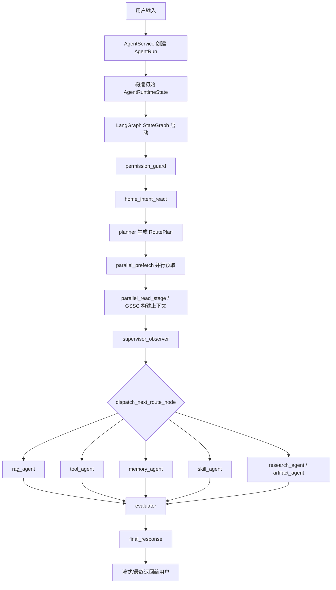
```mermaid
flowchart TD
    A["用户输入"] --> B["AgentService 创建 AgentRun"]
    B --> C["构造初始 AgentRuntimeState"]
    C --> D["LangGraph StateGraph 启动"]
    D --> E["permission_guard"]
    E --> F["home_intent_react"]
    F --> G["planner 生成 RoutePlan"]
    G --> H["parallel_prefetch 并行预取"]
    H --> I["parallel_read_stage / GSSC 构建上下文"]
    I --> J["supervisor_observer"]
    J --> K{"dispatch_next_route_node"}

    K --> L["rag_agent"]
    K --> M["tool_agent"]
    K --> N["memory_agent"]
    K --> O["skill_agent"]
    K --> P["research_agent / artifact_agent"]

    L --> Q["evaluator"]
    M --> Q
    N --> Q
    O --> Q
    P --> Q
    Q --> R["final_response"]
    R --> S["流式/最终返回给用户"]
```

这条链路可以拆成八个阶段。

#### 阶段一：用户请求进入服务层

用户在前端输入问题，比如：

```text
帮我总结一下当前上传的文档
```

或者：

```text
帮我把这段内容写入本地文件
```

请求进入后端 `AgentService`。服务层会做几件事：

1. 确定 `user_id`。
2. 创建或复用 `conversation_id`。
3. 创建本次执行的 `AgentRun`。
4. 生成或读取 `thread_id`。
5. 把 `user_input`、`page_context`、`conversation_id` 等放进初始 state。

这一步的意义是：**每一次 Agent 执行都有数据库身份**。后续的节点事件、工具调用、审批记录、最终答案都能挂到同一个 run 上。

#### 阶段二：LangGraph Runtime 接管执行

服务层不会自己写一堆 if/else 把任务跑完，而是调用 `AgentRuntime.run()`。Runtime 内部使用 LangGraph `StateGraph`，共享状态是 `AgentRuntimeState`。

初始 state 大概是：

```python
{
    "user_id": 1,
    "run_id": 123,
    "thread_id": "user:1:conversation:abc",
    "conversation_id": "abc",
    "user_input": "帮我总结一下当前上传的文档",
    "page_context": {...},
    "mode": "react"
}
```

LangGraph 的作用是把这份 state 依次传给不同节点，每个节点读取一部分、写回一部分。

#### 阶段三：权限检查、意图识别和规划

前几个节点属于 setup 阶段：

```text
permission_guard
  -> home_intent_react
  -> planner
```

`permission_guard` 是入口安全检查。  
`home_intent_react` 判断用户大概想做什么。  
`planner` 生成结构化 `RoutePlan`。

例如文档问答可能生成：

```python
{
    "intent": "document_qa",
    "route": ["rag_agent", "evaluator", "final_response"],
    "risk_level": "L1",
    "needs_approval": False,
    "answer_mode": "rag_qa"
}
```

如果是工具写文件，可能生成：

```python
{
    "intent": "tool.local_file_write",
    "route": ["tool_agent", "evaluator", "final_response"],
    "risk_level": "L3",
    "needs_approval": True,
    "answer_mode": "tool_action"
}
```

这里的重点是：**Planner 只负责规划，不直接执行工具、不直接检索、不直接写记忆。**

#### 阶段四：并行预取和 GSSC 上下文构建

Planner 之后进入 read 阶段：

```text
parallel_prefetch
  -> parallel_read_stage
```

这一阶段会提前准备后面可能需要的上下文，包括：

| 上下文来源 | 说明 |
|---|---|
| 当前任务 | 用户本轮输入 |
| Conversation History | 最近对话 |
| Memory | 用户偏好、历史任务、长期事实 |
| RAG Evidence | 当前文档相关证据 |
| FeedCard Context | 用户当前选中的信息卡片 |
| Page Context | 前端页面状态 |
| Dynamic Preferences | 动态偏好 |
| Graph Context | 图谱或关联上下文 |
| Output Contract | 最终输出要求 |

这些上下文不是无脑拼进 prompt，而是进入 GSSC：

```text
Gather -> Select -> Structure -> Compress
```

GSSC 会根据 route 和 answer_mode 决定什么重要。例如：

| 场景 | 优先上下文 |
|---|---|
| 文档问答 | RAG Evidence、Task、Conversation History |
| 普通聊天 | Conversation History、Memory、Profile |
| 工具动作 | Task、Tool State、Boundary Memory |
| 项目建议 | Project Goal、Tech Stack、Workflow Pattern |
| Skill 复用 | Matched Skill、Memory、Output Contract |

最后它会生成 `state["context"]["gssc_context"]`，给后续 agent 和 final_response 使用。

#### 阶段五：Supervisor / Dispatcher 选择具体 Agent 节点

上下文准备好以后，`supervisor_observer` 会观察当前 state。然后 `dispatch_next_route_node` 根据 `RoutePlan` 和 `completed_nodes` 选择下一个节点。

这里要注意：项目里没有一个独立命名为 `router` 的 StateGraph 节点。真实实现是：

```text
planner 负责生成路线
supervisor_observer 负责观察状态
dispatch_next_route_node 负责条件跳转
```

例如：

```text
route = ["rag_agent", "evaluator", "final_response"]
completed_nodes = ["permission_guard", "planner", "parallel_read_stage"]
next = "rag_agent"
```

如果遇到工具审批：

```text
state.status = waiting_approval
next = END
```

这保证了危险工具在审批前不会继续执行。

#### 阶段六：能力节点执行

根据 RoutePlan，系统会进入不同 agent 节点。

##### RAG Agent

如果用户问当前文档：

```text
rag_agent
  -> ParentChildRetriever
  -> Qdrant Hybrid Search
  -> Parent Context Enrichment
  -> 返回 evidence 和初步答案
```

RAG 的底层链路是：

1. 文档摄入时做 Parent-Child Chunking。
2. 只有 child chunk 写入 Qdrant。
3. 查询时 dense + sparse hybrid 检索。
4. Qdrant native hybrid 使用 Fusion.RRF。
5. 命中 child 后根据 parent_id 回查 parent context。

##### Tool Agent

如果用户要求工具动作：

```text
tool_agent
  -> 选择工具
  -> validate_tool_input
  -> MCPService.call_tool
  -> ToolExecutor
  -> PermissionGuard
```

如果是 L0-L2 工具，可能自动执行。  
如果是 L3 工具，创建 Approval，进入 `waiting_approval`。  
如果是 L4 工具，直接 blocked。

##### Memory Agent

如果需要写记忆：

```text
memory_agent
  -> LLM/regex extractor
  -> confidence / importance filter
  -> add_with_dedup
  -> consolidate_memory
  -> PG + Qdrant Memory
```

它会把记忆分为 working、episodic、semantic。

##### Skill Agent

如果一次任务具有复用价值：

```text
skill_agent
  -> evaluate_reusability
  -> create_skill_draft_from_run
  -> 后续请求中 match_skill
  -> 命中后注入 GSSC
```

当前 Skill 是“复用雏形”，主要实现草稿生成、匹配和上下文注入，还不是完整自动执行引擎。

#### 阶段七：Evaluator 做最终前检查

所有能力节点执行后，会进入 `evaluator`。它的作用是检查最终回答不能乱说。

典型约束包括：

| 场景 | evaluator 约束 |
|---|---|
| RAG 没有 evidence | 不能声称“根据文档” |
| 工具等待审批 | 不能说“已经执行” |
| 工具失败 | 必须告诉用户失败 |
| Memory 写入失败 | 不能说“已记住” |
| 输出包含内部 JSON | final_response 要清理 |

Evaluator 的价值是让 Agent 的最终回答和真实执行状态一致。

#### 阶段八：Final Response 生成最终回答

`final_response` 会基于：

1. `gssc_context`
2. 各 agent result
3. evaluator constraints
4. errors/warnings
5. output rules

生成用户最终看到的自然语言回答。

它不是简单把内部 JSON 贴给用户，而是把 Agent 的执行结果转成产品化回答，并避免泄露内部字段，例如 `status`、`node_results`、`evidence item`、`chunk` 等。

### 1.3 四个核心模块如何协同

整个项目可以抽象成四个核心模块，每个模块解决 Agent 平台的一类关键问题。

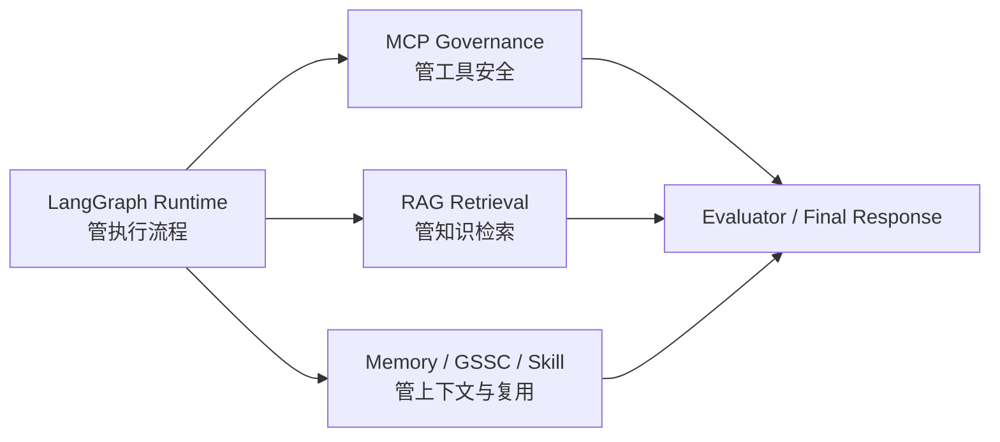
```mermaid
flowchart LR
    A["LangGraph Runtime<br/>管执行流程"] --> B["MCP Governance<br/>管工具安全"]
    A --> C["RAG Retrieval<br/>管知识检索"]
    A --> D["Memory / GSSC / Skill<br/>管上下文与复用"]
    B --> E["Evaluator / Final Response"]
    C --> E
    D --> E
```

#### LangGraph Runtime：管执行流程

Runtime 决定一次请求怎么跑：

```text
入口 -> 规划 -> 上下文 -> 分发 -> 节点执行 -> 评估 -> 最终回答
```

它解决的是：

| 问题 | Runtime 的处理 |
|---|---|
| 流程不可控 | StateGraph 节点化 |
| 状态难传递 | AgentRuntimeState |
| 动态路由 | RoutePlan + Dispatcher |
| 审批中断 | waiting_approval -> END |
| 过程不可观测 | AgentEvent / node_results / completed_nodes |

#### MCP Governance：管工具安全

Tool Agent 不直接执行函数，而是走 MCP 治理层：

```text
工具选择 -> 参数校验 -> 风险分级 -> 审批/阻断/执行 -> 审计
```

它解决的是：

| 问题 | MCP 的处理 |
|---|---|
| 模型误调用工具 | registry + tool selection |
| 参数缺失 | validate_tool_input |
| 外部写入风险 | L3 approval |
| 高危操作 | L4 blocked |
| 无法追踪 | ToolCall / Approval / AgentEvent |

#### RAG Retrieval：管知识检索

RAG 不是简单向量搜索，而是完整文档检索链：

```text
parse -> Parent-Child Chunking -> child-only vector -> Qdrant Hybrid -> RRF -> parent enrichment -> evidence
```

它解决的是：

| 问题 | RAG 的处理 |
|---|---|
| chunk 太大召回不准 | child chunk 检索 |
| chunk 太小上下文不足 | parent context enrichment |
| 纯 dense 对编号不稳 | dense + sparse hybrid |
| 融合分数不可比 | Qdrant Fusion.RRF |
| 优化没证据 | hit@5 eval runner |

#### Memory / GSSC / Skill：管上下文与复用

这层负责让 Agent “记得合适的东西，并复用成功经验”：

```text
Memory 抽取/去重/固化
GSSC 动态上下文选择
Skill workflow 草稿/匹配/注入
```

它解决的是：

| 问题 | 处理方式 |
|---|---|
| 用户偏好丢失 | semantic memory |
| 历史任务不可用 | episodic memory |
| 当前上下文不稳定 | working memory |
| 上下文污染 | MEMORY_CONTEXT_POLICY |
| token 爆炸 | GSSC Select/Compress |
| 重复 workflow 每次重做 | Skill draft/match |

### 1.4 三条典型业务工作流

为了更容易理解，可以把项目拆成三条典型业务流。

#### 业务流一：用户问文档问题

用户输入：

```text
这份合同的编号是多少？
```

工作流：

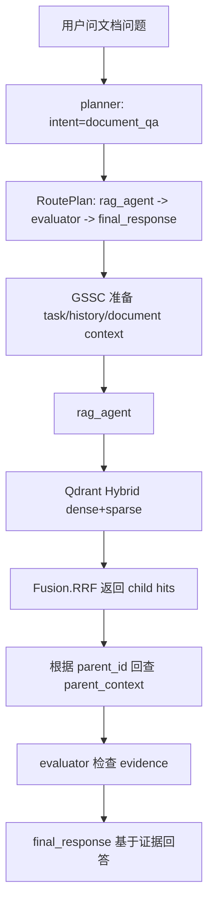
```mermaid
flowchart TD
    A["用户问文档问题"] --> B["planner: intent=document_qa"]
    B --> C["RoutePlan: rag_agent -> evaluator -> final_response"]
    C --> D["GSSC 准备 task/history/document context"]
    D --> E["rag_agent"]
    E --> F["Qdrant Hybrid dense+sparse"]
    F --> G["Fusion.RRF 返回 child hits"]
    G --> H["根据 parent_id 回查 parent_context"]
    H --> I["evaluator 检查 evidence"]
    I --> J["final_response 基于证据回答"]
```

这条链路体现的是 RAG 能力。

#### 业务流二：用户要求执行工具

用户输入：

```text
帮我把这段总结写入本地文件
```

工作流：

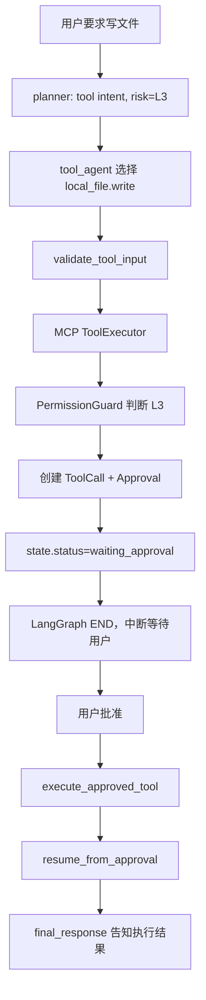
```mermaid
flowchart TD
    A["用户要求写文件"] --> B["planner: tool intent, risk=L3"]
    B --> C["tool_agent 选择 local_file.write"]
    C --> D["validate_tool_input"]
    D --> E["MCP ToolExecutor"]
    E --> F["PermissionGuard 判断 L3"]
    F --> G["创建 ToolCall + Approval"]
    G --> H["state.status=waiting_approval"]
    H --> I["LangGraph END，中断等待用户"]
    I --> J["用户批准"]
    J --> K["execute_approved_tool"]
    K --> L["resume_from_approval"]
    L --> M["final_response 告知执行结果"]
```

这条链路体现的是 MCP 安全治理和人类在环。

#### 业务流三：用户表达长期偏好并后续复用

用户输入：

```text
以后回答我尽量用中文，结构清晰一点
```

工作流：

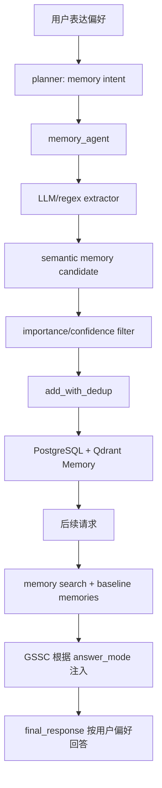
```mermaid
flowchart TD
    A["用户表达偏好"] --> B["planner: memory intent"]
    B --> C["memory_agent"]
    C --> D["LLM/regex extractor"]
    D --> E["semantic memory candidate"]
    E --> F["importance/confidence filter"]
    F --> G["add_with_dedup"]
    G --> H["PostgreSQL + Qdrant Memory"]
    H --> I["后续请求"]
    I --> J["memory search + baseline memories"]
    J --> K["GSSC 根据 answer_mode 注入"]
    K --> L["final_response 按用户偏好回答"]
```

如果某次任务有复用价值，还会进入 Skill：

```text
successful run -> skill_agent -> reusable_score -> Skill draft -> 后续 match -> 注入 GSSC
```

这条链路体现的是 Memory/GSSC/Skill。

### 1.5 你在面试中应该如何整体介绍这个项目

下面这段可以直接作为项目总介绍：

> 我这个项目是基于 Open Deep Research 做的二次开发，目标是把它从一个研究型应用扩展成更工程化的 Agent OS 原型。  
> 
> 整体上我做了四层：第一层是 LangGraph Runtime，把一次用户请求拆成权限检查、意图识别、规划、上下文读取、RAG、工具、Memory、Skill、评估和最终回复等节点；第二层是 MCP 工具治理，把工具统一注册成 spec，执行前做参数校验、L0-L4 风险分级，L3 进入人工审批，L4 直接阻断，并记录 ToolCall 和 Approval；第三层是 RAG 检索，把文档做 Parent-Child Chunking，只让 child chunk 入 Qdrant，并用 dense+sparse hybrid 和 RRF 融合召回；第四层是 Memory/GSSC/Skill，上层负责记忆抽取、去重、固化、动态上下文选择和可复用 workflow 草稿。  
> 
> 一次请求进来后，后端先创建 AgentRun，然后 LangGraph 根据 Planner 的 RoutePlan 决定走 RAG、Tool、Memory 还是 Skill。执行过程中所有节点都通过 AgentRuntimeState 共享状态，工具动作由 MCP 层控制风险，文档问题由 RAG 层返回证据，用户偏好由 Memory 层沉淀，最终由 evaluator 检查一致性，再由 final_response 生成用户可读回答。

这段介绍的好处是：它不是堆技术名词，而是把项目的“输入、执行、能力、约束、输出”讲成了一条完整链路。

---

## 2. 系统真实结构

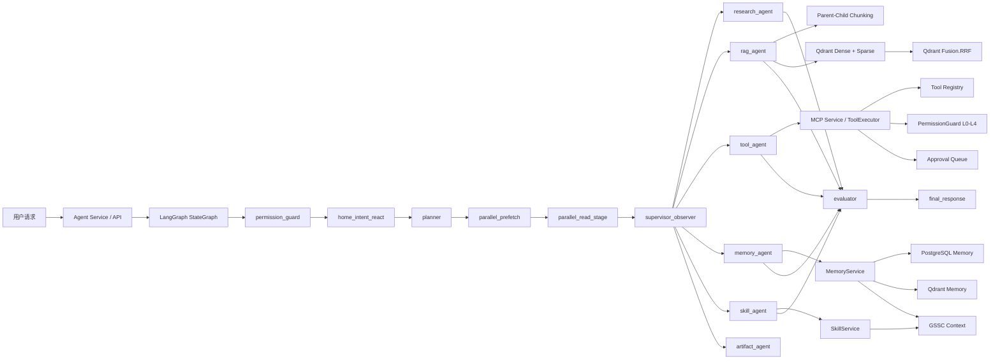
```mermaid
flowchart LR
    User["用户请求"] --> API["Agent Service / API"]
    API --> Graph["LangGraph StateGraph"]

    Graph --> Guard["permission_guard"]
    Guard --> Intent["home_intent_react"]
    Intent --> Planner["planner"]
    Planner --> Prefetch["parallel_prefetch"]
    Prefetch --> Read["parallel_read_stage"]
    Read --> Supervisor["supervisor_observer"]

    Supervisor --> Research["research_agent"]
    Supervisor --> RAG["rag_agent"]
    Supervisor --> Tool["tool_agent"]
    Supervisor --> Memory["memory_agent"]
    Supervisor --> Skill["skill_agent"]
    Supervisor --> Artifact["artifact_agent"]

    Tool --> MCP["MCP Service / ToolExecutor"]
    MCP --> Registry["Tool Registry"]
    MCP --> Risk["PermissionGuard L0-L4"]
    MCP --> Approval["Approval Queue"]

    RAG --> Chunking["Parent-Child Chunking"]
    RAG --> Qdrant["Qdrant Dense + Sparse"]
    Qdrant --> RRF["Qdrant Fusion.RRF"]

    Memory --> MemSvc["MemoryService"]
    MemSvc --> PG["PostgreSQL Memory"]
    MemSvc --> MQ["Qdrant Memory"]
    MemSvc --> GSSC["GSSC Context"]

    Skill --> SkillSvc["SkillService"]
    SkillSvc --> GSSC

    Research --> Eval["evaluator"]
    RAG --> Eval
    Tool --> Eval
    Memory --> Eval
    Skill --> Eval
    Eval --> Final["final_response"]
```

---

## 3. 简历亮点逐项审计

### 3.1 LangGraph StateGraph 是否真的节点化编排 planner/router/tool/rag/memory

**结论：代码中部分实现。**

节点化编排本身是真实的，但如果简历写成“planner/router/tool/rag/memory 全部作为独立 LangGraph 节点”，需要修正。代码里有 `planner`、`tool_agent`、`rag_agent`、`memory_agent` 等节点；但是没有发现一个独立名为 `router` 的 StateGraph 节点，路由由 `planner + supervisor_observer + dispatch_next_route_node` 完成。

关键证据：

| 证据 | 说明 |
|---|---|
| `src/web_app/agent/runtime/graph_builder.py` | 使用 `StateGraph(AgentRuntimeState)`，注册节点并编译 LangGraph |
| `src/web_app/agent/runtime/graph_registry.py` | 定义 `permission_guard`、`planner`、`parallel_read_stage`、`research_agent`、`rag_agent`、`tool_agent`、`memory_agent`、`skill_agent`、`evaluator`、`final_response` 等节点 |
| `src/web_app/agent/runtime/dispatch.py` | 使用 `dispatch_next_route_node` 做条件路由 |
| `src/web_app/agent/runtime/planner.py` | 生成 `RoutePlan`，决定 route、risk_level、needs_approval、answer_mode |

推荐简历说法：

> 基于 LangGraph StateGraph 实现 Agent Runtime，将权限检查、意图识别、规划、上下文构建、RAG、工具调用、Memory、Skill 和最终回复拆成可观测节点；路由由 Planner 生成 RoutePlan，并通过 supervisor/dispatcher 做条件分发。

不要硬讲：

> 我实现了独立 router 节点统一调度所有 Agent。

面试官如果追问“router 在哪”：

> 严格说没有单独做一个 router node。我把路由能力拆成了三层：planner 负责生成 route plan，supervisor_observer 负责运行时观察与选择，dispatch_next_route_node 负责 LangGraph conditional edge 的实际跳转。这样做的好处是 planner 可解释，dispatcher 简单稳定，supervisor 可以后续接入 replanner。

---

### 3.2 checkpoint 是否真的可恢复，不只是配置

**结论：代码中部分实现。**

项目确实接入了 LangGraph checkpointer，但默认配置是关闭的；开启后优先使用 RedisSaver，没有 Redis 时 fallback 到 MemorySaver。MemorySaver 是进程内存级，不等于生产级持久恢复。

关键证据：

| 证据 | 说明 |
|---|---|
| `src/web_app/agent/runtime/checkpointers.py` | `build_checkpointer()` 优先 RedisSaver，fallback MemorySaver |
| `src/web_app/agent/runtime/graph.py` | 只有 `settings.agent_langgraph_checkpointer_enabled` 为 true 时才构建 checkpointer |
| `src/web_app/core/config.py` | `agent_langgraph_checkpointer_enabled: bool = False`，默认关闭 |
| `src/web_app/agent/runtime/graph_config.py` | invoke config 带 `thread_id`，满足 LangGraph checkpoint key 的基本要求 |
| `src/web_app/services/agent_service.py` | `AgentRun.graph_state`、`thread_id`、approval resume 等状态也落 DB |
| `src/web_app/tests/test_agent_runtime_p6b_graph_app_contract.py` | 10 passed，覆盖默认不创建 checkpointer、开启时创建等合同 |

真实边界：

| 能力 | 真实性 |
|---|---|
| LangGraph compile(checkpointer=...) | 已实现 |
| thread_id configurable | 已实现 |
| RedisSaver 接入 | 已实现 |
| 默认开启 checkpoint | 没有 |
| 生产级 crash 后从 Redis 恢复的 E2E 测试 | 没有发现 |
| approval resume 业务恢复 | 已实现，但主要通过 DB graph_state/approval/tool_call，而不完全依赖 LangGraph checkpoint |

推荐简历说法：

> 接入 LangGraph checkpointer 能力，支持基于 thread_id 的状态检查点；生产持久化方案预留 RedisSaver，本地开发 fallback 到 MemorySaver。同时在业务层通过 AgentRun.graph_state、Approval、ToolCall 记录实现审批中断后的恢复。

面试官如果问“服务重启后一定能恢复吗”：

> 我不会说“一定”。当前真实实现是：LangGraph checkpointer 是可选能力，默认关闭；如果配置 RedisSaver，可以具备跨进程 checkpoint 基础。审批恢复这块更稳，是业务状态落在 DB 里，包括 pending approval、tool call、run graph_state。下一步我会补一个重启后从 Redis checkpoint 继续执行的 E2E 测试。

---

### 3.3 MCP 工具治理是否真的有注册、Schema 校验、风险分级、审批、审计

**结论：代码中明确实现大部分；Schema 校验属于部分实现。**

MCP 治理不是只写了接口。它有 registry、tool spec、DB 持久化、风险等级、permission guard、approval flow、tool call 记录和红action相关审计输出。

关键证据：

| 能力 | 状态 | 证据 |
|---|---|---|
| 工具注册 | 已在代码中明确实现 | `src/web_app/mcp/registry.py` 的 `BUILTIN_TOOLS` 和 `ensure_builtin_tools()` |
| 工具 Schema 描述 | 已在代码中明确实现 | `src/web_app/mcp/schemas.py` 的 `MCPToolSpec.input_schema/output_schema` |
| Schema 校验 | 代码中部分实现 | `src/web_app/mcp/tool_router.py` 的 `validate_tool_input()` 校验 required 字段和 email 格式 |
| 风险分级 | 已在代码中明确实现 | L0/L1/L2/L3/L4 常量和 tool spec 的 `safety_level` |
| 审批 | 已在代码中明确实现 | `src/web_app/mcp/tool_executor.py` 创建 Approval，`approval_service.py` 更新审批状态 |
| 审计 | 已在代码中明确实现 | `ToolCall`、`Approval`、`AgentEvent` DB 模型，以及 `mcp/audit.py` 的脱敏 helper |
| 测试 | 已通过 | `test_mcp_stage7.py` 9 passed |

真实边界：

`validate_tool_input()` 并不是完整 JSON Schema validator。它更像工程实用型校验：检查 required 字段、清理参数、校验 email 等。如果简历写“完整 JSON Schema 校验引擎”，会过度包装。

推荐简历说法：

> 设计 MCP 工具治理层：工具统一注册到 registry/DB，工具 spec 包含 input_schema、output_schema、safety_level、approval_required；执行前由 ToolExecutor 做参数必填校验、风险分级、审批拦截和 ToolCall/Approval 审计记录。

面试官如果问“Schema 校验怎么做的”：

> 当前不是完整 JSON Schema validator，而是根据 tool spec 的 required 字段做运行前校验，并补充了 email 等格式校验。这样能覆盖本项目内置工具的主要安全边界。下一步如果接入外部 MCP server，我会引入 `jsonschema` 或 Pydantic 动态模型做标准 JSON Schema 校验。

---

### 3.4 L3/L4 是否真的会阻断或审批

**结论：代码中明确实现。**

代码中的策略是：**L3 进入人工审批；L4 默认阻断。**

关键证据：

| 证据 | 说明 |
|---|---|
| `src/web_app/services/permission_service.py` | `L4` 返回 `allowed=False`、`requires_approval=False`、`reason=high_risk_denied`；`L3` 返回 `requires_approval=True` |
| `src/web_app/mcp/tool_executor.py` | L3 创建 `Approval` 并返回 `waiting_approval`，L4 直接 `blocked` |
| `src/web_app/agent/runtime/node_groups/agent_nodes.py` | `tool_agent` 遇到 `waiting_approval` 会保存 `pending_*`、设置 `status=waiting_approval`，不标记节点完成 |
| `src/web_app/agent/runtime/dispatch.py` | `waiting_approval` 路由到 `END`，形成中断 |
| `src/web_app/tests/test_mcp_stage7.py` | 覆盖 L3 等待审批、L4 high_risk_denied |

面试说法：

> 我把工具风险分为 L0-L4。L0/L1/L2 可以自动执行或低风险执行；L3 是外部写入、发邮件、本地文件写入等，需要生成 Approval，由用户确认后再走 `execute_approved_tool`；L4 是高危操作，比如删除或破坏性动作，当前策略是默认拒绝，不进入审批队列。这是一个保守安全模型。

---

### 3.5 Parent-Child Chunking 是否真的实现

**结论：代码中明确实现。**

项目实现了 overview、parent、child 三类 chunk，并且只把 child chunk 写入 Qdrant，parent/overview 保存在 PostgreSQL 中用于上下文扩展。

关键证据：

| 证据 | 说明 |
|---|---|
| `src/web_app/rag/structured_chunker.py` | `build_structured_chunks()` 生成 overview、parent、child；child 带 `parent_id` |
| `src/web_app/services/document_service.py` | ingest 时只 embedding/upsert `vector_chunks`，也就是 child chunks |
| `src/web_app/rag/retriever.py` | `_enrich_parent_context()` 根据 child 的 `parent_id` 回查 parent chunk |
| `src/web_app/tests/test_rag_stage3.py` | 29 passed，覆盖 child vector、parent enrichment 等 |
| `scripts/run_rag_hybrid_eval.py` | `validate_ingestion()` 检查 child 有 qdrant_point_id，non-child 没有 vector |

面试说法：

> 我没有把大段文档直接切成等长 chunk 丢进向量库，而是做了 Parent-Child Chunking。child chunk 负责检索召回，parent chunk 负责补上下文。这样能兼顾命中精度和回答完整性。代码里约束也比较明确：只有 `chunk_role=child` 的片段会写入 Qdrant，parent/overview 保存在数据库，用于检索后 enrich。

---

### 3.6 Qdrant Hybrid Search 是否真的实现

**结论：代码中明确实现。**

Qdrant Hybrid Search 是真实现，不只是配置名。

关键证据：

| 证据 | 说明 |
|---|---|
| `src/web_app/rag/vector_store.py` | hybrid collection 同时创建 dense named vector 和 sparse vector |
| `src/web_app/rag/sparse_encoder.py` | 稀疏向量编码，包括 hash sparse encoder 和 Qdrant Cloud BM25 兼容 |
| `src/web_app/rag/vector_store.py` | upsert 时写入 dense + sparse 两套向量 |
| `src/web_app/rag/vector_store.py` | `search_hybrid()` 使用 dense prefetch + sparse prefetch |
| `src/web_app/rag/retriever.py` | `ParentChildRetriever` 支持 `qdrant_hybrid` backend，失败时可 fallback |
| `src/web_app/tests/test_rag_qdrant_hybrid.py` | 13 passed，覆盖 schema、upsert、fallback、hybrid result |

面试说法：

> 我把 Qdrant 从单纯 dense vector 检索升级到 hybrid。写入时 child chunk 同时写 dense embedding 和 sparse representation；查询时 dense 与 sparse 分别 prefetch，最后在 Qdrant 内部做融合。这样中文关键词、编号、合同号这类精确信号不完全依赖 embedding。

---

### 3.7 RRF 是否真的实现

**结论：代码中明确实现，但限定在 Qdrant native hybrid 路径。**

关键证据：

| 证据 | 说明 |
|---|---|
| `src/web_app/rag/vector_store.py` | `search_hybrid()` 使用 `FusionQuery(fusion=Fusion.RRF)` |
| `src/web_app/rag/retriever.py` | `qdrant_hybrid` 路径调用 `vector_store.search_hybrid()` |

真实边界：

Python fallback 路径不是 RRF，而是本地 BM25 + vector merge，再经过 weighted reranker。

推荐简历说法：

> 在 Qdrant native hybrid 检索路径使用 Fusion.RRF 融合 dense 与 sparse 召回；同时保留 Python BM25 fallback，用于 Qdrant hybrid 不可用时降级。

不要说：

> 所有 hybrid 检索都用 RRF。

---

### 3.8 hit@5 评估脚本是否存在

**结论：代码中明确实现。**

关键证据：

| 证据 | 说明 |
|---|---|
| `scripts/run_rag_hybrid_eval.py` | 评估 `python_bm25` 与 `qdrant_hybrid`，计算 hit@1、hit@3、hit@5、keyword_hit_rate |
| `src/web_app/tests/test_rag_hybrid_eval_runner.py` | 7 passed |
| `uploads/artifacts/rag_eval/*.md` | 存在历史评估报告 |
| `uploads/artifacts/rag_eval/*.jsonl` | 存在逐 query 结果记录 |

面试说法：

> 我做了一个 synthetic RAG eval runner，不只是主观看结果。它会准备固定测试文档、执行多组 query、比较 Python BM25 fallback 与 Qdrant hybrid，然后输出 Markdown 和 JSONL，包括 hit@1、hit@3、hit@5、keyword_hit_rate、fallback_count 和 latency。

---

### 3.9 hit@5 从 0.54 到 0.92 是否有实验记录支撑

**结论：代码中明确实现，但要限定表述。**

历史报告中存在 `python_bm25 hit@5 = 0.54` 与 `qdrant_hybrid hit@5 = 0.92` 的记录。

关键证据：

| 文件 | 记录 |
|---|---|
| `uploads/artifacts/rag_eval/rag_hybrid_eval_20260611_145414.md` | `python_bm25 hit@5 0.54`，`qdrant_hybrid hit@5 0.92` |
| `uploads/artifacts/rag_eval/rag_hybrid_eval_20260611_105403.md` | 同样记录 `0.54 → 0.92` |
| `uploads/artifacts/rag_eval/rag_hybrid_eval_20260611_104345.md` | 更早一版中 `qdrant_hybrid hit@5 0.00`，说明有调试演进过程 |

真实边界：

这不是生产线上真实用户日志的长期 A/B 数据，而是 synthetic eval 上的 backend 对比。面试时必须讲清楚。

推荐简历说法：

> 在自建 synthetic RAG benchmark 上，将默认 Python BM25 hybrid baseline 的 hit@5 0.54 提升到 Qdrant native hybrid 的 0.92，并保留 Markdown/JSONL 实验记录。

面试官如果追问数据集：

> 这是项目内的 synthetic benchmark，不是线上真实流量。测试集包含中文风险说明、合同类精确信息、技术配置等文档，用来验证中文关键词、编号类 query 和摘要类 query 的召回能力。它的价值是可复现和能防回归；如果做生产化，我会继续接入真实 query log 和人工标注集。

---

### 3.10 三层记忆是否真的存在

**结论：代码中明确实现，但主实现不在 `memory/*.py` 的 store 类里，而在 service/repository/vector store 层。**

关键证据：

| 证据 | 说明 |
|---|---|
| `src/web_app/models/orm.py` | `Memory.memory_type` 支持 working/episodic/semantic 等类型 |
| `src/web_app/services/memory_service.py` | 对 working、episodic、semantic 做不同写入、检索、固化逻辑 |
| `src/web_app/memory/qdrant_memory_store.py` | semantic/episodic 写入 Qdrant，PG 作为 authoritative store |
| `src/web_app/memory/extractor.py` | LLM/regex extraction 输出 working、episodic、semantic |
| `src/web_app/agent/runtime/node_groups/read_nodes.py` | context 中按 Semantic/Episodic/Working Memory 格式化 |

真实边界：

`src/web_app/memory/working.py`、`episodic.py`、`semantic.py` 这些类本身很薄；真正的工程逻辑集中在 `MemoryService`。所以不要讲成“三套独立复杂 memory engine”，应该讲成“一套 service 层实现的三层记忆模型”。

面试说法：

> 我把记忆按生命周期和用途分成 working、episodic、semantic 三层。working 主要承接当前页面和当前任务上下文；episodic 记录任务事件和历史行为；semantic 记录长期偏好、技术栈、边界约束等稳定事实。PostgreSQL 是权威存储，semantic/episodic 额外写 Qdrant 做语义召回。

---

### 3.11 GSSC 动态上下文是否真的有代码实现

**结论：代码中明确实现。**

GSSC 可以理解为 **Gather / Select / Structure / Compress** 的上下文工程流程。代码中确实有 gather、select、structure、compress 四段。

关键证据：

| 证据 | 说明 |
|---|---|
| `src/web_app/context/builder.py` | `ContextBuilder.gather/select/structure/compress/build_with_debug()` |
| `src/web_app/context/builder.py` | `_ROUTE_WEIGHTS` 根据 route 对 memory、evidence、feed、history 等设置不同权重 |
| `src/web_app/context/builder.py` | `MEMORY_CONTEXT_POLICY` 根据 answer_mode 过滤记忆类别 |
| `src/web_app/agent/runtime/node_groups/read_nodes.py` | `context_builder` 调用 `build_with_debug()`，写入 `gssc_context` 和 `gssc_debug` |
| `src/web_app/agent/runtime/node_groups/eval_final_nodes.py` | final response 优先使用 `Structured GSSC Context` |

真实边界：

它是启发式上下文工程实现，不是复杂学习型 context optimizer。动态主要体现在 route-aware source weight、answer_mode memory policy、token budget、selected/dropped debug。

面试说法：

> 我实现的 GSSC 是工程化上下文构建流程：Gather 汇总用户任务、历史对话、Memory、RAG evidence、FeedCard、Graph context；Select 根据 route 权重和 token budget 选择上下文；Structure 把上下文组织成固定 section；Compress 在超过预算时压缩。它不是论文里的学习型优化器，但能稳定控制上下文污染和 token 膨胀。

---

### 3.12 Memory 抽取、去重、固化、任务感知筛选是否真的实现

**结论：代码中明确实现。**

关键证据：

| 能力 | 状态 | 证据 |
|---|---|---|
| LLM 抽取 | 已实现 | `src/web_app/memory/extractor.py` 的 `LlmMemoryExtractor` |
| regex fallback | 已实现 | `MemoryExtractor.extract()` |
| working/episodic/semantic 输出 | 已实现 | extractor 输出三类 memory |
| 去重 | 已实现 | `MemoryService.add_with_dedup()`、`_find_similar()`、`_update_existing()` |
| 固化/晋升 | 已实现 | `MemoryService.consolidate_memory()`，working→episodic，episodic→semantic |
| Qdrant 语义召回 | 已实现 | `QdrantMemoryStore.search_memory()` |
| 任务感知筛选 | 已实现 | `MEMORY_CONTEXT_POLICY`、route-aware context weights、`search_memory(query=...)` |
| 低质量过滤 | 已实现 | `_save_extracted()` 中 confidence/importance 阈值 |

面试说法：

> Memory 写入不是无脑保存。抽取阶段优先用 LLM 输出结构化 memory，失败后回退 regex；保存阶段根据 importance 和 confidence 过滤；写入时做相似度去重，重复内容更新 evidence_count 和 last_seen；固化阶段把高重要度 working/episodic 晋升到更长期的层级；读取阶段根据 query、answer_mode 和 route 选择该注入哪些 memory，避免 tech_stack 这类长期上下文污染普通闲聊。

---

### 3.13 Skill 复用是否真的存在

**结论：代码中部分实现。**

Skill 不是空概念，存在 DB 模型、repository、service、匹配、草稿生成、审批状态、上下文注入、使用统计。但它还不是完整的“自动执行历史 workflow 编排引擎”。

关键证据：

| 能力 | 状态 | 证据 |
|---|---|---|
| Skill 持久化 | 已实现 | `src/web_app/models/orm.py` 的 `Skill` 模型 |
| Skill CRUD/列表 | 已实现 | `src/web_app/db/repositories/skill_repository.py`、`SkillService` |
| 匹配已有 Skill | 已实现 | `SkillService.match_skill()` |
| 命中后注入上下文 | 已实现 | `read_nodes.py` 的 `skill_matcher` 和 `_skill_context_block()` |
| 自动生成 Skill 草稿 | 已实现 | `agent_nodes.py` 的 `skill_agent()` |
| 复用价值评估 | 已实现 | `SkillService.evaluate_reusability()` |
| 使用统计/演进 | 已实现 | `record_skill_usage()`、`get_skill_evolution()` |
| 自动编译成可执行工作流并重放 | 没有发现完整实现 | 当前主要是匹配、注入、草稿和统计 |

推荐简历说法：

> 实现 Skill 复用雏形：从成功 Agent run 中评估 workflow 可复用性并生成 Skill 草稿；后续请求中根据 trigger/context 做 Skill 匹配，命中 approved skill 后把 workflow steps、tool plan、output contract 注入 GSSC 上下文，并记录使用统计。

面试官如果问“Skill 会自动执行吗”：

> 当前版本不是把 Skill 编译成独立可执行 DAG 自动重放，而是作为 workflow memory 和 context contract 使用。它能指导 planner/tool/rag 等节点复用历史流程。真正的下一步是把 approved skill 的 tool_plan 转成受 MCP 权限约束的可执行子图。

---

## 4. 缺口清单与面试降风险说法

| 缺口 | 风险 | 面试怎么说 |
|---|---|---|
| 没有独立 router node | 面试官按简历找不到文件 | “路由被拆成 planner、supervisor_observer 和 conditional dispatcher，没有单独命名 router node。” |
| checkpoint 默认关闭 | “可恢复”容易被质疑 | “接入了可选 checkpointer 和 thread_id；生产持久恢复需要打开 RedisSaver。审批恢复主要走 DB 状态。” |
| MemorySaver fallback 非生产持久 | 服务重启丢失 | “本地 fallback；生产目标是 RedisSaver，并补 crash recovery E2E。” |
| JSON Schema 校验不完整 | 外部 MCP server 接入会有风险 | “当前针对内置工具做 required 和格式校验；外部 MCP 应升级到标准 JSON Schema validator。” |
| RRF 只在 Qdrant native hybrid | Python fallback 不是 RRF | “native Qdrant hybrid 使用 Fusion.RRF；fallback 是 weighted merge/rerank。” |
| hit@5 记录是 synthetic eval | 不能说线上数据 | “是可复现 synthetic benchmark，不是生产 A/B。” |
| Skill 不是自动执行引擎 | 过度包装风险 | “当前是可复用 workflow 的识别、草稿、匹配和上下文注入层。” |
| 三层 memory 的 store 类很薄 | 容易被问到 architecture | “主逻辑在 MemoryService/Repository/QdrantMemoryStore，`memory/*.py` 是轻量抽象。” |

---

## 5. 推荐简历改写版本

### 更稳的项目亮点写法

> 基于 LangGraph StateGraph 设计并实现多节点 Agent Runtime，将权限检查、意图识别、规划、并行上下文读取、RAG、工具调用、Memory、Skill、评估和最终回复拆为可观测节点；通过 RoutePlan、supervisor observer 与 conditional dispatcher 实现动态路由。

> 设计 MCP 工具治理层：内置工具统一注册到 registry/DB，工具 spec 包含 input_schema、output_schema、safety_level、approval_required；执行前进行参数校验、L0-L4 风险分级、L3 人工审批、L4 默认阻断，并通过 ToolCall、Approval、AgentEvent 形成审计链路。

> 构建文档 RAG 检索链路：实现 Parent-Child Chunking，仅 child chunk 写入 Qdrant，检索后回查 parent context；将 Qdrant dense + sparse hybrid search 接入检索器，并在 native hybrid 路径使用 Fusion.RRF 融合召回。

> 搭建 RAG synthetic eval runner，比较 Python BM25 fallback 与 Qdrant native hybrid backend，输出 hit@1/hit@3/hit@5、keyword_hit_rate、fallback_count、latency 和 JSONL 详情；在项目 benchmark 中将 hit@5 从 0.54 提升到 0.92。

> 实现三层 Memory 服务：working/episodic/semantic 的抽取、过滤、去重、固化和语义召回；结合 GSSC 上下文构建器，根据 route、answer_mode、token budget 和 memory policy 动态选择注入 Memory、RAG evidence、FeedCard、Conversation History 等上下文。

> 实现 Skill 复用雏形：从 Agent run 评估 workflow 可复用性并生成 Skill 草稿；后续请求中匹配 approved Skill，将 tool plan、context recipe 和 output contract 注入上下文，并记录使用统计。

### 不建议写的版本

> 实现生产级 checkpoint 崩溃恢复。  
> 实现完整 MCP JSON Schema 校验引擎。  
> 实现独立 router 节点。  
> 实现全自动 Skill 工作流执行引擎。  
> 基于线上数据将 RAG hit@5 从 0.54 提升到 0.92。

---

## 6. 面试模块讲解稿

### 6.1 Agent Runtime 怎么讲

> 这个项目原本更像一个应用型 deep research 项目。我在上层做了一个 Agent OS runtime，把用户请求进入系统后的过程拆成 LangGraph StateGraph 节点。  
> 
> 入口先过 `permission_guard`，然后用 `home_intent_react` 和 `planner` 得到 RoutePlan。接着 `parallel_prefetch` 和 `parallel_read_stage` 并行准备上下文、RAG evidence、Memory、Skill。之后 `supervisor_observer` 根据 route plan 和已完成节点决定下一个 agent，比如 research、rag、tool、memory、skill。最后经过 evaluator 和 final_response。  
> 
> 我这里没有把 router 做成一个单独节点，而是把路由拆成 planner、supervisor 和 conditional dispatcher，这样每一层职责更清楚。

### 6.2 MCP 安全治理怎么讲

> 我把工具调用统一收敛到 MCP Service/ToolExecutor。每个工具都有 spec，包括 name、category、input_schema、output_schema、safety_level 和 requires_approval。  
> 
> 执行前先通过 registry 找到工具，再做参数必填校验和风险判断。L3 工具，比如本地文件写入、发邮件，会创建 Approval 并让 Agent run 进入 waiting_approval；L4 高危工具，比如删除，默认直接 blocked。  
> 
> 审计方面，ToolCall、Approval 和 AgentEvent 都会落库，所以能追踪一次工具调用从发起、等待审批、批准、执行到完成的过程。

### 6.3 RAG 怎么讲

> RAG 我重点解决两个问题：切分粒度和中文/精确关键词召回。  
> 
> 切分上用 Parent-Child Chunking。child chunk 小，适合检索；parent chunk 大，适合给模型补上下文。入库时只有 child 写向量库，parent/overview 留在 PostgreSQL，检索命中 child 后再根据 parent_id 回查 parent context。  
> 
> 召回上接了 Qdrant hybrid，child chunk 同时写 dense 和 sparse；查询时 dense 和 sparse 两路 prefetch，在 Qdrant native hybrid 里用 Fusion.RRF 做融合。这样合同号、金额、中文关键词这类信息比纯 dense 更稳。

### 6.4 RAG 评估怎么讲

> 我没有只靠肉眼判断检索效果，而是做了 synthetic benchmark。runner 会 ingest 固定测试文档，然后跑一组 query，对比 python_bm25 和 qdrant_hybrid 两个 backend，输出 hit@1、hit@3、hit@5、keyword_hit_rate、fallback_count、latency。  
> 
> 项目里保留了历史报告，能看到 baseline hit@5 0.54，qdrant_hybrid hit@5 0.92。但我会明确这是 synthetic benchmark，不是线上真实 A/B。

### 6.5 Memory / GSSC 怎么讲

> Memory 分三层：working、episodic、semantic。working 记录当前页面/当前任务，episodic 记录历史任务事件，semantic 记录长期偏好、技术栈、边界约束。  
> 
> 写入时先抽取，LLM 失败会 fallback regex；再根据 confidence 和 importance 过滤；再做相似度去重；重复内容不新建，而是更新 evidence_count 和 last_seen。固化逻辑会把高价值 working/episodic 晋升到更长期的 memory。  
> 
> 读取时不是全部塞进 prompt，而是通过 GSSC 做上下文选择。GSSC 就是 Gather、Select、Structure、Compress：先收集 Memory、RAG evidence、Feed、History、Graph context，再根据 route 权重、answer_mode policy 和 token budget 选择，最后组织成结构化上下文给 final_response。

### 6.6 Skill 怎么讲

> Skill 当前是一个可复用 workflow 层，不是完整自动执行引擎。  
> 
> 当一次 Agent run 成功后，skill_agent 会评估这个任务是否有复用价值，如果分数够高，就生成 Skill 草稿，包括 trigger、input_schema、workflow_steps、tool_plan、output_schema。后续请求会通过 skill_matcher 匹配已有 Skill，命中 approved skill 后把它的 tool plan 和 output contract 注入 GSSC，影响 planner 和最终回复。  
> 
> 这版已经有复用识别、匹配、草稿生成和使用统计；下一步才是把 approved skill 编译成可执行子图。

---

## 7. 最值得展示的证据路径

| 模块 | 文件 |
|---|---|
| LangGraph 构图 | `src/web_app/agent/runtime/graph_builder.py` |
| 节点注册 | `src/web_app/agent/runtime/graph_registry.py` |
| 状态定义 | `src/web_app/agent/runtime/state.py` |
| Planner | `src/web_app/agent/runtime/planner.py` |
| Dispatcher | `src/web_app/agent/runtime/dispatch.py` |
| Checkpointer | `src/web_app/agent/runtime/checkpointers.py` |
| MCP Registry | `src/web_app/mcp/registry.py` |
| MCP Schema | `src/web_app/mcp/schemas.py` |
| MCP Executor | `src/web_app/mcp/tool_executor.py` |
| Permission Guard | `src/web_app/services/permission_service.py` |
| Approval Service | `src/web_app/services/approval_service.py` |
| Parent-Child Chunking | `src/web_app/rag/structured_chunker.py` |
| Document Ingestion | `src/web_app/services/document_service.py` |
| Qdrant Vector Store | `src/web_app/rag/vector_store.py` |
| RAG Retriever | `src/web_app/rag/retriever.py` |
| RAG Eval | `scripts/run_rag_hybrid_eval.py` |
| Memory Service | `src/web_app/services/memory_service.py` |
| Memory Extractor | `src/web_app/memory/extractor.py` |
| Qdrant Memory | `src/web_app/memory/qdrant_memory_store.py` |
| GSSC Builder | `src/web_app/context/builder.py` |
| Runtime Context Node | `src/web_app/agent/runtime/node_groups/read_nodes.py` |
| Final GSSC Prompt | `src/web_app/agent/runtime/node_groups/eval_final_nodes.py` |
| Skill Service | `src/web_app/services/skill_service.py` |
| Skill Model | `src/web_app/models/orm.py` |

---

## 8. 最终审计结论

这份项目经历能放进简历，而且有不少亮点是真实现、可追问的。最强的三块是：

1. **LangGraph 多节点 Agent Runtime**
2. **MCP L0-L4 工具治理与审批中断**
3. **Parent-Child + Qdrant Hybrid + RRF + hit@5 eval 的 RAG 工程链路**

需要降调的三块是：

1. **checkpoint**：讲“接入和预留生产持久化”，不要讲“生产级可恢复已完成”。
2. **Schema 校验**：讲“参数必填与格式校验”，不要讲“完整 JSON Schema validator”。
3. **Skill 复用**：讲“复用识别、匹配、上下文注入和草稿生成”，不要讲“完整自动执行 Skill 引擎”。

最稳的面试总括：

> 这个项目的核心价值不是单个算法，而是把 Agent 平台常见的工程问题串成了闭环：LangGraph 节点化运行、MCP 工具安全治理、RAG 检索评估、Memory 上下文管理和 Skill 复用雏形。每个模块都有代码落点和测试/评估证据，同时我也清楚哪些部分还只是第一版工程实现，比如 checkpoint 的生产恢复和 Skill 的自动执行。

---

# 9. 四大模块深度讲解书

下面这部分不是审计表，而是给你面试前真正“讲明白”的版本。你可以把它当成自己的项目讲解稿来读：先理解整体链路，再理解每个模块怎么做、为什么这么做、代码里在哪里、面试官追问时怎么回答。

我把项目拆成四个核心模块：

1. **LangGraph Agent Runtime：多节点 Agent 编排层**
2. **MCP Tool Governance：工具治理、安全分级与审批层**
3. **RAG Retrieval System：Parent-Child + Qdrant Hybrid + RRF + Eval 检索层**
4. **Memory / GSSC / Skill：长期记忆、动态上下文与工作流复用层**

这四个模块不是孤立的。真实工作流是这样的：

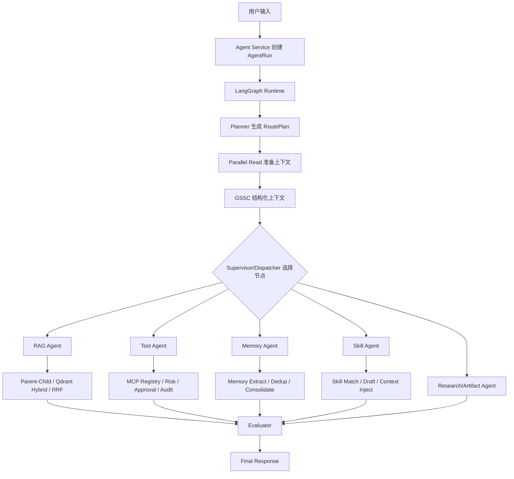
```mermaid
flowchart TD
    A["用户输入"] --> B["Agent Service 创建 AgentRun"]
    B --> C["LangGraph Runtime"]
    C --> D["Planner 生成 RoutePlan"]
    D --> E["Parallel Read 准备上下文"]
    E --> F["GSSC 结构化上下文"]
    F --> G{"Supervisor/Dispatcher 选择节点"}

    G --> H["RAG Agent"]
    G --> I["Tool Agent"]
    G --> J["Memory Agent"]
    G --> K["Skill Agent"]
    G --> L["Research/Artifact Agent"]

    H --> H1["Parent-Child / Qdrant Hybrid / RRF"]
    I --> I1["MCP Registry / Risk / Approval / Audit"]
    J --> J1["Memory Extract / Dedup / Consolidate"]
    K --> K1["Skill Match / Draft / Context Inject"]

    H1 --> M["Evaluator"]
    I1 --> M
    J1 --> M
    K1 --> M
    L --> M
    M --> N["Final Response"]
```

面试时你要先建立这个“系统级视角”：  
**我不是只写了一个聊天接口，而是把 Agent 执行过程拆成规划、上下文、工具、安全、检索、记忆、复用和最终回复几个可观测环节。**

---

## 9.1 模块一：LangGraph Agent Runtime 多节点编排层

### 9.1.1 这个模块解决什么问题

普通 LLM 应用常见的问题是：用户输入进来以后，代码里一堆 if/else 判断，要不要查资料、要不要调用工具、要不要写记忆、要不要生成文件，最后全混在一个函数里。这样会有几个问题：

1. **不可观测**：失败时不知道是 planner 错了、RAG 没查到、工具被拦截，还是 final response 胡说。
2. **不可恢复**：工具审批、长任务、异常中断时，很难恢复到正确阶段。
3. **不可扩展**：以后新增 memory、skill、artifact、approval，每加一个能力都要改主流程。
4. **安全边界模糊**：工具调用、审批、输出生成混在一起，容易绕过安全策略。

所以你做的是：  
**用 LangGraph StateGraph 把 Agent 执行流程拆成节点，让每个节点只负责一个阶段，并通过共享 state 传递结果。**

一句话讲给面试官：

> 我把 Agent Runtime 从传统的单函数链路改成了 LangGraph StateGraph 节点图。每个阶段，比如权限检查、意图识别、规划、上下文读取、RAG、工具调用、Memory、Skill、评估、最终回复，都是独立节点。节点之间通过 AgentRuntimeState 传递状态，并通过 dispatcher 做条件跳转。这样整个 Agent 执行过程可观测、可插拔，也方便处理审批中断和恢复。

### 9.1.2 你具体怎么做的

你主要做了三件事：

第一，定义统一状态 `AgentRuntimeState`。  
这个 state 是所有节点共享的数据结构。它里面不只是 `user_input`，还包括：

| 状态字段 | 作用 |
|---|---|
| `user_id` / `run_id` / `thread_id` | 标识用户、运行实例、LangGraph thread |
| `route_plan` | planner 生成的路由计划 |
| `context` | GSSC 上下文、Memory、RAG evidence、FeedCard 等 |
| `rag_result` / `tool_result` / `memory_result` / `skill_result` | 各 agent 节点产物 |
| `pending_approval_id` / `pending_tool_call_id` | 工具审批中断时保存恢复信息 |
| `completed_nodes` | 已完成节点列表 |
| `node_results` | 节点执行结果，用于观测和最终汇总 |
| `errors` | 节点错误 |
| `final_answer` / `final_payload` | 最终回复 |

这个设计的意义是：每个节点都不需要知道全局业务细节，只需要读自己关心的字段，写自己的结果字段。

第二，定义节点注册表。  
在 `graph_registry.py` 里，节点不是散落注册的，而是有结构化分类：

| 分组 | 节点 |
|---|---|
| SETUP | `permission_guard`、`home_intent_react`、`planner` |
| READ | `parallel_prefetch`、`parallel_read_stage`、`supervisor_observer` |
| AGENT | `research_agent`、`rag_agent`、`artifact_agent`、`tool_agent`、`memory_agent`、`skill_agent` |
| EVAL | `evaluator`、`final_response` |

这说明你的 Agent 不是“函数随机跳”，而是有阶段边界的 runtime。

第三，用 StateGraph 连接节点。  
在 `graph_builder.py` 里创建 `StateGraph(AgentRuntimeState)`，然后把节点都 add 进去。固定前置链路大概是：

```text
permission_guard
  -> home_intent_react
  -> planner
  -> parallel_prefetch
  -> parallel_read_stage
  -> supervisor_observer
```

到 `supervisor_observer` 之后，就不是固定单一路径，而是根据 route plan 和当前完成情况动态选择下一个 agent 节点。

### 9.1.3 一次请求的真实工作流

你可以这样给面试官讲完整请求链路：

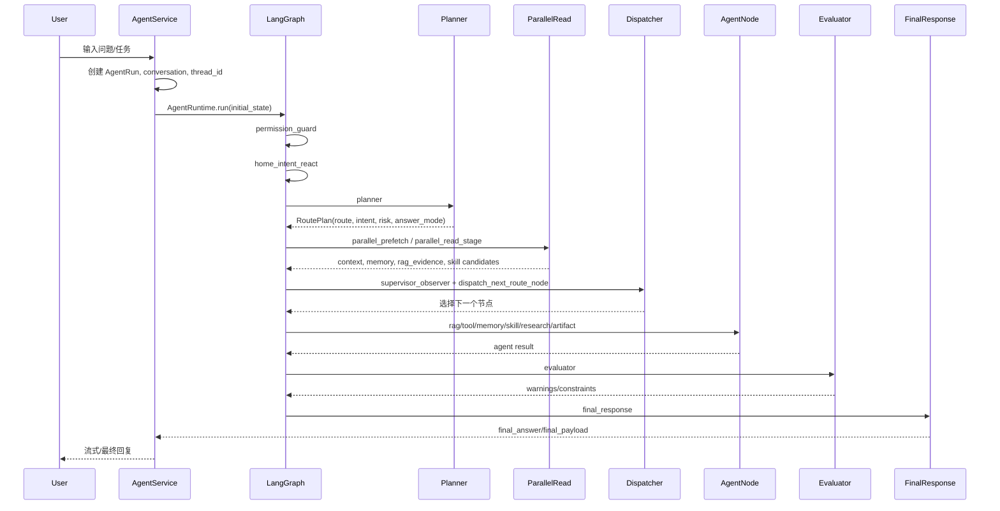
```mermaid
sequenceDiagram
    participant U as User
    participant S as AgentService
    participant G as LangGraph
    participant P as Planner
    participant R as ParallelRead
    participant D as Dispatcher
    participant A as AgentNode
    participant E as Evaluator
    participant F as FinalResponse

    U->>S: 输入问题/任务
    S->>S: 创建 AgentRun, conversation, thread_id
    S->>G: AgentRuntime.run(initial_state)
    G->>G: permission_guard
    G->>G: home_intent_react
    G->>P: planner
    P-->>G: RoutePlan(route, intent, risk, answer_mode)
    G->>R: parallel_prefetch / parallel_read_stage
    R-->>G: context, memory, rag_evidence, skill candidates
    G->>D: supervisor_observer + dispatch_next_route_node
    D-->>G: 选择下一个节点
    G->>A: rag/tool/memory/skill/research/artifact
    A-->>G: agent result
    G->>E: evaluator
    E-->>G: warnings/constraints
    G->>F: final_response
    F-->>S: final_answer/final_payload
    S-->>U: 流式/最终回复
```

更具体地说：

1. **AgentService 创建运行记录**  
   用户请求先进入 service 层。service 会创建 `AgentRun`，保存 `conversation_id`、`thread_id`、`user_input`、`graph_state` 等。这里的作用是让一次 Agent 执行有数据库身份，后续事件、审批、工具调用都能关联到这个 run。

2. **permission_guard 做早期安全检查**  
   它不是具体工具审批，而是 runtime 入口的安全门。比如用户意图明显是 blocked/approval 时，可以提前调整 route。

3. **home_intent_react 识别首页意图**  
   这个节点用规则/LLM 辅助判断用户是在普通聊天、文档问答、工具动作、研究任务还是记忆相关任务。

4. **planner 生成 RoutePlan**  
   planner 是核心。它根据用户输入、意图、风险等级、answer_mode，决定后面要走哪些 agent 节点。比如：

   ```text
   用户问当前文档内容 -> route: rag_agent -> evaluator -> final_response
   用户要求发邮件 -> route: tool_agent -> evaluator -> final_response, risk=L3
   用户说“记住我喜欢中文回答” -> route: memory_agent -> final_response
   用户要求深度研究并产出报告 -> route: research_agent -> artifact_agent -> memory_agent -> skill_agent
   ```

5. **parallel_prefetch / parallel_read_stage 提前准备上下文**  
   这里会提前准备 Memory、RAG evidence、Skill candidates、conversation history、FeedCard context 等。这样后面的 RAG、final_response、skill_matcher 不用各自重复查。

6. **supervisor_observer + dispatcher 做动态节点选择**  
   你的项目里没有一个单独名叫 router 的 StateGraph 节点。实际路由分成：

   | 层 | 责任 |
   |---|---|
   | planner | 生成 route plan |
   | supervisor_observer | 观察当前执行状态和候选节点 |
   | dispatch_next_route_node | 给 LangGraph conditional edge 返回下一个节点名 |

   这也是面试要讲清楚的地方。不要说“我有 router 节点”，要说“我实现的是 planner + dispatcher 的条件路由机制”。

7. **agent 节点执行具体能力**  
   例如 `rag_agent` 做文档检索，`tool_agent` 做 MCP 工具调用，`memory_agent` 做记忆写入，`skill_agent` 做可复用 workflow 检测。

8. **evaluator 做最终前检查**  
   evaluator 会检查一些约束，比如 RAG 没 evidence 不要声称“根据文档”，工具等待审批时不要声称已执行。

9. **final_response 构造最终回答**  
   final_response 会优先使用 GSSC context，把各 agent 的结果整合成用户能读的自然语言。

### 9.1.4 这个模块最重要的工程亮点

**亮点一：节点有职责边界。**

你不是写一个大函数处理所有事情，而是把职责拆开：

| 节点 | 职责 |
|---|---|
| `planner` | 决定做什么 |
| `parallel_read_stage` | 准备上下文 |
| `rag_agent` | 查用户文档 |
| `tool_agent` | 调工具并处理审批 |
| `memory_agent` | 抽取并写入记忆 |
| `skill_agent` | 检测 workflow 是否可复用 |
| `evaluator` | 防止最终回答过度声称 |
| `final_response` | 组织用户可读答案 |

**亮点二：状态可观测。**

通过 `AgentRun`、`AgentEvent`、`AgentStep`、`node_results`、`completed_nodes`，可以看一次 run 到底卡在哪个节点。这对 Agent 平台非常重要，因为 Agent 的问题通常不是“代码直接报错”，而是“模型做了奇怪决策”。可观测性就是定位这类问题的基础。

**亮点三：审批中断是 runtime 级别处理。**

当工具需要审批时，`tool_agent` 不会继续往下假装执行成功，而是设置：

```text
status = waiting_approval
approval_required = True
pending_approval_id = ...
pending_tool_call_id = ...
pending_tool_name = ...
pending_tool_args = ...
```

然后 dispatcher 看到 `waiting_approval`，直接路由到 END。这个设计保证危险工具不会在用户审批前执行。

**亮点四：route plan 与 agent 节点解耦。**

planner 只决定路线，不直接执行工具、不直接检索、不直接写记忆。这样以后要新增一个 agent 节点，只要把它注册到 graph 和 planner route 即可。

### 9.1.5 面试官可能怎么追问

**问题：为什么不用 LangChain AgentExecutor，为什么要用 LangGraph？**

你可以答：

> AgentExecutor 更适合简单 ReAct 工具调用，但这个项目有审批中断、Memory 写入、RAG 检索、Skill 复用、最终评估等多个阶段。我需要明确的状态图、条件边、节点级观测和恢复点，所以选了 LangGraph StateGraph。StateGraph 能让我把复杂 Agent 拆成稳定节点，而不是让 LLM 在一个循环里自由决定所有事情。

**问题：你这个 router 在哪里？**

你可以答：

> 严格说没有独立 router node。我把路由能力拆成 planner、supervisor_observer 和 dispatch_next_route_node。planner 生成 route plan，supervisor 观察运行状态，dispatcher 根据 completed_nodes 和 waiting_approval 返回下一个节点名。这样比单独一个 router 节点更容易测试和维护。

**问题：checkpoint 真的能恢复吗？**

你可以答：

> 当前实现分两层。LangGraph checkpointer 是可选接入，开启后可以用 RedisSaver，开发环境 fallback MemorySaver；默认配置没有开启，所以我不会夸成生产级 crash recovery。业务恢复更实在，approval/tool_call/run_state 都在 DB 里，审批恢复主要靠这些业务状态。下一步我会补 Redis checkpoint 的重启恢复 E2E。

---

## 9.2 模块二：MCP Tool Governance 工具治理、安全分级与审批层

### 9.2.1 这个模块解决什么问题

Agent 平台最危险的地方不是回答错一句话，而是它能调用工具。工具一旦能写文件、发邮件、删数据、访问外部系统，就必须有治理层。

如果没有治理层，会出现这些风险：

1. 模型误判用户意图，直接执行危险操作。
2. 工具参数不完整或格式错误，执行出错。
3. 外部写入动作没有用户确认。
4. 高危操作没有阻断。
5. 事后不知道调用了哪个工具、传了什么参数、是否审批。

所以你做的 MCP 工具治理层，本质上是：

> 把所有工具调用收敛到统一入口，在执行前做注册、参数校验、风险分级、审批拦截和审计记录。

一句话讲给面试官：

> 我没有让 LLM 直接调用 Python 函数，而是做了 MCP ToolExecutor。工具先注册成 MCPToolSpec，带 input_schema、output_schema、safety_level 和 requires_approval。执行时统一经过 PermissionGuard：L3 生成人工审批，L4 默认阻断。所有 ToolCall、Approval、AgentEvent 都落库，形成审计链路。

### 9.2.2 你具体怎么做的

这个模块可以拆成五层：

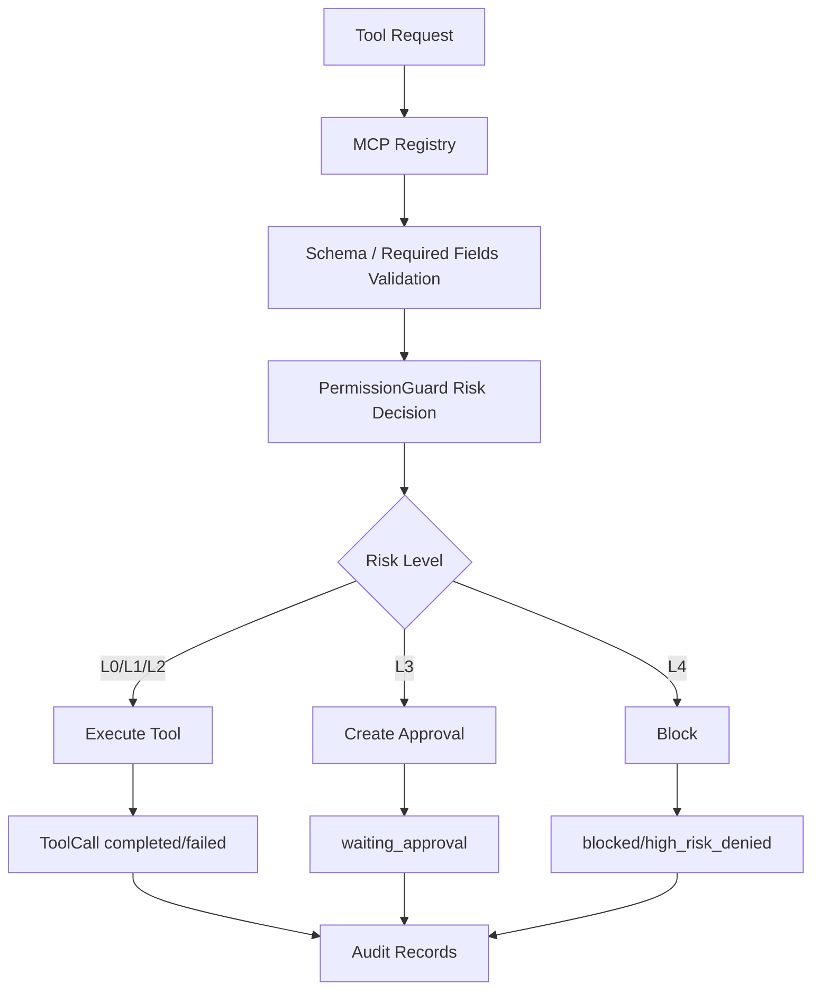
```mermaid
flowchart TD
    A["Tool Request"] --> B["MCP Registry"]
    B --> C["Schema / Required Fields Validation"]
    C --> D["PermissionGuard Risk Decision"]
    D --> E{"Risk Level"}
    E -->|L0/L1/L2| F["Execute Tool"]
    E -->|L3| G["Create Approval"]
    E -->|L4| H["Block"]
    F --> I["ToolCall completed/failed"]
    G --> J["waiting_approval"]
    H --> K["blocked/high_risk_denied"]
    I --> L["Audit Records"]
    J --> L
    K --> L
```

第一层：工具注册。  
在 `registry.py` 中，内置工具被声明成 `BUILTIN_TOOLS`。每个工具包含：

| 字段 | 作用 |
|---|---|
| `name` | 工具名，例如 `local_file.write`、`email.send` |
| `description` | 工具说明 |
| `category` | 工具分类 |
| `input_schema` | 输入字段描述 |
| `output_schema` | 输出字段描述 |
| `safety_level` | 风险等级 |
| `requires_approval` | 是否需要审批 |
| `enabled` | 是否启用 |
| `aliases` | 工具别名 |

`ensure_builtin_tools()` 会把这些工具同步到数据库。这样工具不是写死在执行逻辑里，而是有统一 registry 和持久化记录。

第二层：工具参数校验。  
`tool_router.py` 里的 `validate_tool_input()` 会根据工具 schema 检查 required 字段，并做一些格式校验，比如 email。  
真实边界是：它不是完整 JSON Schema validator，而是针对项目内置工具的工程校验。

第三层：风险分级。  
工具风险分成 L0-L4：

| 等级 | 含义 | 示例 |
|---|---|---|
| L0 | 只读/无副作用 | 读取状态、搜索记忆 |
| L1 | 草稿/低风险 | 创建 artifact 草稿 |
| L2 | 本地低风险写入或只读系统操作 | 某些本地生成动作 |
| L3 | 外部写入/需要确认 | 写本地文件、发邮件 |
| L4 | 高危破坏性操作 | 删除文件、危险 shell、破坏性动作 |

第四层：审批和阻断。  
`PermissionGuard.check_tool_call()` 是关键：

```text
L3 -> allowed=False, requires_approval=True
L4 -> allowed=False, requires_approval=False, reason=high_risk_denied
```

这代表：

| 等级 | 行为 |
|---|---|
| L3 | 不执行，创建 Approval，等待用户批准 |
| L4 | 直接阻断，不进入审批 |

第五层：审计。  
每次工具调用都会创建 `ToolCall` 记录，包括 tool_name、input、output、permission_level、status、error_message 等。审批会创建 `Approval`。运行过程还会写 `AgentEvent`。

### 9.2.3 L3 审批的完整工作流

以用户说“帮我写一个文件”为例：

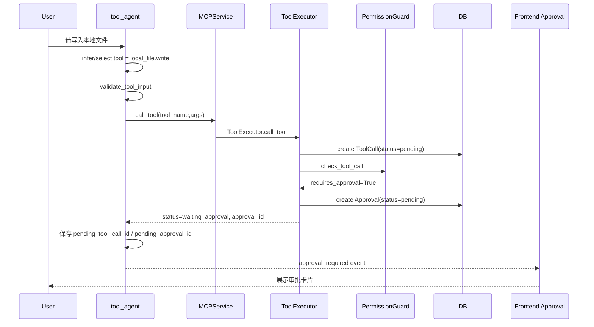
```mermaid
sequenceDiagram
    participant U as User
    participant TA as tool_agent
    participant MS as MCPService
    participant EX as ToolExecutor
    participant PG as PermissionGuard
    participant DB as DB
    participant UI as Frontend Approval

    U->>TA: 请写入本地文件
    TA->>TA: infer/select tool = local_file.write
    TA->>TA: validate_tool_input
    TA->>MS: call_tool(tool_name,args)
    MS->>EX: ToolExecutor.call_tool
    EX->>DB: create ToolCall(status=pending)
    EX->>PG: check_tool_call
    PG-->>EX: requires_approval=True
    EX->>DB: create Approval(status=pending)
    EX-->>TA: status=waiting_approval, approval_id
    TA->>TA: 保存 pending_tool_call_id / pending_approval_id
    TA-->>UI: approval_required event
    UI-->>U: 展示审批卡片
```

这里最关键的是：  
**ToolExecutor 在审批前不会调用真实 provider。**

也就是说，L3 工具在用户确认前只创建审批记录，不执行写文件/发邮件。

### 9.2.4 用户批准后的恢复工作流

用户点击批准后，不是重新让模型决定一次工具调用，而是走审批恢复：

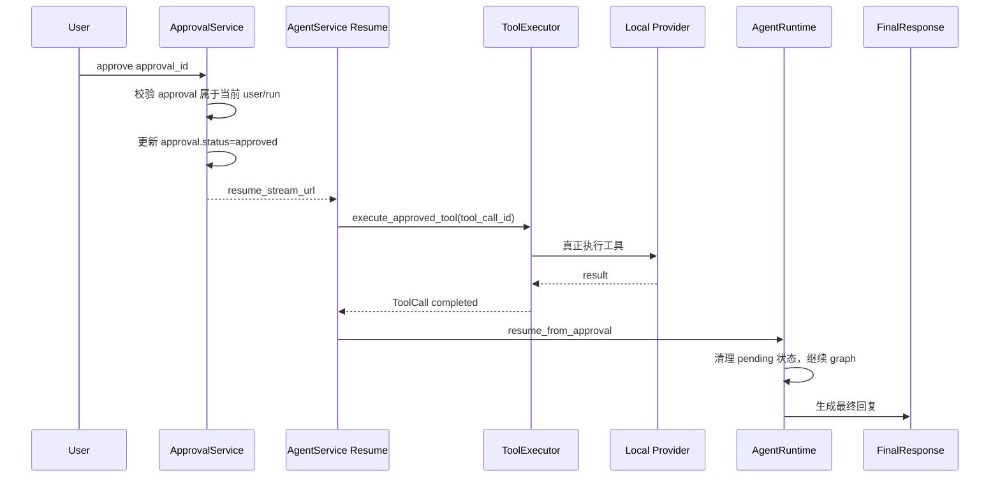
```mermaid
sequenceDiagram
    participant U as User
    participant AS as ApprovalService
    participant AG as AgentService Resume
    participant EX as ToolExecutor
    participant Provider as Local Provider
    participant G as AgentRuntime
    participant F as FinalResponse

    U->>AS: approve approval_id
    AS->>AS: 校验 approval 属于当前 user/run
    AS->>AS: 更新 approval.status=approved
    AS-->>AG: resume_stream_url
    AG->>EX: execute_approved_tool(tool_call_id)
    EX->>Provider: 真正执行工具
    Provider-->>EX: result
    EX-->>AG: ToolCall completed
    AG->>G: resume_from_approval
    G->>G: 清理 pending 状态，继续 graph
    G->>F: 生成最终回复
```

这套设计的意义：

1. 审批前不执行。
2. 批准后执行的是之前保存的 tool_call，而不是让 LLM 重新生成参数。
3. 恢复时把结果写回 state，再继续 graph。
4. 审计链路能看见：谁发起、谁批准、执行结果是什么。

### 9.2.5 L4 阻断工作流

L4 不走审批，而是直接拒绝：

```text
tool_agent
  -> MCPService.call_tool
  -> ToolExecutor.call_tool
  -> PermissionGuard.check_tool_call
  -> reason = high_risk_denied
  -> ToolCall.status = blocked
  -> final_response 告知不能执行
```

为什么 L4 不审批？  
因为审批不是万能安全机制。有些动作即使用户点了批准，也不应该让 Agent 自动做，比如破坏性删除、危险命令。这是保守安全策略。

面试时你可以讲：

> 我把 L3 和 L4 区分开。L3 是“可以做，但需要人确认”的动作；L4 是“当前系统策略下不允许 Agent 做”的动作。这样能避免把所有风险都甩给用户审批。

### 9.2.6 这个模块最重要的工程亮点

**亮点一：工具调用统一入口。**  
LLM 不能绕过 MCPService 直接调用 provider。

**亮点二：工具 spec 和执行解耦。**  
工具信息在 registry/spec 层，执行逻辑在 executor/provider 层。以后接外部 MCP server，也可以复用治理逻辑。

**亮点三：审批是中断，不是弹窗装饰。**  
L3 工具会让 `tool_agent` 设置 `waiting_approval`，dispatcher 直接 END。Graph 不会继续假装任务完成。

**亮点四：L4 默认拒绝。**  
高危动作不是“请用户确认一下”，而是系统层 blocked。

**亮点五：审计链路完整。**  
ToolCall、Approval、AgentEvent 可以还原一次工具调用生命周期。

### 9.2.7 面试官可能怎么追问

**问题：MCP 工具注册怎么做？**

> 我在 registry 里定义 MCPToolSpec，每个工具有 name、input_schema、output_schema、safety_level、requires_approval、enabled 等字段。启动或调用前会 ensure_builtin_tools，把内置工具同步到 DB。执行时通过 registry 找 spec，而不是直接调用函数。

**问题：Schema 校验是不是完整 JSON Schema？**

> 当前不是完整 JSON Schema validator，而是根据 spec 做 required 字段和部分格式校验，比如 email。原因是目前主要治理内置工具，这样足够覆盖关键失败场景。如果后续接入任意第三方 MCP server，我会引入标准 jsonschema 校验。

**问题：审批怎么保证工具没提前执行？**

> ToolExecutor 在 permission guard 判断 requires_approval 后，只创建 Approval 并返回 waiting_approval，不调用 provider。真正 provider.call 只发生在 execute_approved_tool，也就是审批通过之后。

---

## 9.3 模块三：RAG Retrieval System 检索层

### 9.3.1 这个模块解决什么问题

RAG 看起来简单：上传文档、切 chunk、embedding、检索、回答。  
但真实项目里会遇到很多问题：

1. chunk 太小，命中了但上下文不完整。
2. chunk 太大，召回不准、embedding 噪声高。
3. 纯 dense embedding 对合同编号、金额、中文关键词、表格字段不稳定。
4. 检索优化没有评估指标，只靠主观感受。
5. 向量库里到底存了哪些 chunk 不清楚，parent/child 容易混。

所以你做的是：

> 用 Parent-Child Chunking 解决上下文粒度问题，用 Qdrant dense + sparse hybrid 解决语义和关键词召回问题，用 RRF 做融合，用 hit@k eval runner 量化效果。

一句话讲给面试官：

> RAG 这块我不是简单切片入库，而是做了 Parent-Child Chunking：child chunk 负责向量检索，parent chunk 负责补上下文。向量库使用 Qdrant hybrid collection，同时写 dense 和 sparse；查询时 dense/sparse 两路召回，在 Qdrant native hybrid 路径用 Fusion.RRF 融合。最后用 synthetic eval runner 评估 hit@5，从 baseline 0.54 到 qdrant_hybrid 0.92。

### 9.3.2 文档摄入工作流

先讲 ingestion，因为检索效果一半来自入库设计。

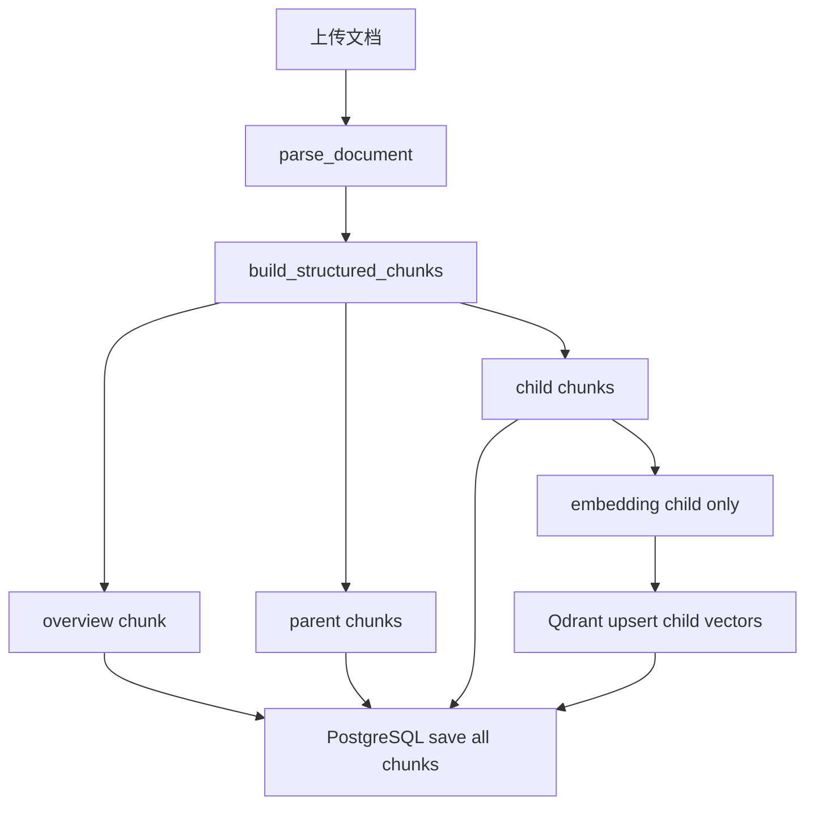
```mermaid
flowchart TD
    A["上传文档"] --> B["parse_document"]
    B --> C["build_structured_chunks"]
    C --> D["overview chunk"]
    C --> E["parent chunks"]
    C --> F["child chunks"]
    F --> G["embedding child only"]
    G --> H["Qdrant upsert child vectors"]
    D --> I["PostgreSQL save all chunks"]
    E --> I
    F --> I
    H --> I
```

具体流程：

1. **parse document**  
   文档先经过解析器，抽取文本、标题、页码、表格等 metadata。

2. **structured chunker 生成三类 chunk**  
   `build_structured_chunks()` 会生成：

   | chunk 类型 | 作用 | 是否写 Qdrant |
   |---|---|---|
   | overview | 文档整体概览 | 否 |
   | parent | 较大语义段落/章节 | 否 |
   | child | 检索粒度的小片段 | 是 |

3. **只 embedding child chunks**  
   这点非常重要。不是所有 chunk 都写向量库。只有 `metadata.chunk_role == "child"` 的 chunk 会写 Qdrant。

4. **保存所有 chunk 到 PostgreSQL**  
   parent/overview 虽然不写向量库，但保存在 DB。检索命中 child 后，根据 child 的 `parent_id` 回查 parent。

这个设计为什么好？

| 问题 | 解决方式 |
|---|---|
| child 太短导致回答不完整 | 命中 child 后补 parent_context |
| parent 太长导致召回不准 | parent 不直接参与向量召回 |
| overview 影响检索噪声 | overview 不写 Qdrant，只用于文档结构 |
| 无法解释命中位置 | child 带 parent_id、heading_path、page/sheet metadata |

### 9.3.3 Parent-Child Chunking 怎么讲清楚

你可以用这个例子：

```text
文档：合同说明

Parent p-0001:
  第 1 节 合同基本信息
  合同编号：HT-2026-001
  甲方：...
  金额：128000
  支付方式：...

Child p-0001-c-001:
  合同编号：HT-2026-001

Child p-0001-c-002:
  金额：128000，支付方式：...
```

用户问“合同编号是多少？”  
检索时 child `p-0001-c-001` 更容易命中，因为它短、关键词集中。  
回答时系统再拿 parent `p-0001` 补上下文，避免只给一个孤立编号。

面试说法：

> child 是检索单元，parent 是回答上下文单元。这样兼顾 recall precision 和 answer completeness。

### 9.3.4 Qdrant Hybrid Search 工作流

纯 dense embedding 对语义问题很好，但对精确信息不稳定，比如：

| Query 类型 | 纯 dense 风险 |
|---|---|
| 合同编号是多少 | 编号不是语义概念，embedding 可能弱 |
| 邮箱是什么 | token 精确匹配更重要 |
| 中文关键词“稀疏向量缺失” | 中文分词和 embedding 可能漂移 |
| 表格字段 | 字段名、数值、单位都需要 lexical signal |

所以你做了 hybrid：

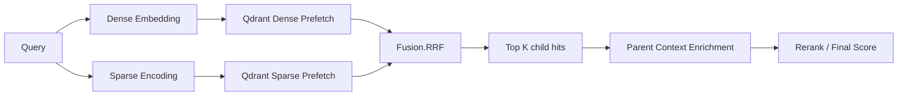
```mermaid
flowchart LR
    Q["Query"] --> DE["Dense Embedding"]
    Q --> SE["Sparse Encoding"]
    DE --> DP["Qdrant Dense Prefetch"]
    SE --> SP["Qdrant Sparse Prefetch"]
    DP --> RRF["Fusion.RRF"]
    SP --> RRF
    RRF --> TOP["Top K child hits"]
    TOP --> PARENT["Parent Context Enrichment"]
    PARENT --> RERANK["Rerank / Final Score"]
```

入库时：

```text
child content
  -> dense embedding vector
  -> sparse vector
  -> Qdrant point vector = {dense_name: dense, sparse_name: sparse}
```

查询时：

```text
query
  -> dense query vector
  -> sparse query vector
  -> Qdrant query_points(prefetch=[dense, sparse], query=FusionQuery(Fusion.RRF))
```

这里的 RRF 是 Qdrant 原生 Fusion.RRF。它把 dense 和 sparse 两路召回按排名融合，而不是简单加权分数。好处是不同召回器的分数尺度不需要完全一致。

### 9.3.5 RRF 怎么讲

RRF 全称 Reciprocal Rank Fusion。  
直觉上，它不太关心每个检索器给的原始分数，而是关心“这个文档在各个检索器里排第几”。

一个简单例子：

| chunk | dense rank | sparse rank | RRF 后 |
---|---:|---:|---:|
| A | 1 | 20 | 仍然较高 |
| B | 8 | 1 | 也会较高 |
| C | 5 | 5 | 稳定靠前 |

如果一个 chunk 在 dense 和 sparse 里都排名不错，它会被强化。  
如果只在其中一路特别高，也不会被完全忽略。

面试时你不需要讲公式，讲工程意义就够：

> RRF 适合 hybrid，因为 dense 和 sparse 的分数尺度不一样。直接加分会有校准问题，RRF 按 rank 融合，更稳。

### 9.3.6 检索后的 parent enrichment

Qdrant 返回的是 child hits，但最终回答不能只看 child。  
所以 retriever 会做：

```text
for each child_hit:
    parent_id = child_hit.metadata.parent_id
    parent = DocumentChunkRepository.get_parent(document_id, parent_id)
    child_hit.parent_context = parent.content
```

这样 final response 能拿到：

| 字段 | 作用 |
|---|---|
| `content` | child 命中内容 |
| `parent_context` | 更完整上下文 |
| `citation` | 文档名、chunk_id、parent_id |
| `heading_path` | 章节路径 |
| `page_number/sheet_name` | 页码/表格来源 |

### 9.3.7 fallback 设计

Qdrant hybrid 不一定永远可用，比如：

1. collection schema 不是 hybrid。
2. sparse encoder 不可用。
3. Qdrant 服务异常。
4. 老数据没有 sparse vector。

所以 retriever 里保留了 Python BM25 hybrid fallback。  
它的工作方式大致是：

```text
vector search
local BM25 search from PostgreSQL child candidates
merge hits
weighted rerank
parent enrichment
```

注意：fallback 不是 RRF，而是本地 weighted merge/rerank。  
面试一定要讲清楚：

> RRF 是 Qdrant native hybrid 路径；fallback 是 Python BM25 + vector merge。

### 9.3.8 hit@5 评估怎么做

你做了 `scripts/run_rag_hybrid_eval.py`，这点非常关键，因为它让 RAG 优化有指标。

评估流程：

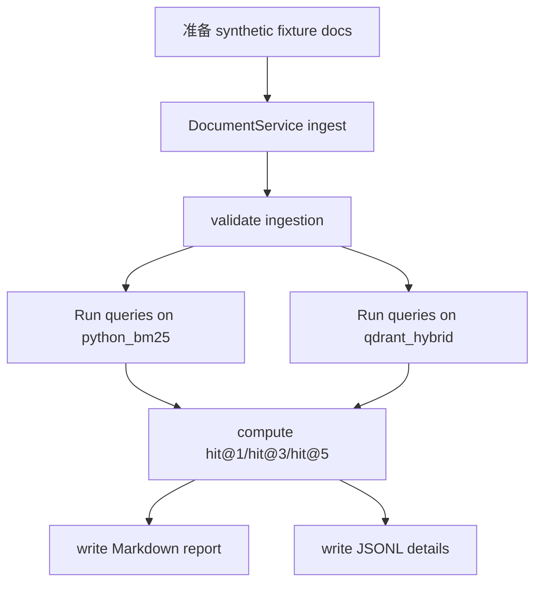
```mermaid
flowchart TD
    A["准备 synthetic fixture docs"] --> B["DocumentService ingest"]
    B --> C["validate ingestion"]
    C --> D["Run queries on python_bm25"]
    C --> E["Run queries on qdrant_hybrid"]
    D --> F["compute hit@1/hit@3/hit@5"]
    E --> F
    F --> G["write Markdown report"]
    F --> H["write JSONL details"]
```

它不是只看“有没有返回结果”，而是看 top-k 结果里是否命中 expected keyword。

指标包括：

| 指标 | 含义 |
|---|---|
| hit@1 | 第一个结果是否命中 |
| hit@3 | 前 3 个结果是否命中 |
| hit@5 | 前 5 个结果是否命中 |
| keyword_hit_rate | 关键词命中率 |
| fallback_count | fallback 次数 |
| warning_count | 警告次数 |
| avg_latency_ms | 平均延迟 |

历史报告中存在：

```text
python_bm25 hit@5 = 0.54
qdrant_hybrid hit@5 = 0.92
```

面试讲法要非常稳：

> 这个 0.54 到 0.92 是 synthetic benchmark 上 backend 对比，不是线上 A/B。我保留了 Markdown 和 JSONL 报告，用来做可复现评估和防回归。

### 9.3.9 这个模块最重要的工程亮点

**亮点一：child-only vector upsert。**  
这避免 parent/overview 污染向量检索。

**亮点二：parent context enrichment。**  
这解决了小 chunk 命中但回答上下文不够的问题。

**亮点三：dense + sparse hybrid。**  
语义召回和关键词召回互补。

**亮点四：Qdrant native RRF。**  
用 rank fusion 避免不同检索器分数不可比。

**亮点五：有 eval runner。**  
RAG 优化有 hit@k 指标和历史报告，不是凭感觉。

### 9.3.10 面试官可能怎么追问

**问题：为什么 Parent-Child 比普通 chunk 好？**

> 普通 chunk 要在“检索精度”和“上下文完整性”之间二选一。chunk 小，召回准但信息不完整；chunk 大，上下文完整但召回噪声高。Parent-Child 把这两个目标拆开：child 负责召回，parent 负责补上下文。

**问题：Qdrant hybrid 比你原来的 BM25 fallback 好在哪里？**

> 原来的 fallback 是本地 BM25 和 vector merge，能工作，但融合和索引都在应用层。Qdrant hybrid 把 dense/sparse 都放进向量库，由 Qdrant 做 native prefetch 和 RRF，结构更统一，也更适合后续扩展过滤、索引和线上化。

**问题：0.54 到 0.92 是怎么来的？**

> 是项目 synthetic eval 的结果。baseline 是 python_bm25 backend，hit@5 0.54；qdrant_hybrid backend hit@5 0.92。这个数据集不是线上真实用户，而是固定测试文档和 query，用来验证中文关键词、合同编号、摘要类问题等场景。

---

## 9.4 模块四：Memory / GSSC / Skill 记忆、上下文与复用层

### 9.4.1 这个模块解决什么问题

Agent 如果没有记忆，每次对话都像第一次见用户。  
但如果把所有历史都塞进 prompt，又会产生上下文污染、token 爆炸和错误个性化。

你这个模块解决的是三个问题：

1. **什么值得记住**：从对话里抽取偏好、项目目标、技术栈、历史任务事件。
2. **什么时候拿出来用**：不同任务只注入相关 memory，不是全部塞进去。
3. **重复 workflow 能否复用**：把成功任务沉淀成 Skill 草稿，下次匹配后注入上下文。

所以这个模块其实由三部分组成：

| 子模块 | 解决问题 |
|---|---|
| Memory | 长期/短期信息怎么存、怎么检索、怎么固化 |
| GSSC | 多源上下文怎么选择、组织、压缩 |
| Skill | 成功 workflow 怎么沉淀、匹配和复用 |

一句话讲给面试官：

> 我做了一个 Memory + GSSC + Skill 的上下文层。Memory 负责抽取、去重、固化和召回；GSSC 负责根据 route、answer_mode 和 token budget 选择上下文；Skill 负责把可复用 workflow 变成草稿，并在后续请求中匹配后注入上下文。

---

## 9.4.A Memory 三层记忆系统

### 9.4.A.1 三层记忆分别是什么

你的 memory 分成 working、episodic、semantic：

| 类型 | 生命周期 | 存什么 | 示例 |
|---|---|---|---|
| working | 当前任务/短期 | 当前页面、选中卡片、临时上下文 | 用户当前在看某个 FeedCard |
| episodic | 中期事件 | 用户做过什么任务、发生过什么交互 | 用户启动过一次深度研究 |
| semantic | 长期稳定事实 | 偏好、目标、技术栈、边界约束 | 用户偏好中文、正在做 Agent OS |

这三个类型不是为了好听，而是为了控制“什么时候注入什么”。

比如用户问“我叫什么？”可以注入 name_preference。  
用户随便问“Python list 怎么排序？”不应该注入他的项目目标、技术栈、历史 research 记录。  
用户问“继续上次那个 Agent OS 项目”时，才应该注入 project_goal、tech_stack、workflow_pattern。

### 9.4.A.2 Memory 写入工作流

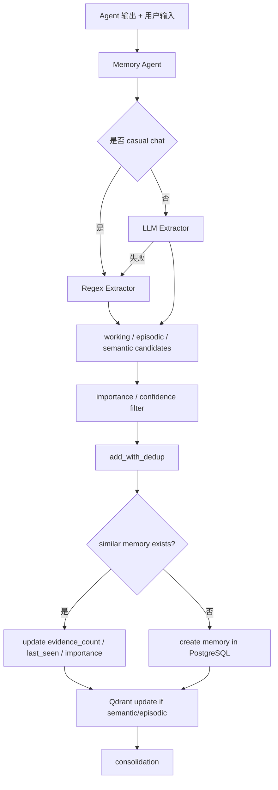
```mermaid
flowchart TD
    A["Agent 输出 + 用户输入"] --> B["Memory Agent"]
    B --> C{"是否 casual chat"}
    C -->|是| D["Regex Extractor"]
    C -->|否| E["LLM Extractor"]
    E -->|失败| D
    D --> F["working / episodic / semantic candidates"]
    E --> F
    F --> G["importance / confidence filter"]
    G --> H["add_with_dedup"]
    H --> I{"similar memory exists?"}
    I -->|是| J["update evidence_count / last_seen / importance"]
    I -->|否| K["create memory in PostgreSQL"]
    J --> L["Qdrant update if semantic/episodic"]
    K --> L
    L --> M["consolidation"]
```

步骤解释：

1. **Memory Agent 拿到上下文**  
   它会拿用户输入、Agent 输出、page_context、feed_card_context、matched_skill、created_skill_draft。

2. **优先 LLM 抽取，失败 fallback regex**  
   对非 casual chat，`LlmMemoryExtractor` 会调用 memory 模型，要求输出结构化 JSON。  
   如果 LLM 失败，回退到 deterministic regex extractor。

3. **抽取三类 memory candidates**  
   extractor 会输出：

   ```text
   working_memories
   episodic_memories
   semantic_memories
   should_consolidate
   ```

4. **confidence / importance 过滤**  
   不是抽出来就保存。低置信度、低重要度会被过滤。

5. **去重写入**  
   `add_with_dedup()` 会找相似 memory。如果找到，就更新旧 memory，而不是新增重复记录。

6. **semantic/episodic 写 Qdrant**  
   PostgreSQL 是权威存储，Qdrant 用于语义检索。working 通常不进 Qdrant。

7. **固化/晋升**  
   高重要度 working 可以晋升 episodic；高稳定性 episodic 可以晋升 semantic。

### 9.4.A.3 去重怎么做

你不是简单按字符串完全相等去重，而是 `_find_similar()` 做相似度判断。它会搜索同类型 memory，然后用归一化文本、Jaccard、字符 n-gram 等方式估计相似度。

如果相似度超过阈值，会 `_update_existing()`：

| 字段 | 更新方式 |
|---|---|
| `evidence_count` | +1，说明多次被观察到 |
| `last_seen_at` | 更新时间 |
| `importance` | 取更高值并小幅增强 |
| `metadata` | 合并新证据 |
| Qdrant point | 如果存在则更新向量 payload |

这就是你可以讲的“记忆去重与证据累积”。

面试说法：

> 我没有每次都新增 memory。保存前会查找相似记忆，如果用户重复表达同一偏好，就更新已有 memory 的 evidence_count、last_seen_at 和 importance。这样长期记忆会越来越稳定，而不是越来越乱。

### 9.4.A.4 固化怎么做

固化就是 memory 从短期变长期：

```text
working -> episodic
episodic -> semantic
```

规则大概是：

| 晋升路径 | 条件 |
|---|---|
| working → episodic | importance 足够高 |
| episodic → semantic | importance 高、不是 temporary、evidence_count 足够、category 属于长期类别 |

为什么要固化？  
因为用户一次临时行为不一定代表长期偏好。比如用户某次让你“这次用英文”，不应该立刻变成“用户长期偏好英文”。但如果他多次表达“以后都用中文”，就可以固化为 semantic memory。

### 9.4.A.5 Memory 读取和任务感知筛选

Memory 读取不是全量加载，而是三步：

1. `search_memory(user_id, query)` 做 query-aware 搜索。
2. `get_baseline_memories()` 取稳定 profile/project 类 memory。
3. `MEMORY_CONTEXT_POLICY` 根据 answer_mode 过滤类别。

例如：

| answer_mode | 允许注入的 memory |
|---|---|
| casual | name、language、tone |
| general_qa | name、language、answer_preference、tone |
| rag_qa | name、language、document_preference |
| tool_action | name、language、tool_preference、boundary |
| project_advice | project_goal、tech_stack、boundary、workflow_pattern 等 |

这个设计很重要，因为它避免“上下文污染”。  
用户问普通技术问题时，不应该每次都塞进“我在做 Agent OS”。

---

## 9.4.B GSSC 动态上下文工程

### 9.4.B.1 GSSC 是什么

GSSC 可以讲成：

```text
Gather -> Select -> Structure -> Compress
```

| 阶段 | 做什么 |
|---|---|
| Gather | 收集多源上下文 |
| Select | 根据 route 权重、相关性、token budget 选择 |
| Structure | 按固定 section 组织 |
| Compress | 超预算时压缩 |

它解决的问题是：Agent 的上下文来源太多，不可能无脑塞。

上下文来源包括：

| 来源 | 示例 |
|---|---|
| task | 当前用户问题 |
| profile | 用户画像 |
| memory | 长期/短期记忆 |
| evidence | RAG 检索证据 |
| feed_card | 当前卡片 |
| page_context | 当前页面 |
| conversation_history | 最近对话 |
| conversation_summary | 会话摘要 |
| checkpoint_summary | 前序执行摘要 |
| dynamic_preferences | 动态偏好 |
| graph_context | 图谱上下文 |
| output_contract | 输出要求 |

### 9.4.B.2 GSSC 工作流

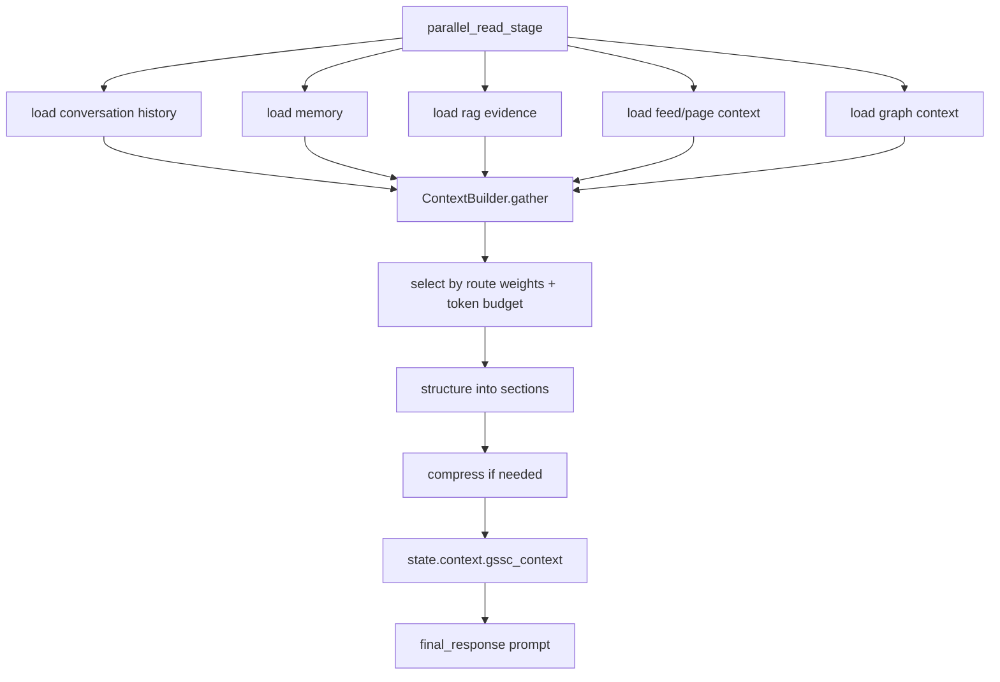
```mermaid
flowchart TD
    A["parallel_read_stage"] --> B["load conversation history"]
    A --> C["load memory"]
    A --> D["load rag evidence"]
    A --> E["load feed/page context"]
    A --> F["load graph context"]
    B --> G["ContextBuilder.gather"]
    C --> G
    D --> G
    E --> G
    F --> G
    G --> H["select by route weights + token budget"]
    H --> I["structure into sections"]
    I --> J["compress if needed"]
    J --> K["state.context.gssc_context"]
    K --> L["final_response prompt"]
```

### 9.4.B.3 route-aware 权重怎么理解

不同任务需要不同上下文。

比如：

| route | 更重要的上下文 |
|---|---|
| chat | conversation_history、memory、profile |
| rag | evidence、task、conversation_history |
| research | feed_card、evidence、checkpoint_summary |
| tool | task、conversation_history、evidence |
| skill | memory、conversation_history、dynamic_preferences |

这就是 `_ROUTE_WEIGHTS` 的作用。  
它让 GSSC 在 token budget 不够时知道优先保留什么。

面试说法：

> GSSC 不是简单拼 prompt。它会根据 route 给不同 source 分配权重，比如 rag 任务优先保留 evidence，chat 任务优先保留 conversation history 和 memory，tool 任务优先保留 task 和 tool state。然后在 token budget 内选择最相关的上下文。

### 9.4.B.4 Structure 阶段怎么组织 prompt

GSSC 会把上下文组织成固定 section，例如：

```text
[Role & Policies]
[User Profile]
[Task]
[Conversation History]
[Relevant Memory]
[Evidence]
[Tool State]
[Output Contract]
[Checkpoint Summary]
[Dynamic Preferences]
[Graph Context]
```

这样 final_response 看到的不是一坨混乱文本，而是结构化上下文。

这对 LLM 很重要，因为模型更容易遵守：

1. 哪些是用户问题。
2. 哪些是历史对话。
3. 哪些是记忆。
4. 哪些是文档证据。
5. 哪些是输出约束。

### 9.4.B.5 GSSC 的真实边界

GSSC 是工程启发式，不是深度学习模型。  
你可以讲它是“route-aware context builder”，不要讲成“自研动态上下文学习算法”。

真实实现有：

| 能力 | 是否有 |
|---|---|
| 多源 gather | 有 |
| route-aware weights | 有 |
| token budget select | 有 |
| section structure | 有 |
| simple compression | 有 |
| selected/dropped debug | 有 |
| 学习型上下文优化 | 没有 |

面试时这样讲非常稳：

> 我这里的 GSSC 是工程化上下文管理，不是论文级 optimizer。它的价值是把上下文选择显式化、可调试化，能看到 selected_sources、dropped_sources 和 token_budget_used。

---

## 9.4.C Skill 复用层

### 9.4.C.1 Skill 复用想解决什么

很多 Agent 任务是重复的：

1. 用户经常让 Agent 做某类研究。
2. 经常需要同样的输出格式。
3. 经常使用同一组工具。
4. 经常对同一类 FeedCard 做分析。

如果每次都从零规划，成本高、行为不稳定。  
所以 Skill 的目标是：

> 把成功任务的 workflow 沉淀下来，后续相似任务命中后复用其 trigger、tool_plan、context_recipe 和 output_contract。

### 9.4.C.2 当前 Skill 的真实能力

当前项目中 Skill 是“复用雏形”，不是完整自动执行引擎。

已经实现：

| 能力 | 说明 |
|---|---|
| Skill 模型 | DB 中有 name、trigger_text、input_schema、context_recipe、tool_plan、output_schema、safety_level、status |
| 创建草稿 | `create_skill_draft_from_run()` |
| 评估可复用性 | `evaluate_reusability()` |
| 匹配已有 Skill | `match_skill()` |
| 命中后上下文注入 | `skill_matcher` 把 Skill block 拼入 GSSC |
| 使用统计 | `record_skill_usage()` |
| 重复 workflow 检测 | `detect_repeated_workflow()` |

还没有完整实现：

| 能力 | 状态 |
|---|---|
| 把 Skill 编译成可执行 LangGraph 子图 | 未发现 |
| 自动按 tool_plan 逐步执行 | 未完整实现 |
| Skill 版本演进和自动优化 | 只有统计雏形 |

### 9.4.C.3 Skill 草稿生成工作流

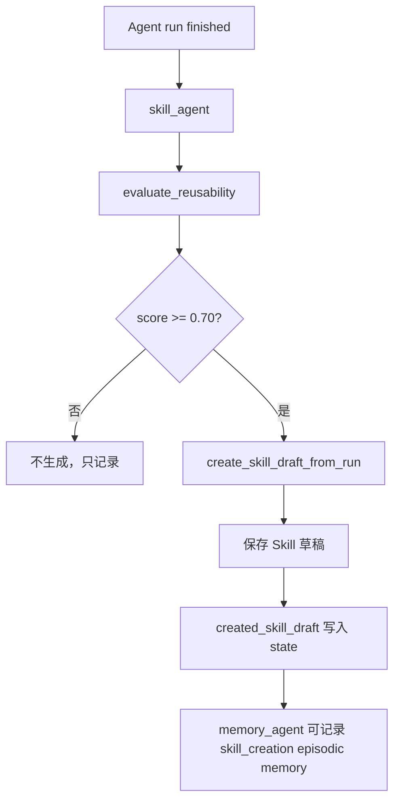
```mermaid
flowchart TD
    A["Agent run finished"] --> B["skill_agent"]
    B --> C["evaluate_reusability"]
    C --> D{"score >= 0.70?"}
    D -->|否| E["不生成，只记录"]
    D -->|是| F["create_skill_draft_from_run"]
    F --> G["保存 Skill 草稿"]
    G --> H["created_skill_draft 写入 state"]
    H --> I["memory_agent 可记录 skill_creation episodic memory"]
```

`evaluate_reusability()` 会看几个信号：

| 信号 | 说明 |
|---|---|
| repeatability | 用户是否表达“以后/下次/复用/流程”等 |
| workflow_structure | route 是否属于 research/rag/tool/artifact/skill |
| artifact_output | 是否产出了 artifact |
| tool_chain | 是否涉及工具链 |
| user_intent | 用户是否明确要保存成 skill |
| successful | run 是否成功 |

如果分数够高，就生成 Skill 草稿。

### 9.4.C.4 Skill 匹配工作流

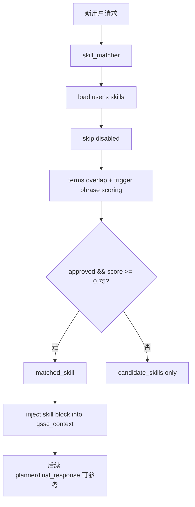
```mermaid
flowchart TD
    A["新用户请求"] --> B["skill_matcher"]
    B --> C["load user's skills"]
    C --> D["skip disabled"]
    D --> E["terms overlap + trigger phrase scoring"]
    E --> F{"approved && score >= 0.75?"}
    F -->|是| G["matched_skill"]
    F -->|否| H["candidate_skills only"]
    G --> I["inject skill block into gssc_context"]
    I --> J["后续 planner/final_response 可参考"]
```

命中 approved skill 后，会把这类信息注入上下文：

```text
Reusable Skill Applied:
- Skill Name
- Why matched
- Expected Inputs
- Execution Steps
- Output Contract
- Constraints
```

这意味着 Skill 当前更多是“上下文 contract”和“workflow memory”，而不是直接执行器。

### 9.4.C.5 面试怎么讲 Skill 才不翻车

不要说：

> 我实现了自动执行 Skill 的完整工作流引擎。

要说：

> 我实现了 Skill 复用的第一阶段：识别可复用 workflow、生成 Skill 草稿、匹配 approved Skill，并把它的 workflow steps、tool plan 和 output contract 注入上下文，指导后续 Agent 执行。下一步会把 approved Skill 编译成受 MCP 权限约束的可执行子图。

这个说法非常稳，因为它准确对应当前代码。

---

## 9.5 四大模块如何串成一个完整故事

面试时不要把四个模块散着讲。你要讲成一个完整 Agent 平台故事：

> 我做的是一个工程化 Agent Runtime。用户请求进来后，LangGraph Runtime 先做权限、意图和规划，生成 RoutePlan。然后 parallel_read_stage 通过 GSSC 准备上下文，包括 Memory、Conversation History、RAG evidence、FeedCard 和 Skill。  
> 
> 如果任务需要查文档，就走 RAG：文档摄入阶段用了 Parent-Child Chunking，检索阶段用了 Qdrant dense+sparse hybrid 和 RRF，命中 child 后再回查 parent context。  
> 
> 如果任务需要工具，就走 MCP Tool Governance：工具统一 registry，执行前做参数校验、L0-L4 风险分级，L3 进入审批中断，L4 直接阻断，所有 ToolCall 和 Approval 落库审计。  
> 
> 如果任务产生了有价值的用户偏好或项目事实，就走 Memory：抽取、过滤、去重、固化，并在后续任务通过 GSSC 按需注入。  
> 
> 如果一次任务体现出可重复 workflow，就走 Skill：生成草稿，后续匹配 approved Skill 后注入上下文。最后 evaluator 做约束检查，final_response 基于结构化上下文生成最终答案。

这段就是你的总讲法。

---

## 9.6 你可以背下来的 4 段模块讲法

### LangGraph Runtime 30 秒版

> 我用 LangGraph StateGraph 做 Agent Runtime，把一次请求拆成权限检查、意图识别、规划、并行上下文读取、supervisor dispatch、RAG/tool/memory/skill agent、evaluator 和 final_response。节点共享 AgentRuntimeState，每个节点只写自己的结果。路由不是一个黑盒 router，而是 planner 生成 RoutePlan，supervisor 观察状态，dispatcher 返回下一个节点。这样整个 Agent 执行过程可观测、可中断，也能支持审批恢复。

### MCP Governance 30 秒版

> 工具调用统一走 MCP ToolExecutor。每个工具先注册成 MCPToolSpec，带 schema、风险等级和 approval_required。执行前校验参数，再交给 PermissionGuard 判断 L0-L4。L3 工具不执行，创建 Approval 并让 graph 进入 waiting_approval；L4 高危工具直接 blocked。审批通过后才 execute_approved_tool。ToolCall、Approval、AgentEvent 都落库，能完整审计。

### RAG 30 秒版

> RAG 摄入阶段我做了 Parent-Child Chunking，只把 child chunk 写 Qdrant，parent/overview 存 PostgreSQL。检索时 child 负责召回，命中后回查 parent_context。向量库升级成 Qdrant hybrid，同时写 dense 和 sparse；查询时两路 prefetch，用 Qdrant Fusion.RRF 融合。最后用 synthetic eval runner 比较 python_bm25 和 qdrant_hybrid，记录 hit@5 从 0.54 到 0.92。

### Memory/GSSC/Skill 30 秒版

> Memory 分 working、episodic、semantic 三层。写入时 LLM 抽取，失败 fallback regex，然后按 confidence/importance 过滤、相似度去重、证据累积和固化。读取时不是全量塞 prompt，而是 GSSC 根据 route、answer_mode、token budget 选择 Memory、RAG evidence、Conversation History 等上下文。Skill 是复用层，会从成功 run 生成草稿，后续匹配 approved Skill 后把 workflow steps、tool_plan、output_contract 注入上下文。

---

## 9.7 如果面试官深挖，你要主动承认的边界

能讲清楚边界，反而更像真实做过。

| 模块 | 主动承认边界 | 你再补一句 |
|---|---|---|
| Runtime | 没有独立 router node | 路由拆成 planner/supervisor/dispatcher |
| Checkpoint | 默认关闭，不是生产级 crash recovery | 业务审批恢复靠 DB 状态，RedisSaver 是预留生产方案 |
| MCP | 不是完整 JSON Schema validator | 当前覆盖内置工具 required/format，外部 MCP 会升级 jsonschema |
| RAG | 0.54→0.92 是 synthetic eval | 价值是可复现和防回归，不是线上 A/B |
| RRF | 只在 Qdrant native hybrid | Python fallback 是 weighted merge/rerank |
| Memory | store 类薄，主逻辑在 service | MemoryService/Repository/QdrantMemoryStore 是核心 |
| Skill | 不是自动执行引擎 | 当前是 workflow 识别、草稿、匹配和上下文注入 |

面试里最有杀伤力的不是“我全做完了”，而是：

> 我知道这个系统哪些已经工程闭环，哪些只是第一版能力，下一步怎么补生产级验证。

这句话会让你的项目听起来非常真实。

---

## 9.8 最终给你的理解地图

你可以按下面这张图在脑子里记：

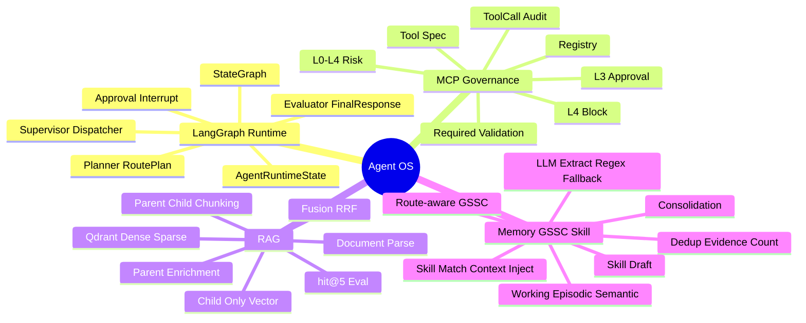
```mermaid
mindmap
  root((Agent OS))
    LangGraph Runtime
      StateGraph
      AgentRuntimeState
      Planner RoutePlan
      Supervisor Dispatcher
      Evaluator FinalResponse
      Approval Interrupt
    MCP Governance
      Registry
      Tool Spec
      Required Validation
      L0-L4 Risk
      L3 Approval
      L4 Block
      ToolCall Audit
    RAG
      Document Parse
      Parent Child Chunking
      Child Only Vector
      Qdrant Dense Sparse
      Fusion RRF
      Parent Enrichment
      hit@5 Eval
    Memory GSSC Skill
      Working Episodic Semantic
      LLM Extract Regex Fallback
      Dedup Evidence Count
      Consolidation
      Route-aware GSSC
      Skill Draft
      Skill Match Context Inject
```

你真正要理解的是这条主线：

> LangGraph 管执行流程，MCP 管工具安全，RAG 管知识检索，Memory/GSSC/Skill 管上下文和复用。

这就是你这个项目最完整、最可信、也最能讲清楚的架构故事。

---

# 10. 四大模块超详细扩展版：从“我做了什么”讲到“我为什么这么做”

这一章继续往深里讲。前面已经把四个模块的主干讲清楚了，但面试时真正难的不是背名词，而是当面试官连续追问时，你能不能把“一个请求进来以后，每一层发生了什么”讲到足够具体。

你要把自己训练成这样一种表达方式：

> 我先说业务问题，再说我拆的工程模块，再说请求流，再说关键数据结构，再说安全/失败/观测怎么处理，最后说当前边界和下一步优化。

这个表达顺序非常重要。因为面试官不是只想听“我用了 LangGraph、用了 Qdrant、用了 MCP”，他想判断你是不是知道为什么用、怎么串起来、哪里有坑。

下面四个模块我都会按这个顺序讲：

1. **业务问题**
2. **我的设计目标**
3. **核心数据结构**
4. **完整工作流**
5. **关键代码落点**
6. **失败路径**
7. **观测与调试**
8. **面试讲法**
9. **容易被追问的点**

---

## 10.1 LangGraph Runtime 超详细讲解

### 10.1.1 你到底做了什么

你做的不是“把 LangGraph 接进项目”这么简单。更准确的说法是：

> 我为 Web App 上层实现了一个 Agent Runtime，把一次用户请求拆成多个可观测、可中断、可恢复的执行节点，并且让 planner、context builder、RAG、tool、memory、skill、evaluator、final response 这些能力通过统一的 state 串起来。

这里有几个关键词：

| 关键词 | 真实含义 |
|---|---|
| 可观测 | 每个节点执行后有 node_results、events、steps、status trace |
| 可中断 | L3 工具审批时 graph 会停在 waiting_approval |
| 可恢复 | 审批后用 DB 中的 pending state 和 tool_call 继续 |
| 可扩展 | 新增节点时注册到 graph registry，再让 planner route 到它 |
| 可治理 | 工具、记忆、RAG、最终回复都有边界，不混在一个大函数里 |

### 10.1.2 为什么不能只用一个普通 async 函数

如果用普通函数写，可能会变成这样：

```python
async def handle_user_message(user_input):
    intent = detect_intent(user_input)
    if intent == "rag":
        docs = search_docs(user_input)
        answer = call_llm(docs)
    elif intent == "tool":
        tool = select_tool(user_input)
        result = call_tool(tool)
        answer = call_llm(result)
    elif intent == "memory":
        save_memory(user_input)
        answer = "已记住"
    return answer
```

这个写法看起来简单，但问题很多：

1. 工具审批怎么暂停？
2. 暂停以后怎么恢复？
3. RAG 失败了 final_response 怎么知道不要声称有证据？
4. Memory 写入失败了怎么提醒 evaluator？
5. 每个阶段耗时怎么记录？
6. 如果后面新增 skill_agent、artifact_agent，主函数会越来越长。

所以你用 StateGraph。StateGraph 的价值不是炫技，而是把执行过程拆成稳定节点。

### 10.1.3 AgentRuntimeState 是整套系统的“总线”

你可以把 `AgentRuntimeState` 理解成一辆车上的总线。每个节点都往总线上读写自己关心的信号。

#### 请求刚进入时的 state

一开始大概只有这些：

```python
{
    "user_id": 1,
    "run_id": 123,
    "thread_id": "user:1:conversation:abc",
    "conversation_id": "abc",
    "user_input": "帮我总结当前上传文档",
    "mode": "react",
    "page_context": {...}
}
```

#### planner 执行后的 state

planner 会补上：

```python
{
    "route": "rag",
    "answer_mode": "rag_qa",
    "route_plan": {
        "intent": "document_qa",
        "route": ["rag_agent", "evaluator", "final_response"],
        "risk_level": "L1",
        "needs_approval": False,
        "answer_mode": "rag_qa"
    }
}
```

#### parallel_read_stage 执行后的 state

上下文节点会补上：

```python
{
    "context": {
        "gssc_context": "... structured context ...",
        "gssc_debug": {
            "selected_sources": ["task", "evidence", "conversation_history"],
            "dropped_sources": ["feed_card"],
            "token_budget_used": 1280
        },
        "memory_items": [...],
        "rag_evidence": [...],
        "conversation_history": "..."
    },
    "memory_context": {
        "loader": "memory_context_loader",
        "read_only": True,
        "items": [...]
    }
}
```

#### rag_agent 执行后的 state

```python
{
    "rag_result": {
        "answer": "...",
        "evidence": [...],
        "retrieval_source": "qdrant_hybrid"
    },
    "agent_outputs": [...],
    "node_results": [
        {"node": "rag_agent", "status": "ok", "updates": {...}}
    ],
    "completed_nodes": ["permission_guard", "planner", "parallel_read_stage", "rag_agent"]
}
```

#### tool_agent 等待审批时的 state

如果用户请求 L3 工具，比如写文件，会变成：

```python
{
    "status": "waiting_approval",
    "approval_required": True,
    "pending_approval_id": 88,
    "pending_tool_name": "local_file.write",
    "pending_tool_args": {"path": "...", "content": "..."},
    "pending_tool_call_id": 456,
    "resume_token": "approval:88"
}
```

这个例子很重要，因为它说明你的 runtime 不是一次性跑到底，而是能被工具审批打断。

### 10.1.4 节点分组的设计思路

你可以把节点分成四类：

#### 第一类：Setup 节点

| 节点 | 做什么 |
|---|---|
| `permission_guard` | runtime 入口安全检查 |
| `home_intent_react` | 判断用户请求的大方向 |
| `planner` | 生成 RoutePlan |

这类节点负责“决定做什么”。

#### 第二类：Read 节点

| 节点 | 做什么 |
|---|---|
| `parallel_prefetch` | 并行预取 memory、skill、graph、rag 相关材料 |
| `parallel_read_stage` | 构建 GSSC context |
| `supervisor_observer` | 观察上下文和 route plan，准备调度 |

这类节点负责“准备材料”。

#### 第三类：Agent 节点

| 节点 | 做什么 |
|---|---|
| `research_agent` | 深度研究 |
| `rag_agent` | 文档问答 |
| `artifact_agent` | 生成 artifact |
| `tool_agent` | MCP 工具调用 |
| `memory_agent` | 记忆抽取和写入 |
| `skill_agent` | 可复用 workflow 检测和 Skill 草稿 |

这类节点负责“执行具体任务”。

#### 第四类：Eval/Final 节点

| 节点 | 做什么 |
|---|---|
| `evaluator` | 检查结果一致性和风险 |
| `final_response` | 生成最终用户回复 |

这类节点负责“收口”。

### 10.1.5 RoutePlan 是什么

RoutePlan 是 planner 给后续节点的执行计划。它不是自然语言，而是结构化决策。

你可以把它讲成：

> RoutePlan 是 planner 输出的执行合同。它告诉 runtime：这次是什么 intent、要走哪些节点、风险等级是什么、是否需要审批、最终回答模式是什么。

示例一：普通 RAG 问答

```python
{
    "intent": "document_qa",
    "route": ["rag_agent", "evaluator", "final_response"],
    "risk_level": "L1",
    "needs_approval": False,
    "answer_mode": "rag_qa"
}
```

示例二：工具写文件

```python
{
    "intent": "tool.local_file_write",
    "route": ["tool_agent", "evaluator", "final_response"],
    "risk_level": "L3",
    "needs_approval": True,
    "answer_mode": "tool_action"
}
```

示例三：用户要求记忆

```python
{
    "intent": "memory.write",
    "route": ["memory_agent", "evaluator", "final_response"],
    "risk_level": "L1",
    "needs_approval": False,
    "answer_mode": "memory_confirm"
}
```

### 10.1.6 dispatcher 怎么工作

dispatcher 不是 LLM，它是确定性的。它看：

1. 当前 status 是否 waiting_approval。
2. route_plan 里有哪些节点。
3. completed_nodes 里哪些已经完成。
4. 是否有 supervisor/replanner 给出的 next node。

如果 waiting_approval：

```text
return END
```

否则：

```text
for node in route_plan.route:
    if node not in completed_nodes:
        return node
return final_response
```

这就是为什么它稳定。LLM 做规划，但真正跳边是代码控制的。

### 10.1.7 evaluator 的价值

很多人做 Agent 会忽略 evaluator，直接把 agent 输出喂给 final response。你这个项目里 evaluator 的价值是“最终回答前的合同检查”。

典型检查：

| 场景 | evaluator/最终约束 |
|---|---|
| RAG 没 evidence | 不要声称“根据文档” |
| 工具 waiting_approval | 不要声称工具已执行 |
| Memory 写失败 | 不要说“已记住” |
| research 是 fallback | 告知检索/研究限制 |
| final answer 里出现内部 JSON | 清理成自然语言 |

面试可以讲：

> evaluator 是我给 Agent 加的一层结果约束。因为 Agent 很容易把中间状态说成最终事实，比如工具还没审批却说已执行。evaluator 会根据 node result 和 state 生成 warnings/constraints，final_response 必须遵守。

### 10.1.8 Runtime 模块长版面试讲法

> 这个项目里我做的第一块是 Agent Runtime。我没有把所有能力写在一个大的 chat handler 里，而是用 LangGraph StateGraph 把执行过程拆成多个节点。  
> 
> 用户请求进来后，service 层先创建 AgentRun，保存 run_id、thread_id、conversation_id。然后 runtime 从 permission_guard 开始，做意图识别和 planner。planner 输出 RoutePlan，里面有 intent、route、risk_level、needs_approval 和 answer_mode。  
> 
> 接下来 parallel_prefetch 和 parallel_read_stage 会准备上下文，比如 conversation history、memory、rag evidence、feed card 和 skill candidates，并通过 GSSC 组装成结构化上下文。然后 supervisor_observer 和 dispatcher 根据 route_plan 和 completed_nodes 选择下一个 agent 节点。  
> 
> 如果是文档问答，就走 rag_agent；如果是工具动作，就走 tool_agent；如果是记忆相关，就走 memory_agent；如果任务有复用价值，就走 skill_agent。每个节点都会把自己的结果写回 AgentRuntimeState，包括 node_results、agent_outputs、completed_nodes 和 errors。最后 evaluator 做一致性检查，final_response 基于 GSSC context 和各 agent result 输出用户可读答案。  
> 
> 这套设计的核心价值是把 Agent 执行过程显式化。每个阶段可观测、可测试，也能处理工具审批这样的中断场景。

---

## 10.2 MCP Tool Governance 超详细讲解

### 10.2.1 你到底做了什么

你做的是一个“工具安全网关”。  
不要把它讲成“我写了几个工具”。你真正做的是：

> 所有工具调用必须经过统一治理层，先查工具注册信息，再校验输入，再判断风险等级，再决定自动执行、等待审批或直接阻断，最后落库审计。

这就像后端系统里的 API Gateway，只不过它面对的调用方是 Agent/LLM。

### 10.2.2 MCP ToolSpec 是工具治理的基础

每个工具都不只是一个函数，而是一份 spec。

你可以这样理解：

```python
{
    "name": "local_file.write",
    "description": "Write a local file",
    "category": "local_file",
    "input_schema": {
        "type": "object",
        "required": ["path", "content"],
        "properties": {
            "path": {"type": "string"},
            "content": {"type": "string"}
        }
    },
    "output_schema": {...},
    "safety_level": "L3_EXTERNAL_WRITE",
    "requires_approval": True,
    "enabled": True
}
```

这个 spec 带来的好处：

1. 工具列表可枚举。
2. 工具风险可配置。
3. 工具参数可校验。
4. 工具是否启用可控制。
5. 工具调用可审计。

### 10.2.3 工具调用前为什么要 normalize

LLM 可能会输出不同名字：

```text
write_file
local_file.write
file.write
```

registry 里有 alias/normalize 逻辑，把不同叫法映射到统一工具名。  
这样可以降低模型输出名字不稳定带来的失败率。

面试可以讲：

> 我没有完全相信模型输出的 tool name，而是通过 registry 做 normalize 和 alias mapping。这样模型输出接近的工具名时，系统仍然能映射到标准 MCP tool。

### 10.2.4 参数校验的真实边界

当前参数校验做了：

1. required 字段检查。
2. 空值检查。
3. 一些格式校验，比如 email。
4. 输出 cleaned args。
5. 如果缺字段，tool_agent 会要求用户补充，而不是直接执行。

如果用户说：

```text
帮我发封邮件
```

但没有收件人、主题、正文，系统应该返回：

```text
需要补充 recipient、subject、body
```

而不是让模型瞎编一个邮箱。

这也是 Agent 工具调用很重要的工程点：  
**缺参数时要问用户，不要编参数。**

### 10.2.5 风险等级如何影响执行路径

你可以把 L0-L4 讲成“执行策略矩阵”：

| 风险 | 是否自动执行 | 是否审批 | 是否阻断 | 解释 |
|---|---:|---:|---:|---|
| L0 | 是 | 否 | 否 | 纯只读 |
| L1 | 通常是 | 否 | 否 | 草稿/低风险 |
| L2 | 视工具而定 | 可能 | 否 | 本地低风险副作用 |
| L3 | 否 | 是 | 否 | 外部写入/用户确认 |
| L4 | 否 | 否 | 是 | 高危动作 |

重点是 L3 和 L4：

```text
L3 = 可以做，但必须用户确认
L4 = 当前系统策略下不允许 Agent 做
```

这句话非常好用。

### 10.2.6 ToolCall 状态机

工具调用可以有这些状态：

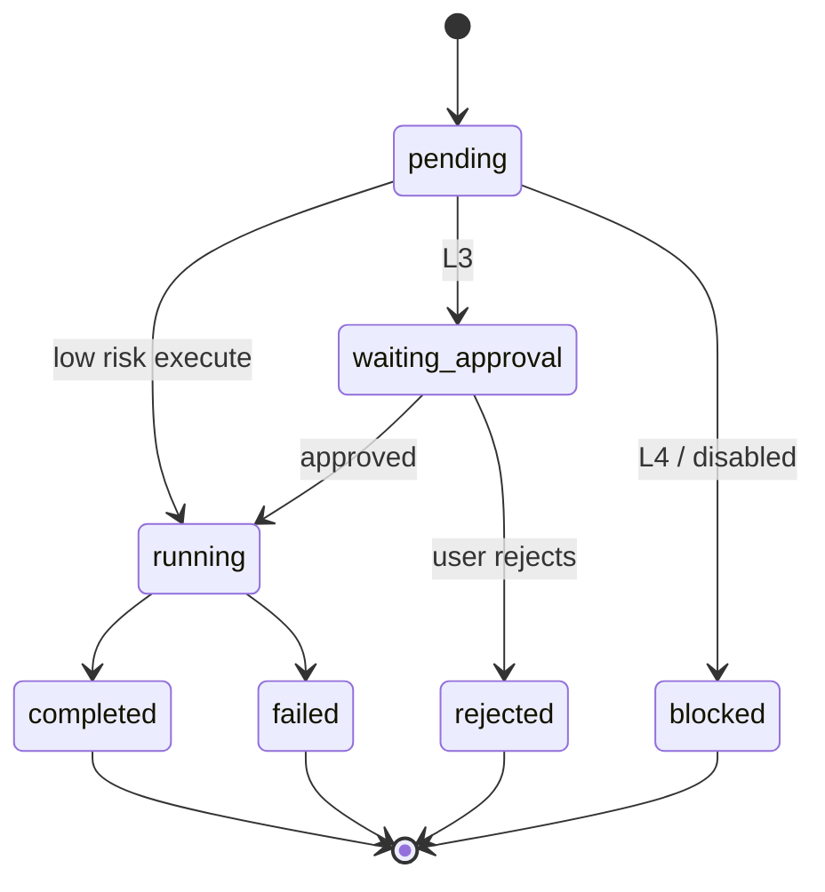
```mermaid
stateDiagram-v2
    [*] --> pending
    pending --> running: low risk execute
    pending --> waiting_approval: L3
    pending --> blocked: L4 / disabled
    waiting_approval --> running: approved
    waiting_approval --> rejected: user rejects
    running --> completed
    running --> failed
    blocked --> [*]
    rejected --> [*]
    completed --> [*]
    failed --> [*]
```

这张状态机你可以在脑子里记住。面试官问“审批怎么保证状态一致”，你就按这个讲。

### 10.2.7 审批 payload 里应该有什么

一个好的审批不是只弹“是否同意”。它应该告诉用户：

1. 要执行哪个工具。
2. 工具风险等级是什么。
3. 将要使用什么参数。
4. 可能产生什么副作用。
5. 审批后怎么恢复。

你项目里的审批记录 payload 会包含 tool_name、input、permission_level、preview/safety notes 等信息。这样前端可以展示审批卡片。

### 10.2.8 为什么审批后不能重新问 LLM

这是非常重要的安全点。

错误做法：

```text
用户批准后 -> 再让 LLM 重新生成工具参数 -> 执行
```

问题是：用户批准的是旧参数，但执行的是新参数，安全上不一致。

正确做法：

```text
审批前保存 ToolCall(input)
用户批准的是这个 ToolCall
审批后 execute_approved_tool(tool_call_id)
执行保存过的 input
```

你项目就是这个思路。

面试可以讲：

> 审批批准的是一个具体 ToolCall，而不是一个抽象意图。批准后执行保存过的 tool_call_id，避免模型二次生成参数导致审批内容和执行内容不一致。

### 10.2.9 MCP 模块长版面试讲法

> 第二块是 MCP 工具治理。因为 Agent 一旦能调用工具，就必须有安全边界。我把工具调用统一收敛到 MCPService 和 ToolExecutor。  
> 
> 每个工具先在 registry 里声明成 MCPToolSpec，包括 input_schema、output_schema、safety_level、requires_approval、enabled 等。调用前先 normalize tool name，再根据 spec 做 required 字段校验。如果缺参数，tool_agent 会让用户补充，不会让模型编参数。  
> 
> 参数通过后进入 PermissionGuard。L0/L1/L2 可以自动执行或低风险执行；L3，比如写本地文件、发邮件，会创建 Approval，把 ToolCall 状态置为 waiting_approval，并让 LangGraph runtime 中断；L4，比如删除或高危命令，直接 blocked，不进入审批。  
> 
> 审批通过后，不是重新让模型生成参数，而是执行之前保存的 tool_call_id，这样用户批准的内容和实际执行的内容一致。所有 ToolCall、Approval、AgentEvent 都会落库，所以事后能审计整个工具调用生命周期。

### 10.2.10 MCP 常见追问

**问：如果用户明确要求删除文件，为什么还要阻断？**

答：

> 因为我把 L4 定义成当前系统不允许 Agent 自动执行的高危能力。用户确认可以降低误操作风险，但不能解决所有破坏性风险。当前阶段我宁愿保守阻断，后续可以针对特定目录、回收站机制、二次确认再开放有限删除。

**问：审批会不会影响用户体验？**

答：

> 只对 L3/L4 级别动作影响。普通只读检索、草稿生成不需要审批。这个分级的目的就是避免所有工具都弹审批，同时保证外部写入和高危动作受控。

**问：工具调用失败怎么办？**

答：

> ToolExecutor 会把 ToolCall 标成 failed，并把 error_message 写入记录。state 里也会 append error，evaluator/final_response 会基于这个状态告诉用户失败，而不是假装成功。

---

## 10.3 RAG 检索系统超详细讲解

### 10.3.1 你到底做了什么

你做的是一套“可评估的文档检索链路”，不是简单向量搜索。

它包括：

1. 文档解析。
2. 结构化 chunking。
3. child-only vector upsert。
4. Qdrant dense + sparse hybrid。
5. native RRF fusion。
6. parent context enrichment。
7. rerank。
8. hit@k eval runner。

把这几个词串起来，就是你的 RAG 故事。

### 10.3.2 为什么 RAG 的关键不是“用了向量数据库”

很多项目会说“我用了向量数据库做 RAG”，但这不够。  
真正决定效果的是：

| 环节 | 决定什么 |
|---|---|
| 文档解析 | 原始文本质量 |
| chunking | 检索粒度 |
| metadata | 过滤和引用能力 |
| embedding | 语义召回 |
| sparse | 关键词召回 |
| fusion | 多路召回怎么合并 |
| rerank | top-k 顺序 |
| eval | 优化有没有证据 |

你的项目覆盖了这些关键点，所以可以讲得比“我用了 Qdrant”更高级。

### 10.3.3 Ingestion 的每一步再展开

#### 第一步：parse_document

解析文档时，系统要尽量保留结构信息：

1. 文件名。
2. 文件类型。
3. 标题层级。
4. 页码。
5. sheet 名。
6. 表格 header。
7. 原始文本。

这些 metadata 后面会进入 chunk metadata。

#### 第二步：build_structured_chunks

它会生成：

```python
{
    "overview_chunk": {...},
    "parent_chunks": [...],
    "vector_chunks": [...],  # child chunks
    "all_chunks": [...]
}
```

其中 child metadata 大概包含：

```python
{
    "chunk_role": "child",
    "chunk_id": "p-0001-c-001",
    "parent_id": "p-0001",
    "chunk_type": "section",
    "heading_path": ["Chapter", "Section"],
    "page_number": 3,
    "content_hash": "..."
}
```

parent metadata 大概包含：

```python
{
    "chunk_role": "parent",
    "chunk_id": "p-0001",
    "heading_path": ["Chapter"],
}
```

#### 第三步：embedding child chunks

只有 `vector_chunks` 会 embedding。  
这就是 child-only vector upsert。

#### 第四步：Qdrant upsert

Qdrant point payload 会包含：

| payload | 用途 |
|---|---|
| `user_id` | 用户隔离 |
| `document_id` | 文档过滤 |
| `chunk_id` | chunk 标识 |
| `chunk_role` | 确认是 child |
| `parent_id` | 回查 parent |
| `filename` | 引用展示 |
| `heading_path` | 章节引用 |
| `content` | 检索结果 preview |

#### 第五步：PostgreSQL 保存 all chunks

所有 overview/parent/child 都保存到 PostgreSQL。  
Qdrant 负责召回，PostgreSQL 负责权威 chunk 记录和 parent 回查。

### 10.3.4 Query 的每一步再展开

用户问问题后，RAG 检索流程大概是：

```text
query
  -> 判断 backend
  -> 如果 qdrant_hybrid:
       dense embedding(query)
       sparse encode(query)
       Qdrant dense prefetch
       Qdrant sparse prefetch
       Fusion.RRF
       top-k child hits
  -> enrich parent_context
  -> rerank_results
  -> return evidence
```

如果 qdrant_hybrid 失败：

```text
fallback to python_bm25_hybrid
  -> vector search
  -> local BM25 over child candidates
  -> merge hits
  -> rerank
  -> parent enrichment
```

### 10.3.5 为什么要 sparse encoder

dense embedding 擅长语义，例如：

```text
query: 这份合同的付款条款是什么？
content: Payment Terms: ...
```

但对这些内容不一定稳：

```text
HT-2026-001
contract-eval@example.com
XR-9000-Pro
¥128,000
qdrant_hybrid
```

这些是精确 token。Sparse vector/BM25 更擅长。

所以 hybrid 的本质是：

```text
dense = 语义理解
sparse = 关键词/编号/术语精确匹配
```

### 10.3.6 reranker 在这里做什么

RRF 已经融合了 dense/sparse，但项目里还有 rerank。  
rerank 的作用是结合业务启发式，比如：

1. query 是 exact/table/summary/general 哪种类型。
2. 是否命中关键词。
3. 是否来自 hybrid。
4. 是否是用户指定文档。
5. 是否 parent_context 可用。
6. 是否 filename 匹配。

你可以讲：

> Qdrant RRF 解决多路召回融合，reranker 解决业务侧排序，比如精确问合同号时提高关键词命中权重，摘要问题时提高 overview/summary 相关内容权重。

### 10.3.7 Eval runner 为什么重要

RAG 优化如果没有 eval，很容易变成“我感觉效果变好了”。  
你的 eval runner 做了几件正确的事：

1. 使用固定 fixture 文档。
2. 每次重新 ingest。
3. 校验 ingestion 是否符合 Parent-Child 约束。
4. 同一批 query 对比不同 backend。
5. 输出 Markdown 适合人看。
6. 输出 JSONL 适合复盘每个 query。
7. 有 hit@1/hit@3/hit@5 指标。

这说明你有工程闭环：

```text
改检索逻辑 -> 跑 eval -> 看 hit@k/latency/fallback -> 决定是否作为默认 backend
```

### 10.3.8 RAG 模块长版面试讲法

> RAG 模块我主要做了两件事：一是改 chunking，二是改检索融合，并且补了评估。  
> 
> chunking 上，我没有把文档直接等长切片，而是做 Parent-Child。解析文档后生成 overview、parent、child 三类 chunk。只有 child chunk 会 embedding 并写入 Qdrant，因为 child 粒度小，召回更准；parent 和 overview 保存在 PostgreSQL。检索命中 child 后，再根据 parent_id 回查 parent_context，给最终回答补充完整上下文。  
> 
> 检索上，我把 Qdrant 从 dense-only 升级成 dense+sparse hybrid collection。写入时 child 同时有 dense embedding 和 sparse vector；查询时 query 也同时生成 dense 和 sparse，两路在 Qdrant prefetch，然后用 Fusion.RRF 做融合。这样能同时覆盖语义问题和合同编号、邮箱、中文关键词这类 lexical query。  
> 
> 同时我保留了 Python BM25 fallback。如果 Qdrant hybrid 不可用，就降级到 vector + local BM25 + weighted rerank。最后我写了 synthetic eval runner，固定文档和 query，比较 python_bm25 与 qdrant_hybrid，输出 hit@1、hit@3、hit@5 和 JSONL 明细。历史报告里 qdrant_hybrid 的 hit@5 达到 0.92，baseline 是 0.54。

### 10.3.9 RAG 常见追问

**问：为什么只 child 入向量库？**

答：

> 因为向量召回需要小粒度、信息密度高的文本。parent 太长，embedding 会稀释关键信息；overview 太概括，容易污染召回。child-only vector upsert 能保持召回精度，parent 通过 parent_id 在命中后补上下文。

**问：怎么保证 parent 和 child 不错位？**

答：

> child metadata 里有 parent_id，parent chunk 在 PostgreSQL 中有对应 chunk_id。检索返回 child 后，用 document_id + parent_id 回查 parent。eval runner 里也检查 child 必须有 parent_id，非 child 不应该有 qdrant_point_id。

**问：如果 hybrid collection schema 不对怎么办？**

答：

> vector_store 里有 hybrid capability 检查，qdrant_hybrid 失败后 retriever 可以 fallback 到 python_bm25_hybrid，并记录 retrieval_warning/fallback_count。这样不会因为 hybrid 不可用导致整个 RAG 崩掉。

---

## 10.4 Memory / GSSC / Skill 超详细讲解

### 10.4.1 这个模块的本质

这个模块表面上有三个名字：Memory、GSSC、Skill。  
但本质只有一个问题：

> Agent 如何带着“合适的历史”和“合适的工作流经验”回答当前问题？

Memory 负责“历史事实”。  
GSSC 负责“当前该用哪些上下文”。  
Skill 负责“历史成功流程怎么复用”。

### 10.4.2 Memory 写入不是简单保存聊天记录

简单保存聊天记录的问题：

1. 太多。
2. 噪声大。
3. 无法区分短期和长期。
4. 无法判断哪些该注入。
5. 用户一句玩笑也可能被当真。

你的 MemoryService 做的是“结构化记忆”，不是聊天日志。

### 10.4.3 Memory extraction 的输入

抽取器会看：

| 输入 | 作用 |
|---|---|
| `user_input` | 用户明确表达的偏好/事实 |
| `agent_output` | Agent 完成了什么 |
| `page_context` | 当前页面 |
| `feed_card_context` | 当前卡片 |
| `matched_skill` | 是否命中 Skill |
| `created_skill_draft` | 是否生成 Skill 草稿 |

这说明 memory 不只来自用户说的话，也来自 Agent 执行事件。

例如：

```text
用户：以后都用中文回答我
-> semantic memory: 用户偏好中文回答

用户：对这个 FeedCard 做深度研究
-> episodic memory: 用户对某卡片启动深度研究

系统：生成了一个 Skill 草稿
-> episodic memory: Agent 创建了新的 Skill 草稿
```

### 10.4.4 LLM extractor 和 regex fallback 的分工

| 抽取方式 | 优点 | 缺点 |
|---|---|---|
| LLM extractor | 能理解复杂表达 | 可能失败、成本更高 |
| regex extractor | 稳定、便宜、可控 | 覆盖面有限 |

所以你的策略是：

```text
非 casual chat -> 先 LLM
LLM 失败 -> regex fallback
casual chat -> regex/低成本路径
```

这是一种工程上比较稳的设计。

### 10.4.5 Memory 保存阈值

抽取出来的 memory 不会全部保存。  
保存逻辑会看：

| 指标 | 含义 |
|---|---|
| confidence | 抽取器有多确定 |
| importance | 这条记忆有多重要 |
| stability | 是 session、medium_term 还是 long_term |
| category | 属于偏好、项目目标、技术栈、边界还是普通事件 |

低置信度、低重要度的会 filtered_out。

面试可以讲：

> 我给 Memory 写入加了质量门槛。LLM 抽取出的内容要过 confidence 和 importance 阈值，避免把临时闲聊或不确定推断写成长记忆。

### 10.4.6 Memory 搜索为什么要 PG + Qdrant

PostgreSQL 和 Qdrant 分工：

| 存储 | 作用 |
|---|---|
| PostgreSQL | 权威记录、过滤、状态、metadata、删除 |
| Qdrant | semantic/episodic 语义召回 |

为什么不能只用 Qdrant？

1. 删除/归档/状态管理不方便。
2. metadata 更新和审计不如 DB。
3. Qdrant 是检索索引，不适合作为唯一事实源。

为什么不能只用 PostgreSQL LIKE？

1. 语义召回弱。
2. 用户换一种说法就搜不到。

所以组合是合理的：

```text
PG authoritative store + Qdrant semantic index
```

### 10.4.7 GSSC 不是 prompt 拼接，而是上下文路由

你要把 GSSC 讲成一个“上下文路由器”。

它回答的问题是：

```text
当前任务需要哪些上下文？
哪些上下文优先级更高？
token 不够时丢哪些？
最终 prompt 应该怎么结构化？
```

例如：

#### 用户问文档问题

保留：

```text
Task
Evidence
Conversation History
Document Preference
Output Contract
```

弱化：

```text
Feed Card
Project Goal
Random old episodic memory
```

#### 用户问“我之前说过什么”

保留：

```text
Conversation History
Relevant Memory
```

弱化：

```text
RAG Evidence
Feed Card
Research Results
```

#### 用户要求工具动作

保留：

```text
Task
Tool State
Boundary Memory
Conversation History
```

弱化：

```text
Long project memories unless relevant
```

这就是动态上下文。

### 10.4.8 Skill 为什么属于上下文层

当前 Skill 还不是自动执行引擎，所以它真正发挥作用的位置是 GSSC。

命中 Skill 后，系统把这个 Skill 转成上下文 contract：

```text
Reusable Skill Applied:
- Skill Name
- Why matched
- Expected Inputs
- Execution Steps
- Output Contract
- Constraints
```

这会影响后续 planner/final_response。  
所以当前 Skill 更像“可复用工作流记忆”。

### 10.4.9 Memory/GSSC/Skill 长版面试讲法

> 这块我做的是 Agent 的上下文层。因为 Agent 不能每次都像第一次见用户，但也不能把所有历史都塞进 prompt，所以我拆成 Memory、GSSC 和 Skill 三部分。  
> 
> Memory 分 working、episodic、semantic。working 存当前页面和临时任务上下文，episodic 存历史任务事件，semantic 存长期偏好、项目目标、技术栈和边界约束。写入时优先用 LLM extractor 抽结构化 memory，失败 fallback regex；保存前按 confidence 和 importance 过滤；写入时做相似度去重，重复记忆更新 evidence_count、last_seen_at 和 importance；高价值 memory 会从 working 固化到 episodic，再从 episodic 固化到 semantic。PostgreSQL 是权威存储，semantic/episodic 额外写入 Qdrant 做语义召回。  
> 
> 读取时不是全量注入，而是通过 GSSC 做动态上下文选择。GSSC 分 Gather、Select、Structure、Compress。它会收集 task、conversation history、memory、RAG evidence、feed card、graph context 等，然后根据 route 权重、answer_mode 的 memory policy 和 token budget 选择上下文，最后结构化成 Role、Task、Memory、Evidence、Conversation 等 section。  
> 
> Skill 是复用层。一次成功 run 结束后，skill_agent 会根据用户意图、workflow 结构、artifact 输出、工具链和成功状态评估是否值得复用，分数够高就生成 Skill 草稿。后续请求中 skill_matcher 会匹配 approved Skill，命中后把 workflow steps、tool_plan 和 output_contract 注入 GSSC。当前它是复用雏形，还不是完整自动执行引擎。

### 10.4.10 Memory/GSSC/Skill 常见追问

**问：怎么避免记忆污染？**

答：

> 写入时用 confidence/importance 阈值过滤，读取时用 answer_mode 的 MEMORY_CONTEXT_POLICY 控制类别。比如 general_qa 不注入 project_goal/tech_stack，casual 只注入名字、语言、语气偏好。

**问：用户改变偏好怎么办？**

答：

> 当前有 dedup 和 evidence_count 机制，可以更新已有 memory 的 last_seen 和 importance。更完整的偏好冲突解决可以继续做 supersede 关系，比如新偏好覆盖旧偏好。

**问：Skill 和 Memory 有什么区别？**

答：

> Memory 记录事实和偏好，Skill 记录可复用流程。比如“用户偏好中文”是 memory；“对 FeedCard 做研究并生成报告的流程”是 skill。

**问：GSSC 和普通 prompt template 有什么区别？**

答：

> 普通 prompt template 是固定拼接，GSSC 是按 route、relevance、token budget 动态选择上下文，并输出 selected/dropped debug。它解决的是多源上下文治理问题。

---

# 11. 四个模块的“项目故事版”串讲

如果面试官让你“整体介绍一下这个项目”，你可以不要从技术名词开始，而是这样讲：

> 这个项目本质上是把 open deep research 二开成一个更完整的 Agent OS。我主要做了四块工程化能力。  
> 
> 第一块是 Runtime。我用 LangGraph StateGraph 把 Agent 的执行过程拆成节点，包括权限检查、意图识别、规划、上下文读取、RAG、工具调用、Memory、Skill、评估和最终回复。这样一次请求不是黑盒，而是能看到每个节点做了什么，也能在工具审批时中断。  
> 
> 第二块是工具治理。Agent 调工具不能直接让模型调用函数，所以我做了 MCP ToolExecutor。每个工具都有 spec、schema、risk level 和 approval_required。调用前做参数校验，L3 进入人工审批，L4 直接阻断，所有 ToolCall 和 Approval 落库审计。  
> 
> 第三块是 RAG。我把普通 chunking 改成 Parent-Child，只让 child 入 Qdrant，命中后回查 parent context。检索上做 Qdrant dense+sparse hybrid，并用 native RRF 融合。为了证明优化有效，我写了 synthetic eval runner，保留 hit@5 评估记录。  
> 
> 第四块是上下文和复用。我做了三层 Memory，支持抽取、去重、固化和语义召回；又做了 GSSC，根据 route 和 token budget 动态选择上下文；最后做了 Skill 复用雏形，把成功 workflow 生成草稿，后续匹配后注入上下文。  
> 
> 所以这个项目不是单点功能，而是围绕 Agent 平台的执行、安全、检索、记忆和复用做了一套工程闭环。

这就是你的高层项目故事。

---

# 12. 四大模块代码地图：面试官要看代码时怎么带

## 12.1 Runtime 代码地图

| 你要讲的点 | 带面试官看哪个文件 | 看什么 |
|---|---|---|
| StateGraph 构建 | `src/web_app/agent/runtime/graph_builder.py` | `StateGraph(AgentRuntimeState)`、add_node、conditional edges |
| 节点列表 | `src/web_app/agent/runtime/graph_registry.py` | runtime nodes 分类 |
| State 字段 | `src/web_app/agent/runtime/state.py` | route_plan、context、pending approval、node_results |
| Planner | `src/web_app/agent/runtime/planner.py` | RoutePlan、risk、answer_mode |
| Dispatcher | `src/web_app/agent/runtime/dispatch.py` | waiting_approval -> END，next node logic |
| Runtime run | `src/web_app/agent/runtime/graph.py` | graph.ainvoke、checkpointer、resume_from_approval |
| Context node | `src/web_app/agent/runtime/node_groups/read_nodes.py` | parallel_read_stage、context_builder |
| Agent nodes | `src/web_app/agent/runtime/node_groups/agent_nodes.py` | rag/tool/memory/skill agent |
| Final response | `src/web_app/agent/runtime/node_groups/eval_final_nodes.py` | GSSC prompt、constraints |

## 12.2 MCP 代码地图

| 你要讲的点 | 文件 | 看什么 |
|---|---|---|
| Tool spec schema | `src/web_app/mcp/schemas.py` | MCPToolSpec |
| Builtin tools | `src/web_app/mcp/registry.py` | BUILTIN_TOOLS、safety_level |
| Tool input validation | `src/web_app/mcp/tool_router.py` | validate_tool_input |
| Tool execution | `src/web_app/mcp/tool_executor.py` | call_tool、execute_approved_tool |
| Risk decision | `src/web_app/services/permission_service.py` | L3 approval、L4 blocked |
| Approval update | `src/web_app/services/approval_service.py` | update_approval_status |
| DB models | `src/web_app/models/orm.py` | ToolCall、Approval、AgentEvent |
| Tests | `src/web_app/tests/test_mcp_stage7.py` | waiting_approval、high_risk_denied |

## 12.3 RAG 代码地图

| 你要讲的点 | 文件 | 看什么 |
|---|---|---|
| Structured chunks | `src/web_app/rag/structured_chunker.py` | overview/parent/child |
| Ingestion | `src/web_app/services/document_service.py` | child-only embedding/upsert |
| Qdrant store | `src/web_app/rag/vector_store.py` | dense+sparse vectors、Fusion.RRF |
| Sparse encoder | `src/web_app/rag/sparse_encoder.py` | sparse vector generation |
| Retriever | `src/web_app/rag/retriever.py` | qdrant_hybrid、fallback、parent enrichment |
| Reranker | `src/web_app/rag/reranker.py` | query-aware scoring |
| Eval runner | `scripts/run_rag_hybrid_eval.py` | hit@1/3/5、reports |
| Eval reports | `uploads/artifacts/rag_eval/*.md` | 0.54 -> 0.92 |
| Tests | `src/web_app/tests/test_rag_stage3.py`、`test_rag_qdrant_hybrid.py` | parent-child/hybrid 覆盖 |

## 12.4 Memory/GSSC/Skill 代码地图

| 你要讲的点 | 文件 | 看什么 |
|---|---|---|
| Memory model | `src/web_app/models/orm.py` | Memory.memory_type |
| Memory service | `src/web_app/services/memory_service.py` | add_with_dedup、search、consolidate |
| Extractor | `src/web_app/memory/extractor.py` | LLM extractor、regex fallback |
| Qdrant memory | `src/web_app/memory/qdrant_memory_store.py` | semantic/episodic vector index |
| Context builder | `src/web_app/context/builder.py` | Gather/Select/Structure/Compress |
| Runtime context | `src/web_app/agent/runtime/node_groups/read_nodes.py` | memory policy、gssc_debug |
| Final GSSC prompt | `src/web_app/agent/runtime/node_groups/eval_final_nodes.py` | Structured GSSC Context |
| Skill service | `src/web_app/services/skill_service.py` | match、draft、usage stats |
| Skill model | `src/web_app/models/orm.py` | Skill fields |

---

# 13. 你最后要形成的“面试脑图”

你要能随时从任何一个点展开：

```text
Agent OS
├── Runtime
│   ├── StateGraph
│   ├── AgentRuntimeState
│   ├── Planner RoutePlan
│   ├── Dispatcher
│   ├── Approval Interrupt
│   └── Evaluator/Final
├── MCP
│   ├── ToolSpec
│   ├── Registry
│   ├── Required validation
│   ├── L0-L4
│   ├── L3 approval
│   ├── L4 block
│   └── ToolCall audit
├── RAG
│   ├── Parse
│   ├── Parent-Child
│   ├── Child-only vector
│   ├── Dense + Sparse
│   ├── Fusion.RRF
│   ├── Parent enrichment
│   └── hit@5 eval
└── Context
    ├── Memory
    │   ├── working
    │   ├── episodic
    │   ├── semantic
    │   ├── extract
    │   ├── dedup
    │   └── consolidate
    ├── GSSC
    │   ├── gather
    │   ├── select
    │   ├── structure
    │   └── compress
    └── Skill
        ├── evaluate reuse
        ├── create draft
        ├── match approved
        └── inject context
```

如果你能把这张脑图讲顺，这个项目就不是“背简历”，而是真能讲清楚。

---

# 14. Agent 开发高频面试 100 问

这一章是面试题库。它不是为了让你死背，而是训练你把 Agent 工程讲成体系。每道题都给出：

1. **面试官想考什么**
2. **推荐回答**
3. **如何结合你的项目讲**

你可以按模块复习：Agent 架构、LangGraph、Tool/MCP、安全审批、RAG、Memory、Context、Evaluation、工程化、系统设计。

---

## 14.1 Agent 基础与架构

### Q1：什么是 AI Agent？它和普通 Chatbot 有什么区别？

**面试官想考什么：**  
他想看你是否理解 Agent 的核心不是“会聊天”，而是“能感知上下文、做决策、调用工具、执行任务、观察结果并迭代”。

**推荐回答：**  
普通 Chatbot 主要是输入一段文本，输出一段文本。Agent 则更像一个任务执行系统，它会根据目标进行规划，读取上下文，选择工具，执行动作，观察结果，并在必要时调整计划。Agent 的关键组成通常包括 planning、memory、tools、environment feedback、reflection/evaluation 和 final response。

**结合你的项目：**  
你可以说：我的项目不是简单聊天接口，而是把请求拆到 LangGraph Runtime 里。用户请求经过 planner 生成 RoutePlan，再进入 RAG、tool、memory、skill 等节点，最后 evaluator 检查结果，final_response 输出。这就是从 Chatbot 到 Agent Runtime 的区别。

### Q2：一个工程化 Agent 系统通常包含哪些核心模块？

**面试官想考什么：**  
他想确认你有没有系统视角，而不是只知道 LangChain 或 prompt。

**推荐回答：**  
一个工程化 Agent 系统通常包括：入口 API、用户和会话状态、Planner、Router/Dispatcher、Context Builder、Tool Layer、RAG Layer、Memory Layer、Execution Runtime、Evaluation/Guardrail、Observability、Persistence 和权限治理。

**结合你的项目：**  
你的项目正好可以映射：AgentService 是入口，LangGraph 是 runtime，planner 生成 RoutePlan，dispatcher 做条件跳转，GSSC 是 Context Builder，MCP 是 Tool Layer，Qdrant Hybrid 是 RAG Layer，MemoryService 是 Memory Layer，AgentEvent/ToolCall/Approval 是观测和审计。

### Q3：Agent 的 planning 和 routing 有什么区别？

**面试官想考什么：**  
他想看你是否能区分“决定任务步骤”和“执行时选择下一个节点”。

**推荐回答：**  
Planning 是生成任务计划，例如要不要查文档、要不要调用工具、要不要写记忆。Routing 是在执行过程中根据状态选择下一步走哪个节点。Planning 更偏语义决策，Routing 更偏运行时控制。

**结合你的项目：**  
你可以说：我的 planner 输出 RoutePlan，包括 intent、route、risk_level、answer_mode；实际跳转由 supervisor_observer 和 dispatch_next_route_node 完成。严格说我没有单独 router node，而是 planner + dispatcher 的组合。

### Q4：为什么 Agent 系统需要状态管理？

**面试官想考什么：**  
他想看你是否知道 Agent 不是无状态函数调用。

**推荐回答：**  
Agent 需要跨步骤保存计划、上下文、工具结果、错误、审批状态、最终答案等。如果没有统一状态，节点之间会靠隐式变量传递，难以恢复、调试和审计。

**结合你的项目：**  
你可以讲 AgentRuntimeState。里面有 route_plan、context、rag_result、tool_result、pending_approval_id、completed_nodes、node_results 等。这个 state 是整个 LangGraph 执行的总线。

### Q5：什么是 ReAct？它有什么局限？

**面试官想考什么：**  
他想看你是否理解经典 Agent 模式和工程化限制。

**推荐回答：**  
ReAct 是 Reasoning + Acting，让模型在思考和工具调用之间循环。它适合简单工具调用，但在复杂业务里会有局限，比如状态不稳定、工具安全难治理、审批中断难处理、可观测性不足、流程不可控。

**结合你的项目：**  
你可以说：我没有只依赖 ReAct 循环，而是把关键流程拆到 LangGraph StateGraph 节点里。模型参与 planner 和 final_response，但工具审批、风险分级、节点跳转由代码控制。

### Q6：Agent 系统里哪些逻辑应该交给 LLM，哪些应该用确定性代码？

**面试官想考什么：**  
他想考你的工程边界感。

**推荐回答：**  
语义理解、开放式规划、自然语言生成适合 LLM；权限判断、风险分级、审批拦截、状态跳转、参数校验、数据持久化应该用确定性代码。Agent 工程的关键是不要把安全和一致性完全交给 LLM。

**结合你的项目：**  
planner 可以结合规则和 LLM 判断意图，但 MCP L3/L4、ToolCall 状态、approval interrupt、dispatcher 跳转都是代码控制。这是你项目的工程亮点。

### Q7：Agent 为什么容易不稳定？

**面试官想考什么：**  
他想看你是否踩过真实工程问题。

**推荐回答：**  
Agent 不稳定主要来自模型输出不确定、上下文污染、工具参数不完整、检索证据不足、状态跨步骤丢失、错误无法反馈给 planner、最终回答过度声称等。

**结合你的项目：**  
你可以讲你的解决方式：GSSC 控制上下文，MCP 校验参数和审批，RAG evaluator 防止无证据声称，AgentRuntimeState 保存跨节点状态，node_results/AgentEvent 做观测。

### Q8：如何设计一个多 Agent 系统？

**面试官想考什么：**  
他想知道你是否理解多 Agent 不是简单创建多个角色。

**推荐回答：**  
多 Agent 系统应该先定义任务边界，再定义共享状态、调度策略、结果协议和失败处理。每个 Agent 应该有明确职责，比如 RAG Agent 负责文档检索，Tool Agent 负责工具调用，Memory Agent 负责记忆写入。

**结合你的项目：**  
你的 agent_nodes 包含 research_agent、rag_agent、tool_agent、memory_agent、skill_agent、artifact_agent。它们通过 AgentRuntimeState 共享状态，由 planner route 和 dispatcher 调度。

### Q9：多 Agent 系统的最大风险是什么？

**面试官想考什么：**  
他想看你是否知道多 Agent 容易失控。

**推荐回答：**  
最大风险是职责重叠、状态冲突、重复执行、成本膨胀和最终结果不一致。必须有统一状态、明确节点完成标记、结果聚合和 evaluator。

**结合你的项目：**  
你可以讲 completed_nodes 防止重复执行，node_results 记录每个 agent 输出，evaluator 检查最终一致性，final_response 负责统一收口。

### Q10：Agent 平台和单个 Agent 应用有什么区别？

**面试官想考什么：**  
他想看你是否有平台化思维。

**推荐回答：**  
单个 Agent 应用解决一个任务，比如文档问答。Agent 平台要解决通用运行时、工具治理、权限、记忆、检索、观测、评估、可恢复、可扩展等问题。

**结合你的项目：**  
你可以说：我的项目不是只做 RAG QA，而是围绕 Runtime、MCP、RAG、Memory、GSSC、Skill 做平台化能力。

---

## 14.2 LangGraph 与运行时

### Q11：为什么选择 LangGraph，而不是普通 LangChain chain？

**面试官想考什么：**  
他想确认你是否知道 LangGraph 适合有状态、多步骤、可分支流程。

**推荐回答：**  
LangChain chain 更适合线性流程，LangGraph 更适合状态机式 Agent。它支持 StateGraph、节点、条件边、checkpoint，适合多步骤、多分支、可中断的 Agent Runtime。

**结合你的项目：**  
你可以说：我需要 planner、parallel_read、rag/tool/memory/skill、evaluator、final_response 这些节点，还要处理 approval interrupt，所以用 StateGraph 比普通 chain 更合适。

### Q12：StateGraph 的核心思想是什么？

**面试官想考什么：**  
他想听你讲状态图，而不是只说“我用了 LangGraph”。

**推荐回答：**  
StateGraph 的核心是用一个共享 state 在节点之间流动。每个节点读取 state 的一部分，写回自己的结果。边决定节点执行顺序，条件边可以根据 state 动态跳转。

**结合你的项目：**  
你的 AgentRuntimeState 存 route_plan、context、pending approval、agent results。节点如 rag_agent、tool_agent 都只更新自己的字段。

### Q13：LangGraph 里的节点应该怎么设计？

**面试官想考什么：**  
他想看你有没有节点粒度设计经验。

**推荐回答：**  
节点要有单一职责，输入输出明确，副作用可控，错误可记录。不要把所有逻辑塞进一个节点，也不要拆得太碎导致状态难追踪。

**结合你的项目：**  
你的节点按 setup/read/agent/eval 分组。planner 只规划，parallel_read 只准备上下文，tool_agent 只处理工具，final_response 只负责输出。

### Q14：LangGraph 条件边适合处理什么场景？

**面试官想考什么：**  
他想看你是否用过动态路由。

**推荐回答：**  
条件边适合根据 state 决定下一步，比如根据 intent 路由到 RAG 或 tool，根据 approval 状态中断，根据错误状态进入 fallback。

**结合你的项目：**  
dispatch_next_route_node 会根据 completed_nodes 和 status 选择下一个 agent。如果 status 是 waiting_approval，就路由到 END。

### Q15：什么是 checkpoint？为什么 Agent 需要 checkpoint？

**面试官想考什么：**  
他想考状态恢复。

**推荐回答：**  
checkpoint 是保存图执行状态的机制。Agent 可能运行时间长，中间可能等待审批、服务重启或失败。checkpoint 可以让系统从某个状态恢复，而不是从头执行。

**结合你的项目：**  
你的项目接入了 LangGraph checkpointer，支持 RedisSaver 和 MemorySaver，但默认关闭。审批恢复主要靠 DB 中的 AgentRun、ToolCall、Approval 状态。

### Q16：MemorySaver 和 RedisSaver 的区别是什么？

**面试官想考什么：**  
他想看你是否知道本地开发和生产持久化的区别。

**推荐回答：**  
MemorySaver 是进程内存级，适合本地开发和测试，服务重启后丢失。RedisSaver 是外部存储，更适合跨进程、重启恢复的生产场景。

**结合你的项目：**  
你可以诚实说：当前默认不开 checkpoint，开启后优先 RedisSaver，失败 fallback MemorySaver。生产级 crash recovery 还需要补 E2E 测试。

### Q17：如何避免 LangGraph 节点重复执行？

**面试官想考什么：**  
他想考幂等和状态控制。

**推荐回答：**  
可以通过 completed_nodes、node result、idempotency key、pending state 判断节点是否已经执行。对于有副作用的节点，尤其要避免重复执行。

**结合你的项目：**  
你的 state 里有 completed_nodes。tool_agent 在 waiting_approval 时不会 mark_completed，因为工具还没真正执行；审批恢复后才清理 pending 并继续。

### Q18：LangGraph 中如何处理异常？

**面试官想考什么：**  
他想看你是否只写 happy path。

**推荐回答：**  
节点内部捕获异常，写入 errors 和 node_results，必要时设置 status failed。最终 evaluator/final_response 根据错误状态给用户可靠反馈，而不是让异常直接泄漏。

**结合你的项目：**  
agent_nodes 中会 append_error，record_agent_node_result，final_response 会根据 errors 和 warnings 生成最终回答。

### Q19：Agent Runtime 如何支持流式输出？

**面试官想考什么：**  
他想看你是否考虑用户体验和事件流。

**推荐回答：**  
通常可以通过 stream queue 或 event emitter，在节点开始、节点完成、answer delta、approval required 等事件上推送给前端。

**结合你的项目：**  
state 中有 `_stream_queue`，AgentEvent 和 queue_stream_event 会记录/推送 answer_started、answer_delta、approval_required、runtime_latency_trace 等事件。

### Q20：如何设计 Agent Runtime 的可观测性？

**面试官想考什么：**  
他想看你是否能排查 Agent 问题。

**推荐回答：**  
需要记录 run、step、event、node_result、latency、LLM call、tool call、approval、retrieval evidence、final payload。可观测性要覆盖每个节点和每个外部调用。

**结合你的项目：**  
你有 AgentRun、AgentEvent、ToolCall、Approval、LLMCall、runtime_latency_trace、node_results。可以追踪一次请求从 planner 到 final_response 的全过程。

---

## 14.3 Tool Calling、MCP 与安全

### Q21：Tool Calling 的核心风险是什么？

**面试官想考什么：**  
他想看你是否理解工具调用比文本生成危险。

**推荐回答：**  
核心风险包括误调用、越权调用、参数幻觉、外部副作用、数据泄露、重复执行和审计缺失。工具调用必须有权限、审批、校验和记录。

**结合你的项目：**  
你的 MCP ToolExecutor 会统一工具入口，L3 审批、L4 阻断，ToolCall 和 Approval 落库。

### Q22：为什么不能让 LLM 直接调用后端函数？

**面试官想考什么：**  
他想考安全边界。

**推荐回答：**  
LLM 输出不可完全信任。直接调用函数会绕过权限、参数校验和审计。应该通过工具网关统一控制。

**结合你的项目：**  
你可以说：tool_agent 不直接调用 provider，而是通过 MCPService 和 ToolExecutor。执行前先 registry lookup、validate input、permission guard。

### Q23：MCP 在 Agent 系统里解决什么问题？

**面试官想考什么：**  
他想看你是否理解 MCP 的抽象价值。

**推荐回答：**  
MCP 提供一种标准化工具/资源接入方式，让 Agent 可以用统一协议发现和调用工具。工程上还需要在 MCP 外层加治理，比如权限、审批、审计。

**结合你的项目：**  
你的 MCP 层包括 registry、schemas、tool_executor、local_provider、permission_service、approval_service，不只是协议名。

### Q24：工具 Schema 有什么作用？

**面试官想考什么：**  
他想看你是否理解结构化调用。

**推荐回答：**  
Schema 用于描述工具输入输出，帮助模型生成参数，也帮助后端校验参数。它能减少参数缺失和类型错误。

**结合你的项目：**  
MCPToolSpec 有 input_schema/output_schema。当前 validate_tool_input 做 required 字段和格式校验，但不是完整 JSON Schema validator。

### Q25：如果模型给了错误工具名怎么办？

**面试官想考什么：**  
他想考鲁棒性。

**推荐回答：**  
可以做工具名 normalize、alias mapping、候选工具重排和缺省 fallback。如果仍无法识别，应该返回可用工具提示，而不是瞎执行。

**结合你的项目：**  
registry 支持 normalize_tool_name 和 aliases，tool_agent 还有 infer/select tool 逻辑。

### Q26：如何处理工具参数缺失？

**面试官想考什么：**  
他想看你是否知道 Agent 不能编参数。

**推荐回答：**  
缺少 required 参数时，不应该调用工具，也不应该让模型编造。应该返回 missing fields，让用户补充。

**结合你的项目：**  
tool_agent 调用 validate_tool_input，如果缺字段，会设置 missing_fields 状态并生成让用户补充的信息。

### Q27：L3 审批和 L4 阻断有什么区别？

**面试官想考什么：**  
他想确认你的安全模型。

**推荐回答：**  
L3 是可以执行但需要用户确认的动作，比如外部写入、发邮件、本地文件写入。L4 是当前系统策略下不允许 Agent 执行的高危动作，比如删除、破坏性命令。L3 进入审批，L4 直接阻断。

**结合你的项目：**  
PermissionGuard 中 L3 returns requires_approval，L4 returns high_risk_denied。test_mcp_stage7 覆盖了 waiting_approval 和 high_risk_denied。

### Q28：审批通过后怎么保证执行的是用户批准的内容？

**面试官想考什么：**  
他想考审批一致性。

**推荐回答：**  
审批应该绑定具体 ToolCall，而不是抽象意图。批准后执行保存的 tool_call_id 和 input，不能重新让 LLM 生成参数。

**结合你的项目：**  
ToolExecutor.call_tool 先创建 ToolCall 和 Approval；审批通过后 execute_approved_tool(tool_call_id) 执行保存参数。

### Q29：工具调用如何做审计？

**面试官想考什么：**  
他想看你是否考虑合规和排障。

**推荐回答：**  
审计需要记录 user、run、tool_name、input、output、risk level、status、approval_id、error、created_at。敏感字段需要脱敏。

**结合你的项目：**  
ToolCall、Approval、AgentEvent 都落库，mcp/audit.py 有 redaction helper。

### Q30：如何防止工具重复执行？

**面试官想考什么：**  
他想考副作用幂等。

**推荐回答：**  
可以使用 tool_call_id、resolved_tool_call_ids、状态机、幂等 key。审批恢复时要检查是否已经执行过。

**结合你的项目：**  
state 有 pending_tool_call_id 和 resolved_tool_call_ids。tool_agent 在恢复路径会判断 pending tool 是否已 resolved。

### Q31：如果审批被拒绝，Agent 应该怎么处理？

**面试官想考什么：**  
他想看你是否处理非 happy path。

**推荐回答：**  
审批拒绝后不能执行工具，应更新 run/tool/approval 状态，清理 pending state，并向用户说明操作未执行。

**结合你的项目：**  
approval_service 会更新 approval status，resume 逻辑会处理 rejected/failed context，final_response 不会声称工具完成。

### Q32：如何设计工具风险分级？

**面试官想考什么：**  
他想看你是否能抽象风险模型。

**推荐回答：**  
可以按副作用范围和不可逆程度分级：只读、草稿、本地写入、外部写入、高危破坏。分级要对应执行策略，而不是只做标签。

**结合你的项目：**  
你的 L0-L4 分级直接影响执行：L3 approval，L4 block，这就是风险标签和运行策略绑定。

### Q33：Tool result 应该直接给用户吗？

**面试官想考什么：**  
他想考最终输出治理。

**推荐回答：**  
不一定。Tool result 可能包含内部字段、错误栈、敏感信息。应该由 final_response 转成用户可读信息，并遵守安全约束。

**结合你的项目：**  
final_response 有输出规则，禁止暴露内部 JSON/status/tool payload，并根据 evaluator constraints 生成自然语言。

### Q34：如何处理工具超时？

**面试官想考什么：**  
他想看稳定性。

**推荐回答：**  
应设置超时、重试策略、失败状态、用户反馈和审计记录。高风险工具不应自动重试副作用操作。

**结合你的项目：**  
你可以说当前 ToolCall 有 failed 状态和 error_message，下一步可以针对 provider 增加 timeout/retry/circuit breaker。

### Q35：外部 MCP server 接入后最需要补什么？

**面试官想考什么：**  
他想看你是否知道内置工具和第三方工具的差异。

**推荐回答：**  
需要补标准 JSON Schema 校验、server trust policy、tool allowlist、OAuth/credential isolation、rate limit、sandbox 和更严格审计。

**结合你的项目：**  
当前内置工具治理已完成基础闭环，外部 MCP 接入时需要把 validate_tool_input 升级为标准 JSON Schema validator。

---

## 14.4 RAG 与检索增强

### Q36：RAG 的基本流程是什么？

**面试官想考什么：**  
他想确认你是否理解 RAG 主链路。

**推荐回答：**  
RAG 包括文档解析、chunking、embedding、索引、query rewrite/embedding、retrieval、rerank、context construction 和 answer generation。

**结合你的项目：**  
你的链路是 parse_document -> build_structured_chunks -> child embedding -> Qdrant upsert -> hybrid search -> parent enrichment -> final response。

### Q37：为什么 chunking 很重要？

**面试官想考什么：**  
他想看你是否知道 RAG 效果不只取决于模型。

**推荐回答：**  
chunking 决定检索粒度。chunk 太大，embedding 噪声高；chunk 太小，上下文不完整。好的 chunking 要兼顾召回精度和回答完整性。

**结合你的项目：**  
你用 Parent-Child Chunking：child 负责召回，parent 负责上下文。

### Q38：Parent-Child Chunking 解决什么问题？

**面试官想考什么：**  
他想听你解释具体收益。

**推荐回答：**  
它把检索单元和回答单元分开。child 小而准，适合召回；parent 大而完整，适合生成答案。命中 child 后回查 parent context。

**结合你的项目：**  
structured_chunker 生成 overview/parent/child，document_service 只把 child upsert 到 Qdrant，retriever 根据 parent_id enrich。

### Q39：为什么只把 child chunk 写入向量库？

**面试官想考什么：**  
他想确认你不是随便设计。

**推荐回答：**  
向量召回需要高信息密度的小文本。parent 太长会稀释语义，overview 太概括会污染召回。child-only upsert 能提高召回精度。

**结合你的项目：**  
eval runner 的 validate_ingestion 会检查 child 有 qdrant_point_id，non-child 没有 vector。

### Q40：Dense retrieval 和 Sparse retrieval 有什么区别？

**面试官想考什么：**  
他想考检索基础。

**推荐回答：**  
Dense retrieval 基于 embedding，擅长语义相似；Sparse retrieval 基于词项/稀疏向量，擅长关键词、编号、术语精确匹配。两者互补。

**结合你的项目：**  
Qdrant hybrid 同时写 dense 和 sparse，用于语义问题和合同号、邮箱、中文关键词等精确问题。

### Q41：Hybrid Search 为什么比纯向量检索更稳？

**面试官想考什么：**  
他想看你是否理解业务 query 多样性。

**推荐回答：**  
纯向量检索对语义问法好，但对编号、金额、邮箱、专业术语不一定稳定。Hybrid 同时使用语义和关键词信号，可以覆盖更多 query 类型。

**结合你的项目：**  
你的 qdrant_hybrid benchmark hit@5 达到 0.92，baseline python_bm25 是 0.54。

### Q42：RRF 是什么？为什么适合 Hybrid Search？

**面试官想考什么：**  
他想考融合方法。

**推荐回答：**  
RRF 是 Reciprocal Rank Fusion，按不同检索器中的排名融合结果。它不依赖不同检索器的原始分数尺度，所以适合 dense 和 sparse 这类分数不可直接比较的召回器。

**结合你的项目：**  
Qdrant native hybrid 里使用 `FusionQuery(fusion=Fusion.RRF)`。注意 Python fallback 不是 RRF。

### Q43：BM25 和向量检索怎么融合？

**面试官想考什么：**  
他想看你是否知道 fallback 方案。

**推荐回答：**  
可以用 RRF 按 rank 融合，也可以把 BM25 score 和 vector score 归一化后加权，再做 rerank。RRF 更少依赖分数校准。

**结合你的项目：**  
Qdrant native hybrid 用 RRF；python_bm25 fallback 是 vector + local BM25 merge，再 weighted rerank。

### Q44：什么是 rerank？它和 retrieval 有什么区别？

**面试官想考什么：**  
他想考检索阶段分层。

**推荐回答：**  
Retrieval 是从大规模索引里召回候选，重在召回率；rerank 是对候选重新排序，重在精度。rerank 可以使用 cross-encoder、LLM 或业务规则。

**结合你的项目：**  
你的 reranker 根据 query_type、vector_score、bm25_score、keyword_score、hybrid bonus、parent context 等做业务排序。

### Q45：RAG 如何做引用和可追溯？

**面试官想考什么：**  
他想看你是否关注可信度。

**推荐回答：**  
检索结果需要保留 document_id、filename、chunk_id、parent_id、page_number、heading_path 等 metadata。最终回答可以引用来源并避免编造。

**结合你的项目：**  
Qdrant payload 和 DocumentChunk metadata 保留 chunk_id、parent_id、filename、heading_path，retriever 返回 citation。

### Q46：如何处理 RAG 没检索到证据的情况？

**面试官想考什么：**  
他想考幻觉控制。

**推荐回答：**  
不要让模型基于空证据回答。应该明确说明没有找到足够证据，或请求用户提供文档/扩大范围。

**结合你的项目：**  
evaluator 检查 rag_result 没 evidence 时添加 warning 和 constraint，final_response 不能声称有文档依据。

### Q47：RAG 如何做用户隔离？

**面试官想考什么：**  
他想考多租户安全。

**推荐回答：**  
索引 payload 必须包含 user_id，查询必须加 user_id filter。数据库查询也要按 user_id 限制。

**结合你的项目：**  
Qdrant payload 有 user_id，vector_store search 有 user filter，DocumentChunkRepository 也按用户/文档查询。

### Q48：RAG 评估指标有哪些？

**面试官想考什么：**  
他想看你是否知道 RAG 不能只靠人工感觉。

**推荐回答：**  
常见指标包括 hit@k、recall@k、MRR、nDCG、answer faithfulness、context precision、latency、fallback rate、cost。

**结合你的项目：**  
你的 eval runner 计算 hit@1、hit@3、hit@5、keyword_hit_rate、fallback_count、warning_count、avg_latency。

### Q49：hit@5 是什么意思？

**面试官想考什么：**  
他想确认你能解释指标。

**推荐回答：**  
hit@5 表示前 5 个检索结果中是否至少有一个命中目标答案或目标证据。它衡量召回能力，适合检索阶段评估。

**结合你的项目：**  
你可以说 synthetic eval 中 qdrant_hybrid hit@5 0.92，表示 92% query 的前 5 个结果里有目标关键词命中。

### Q50：RAG 的 latency 怎么优化？

**面试官想考什么：**  
他想看工程优化能力。

**推荐回答：**  
可以优化 embedding batch、索引过滤、top_k、并行检索、缓存、rerank 候选数、向量库索引参数、文档预处理和超时 fallback。

**结合你的项目：**  
parallel_prefetch 提前准备 RAG evidence，eval report 记录 avg_latency_ms，retriever 有 fallback 避免 hybrid 异常卡死。

### Q51：如何处理中文 RAG？

**面试官想考什么：**  
他想看你是否知道中文分词和关键词问题。

**推荐回答：**  
中文 RAG 要考虑分词、字符 n-gram、专业术语、混合中英文、编号和表格字段。Hybrid Search 往往比纯 dense 更稳。

**结合你的项目：**  
你的 BM25/sparse encoder 有 CJK n-gram 思路，fixture 里有中文风险说明，qdrant_hybrid 用 dense+sparse 处理中文关键词。

### Q52：RAG 中 metadata filter 有什么作用？

**面试官想考什么：**  
他想考检索精度和权限。

**推荐回答：**  
metadata filter 可以做用户隔离、文档范围限制、文件类型过滤、时间过滤、目录过滤。它能减少噪声并保证权限。

**结合你的项目：**  
Qdrant 创建 user_id、document_id、file_type、created_at payload index，查询时可以 filter。

### Q53：如何避免 RAG 把旧文档或无关文档检索出来？

**面试官想考什么：**  
他想看数据治理。

**推荐回答：**  
可以使用 document_id filter、时间 filter、文档状态、用户选择上下文、rerank、query rewrite 和 source priority。

**结合你的项目：**  
page_context/feed_card/current document 可以进入 GSSC，retriever 支持 document_ids，reranker 有 requested docs/filename bonus。

### Q54：RAG 系统为什么需要 fallback？

**面试官想考什么：**  
他想看可靠性。

**推荐回答：**  
向量库、embedding、sparse encoder 或 schema 都可能失败。fallback 能保证系统在高级检索不可用时仍提供基本能力。

**结合你的项目：**  
qdrant_hybrid 失败会 fallback 到 python_bm25_hybrid，并记录 warning/fallback_count。

### Q55：如何判断 RAG 答案是否忠实于证据？

**面试官想考什么：**  
他想考 hallucination mitigation。

**推荐回答：**  
可以检查答案是否引用检索证据，是否出现证据外事实，是否有足够 evidence。可以用规则、LLM judge、人工标注或自动评估。

**结合你的项目：**  
evaluator 会在 evidence missing 时加 constraint，final_response 明确不要编造文档中没有的内容。

---

## 14.5 Memory、Context 与 Skill

### Q56：Agent Memory 有哪些类型？

**面试官想考什么：**  
他想看你是否知道 memory 不只是聊天历史。

**推荐回答：**  
常见可分为 working memory、episodic memory、semantic memory。working 存当前任务状态，episodic 存历史事件，semantic 存长期事实和偏好。

**结合你的项目：**  
你的 MemoryService 支持 working/episodic/semantic，semantic/episodic 写 Qdrant，PG 是权威存储。

### Q57：为什么不能把所有历史对话都塞进 prompt？

**面试官想考什么：**  
他想考上下文污染。

**推荐回答：**  
全塞会导致 token 膨胀、噪声增加、模型关注错误信息、隐私风险和成本上升。应该做摘要、检索和任务感知筛选。

**结合你的项目：**  
GSSC 根据 route weight、answer_mode policy 和 token budget 选择上下文，而不是全量注入。

### Q58：Memory 写入时如何避免错误记忆？

**面试官想考什么：**  
他想看你是否有质量门槛。

**推荐回答：**  
需要 confidence/importance 阈值、来源记录、用户明确表达优先、低置信度过滤、冲突处理和可删除机制。

**结合你的项目：**  
_save_extracted 对 semantic/episodic 有 confidence 和 importance 阈值，extractor prompt 要求不要编造。

### Q59：Memory 去重怎么做？

**面试官想考什么：**  
他想看长期记忆是否会越积越乱。

**推荐回答：**  
可以先检索相似 memory，再用文本相似度或 embedding 相似度判断。重复时更新 evidence_count、last_seen_at、importance，而不是新增。

**结合你的项目：**  
MemoryService.add_with_dedup 会 _find_similar 和 _update_existing，重复记忆会更新 evidence_count。

### Q60：Memory 固化是什么意思？

**面试官想考什么：**  
他想看你是否理解短期到长期的晋升。

**推荐回答：**  
固化是把高价值、稳定、多次出现的信息从短期记忆晋升为长期记忆。例如 working 到 episodic，episodic 到 semantic。

**结合你的项目：**  
consolidate_memory 支持 working->episodic、episodic->semantic，并根据 importance、stability、evidence_count、category 判断。

### Q61：什么是上下文工程？

**面试官想考什么：**  
他想看你是否知道 prompt 之外的工程。

**推荐回答：**  
上下文工程是围绕模型输入构建、选择、压缩和组织信息的工程能力，包括历史对话、记忆、检索证据、工具状态、系统约束和输出契约。

**结合你的项目：**  
GSSC 就是上下文工程实现：Gather、Select、Structure、Compress。

### Q62：GSSC 的 Gather 阶段做什么？

**面试官想考什么：**  
他想看你是否能拆流程。

**推荐回答：**  
Gather 负责收集多源上下文，比如 task、profile、conversation history、memory、evidence、tool state、feed card、graph context。

**结合你的项目：**  
ContextBuilder.gather 把 payload 转为 ContextPacket，并为每个 source 赋 relevance_score。

### Q63：GSSC 的 Select 阶段做什么？

**面试官想考什么：**  
他想看 token budget 管理。

**推荐回答：**  
Select 根据相关性、route 权重和 token budget 选择保留哪些上下文，低相关或超预算的丢弃。

**结合你的项目：**  
ContextBuilder.select 按 relevance_score 排序，在 budget 内选择，并记录 selected_sources/dropped_sources。

### Q64：GSSC 的 Structure 阶段有什么价值？

**面试官想考什么：**  
他想看 prompt 组织能力。

**推荐回答：**  
Structure 把上下文按固定 section 组织，让模型区分任务、历史、记忆、证据、工具状态和输出要求，减少混乱。

**结合你的项目：**  
ContextBuilder.structure 输出 `[Task]`、`[Relevant Memory]`、`[Evidence]`、`[Conversation History]` 等 section。

### Q65：如何做任务感知的 Memory 注入？

**面试官想考什么：**  
他想看你是否避免 memory 污染。

**推荐回答：**  
根据 answer_mode 或 route 设置 memory category policy。普通问答只注入语言/回答偏好，项目建议才注入 project_goal、tech_stack、workflow_pattern。

**结合你的项目：**  
MEMORY_CONTEXT_POLICY 针对 casual、general_qa、rag_qa、tool_action、project_advice 有不同 category allowlist。

### Q66：Skill 和 Memory 的区别是什么？

**面试官想考什么：**  
他想看你是否混淆概念。

**推荐回答：**  
Memory 记录事实、偏好和事件；Skill 记录可复用工作流，包括触发条件、输入、步骤、工具计划和输出契约。

**结合你的项目：**  
Memory 存用户偏好和任务事件；Skill 模型有 trigger_text、context_recipe、tool_plan、output_schema。

### Q67：Skill 复用如何触发？

**面试官想考什么：**  
他想看你是否知道复用机制。

**推荐回答：**  
可以根据 trigger phrase、query terms、上下文相似度、历史成功次数和用户显式复用意图触发。

**结合你的项目：**  
SkillService.match_skill 根据 terms overlap、trigger phrase、task_type_match、approved status 评分，score 足够高才 auto_use。

### Q68：Skill 草稿什么时候生成？

**面试官想考什么：**  
他想看你是否理解 workflow mining。

**推荐回答：**  
当一次任务有明确复用信号、结构化 workflow、artifact 输出、工具链和成功完成时，可以生成 Skill 草稿，等待用户批准。

**结合你的项目：**  
skill_agent 调用 evaluate_reusability，score >= 0.70 时 create_skill_draft_from_run。

### Q69：为什么当前 Skill 不应说成自动执行引擎？

**面试官想考什么：**  
他想看你是否诚实。

**推荐回答：**  
自动执行引擎需要把 Skill 编译成可执行 DAG 或子图，并按 tool_plan 执行和处理权限。当前如果只是匹配和上下文注入，就应该称为复用雏形。

**结合你的项目：**  
你的 Skill 当前是草稿生成、匹配、上下文注入和统计，还没有完整子图执行。

### Q70：如何处理用户要求删除记忆？

**面试官想考什么：**  
他想考隐私和数据治理。

**推荐回答：**  
需要支持按 id、类别、时间、重要度删除或归档，同时删除向量索引中的对应点，并记录操作。

**结合你的项目：**  
MemoryService 有 forget_memory、forget_by_importance、forget_by_time、forget_by_capacity，Qdrant memory store 有 delete。

---

## 14.6 Evaluation、Guardrail 与质量控制

### Q71：Agent 为什么需要 evaluator？

**面试官想考什么：**  
他想看你是否知道最终输出要受约束。

**推荐回答：**  
Agent 中间结果可能失败、缺证据或等待审批。Evaluator 可以在最终回答前检查状态，生成 warnings 和 constraints，避免最终回答过度承诺。

**结合你的项目：**  
evaluator 检查 tool waiting approval、rag evidence missing、memory write failed 等情况。

### Q72：如何防止 RAG 答案幻觉？

**面试官想考什么：**  
他想考 grounded generation。

**推荐回答：**  
需要检索证据约束、无证据时明确说明、引用来源、final prompt 约束、必要时用 evaluator 检查答案是否超出证据。

**结合你的项目：**  
final_response 指令要求不要编造文档没有的信息，evaluator 在 evidence missing 时加 constraint。

### Q73：如何防止工具执行状态被夸大？

**面试官想考什么：**  
他想考工具一致性。

**推荐回答：**  
final response 必须读取 ToolCall status。如果 status 是 waiting_approval 或 failed，不能说已完成。

**结合你的项目：**  
eval_final_nodes 对 waiting_approval 加 warning，约束回答“需要审批后才能执行”。

### Q74：Agent 评估可以分哪几层？

**面试官想考什么：**  
他想看评估体系。

**推荐回答：**  
可以分为 retrieval eval、tool eval、planning eval、memory eval、final answer eval、latency/cost eval、safety eval。

**结合你的项目：**  
RAG 有 hit@k eval，Tool 有 MCP stage tests，Runtime 有 graph contract tests，Memory/GSSC 可以继续补 selected context correctness eval。

### Q75：LLM-as-judge 有什么风险？

**面试官想考什么：**  
他想看你是否知道评估也会有偏差。

**推荐回答：**  
LLM judge 可能不稳定、偏向长答案、受 prompt 影响、无法替代人工标注。适合辅助评估，但关键指标最好有规则或人工基准。

**结合你的项目：**  
你的 hit@5 eval 是规则型 keyword hit，不依赖 LLM judge，这对检索阶段更稳定。

### Q76：如何评估 Memory 是否有效？

**面试官想考什么：**  
他想看 memory 不是只写入。

**推荐回答：**  
可以评估抽取准确率、去重率、长期偏好命中率、上下文注入相关性、冲突率、用户纠正率。

**结合你的项目：**  
当前有 extraction/dedup/consolidation 代码，后续可以补 memory eval dataset，验证不同 answer_mode 下 memory category 是否正确注入。

### Q77：如何评估 Planner？

**面试官想考什么：**  
他想考 route 质量。

**推荐回答：**  
构建输入到 expected route/intent/risk 的测试集，评估 intent accuracy、route accuracy、risk classification accuracy、approval decision accuracy。

**结合你的项目：**  
planner 输出 RoutePlan，可以用测试集验证 document_qa 是否走 rag_agent，L3 工具是否 needs_approval。

### Q78：如何评估 Tool 安全？

**面试官想考什么：**  
他想看安全测试。

**推荐回答：**  
覆盖低风险自动执行、缺参数拦截、L3 审批、L4 阻断、审批通过执行、审批拒绝不执行、审计记录存在。

**结合你的项目：**  
test_mcp_stage7 已覆盖部分场景，尤其 waiting_approval 和 high_risk_denied。

### Q79：如何做回归测试防止 RAG 变差？

**面试官想考什么：**  
他想看持续评估。

**推荐回答：**  
固定 eval docs 和 queries，每次改 chunking/retrieval/rerank 后跑 hit@k 和 latency，对比历史报告，设置最低阈值。

**结合你的项目：**  
scripts/run_rag_hybrid_eval.py 就是这个方向，报告保存在 uploads/artifacts/rag_eval。

### Q80：如何判断 final answer 是否泄露内部字段？

**面试官想考什么：**  
他想看产品化输出质量。

**推荐回答：**  
可以用规则检测 JSON、status、tool_call、evidence item、chunk 等内部字段，并在 final prompt 中明确禁止。

**结合你的项目：**  
eval_final_nodes 中有 _looks_like_internal_json 和 output rules，禁止输出 status、final_output、evidence 等内部字段。

---

## 14.7 工程化、性能与可靠性

### Q81：Agent 系统如何做持久化？

**面试官想考什么：**  
他想看系统不是内存玩具。

**推荐回答：**  
需要持久化用户、会话、run、state、events、tool calls、approvals、memory、skills、documents、chunks 和 eval records。

**结合你的项目：**  
models/orm.py 中有 AgentRun、AgentEvent、ToolCall、Approval、Memory、Skill、DocumentChunk 等。

### Q82：Agent 系统如何做用户隔离？

**面试官想考什么：**  
他想考多用户安全。

**推荐回答：**  
所有数据库查询、向量索引 payload、memory、tools、documents 都要绑定 user_id。外部工具也要做用户级权限和凭证隔离。

**结合你的项目：**  
Memory、ToolCall、Approval、DocumentChunk、Qdrant payload 都带 user_id。

### Q83：Agent 系统如何做错误恢复？

**面试官想考什么：**  
他想看可靠性。

**推荐回答：**  
错误恢复包括节点级错误记录、失败状态、fallback、重试、checkpoint、业务状态恢复、用户可读错误信息。

**结合你的项目：**  
RAG 有 fallback，tool 有 failed/blocked/waiting_approval 状态，approval resume 走 DB 状态，LangGraph checkpointer 可选。

### Q84：如何降低 Agent 延迟？

**面试官想考什么：**  
他想看性能优化。

**推荐回答：**  
可以并行预取上下文、缓存 embedding、减少 rerank 候选、流式输出、拆分 fast path、减少不必要 LLM 调用、选择轻量模型。

**结合你的项目：**  
parallel_prefetch 和 parallel_read_stage 就是延迟优化，LLM router 也可按 purpose/complexity 选择模型。

### Q85：如何降低 Agent 成本？

**面试官想考什么：**  
他想看成本意识。

**推荐回答：**  
减少 token、减少无必要 LLM 调用、用小模型处理分类/抽取、缓存检索和 embedding、控制上下文 budget、只在必要时跑深度研究。

**结合你的项目：**  
GSSC 有 token budget 和 compression，memory extraction 对 casual chat 可以走 regex，planner 可决定是否需要 research。

### Q86：为什么要记录 LLMCall？

**面试官想考什么：**  
他想看可观测性和成本审计。

**推荐回答：**  
LLMCall 记录 provider、model、purpose、latency、tokens/chars、status、error，有助于排查质量、成本和性能问题。

**结合你的项目：**  
memory_extractor、intent_llm、final_response 等路径会 record_llm_call。

### Q87：如何处理长任务？

**面试官想考什么：**  
他想看异步和用户体验。

**推荐回答：**  
长任务应异步执行，流式事件返回进度，持久化 run state，支持取消、恢复和失败反馈。

**结合你的项目：**  
AgentRun、stream_queue、AgentEvent、runtime_latency_trace 支持长任务观测，research_agent 和 approval flow 都适合长任务模型。

### Q88：Agent 系统如何做权限控制？

**面试官想考什么：**  
他想看安全体系。

**推荐回答：**  
权限控制包括用户身份、资源归属、工具 allowlist、风险等级、审批、凭证隔离和审计。

**结合你的项目：**  
工具层有 PermissionGuard，资源层有 user_id filter，审批层有 ApprovalService 验证 user/run。

### Q89：如何避免 prompt injection？

**面试官想考什么：**  
他想考安全攻防。

**推荐回答：**  
需要区分系统指令和外部内容，检索内容作为不可信上下文处理，工具调用前用代码权限控制，禁止文档内容覆盖系统策略，输出前做 guardrail。

**结合你的项目：**  
MCP 权限由代码控制，不会因为文档说“请执行删除”就执行。GSSC 结构化上下文也有 Role & Policies section。

### Q90：如何处理敏感信息？

**面试官想考什么：**  
他想看隐私意识。

**推荐回答：**  
敏感信息要最小化存储、脱敏日志、权限隔离、加密凭证、限制工具输出、支持删除。

**结合你的项目：**  
mcp/audit.py 有 redaction helper，Memory 支持 forget，ToolCall 审计应继续强化敏感字段脱敏。

---

## 14.8 系统设计与开放问题

### Q91：如果让你从零设计一个企业 Agent 平台，你怎么设计？

**面试官想考什么：**  
他想看系统设计能力。

**推荐回答：**  
可以分层设计：API 层、Runtime 层、Planner/Router、Context/RAG/Memory、Tool Gateway、安全审批、事件观测、存储层、评估平台、管理后台。

**结合你的项目：**  
你的项目已经有这些雏形：AgentService、LangGraph Runtime、GSSC、MCP ToolExecutor、Qdrant RAG、MemoryService、SkillService、AgentEvent。

### Q92：如何把你的 Agent 系统做成多租户 SaaS？

**面试官想考什么：**  
他想考扩展和隔离。

**推荐回答：**  
需要 tenant_id/user_id 隔离、数据库行级权限、向量库 payload filter、租户级工具 allowlist、凭证隔离、配额、审计和计费。

**结合你的项目：**  
当前 user_id 隔离已存在，下一步可以扩展 tenant_id 和 workspace-level permissions。

### Q93：如果 Agent 调错工具，怎么排查？

**面试官想考什么：**  
他想看调试链路。

**推荐回答：**  
先看 planner intent/route，再看 tool selection 输入输出，再看 validate_tool_input，再看 PermissionGuard decision，再看 ToolCall status 和 AgentEvent。

**结合你的项目：**  
你可以沿 AgentRun -> node_results -> ToolCall -> Approval -> AgentEvent 追踪。

### Q94：如果 RAG 检索效果突然下降，怎么排查？

**面试官想考什么：**  
他想看真实运维能力。

**推荐回答：**  
检查文档解析、chunk 数量、child 是否入库、Qdrant collection schema、dense/sparse 是否写入、query filter、rerank、eval report、fallback_count。

**结合你的项目：**  
run_rag_hybrid_eval 的 validate_ingestion、qdrant_hybrid tests 和 JSONL 明细可以帮助定位。

### Q95：如果 Memory 注入了错误上下文，怎么排查？

**面试官想考什么：**  
他想看上下文可观测。

**推荐回答：**  
查看抽取记录、memory metadata、search result、answer_mode policy、GSSC selected_sources/dropped_sources 和 final prompt。

**结合你的项目：**  
gssc_debug 记录 selected_sources/dropped_sources/token_budget_used，memory_context 记录 backend、qdrant_hits、items。

### Q96：如何让 Agent 支持人类在环？

**面试官想考什么：**  
他想看 HITL 设计。

**推荐回答：**  
HITL 可以用于高风险工具、低置信度计划、长任务确认、结果审核。实现上需要 pending state、approval record、resume token 和可恢复 runtime。

**结合你的项目：**  
L3 工具审批就是 HITL：Approval 记录、waiting_approval 状态、resume_from_approval。

### Q97：如何让 Agent 输出更稳定？

**面试官想考什么：**  
他想看产品化。

**推荐回答：**  
使用结构化上下文、输出契约、低温度、few-shot、evaluator、JSON schema 或 parser、禁止内部字段、错误状态约束。

**结合你的项目：**  
GSSC 提供结构化上下文，final_response 有 Output Rules，evaluator 提供 constraints。

### Q98：如何处理 Agent 的权限升级问题？

**面试官想考什么：**  
他想考安全升级路径。

**推荐回答：**  
权限升级必须显式、可审计、最小权限原则。比如从只读到写入必须审批，从 L3 到 L4 不允许自动升级。

**结合你的项目：**  
L3 需要审批，L4 blocked，tool spec 的 safety_level 固定在 registry/DB，不由模型随意改。

### Q99：你的项目下一步最应该补什么？

**面试官想考什么：**  
他想看你是否知道不足。

**推荐回答：**  
可以补生产级 Redis checkpoint E2E、完整 JSON Schema validator、外部 MCP server trust policy、Memory eval、Skill 可执行子图、线上 query log RAG eval。

**结合你的项目：**  
这正好对应真实性审计里的边界。你要主动承认这些不是当前已完成生产级能力。

### Q100：如果只能保留你项目里最有价值的三个设计，你选什么？

**面试官想考什么：**  
他想看你抓重点。

**推荐回答：**  
我会选：LangGraph 节点化 Runtime、MCP L0-L4 工具治理、Parent-Child + Qdrant Hybrid RAG。因为它们分别解决执行可控、工具安全和知识检索这三个 Agent 平台最核心问题。

**结合你的项目：**  
最后可以补一句：Memory/GSSC/Skill 是上层增强能力，但 Runtime、MCP、RAG 是平台底座。

---

## 14.9 这 100 题怎么复习

不要从 Q1 背到 Q100。建议这样复习：

1. 先背四段 30 秒模块讲法。
2. 再按模块看问题：Runtime、MCP、RAG、Memory。
3. 每道题都练习把答案落回你的项目文件和工作流。
4. 遇到当前项目没有完整实现的能力，主动说清楚边界。

你的面试核心姿态应该是：

> 我不是只知道概念，我知道它在工程里怎么落地、怎么失败、怎么观测、怎么补下一版。
