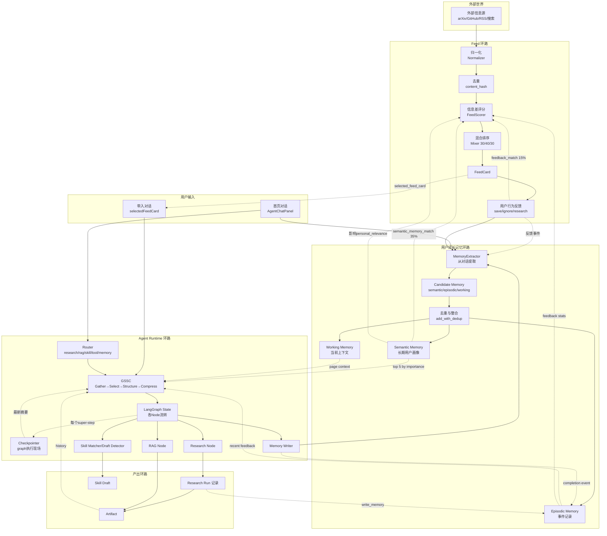

# 信息流程架构分析文档

## 1. 总览结论

当前系统的信息流可以概括为三条主干环路和一条横切管道：

**环路 A — Feed 环路（外部世界 → 用户）**：外部信息源 → 归一化 → 去重 → 信息差评分 → 个性化排序 → FeedCard → 用户行为反馈 → 记忆更新 → 影响下一轮排序。

**环路 B — Research 环路（用户意图 → 深度产出）**：FeedCard / 用户输入 → Agent Run → LangGraph State → Checkpoint → Research 输出 → Artifact → 用户反馈 → 记忆更新。

**环路 C — 用户成长环路（对话 → 长期画像）**：用户对话 / 行为事件 → MemoryExtractor → Candidate Memory → Dedup/Consolidation → Semantic Memory → GSSC → 影响 Feed 排序、Research 规划和 Artifact 生成。

**横切管道 — GSSC**：不是存储层，是每次 LLM 调用前的上下文组装流水线。Gather 从多源拉候选 → Select 按相关性和 token budget 筛选 → Structure 组织成稳定格式 → Compress 超限时压缩。输出生命周期 = 单次 LLM 调用，不入库。

三条环路通过 GSSC 和用户成长记忆交汇：Feed 环路产生偏好信号流入记忆，记忆流入 GSSC 影响 Research 和 Artifact，Research 产出又反写记忆。

---

## 2. 核心信息类型清单

### 类型 1：外部原始信息（RawFeedItem）

| 维度 | 说明 |
|------|------|
| 从哪里产生 | FeedSource（arXiv、GitHub、RSS、Tavily、SerpApi、DuckDuckGo、ManualSeed）fetch 返回 |
| 流向哪里 | Normalizer → InfoItem（去重后入库）→ FeedCard 生成 |
| 生命周期 | **短期**：fetch 后立即归一化，原始 RawFeedItem 不持久化 |
| 进入 GSSC | 否 |
| 进入长期记忆 | 否 |
| 进入 Checkpointer | 否 |
| 影响 Feed 排序 | 间接：归一化后的 InfoItem 参与评分 |
| 影响 Research/Artifact | 否 |

### 类型 2：标准化信息项（InfoItem）

| 维度 | 说明 |
|------|------|
| 从哪里产生 | Normalizer 处理 RawFeedItem 后生成，含 content_hash 用于去重 |
| 流向哪里 | InfoItemRepository（持久化）→ FeedScorer 评分 → FeedCard 生成 |
| 生命周期 | **长期**：持久化在 info_items 表，作为 Feed 候选池 |
| 进入 GSSC | 否 |
| 进入长期记忆 | 否 |
| 进入 Checkpointer | 否 |
| 影响 Feed 排序 | **是**：title/summary/topics 参与个人相关性评分 |
| 影响 Research/Artifact | 否 |

### 类型 3：FeedCard（信息差卡片）

| 维度 | 说明 |
|------|------|
| 从哪里产生 | FeedScorer 评分 + CardGenerator 生成中文标题/文案 + Mixer 按 30/40/30 混合 |
| 流向哪里 | FeedRepository（持久化）→ 用户首页 / Feed 列表 → 用户行为反馈 |
| 生命周期 | **长期**：持久化在 feed_cards 表，status 标记 active/saved/ignored/researched |
| 进入 GSSC | **是**：selected_feed_card 作为 ContextBuilder 的 feed_card 源 |
| 进入长期记忆 | 间接：用户对卡片的行为（save/ignore/research）写入 episodic memory |
| 进入 Checkpointer | 否 |
| 影响 Feed 排序 | **是**：已展示/已忽略的卡片影响后续去重和排序 |
| 影响 Research/Artifact | **是**：FeedCard 是 Research 任务的主要入口之一 |

### 类型 4：用户输入信息

| 维度 | 说明 |
|------|------|
| 从哪里产生 | 前端 AgentChatPanel 提交 / 首页"带入对话"按钮 |
| 流向哪里 | Agent Run → LangGraph State → Router → ContextBuilder → 各 Node |
| 生命周期 | **任务级**：一次 Agent Run 内有效 |
| 进入 GSSC | **是**：作为 ContextBuilder.build() 的 task 字段 |
| 进入长期记忆 | **是**：MemoryExtractor 分析用户输入，提取语义/情景记忆 |
| 进入 Checkpointer | **是**：作为 graph state 的一部分被 checkpoint |
| 影响 Feed 排序 | 间接：通过提取的 semantic memory 影响后续 Feed 评分 |
| 影响 Research/Artifact | **是**：直接驱动 Research 查询和 Artifact 生成 |

### 类型 5：对话上下文信息（Agent Run Context）

| 维度 | 说明 |
|------|------|
| 从哪里产生 | ContextBuilder.build() 的输出，汇集 task + route + profile + memory + feed_card + page_context |
| 流向哪里 | LangGraph State.context → 各 Node 使用 → 随 Run 结束而失效 |
| 生命周期 | **任务级**：一次 Agent Run 内有效 |
| 进入 GSSC | **是**：它就是 GSSC 的输出 |
| 进入长期记忆 | 否（但其组成部分如 memory 可能来自长期记忆） |
| 进入 Checkpointer | **是**：作为 state.context 的一部分 |
| 影响 Feed 排序 | 否 |
| 影响 Research/Artifact | **是**：直接影响 Research 规划和 Artifact 生成质量 |

### 类型 6：用户成长记忆（Semantic / Episodic / Working Memory）

| 维度 | 说明 |
|------|------|
| 从哪里产生 | MemoryExtractor 从对话中提取 + MemoryService.add_with_dedup 写入 |
| 流向哪里 | MemoryRepository（持久化）→ GSSC Gather 阶段 → 影响 Feed 评分 / Research / Artifact |
| 生命周期 | **长期**：semantic memory 长期保留，episodic 中期保留，working 短期（TTL 3600s） |
| 进入 GSSC | **是**：semantic memory 作为 ContextBuilder 的 memory 源（top 5 by importance） |
| 进入长期记忆 | **是**：这就是长期记忆本身 |
| 进入 Checkpointer | 否（memory 的 ID 可能被 state 引用，但 memory 内容不入 checkpoint） |
| 影响 Feed 排序 | **是**：semantic_memory_match 占 personal_relevance 的 35% |
| 影响 Research/Artifact | **是**：通过 GSSC 影响 Research 上下文和 Artifact 风格 |

### 类型 7：用户行为反馈

| 维度 | 说明 |
|------|------|
| 从哪里产生 | FeedCard 的 save/ignore/useful/not_relevant/deep_research 操作 |
| 流向哪里 | FeedFeedbackRepository → feedback stats → FeedScorer → MemoryExtractor（episodic memory） |
| 生命周期 | **长期**：feedback 记录持久化，参与后续排序 |
| 进入 GSSC | 间接：通过 feedback stats 和 episodic memory |
| 进入长期记忆 | **是**：重要的反馈事件写入 episodic memory |
| 进入 Checkpointer | 否 |
| 影响 Feed 排序 | **是**：positive_topics/negative_topics 占 personal_relevance 的 15% |
| 影响 Research/Artifact | 间接：通过 episodic memory → GSSC |

### 类型 8：Deep Research 任务信息

| 维度 | 说明 |
|------|------|
| 从哪里产生 | FeedCard 触发 / 用户直接输入 → Agent Run（route=research） |
| 流向哪里 | ResearchService → LangGraph State → Research Run 记录 → Artifact |
| 生命周期 | **任务级**：一次 Research Run 内有效，结果持久化 |
| 进入 GSSC | **是**：Research 任务的上下文由 GSSC 组装 |
| 进入长期记忆 | **是**：Research 完成后写入 episodic memory |
| 进入 Checkpointer | **是**：Research 执行的 graph state 被 checkpoint |
| 影响 Feed 排序 | 间接：Research 行为反映用户兴趣 |
| 影响 Research/Artifact | **是**：Research 结果直接生成 Artifact |

### 类型 9：Artifact 信息

| 维度 | 说明 |
|------|------|
| 从哪里产生 | Research 完成 / Agent Run 输出 / 手动创建 |
| 流向哪里 | ArtifactRepository（持久化）→ 用户查看 / 编辑 → GSSC 的 context source |
| 生命周期 | **长期**：持久化存储 |
| 进入 GSSC | **是**：Artifact 历史可作为 ContextBuilder 的 evidence/context source |
| 进入长期记忆 | 间接：重要 Artifact 的创建写入 episodic memory |
| 进入 Checkpointer | 否 |
| 影响 Feed 排序 | 否 |
| 影响 Research/Artifact | **是**：历史 Artifact 可作为后续 Research 的参考 |

### 类型 10：LangGraph Runtime State

| 维度 | 说明 |
|------|------|
| 从哪里产生 | AgentRuntime 初始化时创建，各 Node 逐步填充 |
| 流向哪里 | Node → Node（沿 Graph 边流转）→ Checkpointer → 随 Run 结束归档 |
| 生命周期 | **任务级**：一次 Graph 执行内有效 |
| 进入 GSSC | **是**：state 是 GSSC Gather 的源之一 |
| 进入长期记忆 | 否（state 中的关键结果可被 MemoryExtractor 提取后入记忆） |
| 进入 Checkpointer | **是**：每个 super-step 后 checkpoint |
| 影响 Feed 排序 | 否 |
| 影响 Research/Artifact | **是**：state 承载 Research 和 Artifact 生成的中间结果 |

### 类型 11：Checkpoint 信息

| 维度 | 说明 |
|------|------|
| 从哪里产生 | LangGraph Checkpointer 在每个 super-step 后自动保存 |
| 流向哪里 | Checkpointer 存储 → Resume/Replay 时恢复 → 调试分析 |
| 生命周期 | **中期**：保留用于 resume/replay，可配置 TTL |
| 进入 GSSC | **是**：最新 checkpoint 摘要可作为 ContextBuilder 的输入 |
| 进入长期记忆 | 否 |
| 进入 Checkpointer | **是**：这就是 Checkpointer 本身 |
| 影响 Feed 排序 | 否 |
| 影响 Research/Artifact | 间接：支持 Research 中断恢复 |

### 类型 12：GSSC 临时上下文

| 维度 | 说明 |
|------|------|
| 从哪里产生 | ContextBuilder.build() 执行 Gather → Select → Structure → Compress |
| 流向哪里 | LLM 调用 → 调用结束后丢弃 |
| 生命周期 | **瞬时**：单次 LLM 调用 |
| 进入 GSSC | **是**：这就是 GSSC 的输出 |
| 进入长期记忆 | 否 |
| 进入 Checkpointer | 否（但输入的 state 会被 checkpoint） |
| 影响 Feed 排序 | 否 |
| 影响 Research/Artifact | **是**：直接决定 LLM 看到什么 |

### 类型 13：Skill 信息

| 维度 | 说明 |
|------|------|
| 从哪里产生 | SkillMatcher 匹配已有 Skill / SkillDraftDetector 创建新 Skill 草稿 |
| 流向哪里 | SkillRepository（持久化）→ Agent Run 的 matched_skill / created_skill_draft → GSSC |
| 生命周期 | **长期**：approved skill 长期复用，draft 待审批 |
| 进入 GSSC | **是**：matched_skill 的上下文块插入 GSSC 输出 |
| 进入长期记忆 | 间接：skill match/create 事件写入 episodic memory |
| 进入 Checkpointer | 否 |
| 影响 Feed 排序 | 间接：skill_interest_match 占 personal_relevance 的 10% |
| 影响 Research/Artifact | **是**：Skill 可自动执行 Research/Artifact 工作流 |

---

## 3. 总体信息流图



**关键信息流说明**：

1. **外部信息 → FeedCard**：ES → NORM → DEDUP → SCORE → MIX → FC。用户记忆（SM）和反馈（FB）在 SCORE 步骤汇入，影响个性化排序。

2. **用户对话 → 记忆**：UI → Agent Runtime(MW) → EXTRACT → CANDIDATE → DEDUP_MEM → SM/EM/WM。这是"对话中自然提取长期设定"的核心路径。

3. **记忆 → GSSC → Agent**：SM/EM/WM → GSSC Gather → Select → Structure → Compress → LG。记忆不是直接塞给 LLM，而是通过 GSSC 筛选后进入上下文。

4. **FeedCard → Research → Artifact**：FC → UI(带入对话) → GSSC → LG(RESEARCH) → RR → AR。FeedCard 的 title/one_sentence_value/information_gap 进入 GSSC，影响 Research 方向。

5. **反馈闭环**：FB → EXTRACT → EM → SCORE → FC。用户 save/ignore 行为不仅影响当前卡片状态，还通过 episodic memory 和 feedback stats 影响后续 Feed 排序。

---

## 4. 用户成长记忆信息流

### 4.1 提取节点

用户设定在 **两个节点** 被提取：

**节点 A — Agent Runtime MemoryWriter**（每次 Agent Run 结束时）：
- 输入：user_input + agent_output + page_context + feed_card_context + matched_skill + created_skill_draft
- 调用 `MemoryExtractor.extract()` → 产生 semantic / episodic / working 三类候选记忆
- 调用 `MemoryService.extract_and_save()` → dedup → 写入

**节点 B — ResearchService._run()**（每次 Research 完成时）：
- 输入：research query + result summary
- 直接写入 episodic memory（importance=0.75）

### 4.2 候选记忆 → 有效记忆

```
候选记忆 (Candidate Memory)
    │
    ├─ semantic, importance ≥ 0.70 ──→ add_with_dedup()
    │       │
    │       ├─ 相似度 ≥ 0.55（Jaccard + 3-gram）──→ 更新已有记忆
    │       │       └─ importance = max(old, new)
    │       │       └─ evidence_count += 1
    │       │       └─ evidence_count ≥ 3 → importance += 0.05
    │       │
    │       └─ 相似度 < 0.55 ──→ 新建记忆
    │
    ├─ episodic, importance ≥ 0.50 ──→ 直接写入（不dedup）
    │
    └─ working, importance < 0.50 ──→ 直接写入（TTL 3600s）
```

### 4.3 强化机制

- **重复证据累积**：同一设定被多次提取时，evidence_count 递增，importance 逐步提升
- **Consolidation 提升**：working(importance≥0.7) → episodic；episodic(importance≥0.8) → semantic
- **GSSC 引用**：被 GSSC 频繁选中的记忆，可通过 feedback 回路间接强化

### 4.4 修正机制

- **用户明确否定**时，MemoryExtractor 提取新设定（如"不要英文FeedCard"），写入新的 semantic memory
- **旧设定被新设定覆盖**：如果新记忆的 content 与旧记忆相似度 ≥ 0.55，更新旧记忆的内容和 importance
- **当前未实现**：显式 supersede 标记。旧设定不会自动失效，只能通过相似度匹配被更新

### 4.5 衰减机制

- **当前未实现显式衰减**。Working memory 有 TTL（3600s），但 semantic/episodic 无自动衰减
- **隐式衰减**：GSSC 的 Select 阶段按 importance 排序取 top 5，低 importance 记忆自然不被选中
- **建议方向**（不在此阶段实现）：last_seen_at 超过 N 天未在 GSSC 中被选中的记忆，importance 线性衰减

### 4.6 碎片记忆 → 高层画像

- **当前未实现 Reflection/Summarization**。多个相关 semantic memory 还不会自动合并成高层画像
- **去重机制**提供了基础：同一主题的多次提取会更新同一条记忆而非创建多条
- **建议方向**（不在此阶段实现）：当同一 category 的 semantic memory ≥ 5 条时，触发 Reflection 节点，生成一条高层 summary memory

### 4.7 记忆 → GSSC

```
GSSC Gather 阶段:
    memory_service.search_memory(
        user_id,
        query=user_input,      # 用当前输入做关键词匹配
        min_importance=0.2,    # 过滤低价值记忆
        db=db
    )[:5]                      # 只取 top 5
    ↓
    进入 ContextBuilder.build(memory=memories)
    ↓
    Structure 阶段: source=="memory" → "Relevant Memory" section
    ↓
    Select 阶段: relevance=0.5，与其他 source 竞争 token budget
```

**避免把所有记忆塞进上下文的关键机制**：
1. `min_importance=0.2` 过滤噪音
2. `[:5]` 硬限制数量
3. Select 阶段按 relevance 排序，低相关记忆被 token budget 自然淘汰
4. 记忆内容本身是短句（不是原始对话），token 开销小

---

## 5. Feed 信息流

### 5.1 外部信息源 → 标准化候选

```
外部信息源 (arXiv/GitHub/RSS/Tavily/SerpApi/DuckDuckGo/ManualSeed)
    │
    │  fetch() → RawFeedItem {title, summary, url, tags, ...}
    ↓
Normalizer.normalize_raw_item()
    │
    │  canonicalize_url() → 去参数/去尾斜杠
    │  stable_hash(url + title) → content_hash
    │  infer_domain(tags, text) → domain (agent/rag/devtools/startup/research/ai)
    │  输出: InfoItemCreate {title, summary, content_hash, topics, raw_metadata, ...}
    ↓
InfoItemRepository.upsert_by_hash()
    │
    │  content_hash 已存在 → 更新（updated_info++）
    │  content_hash 不存在 → 创建（created_info++）
    ↓
InfoItem (持久化)
```

### 5.2 评分与排序

```
InfoItem
    │
    ↓
FeedScorer.score(info_item, profile, feedback_stats, semantic_memories)
    │
    │  personal_relevance =
    │    0.35 × profile_match        ← explicit_interests / goals / domains
    │    0.35 × semantic_memory_match ← 用户长期设定中的关键词匹配
    │    0.15 × recent_feedback_match ← positive/negative topics
    │    0.10 × skill_interest_match  ← skill/workflow/reusable 等术语
    │    0.05 × negative_penalty      ← disliked_topics + 负向记忆
    │
    │  final_score =
    │    0.30 × personal_relevance
    │    0.20 × novelty              ← 发布时间衰减
    │    0.15 × cross_domain_distance ← explicit=0.35 / adjacent=0.70 / far=0.82
    │    0.15 × opportunity_value     ← 是否包含机会术语
    │    0.10 × source_credibility    ← arxiv=0.85 / github=0.75 / web=0.60
    │    0.10 × actionability         ← 是否可执行
    │
    │  relation_type: explicit_related / adjacent_domain / far_domain
    │  confidence: high / medium / low
    │  filtered: personal_relevance < min_threshold → 丢弃
    ↓
CardGenerator.generate_feed_card()
    │
    │  中文标题生成 (deterministic, 按 domain/tags/source_type 差异化)
    │  中文文案生成 (one_sentence_value / why_relevant / benefit / information_gap / next_action)
    ↓
候选卡片列表
    │
    ↓
Mixer.mix_cards()
    │
    │  按 30/40/30 分配 explicit_related/adjacent_domain/far_domain
    │  _avoid_repetition(): 避免连续两张同 domain 或同 source_type
    │  _limit_low_confidence(): low confidence 不超过 20%
    ↓
FeedCard (持久化, status=active)
```

### 5.3 用户反馈闭环

```
用户行为 (save / ignore / useful / not_relevant / deep_research)
    │
    ├─→ FeedFeedback 记录持久化
    │       ↓
    │   FeedFeedbackRepository.get_user_feedback_stats()
    │       ↓
    │   positive_topics / negative_topics → FeedScorer (15% weight)
    │
    ├─→ FeedCard.status 更新 (saved / ignored / researched)
    │       ↓
    │   已 ignore 的卡片在 list_cards 时默认不返回
    │
    └─→ MemoryExtractor 提取 episodic memory
            ↓
        用户偏好变化 → semantic memory 更新
            ↓
        semantic_memory_match → FeedScorer (35% weight)
```

### 5.4 个性化推荐理由

每张 FeedCard 携带的推荐理由字段：

| 字段 | 来源 | 含义 |
|------|------|------|
| `relation_type` | FeedScorer | 显性相关/邻近机会/远域启发 |
| `why_relevant` | CardGenerator | 为什么和当前用户相关（含匹配的兴趣标签） |
| `benefit` | CardGenerator | 你能从中得到什么（按 domain 差异化） |
| `information_gap` | CardGenerator | 多数人忽略了什么（按 domain 差异化） |
| `next_action` | CardGenerator | 建议下一步（带入对话/深度研究/保存/生成Skill） |
| `personal_relevance` | FeedScorer | 个人相关性分数 |
| `semantic_memory_match` | FeedScorer | 长期记忆匹配度 |

---

## 6. Deep Research 信息流

### 6.1 FeedCard → Research Task

```
FeedCard
    │
    │  用户点击 "深度研究" 或 "带入对话"
    ↓
AgentRunRequest {
    user_input: "Research feed card {id}: {title}",
    page_context: { selected_feed_card_id: id },
    feed_card_id: id,
    auto_skill: true,
    write_memory: true,
}
    │
    ↓
Router: route = "research"
    │
    ↓
ContextBuilder.build() ─── GSSC Gather 阶段:
    │
    ├─ task: user_input
    ├─ route: "research"
    ├─ profile: { segment, goals, interests }
    ├─ memory: top 5 semantic memories (min_importance=0.2)
    ├─ feed_card: { title, one_sentence_value, why_you, information_gap,
    │               evidence, suggested_actions, relation_type, source_type, domain, score }
    └─ page_context: { page: "home", selected_feed_card_id }
    │
    ↓
ResearchService.research_feed_card() / research_query()
    │
    │  输入: ResearchRequest { query, depth, save_artifact, write_memory, create_skill_draft }
    ↓
LangGraph State (Research 执行中)
    │
    ├─ state["route"] = "research"
    ├─ state["context"] = { gssc_context, memory_count, feed_card, page_context }
    ├─ state["research"] = { id, status, summary, findings, evidence, ... }
    ├─ state["artifacts"] = [{ id, type: "research_report" }]
    └─ state["skill_drafts"] = [{ id, source: "research" }]
    │
    │  每个 super-step → Checkpointer
    ↓
Research Run 完成
    │
    ├─→ ResearchRun 记录持久化
    │       { query, status, summary, findings, evidence, risks,
    │         opportunities, suggested_actions, markdown_report,
    │         artifact_id, skill_draft_id }
    │
    ├─→ Artifact 生成
    │       artifact_service.save_text_artifact()
    │       Artifact { artifact_type: "research_report", file_path }
    │
    ├─→ Skill Draft 生成（如 reusable_score ≥ 0.70）
    │       skill_service.create_skill_draft_from_run()
    │
    └─→ Memory 写入
            memory_service.add_memory(
                content="用户围绕 Deep Research 完成研究：{query}\n摘要：{summary}",
                memory_type="episodic",
                importance=0.75
            )
```

### 6.2 Research 中间状态与 Checkpointer

```
Research 执行过程中:
    state["research"] = {
        "id": "uuid",
        "status": "running",       # → "completed" / "failed"
        "query": "...",
        "summary": "...",          # 逐步填充
        "findings": [...],         # 逐步追加
        "evidence": [...],         # 逐步追加
        "markdown_report": "...",  # 最终填充
    }

    Checkpointer 保存: 完整的 AgentRuntimeState
    可恢复: 中断后从最近 checkpoint 继续
    不可恢复: 外部 API 调用的副作用（如搜索 API 已调用）
```

### 6.3 Research → Memory 回流

```
Research 完成后的记忆写入:

1. 直接写入 episodic:
   "用户围绕 Deep Research 完成研究：{query}"

2. 通过 MemoryWriter Node:
   MemoryExtractor 分析 user_input + research_summary
   → 提取可能的新 semantic memory:
       "用户深度研究了 {domain} 方向的 {topic}"
       "用户对 {specific_tech} 表现出持续关注"
   → add_with_dedup() → 更新/新建 semantic memory

3. Research 发现中的关键 insight:
   当前未自动提取，需要用户主动 "save" 或 "remember this"
```

---

## 7. Artifact 信息流

### 7.1 Research → Artifact

```
Research Run 完成
    │
    ├─ summary / findings / markdown_report
    ↓
artifact_service.save_text_artifact(user_id, filename, content)
    │
    │  文件存储: uploads/artifacts/{user_id}/{filename}
    │  数据库记录: Artifact { artifact_type, title, file_path }
    ↓
Artifact ID 回写到 ResearchRun.artifact_id
```

### 7.2 用户记忆 → Artifact 生成

```
当前阶段: 用户记忆对 Artifact 的影响是间接的

GSSC 上下文 → Research 质量 → Artifact 质量
     ↑
semantic memory (用户偏好、技术栈、项目目标)
     ↑
影响 Research 方向和深度 → 影响 Artifact 的实用性和针对性

未来可增强:
    - Artifact 语言: 用户偏好中文 → Artifact 中文输出
    - Artifact 结构: 用户偏好简洁 → 短报告而非长文
    - Artifact 风格: 用户是开发者 → 偏技术实现细节
```

### 7.3 Artifact 生命周期中的信息分类

```
Runtime State (不入库):
    - Artifact 生成过程中的 LLM 中间输出
    - GSSC 组装的临时上下文
    - LangGraph state 中的 artifact 引用

持久化记录 (入库):
    - Artifact { id, title, artifact_type, file_path, metadata_json }
    - ResearchRun.artifact_id (关联)

可进入 GSSC:
    - Artifact 历史 (作为 ContextBuilder 的 evidence source)
    - Artifact 的 metadata 摘要

可进入记忆:
    - "用户生成了关于 {topic} 的深度研究报告" (episodic)
    - 用户对 Artifact 的反馈 (episodic → semantic)
```

### 7.4 Artifact 编辑反馈

```
用户编辑 Artifact:
    │
    ├─→ 编辑事件写入 episodic memory
    │       "用户修改了 {artifact_title} 的 {section}"
    │
    ├─→ 编辑模式/偏好提取
    │       如果用户反复修改同一类内容 → 提取为 preference
    │       "用户偏好 {shorter|more detailed|more technical} 的 {section}"
    │
    └─→ 当前未实现自动提取，需手动触发
```

---

## 8. LangGraph Persistence 信息流边界

### 8.1 核心边界

```
Checkpointer 保存的:
    ✓ Graph 执行现场 (AgentRuntimeState 的完整快照)
    ✓ 每个 Node 的输入输出
    ✓ 当前 route / status / error
    ✓ 累积的 artifacts / memory_updates / skill_drafts 引用

Checkpointer 不保存的:
    ✗ 用户长期记忆的内容（那是 MemoryRepository 的事）
    ✗ FeedCard 的完整数据（只保存 feed_card_id 引用）
    ✗ 外部 API 调用结果的内容（只保存引用/摘要）
    ✗ 数据库中的业务记录（只保存 ID 引用）
```

### 8.2 thread_id 与任务类型的关联

```
thread_id 的设计建议:
    不是 "user_123" (那会混淆所有任务)
    而是 "{task_type}:{task_id}:{run_id}"

示例:
    feed_refresh:    "feed:refresh:{user_id}:{timestamp}"
    research_task:   "research:{research_run_id}:{run_id}"
    artifact_gen:    "artifact:{artifact_id}:{run_id}"
    home_chat:       "chat:{user_id}:{run_id}"
```

### 8.3 Feed Refresh Thread 信息流

```
Feed Refresh 不是 LangGraph 任务，不走 Checkpointer。

Feed Refresh 的"状态":
    - InfoItem / FeedCard 的 CRUD 由数据库事务保证
    - 不需要 graph 执行，不需要 checkpoint
    - 如果 refresh 中断，下次 refresh 重新 fetch + dedup（content_hash 保证幂等）
```

### 8.4 Research Thread 信息流

```
Research Run (LangGraph 任务):

state = {
    "run_id": 123,
    "user_id": 1,
    "user_input": "Research feed card 5: Skill-RM...",
    "route": "research",
    "status": "running",
    "context": { gssc_context, memory_count, feed_card },
    "research": {
        "id": "uuid",
        "status": "running",
        "query": "...",
        "findings": [],
        "evidence": [],
    },
    "artifacts": [],
    "memory_updates": [],
}

每个 super-step → Checkpointer.save(state)

中断恢复:
    Resume from checkpoint → 重新执行当前 Node
    ⚠ 外部 API 副作用（搜索已调用）不可回滚

完成:
    state["status"] = "completed"
    → Evaluator Node 汇总
    → MemoryWriter Node 写记忆
    → Checkpointer 可选择性保留最终 checkpoint
```

### 8.5 Artifact Generation Thread 信息流

```
Artifact 生成可以作为 Research 的子步骤，也可以独立:

独立 Artifact 生成:
    route = "artifact"
    state["final_output"] → artifact_service.save_text_artifact()
    → Artifact 记录入库
    → artifact ID 回写 state

作为 Research 子步骤:
    research Node 内部调用 artifact_service
    → artifact ID 写入 state["artifacts"]
    → ResearchRun.artifact_id = artifact.id
```

### 8.6 Checkpoint 调试价值

```
Checkpoint 历史可以用于:
    ✓ 调试: 查看某次 Run 在哪个 Node 失败
    ✓ 审计: 追溯 Agent 的决策路径
    ✓ 回放: 用相同 state 重放某个 Node

Checkpoint 历史不应该用于:
    ✗ 用户画像: checkpoint 是任务级快照，不是长期记忆
    ✗ Feed 排序: checkpoint 不包含用户偏好
    ✗ 长期分析: checkpoint 应配置 TTL，过期清理
```

---

## 9. GSSC 信息流边界

### 9.1 GSSC 是什么 / 不是什么

```
GSSC 是:
    ✓ 每次 LLM 调用前的上下文组装流水线
    ✓ Gather → Select → Structure → Compress 四个阶段的管道
    ✓ 无状态函数：输入多源数据，输出一段文本

GSSC 不是:
    ✗ 存储层：不持久化任何数据
    ✗ 长期记忆：输出的上下文生命周期 = 单次 LLM 调用
    ✗ 数据库：不索引、不查询、不管理数据
    ✗ 业务逻辑：不决定 route、不评分、不排序
```

### 9.2 GSSC Gather 的数据源

```
ContextBuilder.build() 当前从以下源 Gather:

┌─────────────────────┬──────────────────┬─────────────────────┐
│ Source              │ 内容             │ 进入条件            │
├─────────────────────┼──────────────────┼─────────────────────┤
│ task                │ user_input       │ 总是                │
│ route               │ 当前路由         │ 总是                │
│ profile             │ segment/goals/   │ 总是                │
│                     │ interests        │                     │
│ memory              │ top 5 semantic   │ min_importance≥0.2  │
│                     │ memories         │                     │
│ feed_card           │ 选中的FeedCard   │ selected_feed_card  │
│                     │ 的上下文信息     │ 存在时              │
│ page_context        │ 当前页面/状态    │ 总是                │
│ output_contract     │ 期望的输出格式   │ 总是                │
└─────────────────────┴──────────────────┴─────────────────────┘

可以扩展但当前未接入的源:
    - 对话历史 (最近 N 轮)
    - RAG 检索结果 (相关文档 chunk)
    - Artifact 历史 (最近生成的 Artifact 摘要)
    - Checkpoint 摘要 (最近 checkpoint 的关键状态)
    - 外部信息源候选 items
    - 项目笔记 / Note
```

### 9.3 不同任务取不同上下文

```
当前实现: ContextBuilder.build() 对所有任务使用相同的 gather 逻辑

应该差异化:
    route="research" → feed_card 权重 ↑, memory 权重 ↑
    route="rag"     → RAG 检索结果 权重 ↑
    route="skill"   → 已有 skill 列表 权重 ↑
    route="chat"    → 对话历史 权重 ↑, feed_card 权重 ↓

差异化可以通过:
    - 调整不同 source 的 relevance 初始值
    - 调整不同 source 的 token budget 分配
    - 不同 route 使用不同的 structure 模板
```

### 9.4 GSSC 输出的生命周期

```
GSSC 输出 = ContextBuilder.build() 的返回值:
    - 一段结构化文本 (当前是纯文本拼接)
    - 写入 state["context"]["gssc_context"]
    - 随 LangGraph state 流转
    - 可被 Checkpointer 保存（作为 state 的一部分）
    - LLM 调用结束后不再使用
    - 不入库、不索引、不跨 Run 共享

生命周期: 单次 LLM 调用
存储位置: state["context"]["gssc_context"] (可被 checkpoint)
下次调用: 重新 Gather → Select → Structure → Compress
```

### 9.5 GSSC 与各系统的边界

```
GSSC ←→ 长期记忆:
    GSSC Gather 读取 semantic memory (top 5)
    GSSC 不写入记忆
    记忆系统不依赖 GSSC

GSSC ←→ RAG:
    GSSC Gather 可读取 RAG 检索结果
    GSSC 不触发 RAG 检索
    RAG 检索不依赖 GSSC

GSSC ←→ Checkpointer:
    GSSC 输出可被 Checkpointer 保存（作为 state 的一部分）
    GSSC Gather 可读取 checkpoint 摘要
    Checkpointer 不管理 GSSC 的生命周期

GSSC ←→ Feed:
    GSSC Gather 可读取选中的 FeedCard
    GSSC 不影响 Feed 排序
    Feed 系统不依赖 GSSC
```

### 9.6 避免 GSSC 变成大泥球

```
原则 1: GSSC 只做上下文组装，不做业务决策
    ✗ "GSSC 决定 route" → 这是 Router 的事
    ✗ "GSSC 决定写什么记忆" → 这是 MemoryExtractor 的事
    ✓ "GSSC 把 route 信息和相关记忆组装成上下文"

原则 2: GSSC 的输出格式是 Contract，不是自由格式
    - Structure 阶段按固定模板组织
    - 不同任务类型有不同的模板
    - 模板保证 LLM 看到的信息结构稳定

原则 3: 新数据源通过扩展 ContextBuilder，不修改 GSSC 核心
    - 新增 source → 在 Gather 阶段加一个 source adapter
    - 不影响 Select / Structure / Compress 逻辑

原则 4: GSSC 不做长期存储，不做跨 Run 状态
    - 每次调用的 GSSC 是独立的
    - 不缓存上次上下文
    - 不记住上次选了哪些内容
```

---

## 10. 易混淆边界与反模式

### 10.1 长期记忆 vs Checkpointer

```
常见混淆: "Checkpointer 保存了 state → 这就是用户记忆"

正解:
    Checkpointer 保存的是 "Agent 执行到哪一步了"
    长期记忆保存的是 "用户是什么样的开发者"

    用户说 "我在做信息差 Agent OS" →
        → MemoryExtractor 写入 semantic memory（长期）
        → Checkpointer 只记录这个事实被用在了 context 里（任务级）

    反模式: 从 checkpoint 历史中挖掘用户画像
    → Checkpoint 应该可安全清理，不影响用户画像
```

### 10.2 对话历史 vs 长期记忆

```
常见混淆: "把最近 N 轮对话存下来就是记忆"

正解:
    对话历史 = 原始交互记录（短期，用于上下文连贯）
    长期记忆 = 从对话中提炼的稳定设定（长期，跨 Session）

    对话历史进入 GSSC（当前上下文）
    长期记忆从对话中提取（跨 Session 复用）

    反模式: 把全部对话历史塞进 semantic memory
    → 对话历史是 raw data，记忆是 extracted knowledge
```

### 10.3 FeedCard vs 记忆

```
常见混淆: "用户 save 的 FeedCard 就是用户兴趣记忆"

正解:
    FeedCard 是信息产品（可过期）
    记忆是用户画像（持续更新）

    save 行为 → 写入 episodic memory（"用户对 X 主题感兴趣"）
    FeedCard 本身 → 不入记忆
    FeedCard 的主题/domain → 通过 episodic memory 间接影响 semantic memory

    反模式: 把 FeedCard 内容直接写入 semantic memory
    → FeedCard 会过期，但 "用户关注 Agent 技术" 这个设定不会
```

### 10.4 GSSC vs RAG

```
常见混淆: "GSSC 和 RAG 都是给 LLM 加上下文，它们是一样的"

正解:
    GSSC = 从系统内部组装上下文（用户记忆、当前状态、选中卡片）
    RAG = 从外部知识库检索相关文档

    GSSC 的输出包含 RAG 的结果，但两者职责不同:
        RAG: "哪些文档和这个问题相关？"
        GSSC: "在 token budget 内，如何组织所有相关上下文？"

    反模式: GSSC 直接做向量检索
    → 检索是 RAG 的事，GSSC 只管组装
```

### 10.5 Semantic Memory vs UserProfile

```
常见混淆: "UserProfile 的 interests/goals 字段就是 semantic memory"

正解:
    UserProfile 是用户显式填写的静态配置（或默认值）
    Semantic Memory 是从对话中动态提取的持续演进的用户画像

    它们应该互补:
        UserProfile: 初始种子（"LangGraph, LangChain, RAG, MCP, Agent"）
        Semantic Memory: 持续成长（"用户正在做信息差 Agent OS 的阶段 11"）

    反模式: 只用一个而不用另一个
    → UserProfile 是冷启动，Semantic Memory 是持续学习
```

### 10.6 总体反模式清单

| 反模式 | 为什么错 | 正确做法 |
|--------|---------|---------|
| GSSC 直接写数据库 | GSSC 是瞬时管道，不应有副作用 | GSSC 只输出文本，写入由 Node 负责 |
| Checkpointer 当长期记忆用 | checkpoint 会过期，不应承载用户画像 | MemoryRepository 管理长期记忆 |
| FeedCard 内容直接入记忆 | FeedCard 有生命周期，不应污染记忆 | 提取主题/兴趣，不存原文 |
| 所有记忆都进 GSSC | token 浪费，低价值信息干扰 LLM | Select 阶段按 relevance + token budget 筛选 |
| 所有对话都提取记忆 | 闲聊产生噪音 | MemoryExtractor 过滤闲聊，只提取有信号的内容 |
| 跨 user 共享记忆 | 隐私泄露，推荐失真 | user_id 严格隔离 |
| 一个 thread_id 复用所有任务 | checkpoint 混乱，无法 resume | 不同任务类型使用不同 thread_id 前缀 |
| GSSC 决定业务逻辑 | 职责不清，管道变 God Object | GSSC 只管组装上下文，业务决策在各 Node |
