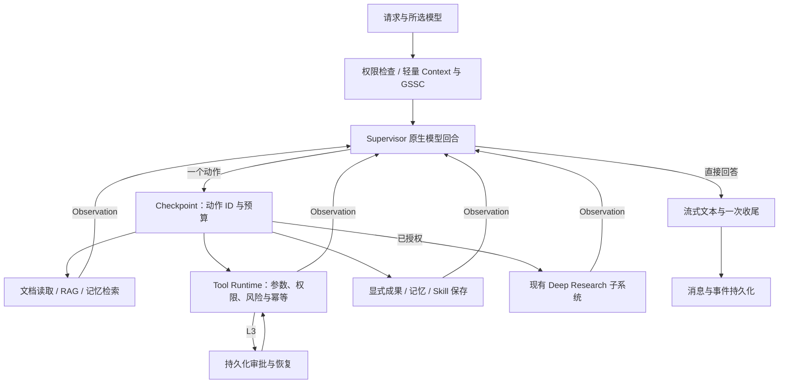

# 原生 Supervisor 运行架构

文本、文档与业务任务使用单一 Supervisor。轻量上下文准备不调用入口分类模型；Supervisor 直接流式回答，或选择一个原生工具调用，读取执行结果后继续。没有 JSON 正文转工具调用的兜底，也不会自动更换本轮选择的模型。



## 实现与边界

- `src/web_app/agent/runtime/nodes.py` 为唯一 Supervisor，`graph_builder.py` 构建运行图；原生流协议位于 `agent/llm/native_turn.py`。
- 独立入口分类、JSON 决策、独立回答节点、Planner、dispatcher、Replanner 及临时双运行时开关已移除。
- 新任务记录 `runtime_version=2`、`loop_protocol_version=1`。恢复入口拒绝旧 checkpoint，历史消息仍可读取；不转换或删除用户历史。
- 普通聊天和直接文档读取支持 steering；进入其他业务能力前关闭普通 steering。工具由运行时校验、审批和审计，恢复不重新选择已冻结动作。
- 文本通过 `agent_text_started/delta/completed` 即时展示，回合结束后归为过程或最终文本。兼容原 `answer_*` 事件，并通过 `text_id` 去重；断流保留部分答案，不自动重放整段。
- 默认预算为 12 次决策、8 次工具执行、1 次深研、3 次连续失败；原生回合超时默认 60 秒。超限不执行新动作。
- 纯图片直答保留既有多模态服务；混合附件的图片理解结果进入上下文。聊天长文档上传不等待可选 LLM 摘要。

## 验证

切换后隔离全仓回归：865 passed、0 failed、0 errors；47 项真实 provider 或持久化后端集成测试单独运行，不在离线套件内连接外部服务。

已完成 PostgreSQL 跨进程审批、独立服务重启以及外部效果已发生但本地结果未提交时停止重试的验证。Redis 当前显式拒绝不支持的恢复配置。前端类型检查、构建及原生事件投影测试通过。所选模型的真实普通聊天、SQL 文档读取和联网搜索已通过；原始运行日志和本地审计快照不随源码发布。

离线测试命令：

```powershell
python scripts/run_offline_tests.py
cd frontend
npm run build
node --test tests/chatStream.test.mjs
```

测试覆盖从旧入口/JSON 协议迁到原生调用分片、单动作约束、参数验证、动态循环、预算、文档隔离、保存授权、取消、事件回放和审批恢复。纯旧拓扑和头协议断言退役，产品行为断言保留。

真实 ODR 外部调用、任意内部步骤恢复及真实向量检索未由这些模拟测试证明。无供应方幂等支持时，外部效果成功、本地提交前崩溃仍可能产生“结果未知”；运行时停止自动重试，不能保证任意外部系统的绝对 exactly-once。

## 迁移残留清理

对当前 Python 入口和导入关系检查后，移除以下没有生产调用方的实现：

| 清理项 | 调用证据与保留的行为 |
| --- | --- |
| `runtime/emitter.py` | 只有测试实例化；当前 Supervisor 使用 `finalization.emit → event_ledger.publish_event`。事件序号、持久化与 SSE 一致性测试改为调用当前实现。 |
| `runtime/langgraph_status.py` | 旧步骤追加函数没有调用方；Graph 仅设置/清空无人读取的队列。删除队列挂接与两个旧配置，当前 `live_progress.run_node` 继续记录节点生命周期。 |
| `runtime/visibility.py`、旧可见思考生成函数 | 只被已失效的固定步骤文案生成链引用。`visible_thought_texts` 保留为历史记录的只读投影。 |
| `live_progress` 的旧节点文案与 `publish_findings` | 结果发布分支只识别已删除的 `research_agent/rag_agent/tool_agent`。当前动作结果由 Observation 和现有事件发布，保留七个实际图节点的显示名称。 |
| `agent/llm/config.py` | `LLM_ENABLED` 已没有生产读取者，只有测试清理其缓存；移除空转配置及测试设置。 |
| 其他失效配置及 `chat_entry_route` 分支 | 删除无人读取的日志/时间线/消息开关，以及已无写入者的旧入口专用收尾分支。保留当前统一流式收尾。 |
| `services/scoring_service.py` | 只被两份旧测试引用；Feed 生产入口使用 `feed.scorer.FeedScorer`。评分公式、兴趣分类和相关性过滤测试迁到当前评分器。 |

保留 ODR 深研模块、研究页仍使用的 fallback、`langgraph.json` 引用的认证入口、图谱同步脚本使用的模块及数据库初始化入口。文件较旧或没有 Web 请求直接调用，并不足以判定其无用。本次不更改数据库 schema、历史 checkpoint 或用户文件。

本地 `src/legacy`、`agent/nodes`、`agent/adapters` 检查后均只含已删除模块的 `.pyc` 缓存，不是 Git 中残存的源码；缓存删除被本次执行环境的自动审批策略拦截，暂保留。README 中旧研究 adapter 路径同步更正。

本次清理后重新执行隔离全仓回归：**865 passed、47 skipped、0 failed、0 errors**（156.13 秒），与清理前用例数量及外部集成分离范围一致。另完成 54 项运行时针对性回归及 15 项 Feed 针对性回归；没有调用真实模型，也没有重新验证外部 PostgreSQL/Redis 服务重启。历史可见摘要只读投影、Python 语法及 diff 空白检查通过。
