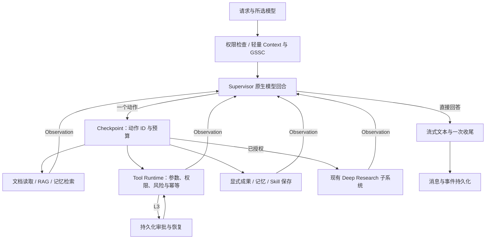

# 原生 Supervisor 运行架构

文本、文档与业务任务使用单一 Supervisor。轻量上下文准备不调用入口分类模型；Supervisor 直接流式回答，或选择一个原生工具调用，读取执行结果后继续。没有 JSON 正文转工具调用的兜底，也不会自动更换本轮选择的模型。



## 实现与边界

- `src/web_app/agent/runtime/nodes.py` 为唯一 Supervisor，`graph_builder.py` 构建运行图；原生流协议位于 `agent/llm/native_turn.py`。
- 独立入口分类、JSON 决策、独立回答节点、Planner、dispatcher、Replanner 及临时双运行时开关已移除。
- 新任务记录 `runtime_version=2`、`loop_protocol_version=1`。恢复入口拒绝旧 checkpoint，历史消息仍可读取；不转换或删除用户历史。
- 普通聊天和直接文档读取支持 steering；进入其他业务能力前关闭普通 steering。工具由运行时校验、审批和审计，恢复不重新选择已冻结动作。
- 文本通过 `agent_text_started/delta/completed` 即时展示，回合结束后归为过程或最终文本。兼容原 `answer_*` 事件，并通过 `text_id` 去重；断流保留部分答案，不自动重放整段。
- 默认预算为 12 次决策、8 次工具执行、1 次深研、3 次连续失败；原生回合超时默认 60 秒。超限不执行新动作。
- 纯图片直答保留既有多模态服务；混合附件的图片理解结果进入上下文。聊天长文档上传不等待可选 LLM 摘要。

## 验证

切换后隔离全仓回归：865 passed、0 failed、0 errors；47 项真实 provider 或持久化后端集成测试单独运行，不在离线套件内连接外部服务。

已完成 PostgreSQL 跨进程审批、独立服务重启以及外部效果已发生但本地结果未提交时停止重试的验证。Redis 当前显式拒绝不支持的恢复配置。前端类型检查、构建及原生事件投影测试通过。所选模型的真实普通聊天、SQL 文档读取和联网搜索已通过；原始运行日志和本地审计快照不随源码发布。

离线测试命令：

```powershell
python scripts/run_offline_tests.py
cd frontend
npm run build
node --test tests/chatStream.test.mjs
```

测试覆盖从旧入口/JSON 协议迁到原生调用分片、单动作约束、参数验证、动态循环、预算、文档隔离、保存授权、取消、事件回放和审批恢复。纯旧拓扑和头协议断言退役，产品行为断言保留。

真实 ODR 外部调用、任意内部步骤恢复及真实向量检索未由这些模拟测试证明。无供应方幂等支持时，外部效果成功、本地提交前崩溃仍可能产生“结果未知”；运行时停止自动重试，不能保证任意外部系统的绝对 exactly-once。
