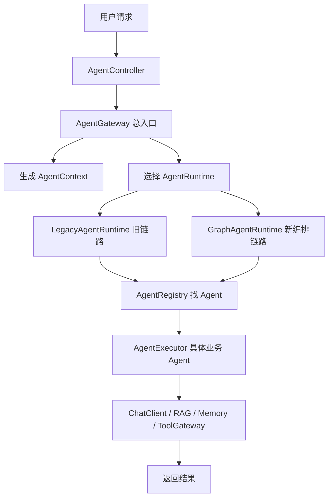
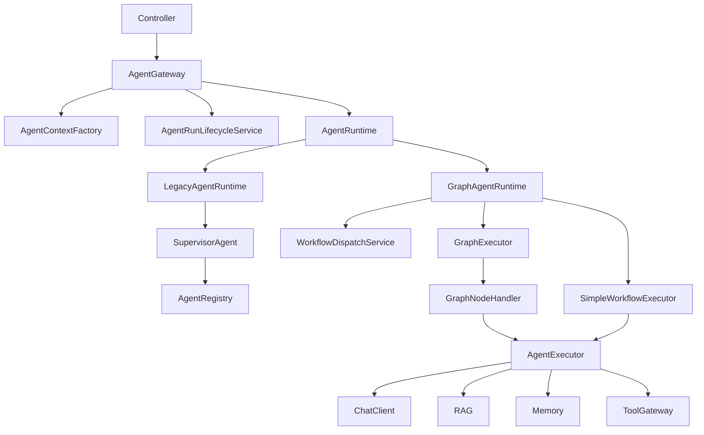
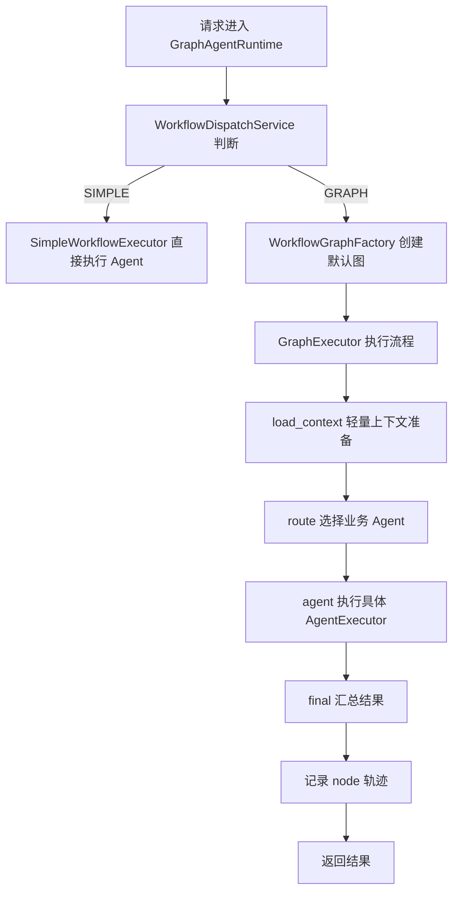
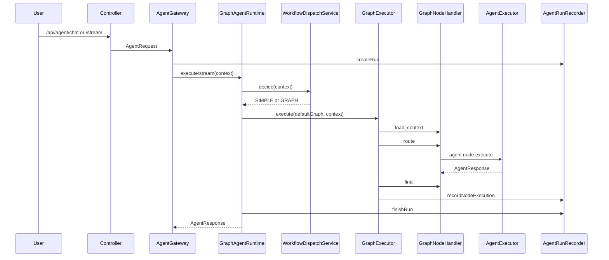
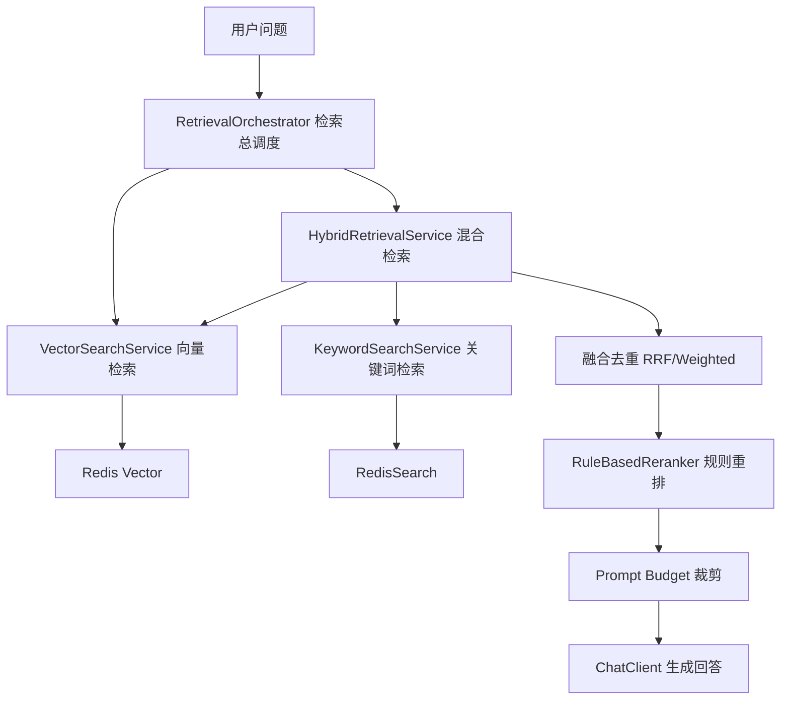
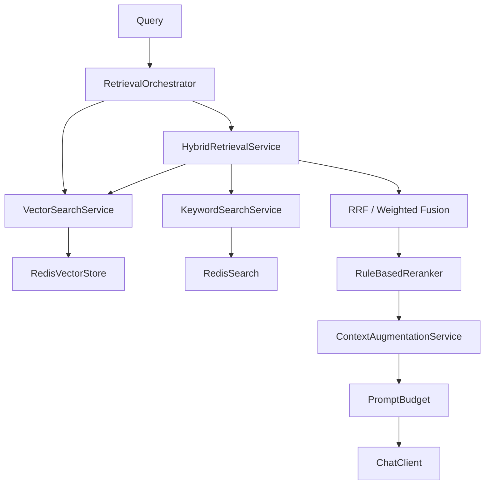
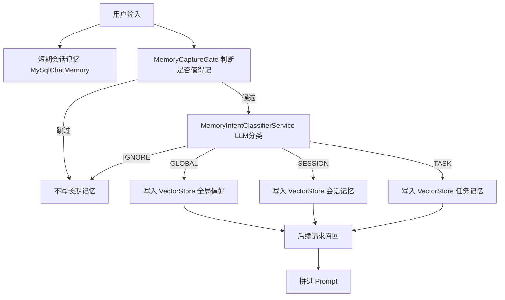
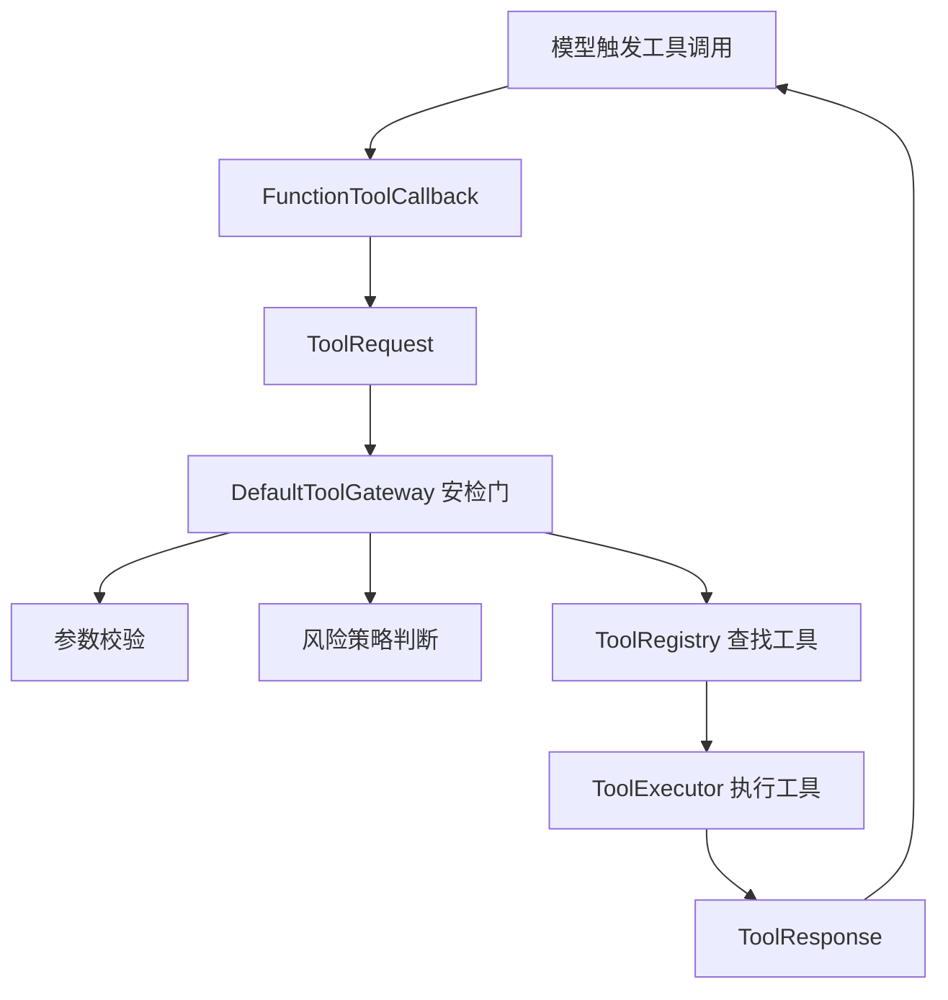
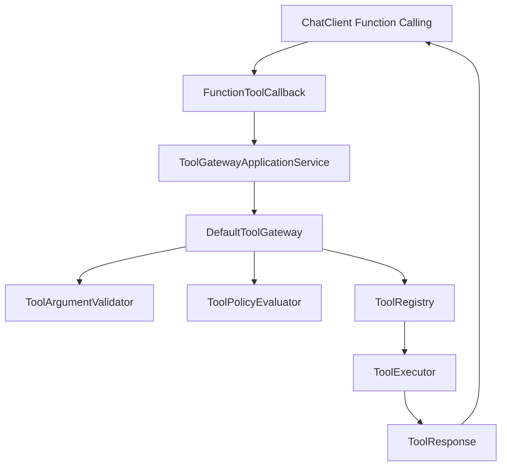

# AgentHub 多 Agent 编排平台

> [!NOTE]
> 这是一份“讲得明白 + 细节完整”的融合版。  
> 它把**面试讲解版**的通俗表达、背诵话术和追问回答，与**深度讲解报告版**的代码依据、调用链、边界说明融合到一起。  
> 阅读顺序建议：先看“四个大点讲透版”，再看“端到端调用链”和“最终背诵版”。

---

## 📚 目录

- [0. 阅读定位](#0-阅读定位)
- [1. 项目整体定位](#1-项目整体定位)
- [2. 代码模块地图](#2-代码模块地图)
- [3. 四个大点讲透版](#3-四个大点讲透版)
  - [3.1 Agent 运行时编排架构](#31-agent-运行时编排架构)
  - [3.2 Graph Workflow 编排链路](#32-graph-workflow-编排链路)
  - [3.3 Redis 混合 RAG 检索链路](#33-redis-混合-rag-检索链路)
  - [3.4 Memory + ToolGateway](#34-memory--toolgateway)
- [4. 完整端到端调用链](#4-完整端到端调用链)
- [5. 面试官可能追问与标准回答](#5-面试官可能追问与标准回答)
- [6. 哪些能讲，哪些不能夸大](#6-哪些能讲哪些不能夸大)
- [7. 最终背诵版](#7-最终背诵版)

---

## 0. 阅读定位

这份文档不是单纯的架构设计文档，而是给 Java 后端面试使用的项目讲解稿。

你可以按下面方式使用：

| 场景 | 看哪一部分 | 目标 |
|---|---|---|
| 想快速理解项目 | 项目整体定位 + 四个大点的一句话解释 | 先知道项目到底解决什么问题 |
| 想背面试话术 | 每个大点的 30 秒 / 1 分钟 / 3 分钟版 | 面试时能顺畅说出来 |
| 想应对追问 | 代码级深挖补充 + 面试官追问 | 被问到细节时不慌 |
| 想避免吹过头 | 哪些地方不能夸大 + 防翻车话术 | 保证表达真实可信 |

下面报告基于当前仓库真实代码整理。为避免路径过长，统一约定：

> `P = yudao-cloud-master-jdk17/yudao-module-ordish-ai/yudao-module-ordish-ai-server/src/main/java/com/ordish/ai`

---

## 1. 项目整体定位

这个项目不是单纯 `ChatClient.prompt().user().call()` 的封装，而是把多个业务 Agent 统一到了一个后端运行时体系里：Controller 统一入口进入 `AgentGateway`，由 `AgentRuntime` 决定走 Legacy 直连执行还是 Graph Workflow 编排，再由 `AgentExecutor` 屏蔽不同业务 Agent 的执行差异。

核心证据：

- 统一 API：`P/controller/AgentController.java:46` 同步聊天，`P/controller/AgentController.java:51` SSE 流式接口。
- 统一门面：`P/application/agent/AgentGateway.java:44` `chat`，`P/application/agent/AgentGateway.java:66` `startStreamTask`。
- 运行时抽象：`P/application/agent/runtime/AgentRuntime.java:10` `execute`，`:12` `stream`，`:14` `mode`。
- Legacy Runtime：`P/application/agent/runtime/LegacyAgentRuntime.java:22` 委托 `SupervisorAgent.execute`。
- Graph Runtime：`P/application/agent/runtime/GraphAgentRuntime.java:41` 执行入口，`:79` 流式入口。
- Agent 执行抽象：`P/application/agent/AgentExecutor.java:13` `code`，`:23` `execute`，`:25` 默认 `stream`。
- 注册中心：`P/application/agent/AgentRegistry.java:27` 收集并排序所有 `AgentExecutor`，`:32` 按 code 注册。

为什么可以叫 AgentHub：

它已经具备“多 Agent 聚合入口 + 注册中心 + 路由 + 双运行时 + RAG + Memory + ToolGateway + SSE + 轨迹记录”的工程骨架。业务 Agent 包括普通聊天、文档问答、打车、旅行、面试、游戏、RAG 调试等，定义在 `P/application/agent/core/AgentDefinitionFactory.java:19`、`:28`、`:37`、`:46`、`:55`、`:64`、`:73`。

但要诚实讲：当前 Graph 默认工作流是线性的 `load_context -> route -> agent -> final`，不是复杂生产级 DAG。证据是 `P/application/agent/graph/WorkflowGraphFactory.java:15` 到 `:23`，以及 `WorkflowGraph.getNextNodeId` 只取第一条边 `findFirst()`：`P/application/agent/graph/WorkflowGraph.java:36` 到 `:39`。

面试第一句话建议：

> 这个项目是我基于 Spring AI 做的一个多 Agent 编排平台，核心不是简单调模型，而是把文档问答、旅行规划、打车、面试辅助、通用聊天这些业务 Agent 统一接入到 AgentGateway，下面通过 Legacy/Graph 两套 Runtime 执行，并把 RAG、Memory、ToolGateway、SSE 流式输出和 run/step/node 轨迹记录都沉淀成可复用能力。

---

---

## 2. 代码模块地图

| 层 | 真实代码 | 作用 | 面试讲法 |
|---|---|---|---|
| Controller/API | `P/controller/AgentController.java:46`、`:51`、`:74` | `/chat`、`/stream`、`/runs/{runId}` | 统一 Agent API 入口，SSE 也走 AgentGateway |
| Agent Gateway | `P/application/agent/AgentGateway.java:44`、`:66`、`:118` | 构造上下文、绑定 Memory、创建 run、选择 Runtime | 它不是薄转发，负责统一上下文和生命周期 |
| Context Factory | `P/application/agent/AgentContextFactory.java:29` | 生成 runId、userId、sessionId、workflowCode、runtimeMode | 把外部请求转成内部运行上下文 |
| Runtime | `P/application/agent/runtime/AgentRuntime.java:10` | 屏蔽 Legacy/Graph 执行差异 | Controller 不关心具体执行模式 |
| Legacy Runtime | `P/application/agent/runtime/LegacyAgentRuntime.java:22` | 走 `SupervisorAgent` 老链路 | 保留稳定旧路径，兼容已有业务 |
| Graph Runtime | `P/application/agent/runtime/GraphAgentRuntime.java:41` | 决策 SIMPLE/GRAPH，执行简单链路或图链路 | 新编排入口，但不是默认全量 DAG |
| Workflow Dispatch | `P/application/agent/workflow/DefaultWorkflowDispatchService.java:27` | 决定 SIMPLE 还是 GRAPH | `forceGraph`、`workflowType=graph`、`rag-debug-v1`、复杂标记触发 GRAPH |
| Graph | `P/application/agent/graph/GraphExecutor.java:31` | 遍历节点、调用 handler、记录 node 执行 | 当前线性图，预留扩展节点类型 |
| NodeHandler | 代码中实际叫 `GraphNodeHandler`：`P/application/agent/graph/GraphNodeHandler.java:16` | 每类节点一个处理器 | 简历可抽象为 NodeHandler，代码名要讲清 |
| Agent Executor | `P/application/agent/AgentExecutor.java:23` | 真正执行业务 Agent | 统一业务 Agent 适配层 |
| RAG | `P/application/retrieval/RetrievalOrchestrator.java:53`、`HybridRetrievalService.java:72` | 混合检索、融合、rerank | Redis Vector + RedisSearch 双路召回 |
| Memory | `P/memory/MySqlChatMemory.java:33`、`P/application/context/UserContextMemoryService.java:37` | MySQL 会话记忆 + VectorStore 长期记忆 | 短期历史和长期偏好分层 |
| ToolGateway | `P/ai/tool/gateway/DefaultToolGateway.java:48` | 工具统一校验、策略、执行、封装 | Function Calling/MCP 工具都收敛到网关 |
| Observability | `P/application/agent/AgentRunRecorder.java:32`、`:56`、`:73`、`:103` | run/step/node 记录 | 支持排查一次 Agent 调用链路 |
| SSE | `P/application/agent/AiConversationTaskService.java:75`、`:79`、`:99`、`:179` | 后台任务 + Reactor Sink | 客户端订阅与后台模型任务解耦 |

---

---

## 3. 四个大点讲透版

> 这一章是融合版的核心：  
> 每个点先用人话讲清楚，再补流程、类职责、亮点、边界、面试话术、追问，最后附上代码级深挖。

---

## 3.1 Agent 运行时编排架构

### 1. 这个点一句话到底在讲什么

这个点讲的是：我把多个 AI 业务能力统一接到一个总入口里。  
不管用户是问文档、做旅行规划、打车、面试辅助，还是普通聊天，后端都先走一套统一流程。  
这样新增 Agent 不需要到处改 Controller，也方便统一做记录、记忆、流式返回和后续编排。

### 2. 没有这个设计之前会有什么问题

如果每个 Agent 都自己写 Controller、自己调模型、自己处理工具和记忆，项目会很快变乱。

比如：

- 文档问答自己走一套上传、检索、回答流程。
- 旅行规划自己调旅行服务和工具。
- 打车 Agent 自己处理高风险工具。
- 面试辅助自己维护 Prompt 和历史。
- 通用聊天自己处理流式输出。

这样会带来几个问题：

1. **入口分散**  
   面试官问“一次 Agent 请求怎么走”，你很难讲清楚，因为每个业务都不一样。

2. **路由逻辑分散**  
   用户到底应该进入文档 Agent、旅行 Agent，还是通用聊天，不能统一判断。

3. **运行记录不好统一**  
   每个业务自己记日志，后面排查问题时很难按同一个 runId 串起来。

4. **新旧链路不好迁移**  
   老的稳定链路不能一下子删，新编排链路又要试，所以需要一个地方控制走旧链路还是新链路。

### 3. 我到底做了什么

我主要做了四件事。

第一件事：我做了一个统一入口。  
外部请求先进 `AgentGateway`。你可以把它理解成“总服务台”。用户来了之后，总服务台先登记信息，再决定交给谁处理。

第二件事：我把“怎么执行”单独抽出来。  
Controller 不需要关心到底是走旧链路，还是走新的 Graph 编排链路。这个抽象在代码里叫 `AgentRuntime`，可以理解成“执行路线选择器”。

第三件事：我把具体业务 Agent 抽成统一接口。  
文档问答、旅行、打车、面试、通用聊天都实现 `AgentExecutor`。你可以理解成“具体业务员工”。总入口只要知道员工编号，不需要知道每个员工内部怎么干活。

第四件事：我做了 Agent 注册中心。  
所有 `AgentExecutor` 会被 `AgentRegistry` 收集起来。后面新增一个 Agent，不需要在入口层写一堆 if else，只要实现接口并补充定义和路由规则。

### 4. 整体流程怎么走

按人话解释：

1. 用户请求先进 `AgentController`。  
   这里是统一的 HTTP 入口。

2. Controller 把请求交给 `AgentGateway`。  
   Gateway 不直接回答，它先做准备工作。

3. Gateway 生成 `AgentContext`。  
   里面有 `runId`、`userId`、`sessionId`、`scene`、`agentCode`、用户输入、文件 ID 等信息。

4. Gateway 决定走哪个 Runtime。  
   Runtime 就是“执行方式”。当前有旧链路 `LegacyAgentRuntime` 和新链路 `GraphAgentRuntime`。

5. Runtime 找到具体 Agent。  
   通过 `AgentRegistry` 根据 agentCode 找到文档问答、旅行、打车、面试或通用聊天 Agent。

6. 具体 Agent 开始干活。  
   可能是调模型，可能是查文档，可能是调工具，也可能是读写记忆。

7. 最后统一返回 `AgentResponse` 或 SSE 流式结果。

### 5. 核心类到底是干嘛的

| 类名 | 你可以理解成什么 | 它主要负责什么 | 面试时怎么讲 |
|---|---|---|---|
| `AgentController` | 对外窗口 | 接收 `/chat`、`/stream`、`/runs` 请求 | 用户请求先进这里，但它不关心具体 Agent 怎么执行 |
| `AgentGateway` | 总服务台 | 构造上下文、绑定记忆、创建 run、选择执行路线 | 它是多 Agent 的统一入口 |
| `AgentContextFactory` | 登记员 | 把请求整理成内部上下文 | 它把零散参数整理成后面所有链路都能用的对象 |
| `AgentRuntime` | 执行路线选择器 | 屏蔽旧链路和新链路差异 | Controller 不需要知道底层怎么跑 |
| `LegacyAgentRuntime` | 老流程入口 | 走原来的 `SupervisorAgent` 方式 | 保留旧稳定链路，方便平滑迁移 |
| `GraphAgentRuntime` | 新流程入口 | 支持简单执行和 Graph 编排 | 新的编排能力从这里进入 |
| `AgentRegistry` | 员工通讯录 | 收集所有业务 Agent | 新增 Agent 时不用到处改入口 |
| `AgentExecutor` | 具体业务员工 | 真正执行某个业务 Agent | 每个业务 Agent 都按统一接口接入 |

### 6. 这个点的亮点是什么

1. **降低新增 Agent 成本**  
   新增 Agent 不需要新写一套入口，只要实现统一接口。

2. **新旧链路可以平滑迁移**  
   旧的 `Legacy` 保留，新链路 `Graph` 慢慢接入，不会一次性推翻旧代码。

3. **入口和执行解耦**  
   Controller 只负责接请求，不关心具体是哪个 Agent、怎么执行。

4. **后续统一接入 Memory、RAG、Tool、SSE 更方便**  
   因为请求都先经过统一上下文。

5. **问题排查更清楚**  
   每次请求都有 runId，可以往后串执行记录。

### 7. 哪些地方不能吹太过

| 我能说什么 | 我不能说什么 | 被追问时怎么回答 |
|---|---|---|
| 已经有统一 AgentGateway 入口 | 不能说所有老接口都完全迁完了 | “核心 Agent API 已经统一，旧业务 Controller 还在逐步迁移。” |
| 支持 Legacy/Graph 双运行时 | 不能说每个请求都自由动态切 Runtime | “Gateway 级别主要看配置，Graph 内部再判断 SIMPLE/GRAPH。” |
| 新增 Agent 成本降低 | 不能说完全零改动 | “仍需要实现 AgentExecutor、补 Agent 定义和路由规则。” |
| AgentRegistry 自动收集 Agent | 不能说所有业务逻辑都在 Registry | “Registry 只负责注册和查找，业务逻辑还在具体 Agent。” |

### 8. 面试话术

#### 30 秒版

> 我这块主要做的是多 Agent 的统一入口。以前如果文档问答、旅行、打车、面试都各写一套入口，后面会很乱。我把请求统一收敛到 AgentGateway，再通过 Runtime 决定走旧链路还是新编排链路，最后由具体 AgentExecutor 执行业务。这样新增 Agent 和排查问题都更清楚。

#### 1 分钟版

> 我把这个平台的 Agent 执行抽成了三层。第一层是 AgentGateway，像总服务台，负责接收请求、生成上下文、创建运行记录。第二层是 AgentRuntime，像执行路线选择器，屏蔽旧链路和新 Graph 链路的差异。第三层是 AgentExecutor，像具体业务员工，文档问答、旅行、打车、面试、通用聊天都实现这个接口。这样 Controller 不需要关心具体业务怎么做，新增 Agent 也不用到处改入口。

#### 3 分钟版

> 这个设计的背景是项目里有多个 AI 场景。如果每个场景都自己写 Controller、自己调 ChatClient、自己处理记忆和工具，代码会越来越散。  
>   
> 所以我先做了 AgentGateway，把所有 Agent 请求统一接进来。Gateway 会把外部请求整理成 AgentContext，里面包含 runId、userId、sessionId、scene、agentCode、用户输入和文件信息。然后它会选择一个 AgentRuntime。  
>   
> Runtime 是我抽出来的执行方式。LegacyAgentRuntime 走旧的 SupervisorAgent 链路，GraphAgentRuntime 走新的编排链路。这样老功能可以保留，新功能可以逐步迁移。  
>   
> 真正干活的是 AgentExecutor。比如 DocQaAgent 负责文档问答，TravelAgent 负责旅行，DidiAgent 负责打车，GeneralChatAgent 负责普通聊天。所有这些 Agent 都被 AgentRegistry 管理。  
>   
> 这套设计的好处是入口统一、执行模式可切换、新增 Agent 成本低，而且后面要统一接 RAG、Memory、ToolGateway、SSE 和运行轨迹都更方便。

### 9. 面试官追问

1. **为什么需要 AgentGateway？**  
   因为它统一接收请求、生成上下文、创建运行记录，不让 Controller 直接绑定具体 Agent。

2. **AgentRuntime 是什么？**  
   它就是执行方式抽象，屏蔽旧链路和新编排链路的差异。

3. **Legacy 和 Graph 有什么区别？**  
   Legacy 走原来的 SupervisorAgent 直达方式；Graph 会先经过工作流调度和节点执行。

4. **为什么不直接全换成 Graph？**  
   因为有些场景单 Agent 直达就够了，而且旧链路稳定，适合渐进迁移。

5. **新增一个 Agent 要改哪里？**  
   实现 `AgentExecutor`，补 `AgentDefinitionFactory`，必要时补路由关键词。

6. **AgentRegistry 怎么工作？**  
   Spring 注入所有 `AgentExecutor`，按 code 放到 Map 里，后面按 code 查找。

7. **Controller 还需要知道具体 Agent 吗？**  
   统一入口里不需要，Controller 只把请求交给 Gateway。

8. **现在所有旧接口都迁移了吗？**  
   没有。核心 Agent API 已统一，但旧 Controller 仍存在，项目处于迁移阶段。

9. **Runtime 是按什么切换的？**  
   Gateway 级别主要看配置里的 runtime mode；Graph 内部再通过 WorkflowDispatchService 判断 SIMPLE/GRAPH。

10. **这个设计最大价值是什么？**  
      把多 Agent 从“散落的业务代码”变成“统一入口 + 统一执行协议”。

### 代码依据

- `AgentController` 同步和流式入口：`P/controller/AgentController.java:46`、`:51`
- `AgentGateway.chat/startStreamTask`：`P/application/agent/AgentGateway.java:44`、`:66`
- Runtime 选择：`P/application/agent/AgentGateway.java:118`
- `AgentRuntime` 接口：`P/application/agent/runtime/AgentRuntime.java:10`
- `LegacyAgentRuntime`：`P/application/agent/runtime/LegacyAgentRuntime.java:22`
- `GraphAgentRuntime`：`P/application/agent/runtime/GraphAgentRuntime.java:41`
- `AgentExecutor`：`P/application/agent/AgentExecutor.java:23`
- `AgentRegistry`：`P/application/agent/AgentRegistry.java:27`
- 业务 Agent 定义：`P/application/agent/core/AgentDefinitionFactory.java:19`

---

### 10. 代码级深挖补充：Agent 运行时编排架构

> 这一部分保留深度报告里的代码证据、调用链、异常边界和设计取舍。面试时如果被追问到细节，可以从这里展开。

#### A. 原文

设计 Agent 运行时编排架构：基于 `AgentGateway + AgentRuntime + AgentExecutor` 抽象多 Agent 统一入口，支持 Legacy/Graph 双运行时切换。

#### B. 人话解释

把不同业务 Agent 从“各自 Controller/Service 自己调模型”收敛成统一入口。外部只请求 `AgentGateway`，内部根据配置和上下文选择 Runtime，最终由具体 `AgentExecutor` 执行业务。

#### C. 痛点

旧链路里文档、旅行、打车、面试等 Controller 仍存在独立入口，例如 `DocController` 直接走文档流式接口：`P/controller/DocController.java:38`，旧运行记录用 `AgentRunTrackingService`：`P/controller/DocController.java:64`、`P/controller/TravelController.java:47`。这说明项目处在新旧链路并存状态，不能说“所有入口都完全统一”。

#### D/E. 架构

#### F. 核心类职责表

| 类 | 文件 | 核心职责 | 关键方法 | 面试讲法 |
|---|---|---|---|---|
| AgentController | `P/controller/AgentController.java:46` | 暴露统一 Agent API | `chat`、`stream`、`runs` | HTTP 层只认 Gateway |
| AgentGateway | `P/application/agent/AgentGateway.java:44` | 统一入口、上下文、run 生命周期、Runtime 选择 | `chat`、`startStreamTask`、`resolveRuntime` | 平台门面 |
| AgentContextFactory | `P/application/agent/AgentContextFactory.java:29` | 构造运行上下文 | `build` | 把请求变成可编排上下文 |
| AgentRuntime | `P/application/agent/runtime/AgentRuntime.java:10` | 执行模式抽象 | `execute`、`stream`、`mode` | 屏蔽 Legacy/Graph |
| LegacyAgentRuntime | `P/application/agent/runtime/LegacyAgentRuntime.java:22` | 老链路执行 | 委托 `SupervisorAgent` | 稳定兼容路径 |
| GraphAgentRuntime | `P/application/agent/runtime/GraphAgentRuntime.java:41` | 新运行时入口 | `execute`、`stream`、`executeGraph` | 支持 SIMPLE/GRAPH |
| AgentRegistry | `P/application/agent/AgentRegistry.java:27` | Agent 注册中心 | `find`、`getRequired` | 自动收集业务 Agent |
| AgentExecutor | `P/application/agent/AgentExecutor.java:23` | 业务 Agent 执行协议 | `execute`、`stream` | 统一适配不同业务 |

#### G. 调用链

`AgentController.chat` -> `AgentGateway.chat` -> `AgentContextFactory.build` -> `AgentRunLifecycleService.createRun` -> `resolveRuntime` -> `LegacyAgentRuntime` 或 `GraphAgentRuntime` -> `AgentRegistry` -> `AgentExecutor.execute`。

#### H. 关键代码证据

- Runtime 选择只看配置 effective mode：`P/application/agent/AgentGateway.java:118` 到 `:128`。
- 配置默认是 legacy：`P/application/agent/runtime/AgentRuntimeProperties.java:7` 到 `:15`。
- Graph Runtime Bean 只有配置为 graph 时加载：`P/application/agent/runtime/GraphAgentRuntime.java:26`。
- Graph 内部再决定 SIMPLE/GRAPH：`P/application/agent/workflow/DefaultWorkflowDispatchService.java:34` 到 `:62`。

#### I. 数据对象

- 请求：`AgentRequest` 字段 `agentCode,userId,sessionId,scene,input,fileId,variables`：`P/application/agent/dto/AgentRequest.java:8` 到 `:23`。
- 上下文：`AgentContext` 包含 `runId,tenantId,userId,sessionId,scene,entryAgentCode,routedAgentCode,workflowCode,runtimeMode,input,fileId,variables`：`P/application/agent/dto/AgentContext.java:10` 到 `:46`。
- 响应：`AgentResponse`：`P/application/agent/dto/AgentResponse.java:8` 到 `:40`。

#### J. 异常边界

- Runtime 不存在时 fallback legacy：`P/application/agent/AgentGateway.java:121` 到 `:128`。
- Agent 不存在时 `AgentRegistry.getRequired` 抛错：`P/application/agent/AgentRegistry.java:46` 到 `:49`。
- Graph 执行异常会转 failed response 并 finishRun：`P/application/agent/runtime/GraphAgentRuntime.java:65` 到 `:75`。

#### K/L. 设计原因

抽 Runtime 是为了让 Controller 和业务 Agent 不关心执行形态；抽 AgentExecutor 是为了让新增业务只实现一个协议；保留 Legacy 是为了渐进迁移，因为老 Controller/Service 还在使用旧链路。

#### M. 升级点

从分散 Controller/Service 调用，升级为 `AgentGateway + Runtime + Registry + Executor`。但当前仓库仍存在旧入口和旧 `AgentRunTrackingService`，所以面试要说“新架构已落地核心入口，旧链路仍在迁移”。

#### N/O. 面试讲法

1 分钟：

> 我做的是一个 Agent 运行时抽象。Controller 不直接调某个 ChatClient，而是统一进 AgentGateway。Gateway 会构造 AgentContext、绑定 Memory、创建 run，然后根据配置选择 Legacy 或 Graph Runtime。Runtime 再通过 AgentRegistry 找到具体 AgentExecutor。这样文档问答、旅行、打车、面试、通用聊天都可以按统一协议接入。

3 分钟：

> 最初不同业务 Agent 的入口、路由、工具和记忆处理比较分散，所以我抽了三层：AgentGateway 做统一门面和生命周期，AgentRuntime 屏蔽执行模式，AgentExecutor 作为业务 Agent 适配协议。Legacy Runtime 走 SupervisorAgent，保留旧稳定路径；Graph Runtime 先经过 WorkflowDispatchService，简单场景走 SimpleWorkflowExecutor，复杂标记或 rag-debug 走 GraphExecutor。新增 Agent 只需要实现 AgentExecutor、注册定义和路由关键词，不需要改 Controller。

#### P. 深挖回答

- 为什么不是全量 Graph？
  因为当前很多场景是单 Agent 直达，Graph 会增加复杂度；代码里默认仍是 SIMPLE，只有 `forceGraph/workflowType/rag-debug/复杂标记` 才 GRAPH。
- 新增 Agent 改哪里？
  实现 `AgentExecutor`，补 `AgentDefinitionFactory`，补路由规则或显式 agentCode。
- AgentRegistry 是否存在？
  存在，自动收集 `List<AgentExecutor>` 并按 code 注册：`P/application/agent/AgentRegistry.java:21` 到 `:34`。

#### Q. 不能夸大

不能说“所有业务入口已完全统一”，因为旧 Controller 仍直接调业务 Service 和旧 tracking。不能说“按请求参数直接切 Runtime”，Gateway 级 Runtime 选择主要来自配置。

#### R. 简历表达建议

> 设计并落地 AgentGateway、AgentRuntime、AgentExecutor 三层抽象，统一多业务 Agent 的入口、上下文和执行协议；支持 Legacy 与 Graph Runtime 渐进切换，并通过 AgentRegistry 降低新增 Agent 接入成本。

---

---

## 3.2 Graph Workflow 编排链路

### 1. 这个点一句话到底在讲什么

这个点讲的是：我把一次 Agent 执行拆成几个固定步骤来跑。  
就像一张流程审批单，先准备上下文，再判断该找谁处理，再执行 Agent，最后汇总结果。  
好处是每一步都能记录，出问题能定位到具体节点。

### 2. 没有这个设计之前会有什么问题

如果每个 Agent 都把流程写在自己方法里，会有几个问题：

1. **流程看不清楚**  
   文档问答可能先查文档再调模型，旅行可能先规划再调工具，打车可能先确认再下单。每个业务都自己写，面试官问执行链路时很难讲统一。

2. **后续插入节点很麻烦**  
   比如以后打车要加“高危操作审批”，旅行要加“工具节点”，文档问答要加“答案校验节点”，如果流程写死在业务代码里，改起来很痛苦。

3. **排查问题只能看日志**  
   不知道是路由错了，还是 Agent 执行错了，还是最终汇总错了。

4. **运行轨迹不够细**  
   只有一次 run 成功或失败，不知道中间哪个节点失败。

### 3. 我到底做了什么

我主要做了四件事。

第一件事：我做了一个工作流调度器。  
它负责判断这次请求是简单直达，还是要走 Graph 编排。代码里叫 `WorkflowDispatchService`。

第二件事：我做了一个流程执行器。  
它会按流程图里的节点一步步执行。代码里叫 `GraphExecutor`。

第三件事：我把每一步抽成节点处理器。  
比如 `load_context` 负责轻量准备上下文，`route` 负责选择 Agent，`agent` 负责执行具体业务，`final` 负责收尾。代码里接口叫 `GraphNodeHandler`。

第四件事：我把节点执行过程记录下来。  
每个节点的状态、耗时、输出、错误都会写入 node 轨迹，方便排查问题。

### 4. 整体流程怎么走

按人话解释：

1. 请求进入 `GraphAgentRuntime`。  
   它是新编排链路的入口。

2. `WorkflowDispatchService` 先判断是否真的要走 Graph。  
   如果只是普通聊天，就可以简单直达。  
   如果带了 `forceGraph`、`workflowType=graph` 或复杂标记，就走 Graph。

3. 如果走 Graph，`WorkflowGraphFactory` 创建默认流程。  
   当前默认流程是：`load_context -> route -> agent -> final`。

4. `GraphExecutor` 从第一个节点开始执行。  
   每个节点找对应的 `GraphNodeHandler`。

5. `load_context` 节点做轻量准备。  
   注意：它当前不真正查 RAG，也不真正加载 Memory，只是写一些上下文标记。

6. `route` 节点选择目标 Agent。  
   比如根据文件 ID 或关键词判断走文档问答、旅行、打车等。

7. `agent` 节点调用具体 `AgentExecutor`。  
   真正的模型调用、RAG、工具调用在这里往下发生。

8. `final` 节点做收尾。  
   从上下文里拿到 Agent 输出，标记流程完成。

9. 每个节点执行后都会记录 node 轨迹。  
   出问题时可以看是哪个节点失败。

### 5. 核心类到底是干嘛的

| 类名 | 你可以理解成什么 | 它主要负责什么 | 面试时怎么讲 |
|---|---|---|---|
| `GraphAgentRuntime` | 新流程入口 | 决定走简单执行还是 Graph | 它是新编排链路的入口 |
| `WorkflowDispatchService` | 分流员 | 判断 SIMPLE 还是 GRAPH | 不是所有请求都强行走 Graph |
| `WorkflowGraphFactory` | 流程图生成器 | 创建默认四节点流程 | 当前默认图是线性的 |
| `GraphExecutor` | 流程执行员 | 按节点一步步执行 | 像按审批单顺序流转 |
| `GraphNodeHandler` | 节点处理规范 | 每类节点一个处理方式 | 方便后续加新节点 |
| `LoadContextNodeHandler` | 准备环节 | 轻量整理上下文标记 | 当前不真正加载 RAG/Memory |
| `RouterNodeHandler` | 分派环节 | 判断该交给哪个 Agent | 只路由，不调模型 |
| `AgentNodeHandler` | 执行环节 | 找到 AgentExecutor 并执行 | 真正业务从这里开始 |
| `FinalNodeHandler` | 收尾环节 | 汇总输出，标记完成 | 做流程结束处理 |
| `AgentRunRecorder` | 记录员 | 记录 run/step/node | 用于排查链路问题 |

### 6. 这个点的亮点是什么

1. **把 Agent 执行过程拆清楚了**  
   不再是一个大方法从头写到尾。

2. **每个节点可以单独记录状态**  
   排查时能看出是路由失败、Agent 失败，还是收尾失败。

3. **为后续复杂流程预留空间**  
   以后可以插入工具、审批、校验、重试节点。

4. **简单请求不强行复杂化**  
   普通场景可以走 SIMPLE，复杂场景再走 GRAPH。

5. **面试讲起来有主线**  
   `load_context -> route -> agent -> final` 很容易讲清楚。

### 7. 哪些地方不能吹太过

| 我能说什么 | 我不能说什么 | 被追问时怎么回答 |
|---|---|---|
| 当前有 Graph Workflow 骨架 | 不能说已经是复杂 DAG | “当前默认是线性流程，但节点和边模型已经预留扩展。” |
| 有 node 级轨迹 | 不能说完整可视化编排平台 | “现在主要是后端执行轨迹，不是低代码画布。” |
| load_context 做上下文准备 | 不能说它完整加载 RAG 和 Memory | “代码里它是轻量准备，真正 RAG/Memory 在 Agent 执行层。” |
| NodeType 预留审批/工具节点 | 不能说审批节点已生产可用 | “类型预留了，但 handler 和闭环还没完全做完。” |

### 8. 面试话术

#### 30 秒版

> Graph Workflow 这块我做的是把一次 Agent 执行拆成几个节点。当前默认是 load_context、route、agent、final 四步。它现在不是复杂 DAG，但已经把节点执行、上下文传递和 node 级记录打通了，后面可以继续扩展工具、审批、校验这些节点。

#### 1 分钟版

> 我在新运行时里加了一个 Graph Workflow。它会先判断请求是简单直达还是走图流程。如果走图，就创建一个默认四节点流程：先做轻量上下文准备，再路由到具体 Agent，再执行 Agent，最后收尾。每个节点都有自己的 Handler，执行后会记录状态、耗时、输出和错误。这样好处是链路更清楚，排查问题也能定位到具体节点。

#### 3 分钟版

> 我做 Graph Workflow 的原因是，多 Agent 后面会越来越复杂。比如文档问答要查资料，旅行规划要调工具，打车可能涉及高风险操作，面试辅助可能要加校验。如果这些流程都写在每个 Agent 的方法里，后面很难维护。  
>   
> 所以我把执行流程抽成了节点。当前默认流程是四步：`load_context -> route -> agent -> final`。`load_context` 只做轻量准备，比如写入 session、scene、是否有文件这些标记；`route` 负责选择目标 Agent；`agent` 节点调用具体 AgentExecutor；`final` 节点做结果收尾。  
>   
> 执行这张图的是 GraphExecutor。它会从第一个节点开始，找到对应的 GraphNodeHandler，然后一步步往下走。每个节点执行完都会写 node 级记录，包括状态、耗时、输出和错误。  
>   
> 我会明确说，当前这个 Graph 不是复杂 DAG，默认是线性图。但我这么设计是为了后续能加工具节点、审批节点、校验节点和重试节点。也就是说，现在先把编排骨架和可观测性打通。

### 9. 面试官追问

1. **当前 Graph 是复杂 DAG 吗？**  
   不是。当前默认是线性流程，预留了图结构扩展。

2. **那为什么还叫 Graph？**  
   因为代码已经有节点、边、节点类型和执行器，只是当前默认图比较简单。

3. **Graph 和责任链有什么区别？**  
   当前执行效果像责任链，但 Graph 多了显式节点、边、节点类型和 node 级记录。

4. **load_context 做了什么？**  
   当前只是轻量上下文准备，不真正查 RAG 或加载 Memory。

5. **route 节点会调模型吗？**  
   不会。它主要根据上下文、agentCode、关键词等做路由。

6. **agent 节点做什么？**  
   它找到具体 AgentExecutor，然后调用业务 Agent 执行。

7. **final 节点会重新生成答案吗？**  
   不会。它主要从上下文中取 Agent 输出并标记完成。

8. **什么时候走 GRAPH？**  
   `forceGraph=true`、`workflowType=graph`、`rag-debug-v1` 或复杂标记时走 GRAPH。

9. **普通聊天也走 Graph 吗？**  
   不一定。默认简单场景会走 SIMPLE，避免过度复杂。

10. **Graph 最大价值是什么？**  
      不是复杂度，而是把流程拆开、记录清楚、后续可扩展。

### 代码依据

- Graph Runtime 入口：`P/application/agent/runtime/GraphAgentRuntime.java:41`
- SIMPLE/GRAPH 判断：`P/application/agent/workflow/DefaultWorkflowDispatchService.java:27`
- `forceGraph/workflowType`：`P/application/agent/workflow/DefaultWorkflowDispatchService.java:34`
- 默认四节点图：`P/application/agent/graph/WorkflowGraphFactory.java:15`
- 默认边：`P/application/agent/graph/WorkflowGraphFactory.java:21`
- 当前只取第一条边：`P/application/agent/graph/WorkflowGraph.java:36`
- `GraphExecutor` 执行节点：`P/application/agent/graph/GraphExecutor.java:31`
- 无 handler 失败：`P/application/agent/graph/GraphExecutor.java:53`
- node 记录：`P/application/agent/graph/GraphExecutor.java:94`
- `load_context` 不调 RAG/Memory：`P/application/agent/graph/handler/LoadContextNodeHandler.java:14`

---

### 10. 代码级深挖补充：Graph Workflow 编排链路

> 这一部分保留深度报告里的代码证据、调用链、异常边界和设计取舍。面试时如果被追问到细节，可以从这里展开。

#### A/B. 原文和人话

原文说基于 `WorkflowDispatchService + GraphExecutor + NodeHandler` 完成上下文加载、路由、Agent 执行、结果汇总和轨迹记录。代码中 `NodeHandler` 实际命名为 `GraphNodeHandler`：`P/application/agent/graph/GraphNodeHandler.java:16`。

人话：Graph Runtime 不是直接调 Agent，而是先生成一个工作流图，然后按节点执行，每个节点读写同一个 `AgentContext.variables`，并记录 node 执行轨迹。

#### C. 业务痛点

复杂 Agent 未来会有加载上下文、意图路由、工具调用、审批、人审、反思、重试等步骤。如果都写在每个 Agent 里，会导致流程散落、日志不可对齐、异常不可观测。

#### D/E. 当前架构

#### F. 核心类职责

| 类 | 证据 | 职责 |
|---|---|---|
| WorkflowDispatchService | `P/application/agent/workflow/WorkflowDispatchService.java:5` | 判断 SIMPLE/GRAPH |
| DefaultWorkflowDispatchService | `P/application/agent/workflow/DefaultWorkflowDispatchService.java:27` | 具体规则 |
| GraphAgentRuntime | `P/application/agent/runtime/GraphAgentRuntime.java:41` | 调度 Workflow |
| WorkflowGraphFactory | `P/application/agent/graph/WorkflowGraphFactory.java:10` | 创建默认图 |
| GraphExecutor | `P/application/agent/graph/GraphExecutor.java:31` | 遍历图节点 |
| GraphNodeHandler | `P/application/agent/graph/GraphNodeHandler.java:16` | 节点处理器接口 |
| LoadContextNodeHandler | `P/application/agent/graph/handler/LoadContextNodeHandler.java:23` | 轻量上下文标记 |
| RouterNodeHandler | `P/application/agent/graph/handler/RouterNodeHandler.java:37` | 路由目标 Agent |
| AgentNodeHandler | `P/application/agent/graph/handler/AgentNodeHandler.java:46` | 找 AgentExecutor 执行 |
| FinalNodeHandler | `P/application/agent/graph/handler/FinalNodeHandler.java:32` | 标记完成，取 agentOutput |
| AgentRunRecorder | `P/application/agent/AgentRunRecorder.java:32` | 记录 run/step/node |

#### G. 端到端链路

1. `AgentGateway.chat` 创建 `AgentContext`：`P/application/agent/AgentGateway.java:44` 到 `:53`。
2. 配置为 graph 时进入 `GraphAgentRuntime.execute`：`P/application/agent/runtime/GraphAgentRuntime.java:41`。
3. `WorkflowDispatchService.decide` 决定 SIMPLE/GRAPH：`P/application/agent/workflow/DefaultWorkflowDispatchService.java:27`。
4. 如果 GRAPH，`WorkflowGraphFactory.createDefaultGraph` 创建四节点线性图：`P/application/agent/graph/WorkflowGraphFactory.java:15` 到 `:23`。
5. `GraphExecutor.execute` 从第一个节点开始 while 遍历：`P/application/agent/graph/GraphExecutor.java:34` 到 `:83`。
6. `route` 节点调用 `AgentRoutingService.route`：`P/application/agent/graph/handler/RouterNodeHandler.java:37`。
7. `agent` 节点通过 `AgentRegistry.find` 找执行器：`P/application/agent/graph/handler/AgentNodeHandler.java:46`。
8. `AgentExecutorNodeAdapter` 执行具体 Agent：`P/application/agent/node/AgentExecutorNodeAdapter.java:18`。
9. 每个节点写 `agent_node_execution`：`P/application/agent/graph/GraphExecutor.java:94` 到 `:121`。
10. Runtime 最终 `finishRun`：`P/application/agent/runtime/GraphAgentRuntime.java:61`。

#### H. 关键代码证据

- Graph 默认节点：`load_context, route, agent, final`：`P/application/agent/graph/WorkflowGraphFactory.java:15` 到 `:18`。
- Graph 默认边：`load_context -> route -> agent -> final`：`P/application/agent/graph/WorkflowGraphFactory.java:21` 到 `:23`。
- 当前只取第一条 outgoing edge：`P/application/agent/graph/WorkflowGraph.java:36` 到 `:39`。
- NodeType 预留了 `TOOL, MEMORY, VERIFIER, SYNTHESIZER, APPROVAL`：`P/application/agent/graph/NodeType.java:11` 到 `:19`。
- 但当前 handler 只看到 load/router/agent/final，未发现 ToolNodeHandler、ApprovalNodeHandler 等完整实现。

#### I. WorkflowContext / 上下文对象

代码里没有单独叫 `WorkflowContext` 的类，Graph 复用 `AgentContext`。节点共享数据主要靠 `context.getVariables()`：

- LoadContext 写 `loadContextDone, graphStartTime, inputNormalized, sessionId, scene, hasFile`：`P/application/agent/graph/handler/LoadContextNodeHandler.java:27` 到 `:60`。
- Router 写 `routingSource, routingConfidence, matchedKeywords`：`P/application/agent/graph/handler/RouterNodeHandler.java:37` 到 `:53`。
- Agent 写 `agentOutput, agentCode`：`P/application/agent/graph/handler/AgentNodeHandler.java:57` 到 `:58`。
- Final 写 `finalized, graphFinishedAt`，读取 `agentOutput`：`P/application/agent/graph/handler/FinalNodeHandler.java:32` 到 `:39`。

注意：`LoadContextNodeHandler` 注释明确说不调用 LLM、RAG、Memory，真正 RAG/Memory 在下游 AgentExecutor 里处理：`P/application/agent/graph/handler/LoadContextNodeHandler.java:14` 到 `:17`。所以不能说 load_context 已真实加载会话记忆和 RAG。

#### J. 异常处理

- 无 handler：记录失败并返回 failure：`P/application/agent/graph/GraphExecutor.java:53` 到 `:57`。
- handler 返回 failed：`P/application/agent/graph/GraphExecutor.java:64` 到 `:68`。
- 节点异常：`P/application/agent/graph/GraphExecutor.java:76` 到 `:80`。
- Agent 不存在：`P/application/agent/graph/handler/AgentNodeHandler.java:46` 到 `:48`。

#### K. 可扩展点

可以扩展新的 `GraphNodeHandler`，配合 `NodeType.TOOL/APPROVAL/VERIFIER`。但目前 `WorkflowGraphFactory` 只创建默认线性图，边条件 `WorkflowEdge.condition` 未看到执行判断逻辑，因此要说“预留扩展点”，不能说“复杂 DAG 已生产化”。

#### L. 为什么这样设计

它比 if-else 高级的地方在于：流程步骤被抽成节点，节点可单独记录状态、耗时、错误；未来能插入工具、审批、校验节点。它和责任链相似，但多了显式图模型、节点类型、边模型和 node 级持久化轨迹。

#### M. 和旧版相比

Legacy 是 `SupervisorAgent -> AgentRegistry -> AgentExecutor`，记录 step：`P/application/agent/SupervisorAgent.java:41`。Graph 增加了 workflow dispatch、node handler 和 node execution 轨迹。

#### N/O. 面试讲法

1 分钟：

> Graph Workflow 是我为多 Agent 编排预留的执行框架。GraphAgentRuntime 先通过 WorkflowDispatchService 判断简单直达还是图执行。如果走图，会由 WorkflowGraphFactory 创建默认图，当前是 load_context、route、agent、final 四个节点。GraphExecutor 逐个执行节点，每个节点由 GraphNodeHandler 处理，并把 node 状态、耗时、输出、异常写到 agent_node_execution。

3 分钟：

> 我没有把它包装成复杂 DAG，目前默认图是线性的，这是一个很重要的边界。之所以仍然抽成 Graph，是因为 Agent 链路后续会有工具节点、审批节点、Verifier、反思重试等复杂流程。现在的实现先把运行时模型、节点接口、节点轨迹、上下文共享机制打通。路由节点只负责选 Agent，不调用模型；Agent 节点才调用具体 AgentExecutor；Final 节点做结果归并。这样面试官问可观测性时，我能说清一次调用不仅有 run 级状态，还有 step 和 node 级轨迹。

#### P. 深挖问题

- 现在是不是 DAG？
  不是。代码目前默认线性图，`getNextNodeId` 只取第一条边。
- 为什么还叫 Graph？
  因为数据结构已经抽象成节点和边，并且 NodeType 预留了工具、审批、校验等扩展；当前是第一阶段线性图。
- 可观测性怎么做？
  run 记录整体请求，step 记录 Legacy/Supervisor 执行步，node 记录 Graph 节点执行。

#### Q. 不能夸大

不能说“复杂多分支 DAG 编排已上线”。不能说 “load_context 已统一加载 RAG/Memory”，代码注释明确不是。

#### R. 简历表达建议

> 实现 Graph Workflow 编排骨架，基于 WorkflowDispatchService 决定 SIMPLE/GRAPH，基于 GraphExecutor 和 GraphNodeHandler 执行 `load_context -> route -> agent -> final` 默认工作流，并持久化 node 级执行轨迹，为后续工具、审批、校验节点扩展预留接口。

---

---

## 3.3 Redis 混合 RAG 检索链路

### 1. 这个点一句话到底在讲什么

这个点讲的是：模型回答文档问题前，先去资料库里查相关内容。  
我没有只用一种查法，而是同时用“语义相似”和“关键词命中”两种方式查。  
这样短问题、章节标题、专有名词这类场景更稳。

### 2. 没有这个设计之前会有什么问题

如果文档问答只用向量检索，会有一些典型问题：

1. **短 Query 容易飘**  
   比如用户只问“项目背景”“接口限制”“费用规则”，向量信息太少，可能召回到语义相近但不准确的段落。

2. **章节标题不一定语义最像**  
   标题很短，但它可能是用户最想找的内容。纯向量可能不如关键词直接命中。

3. **专有名词容易漏**  
   比如系统名、类名、工具名、业务名，关键词检索反而更可靠。

4. **召回太多会撑爆 Prompt**  
   查到内容后还要控制长度，不然模型输入太长，成本高，也可能影响回答质量。

### 3. 我到底做了什么

我主要做了五件事。

第一件事：我做了一个 RAG 检索总调度。  
代码里叫 `RetrievalOrchestrator`。它负责决定这次检索用什么参数、查哪些文档类型、最终返回多少条。

第二件事：我做了向量检索。  
向量检索就是“看语义像不像”。代码里叫 `VectorSearchService`，底层用 RedisVectorStore。

第三件事：我做了关键词检索。  
关键词检索就是“看词有没有直接命中”。代码里叫 `KeywordSearchService`，底层用 RedisSearch。

第四件事：我做了融合和重排。  
两路结果可能重复，也可能分数标准不同，所以用 `HybridRetrievalService` 做合并、RRF 或加权融合，再用 `RuleBasedReranker` 做规则重排。

第五件事：我做了 Prompt 预算裁剪。  
召回结果不能无限塞给模型，所以 `ContextAugmentationService` 会按字符数和条数裁剪。

### 4. 整体流程怎么走

按人话解释：

1. 用户问文档问题。  
   比如：“这份文档的接口限制是什么？”

2. 文档问答 Agent 会先构造增强上下文。  
   不是直接把问题丢给模型。

3. `RetrievalOrchestrator` 负责组织检索。  
   它会拿到 topK、相似度阈值、融合策略等配置。

4. 向量检索先查语义相似的 chunk。  
   适合长问题、描述性问题。

5. 关键词检索再查标题、正文、搜索字段。  
   适合短词、标题、专有名词。

6. `HybridRetrievalService` 合并两路结果。  
   同一个 chunk 如果两边都命中，会合并分数和来源。

7. `RuleBasedReranker` 做规则加分。  
   比如标题命中、正文命中、headingPath 命中都会加分。

8. `ContextAugmentationService` 控制上下文长度。  
   最后把合适的资料拼进 Prompt 给模型。

### 5. 核心类到底是干嘛的

| 类名 | 你可以理解成什么 | 它主要负责什么 | 面试时怎么讲 |
|---|---|---|---|
| `RetrievalOrchestrator` | 检索总调度 | 组织一次完整检索 | 它决定查什么、查多少、怎么返回 |
| `VectorSearchService` | 语义搜索员 | 用向量找语义相似内容 | 适合长问题和语义问题 |
| `KeywordSearchService` | 关键词搜索员 | 用 RedisSearch 查词命中 | 弥补短 Query 和标题类问题 |
| `HybridRetrievalService` | 双路结果合并员 | 合并向量和关键词结果 | 去重、融合、限制最终数量 |
| `RuleBasedReranker` | 规则排序员 | 根据标题、正文、路径命中加分 | 不依赖模型，成本低 |
| `ContextAugmentationService` | 资料整理员 | 把检索结果裁剪并拼进 Prompt | 防止上下文过长 |
| `RagConfiguration` | Redis 检索配置 | 配 RedisVectorStore 和 metadata 字段 | 让检索能按用户、会话、文档过滤 |
| `RagContextProperties` | 参数表 | topK、阈值、融合策略、预算 | 检索参数可配置 |

### 6. 这个点的亮点是什么

1. **不是只靠纯向量**  
   同时引入关键词召回，解决短问题和标题命中问题。

2. **支持 metadata 过滤**  
   可以按 `sessionId`、`docType` 等过滤，避免不同文档串数据。

3. **结果有融合和去重**  
   两路召回不是简单拼接，而是做 RRF 或加权融合。

4. **有规则 rerank**  
   标题、正文、章节路径命中会影响排序。

5. **有 Prompt 预算控制**  
   防止召回内容太多导致 Prompt 太长。

### 7. 哪些地方不能吹太过

| 我能说什么 | 我不能说什么 | 被追问时怎么回答 |
|---|---|---|
| 有 Redis Vector + RedisSearch 混合检索 | 不能说一定比所有方案都好 | “它主要解决当前短 Query 和标题召回问题。” |
| 有 RRF/加权融合 | 不能说只有 RRF | “代码支持配置，默认是 RRF，也支持 weighted。” |
| 有规则 rerank | 不能说用了模型 rerank | “当前是规则重排，不是 cross-encoder 模型重排。” |
| 有预算裁剪 | 不能说 token 级精确裁剪 | “当前主要按字符数和条数裁剪。” |
| 改善召回稳定性 | 不能编准确率提升百分比 | “代码里没有离线评测指标，所以我不写具体数字。” |

### 8. 面试话术

#### 30 秒版

> 文档问答这块我做了混合 RAG。它不是只用向量检索，而是同时用 Redis Vector 做语义召回，用 RedisSearch 做关键词召回。两路结果再融合、规则重排，最后按 Prompt 预算裁剪后交给模型。这样短 Query、章节标题和专有名词会更稳。

#### 1 分钟版

> 我做混合 RAG 的原因是纯向量检索对长问题比较好，但对短 Query、标题、专有名词不一定稳。所以我把检索拆成两路：一路是 VectorSearchService，用 RedisVectorStore 查语义相似；另一路是 KeywordSearchService，用 RedisSearch 查标题、正文和 searchContent。然后 HybridRetrievalService 做去重和融合，RuleBasedReranker 根据标题命中、正文命中、章节路径命中加分。最后 ContextAugmentationService 控制上下文长度，避免 Prompt 太长。

#### 3 分钟版

> 文档问答里，模型回答前一定要先查资料。最简单的做法是只用向量检索，但我在测试短 Query 和标题类问题时发现不够稳。比如用户问“接口限制”“项目背景”这种词很短，向量召回有时候会漂；但关键词检索能直接命中文档里的标题或专有名词。  
>   
> 所以我做了混合检索。入口是 RetrievalOrchestrator，它会组装检索上下文，比如 topK、相似度阈值、docType 和 sessionId。然后 VectorSearchService 走 RedisVectorStore，KeywordSearchService 走 RedisSearch。  
>   
> 两路结果回来后，HybridRetrievalService 会先合并去重，再根据配置做 RRF 或加权融合。之后 RuleBasedReranker 会按规则加分，比如两路都命中、标题包含 query、正文命中、headingPath 命中。  
>   
> 最后不是把所有内容都塞给模型，而是由 ContextAugmentationService 做预算裁剪。当前是按字符数和条数控制，不是严格 token 级。这样整体效果是：召回更稳，Prompt 更可控，文档问答链路也更容易解释和排查。

### 9. 面试官追问

1. **为什么不用纯向量？**  
   短 Query、标题、专有名词纯向量容易漂，关键词能补精确命中。

2. **为什么不用 Elasticsearch？**  
   当前项目已经用 RedisVectorStore，RedisSearch 可以和向量索引放在 Redis 体系内，架构更轻。

3. **Redis Vector 负责什么？**  
   负责语义相似检索。

4. **RedisSearch 负责什么？**  
   负责标题、正文、searchContent 的关键词命中。

5. **metadata filter 有什么用？**  
   避免查到别的会话、别的文档类型的数据。

6. **RRF 是什么？**  
   按排名加分，排名越靠前分越高，两路都靠前的 chunk 会更靠前。

7. **权重融合是多少？**  
   默认 vector 0.6，keyword 0.4，但代码支持配置。

8. **rerank 是模型做的吗？**  
   不是。当前是规则 rerank。

9. **Prompt 预算按 token 吗？**  
   不是严格 token。当前主要按字符数和条数裁剪。

10. **有没有准确率或召回率指标？**  
      代码里没看到离线评测数据，所以不能编指标，只能讲机制和场景收益。

### 代码依据

- RAG 总调度：`P/application/retrieval/RetrievalOrchestrator.java:53`
- 混合检索开关和参数：`P/config/RagContextProperties.java:32` 到 `:43`
- RedisVectorStore 配置：`P/config/RagConfiguration.java:35`
- metadata 字段：`P/config/RagConfiguration.java:51`
- Vector 检索 topK/filter：`P/application/retrieval/VectorSearchService.java:41`
- Vector filter：`P/application/retrieval/VectorSearchService.java:153`
- RedisSearch 调用：`P/application/retrieval/KeywordSearchService.java:69`
- Query 候选：`P/application/retrieval/KeywordSearchService.java:140`
- 章节类 Query：`P/application/retrieval/KeywordSearchService.java:155`
- 混合 merge：`P/application/retrieval/HybridRetrievalService.java:72`
- 融合策略：`P/application/retrieval/HybridRetrievalService.java:133`
- 加权融合：`P/application/retrieval/HybridRetrievalService.java:172`
- 规则 rerank：`P/application/retrieval/RuleBasedReranker.java:18`
- Prompt 预算：`P/application/context/ContextAugmentationService.java:343`

---

### 10. 代码级深挖补充：Redis 混合 RAG 检索链路

> 这一部分保留深度报告里的代码证据、调用链、异常边界和设计取舍。面试时如果被追问到细节，可以从这里展开。

#### A/B. 人话解释

文档问答不是只做向量检索，而是同时做 Redis Vector 语义召回和 RedisSearch 关键词召回，然后融合、规则重排、预算裁剪，最后拼到 Prompt。

#### 核心流程

#### 代码证据

- RAG 入口实际叫 `RetrievalOrchestrator`：`P/application/retrieval/RetrievalOrchestrator.java:53`。
- 混合检索开关：`RagContextProperties.enableHybrid=true`：`P/config/RagContextProperties.java:39`。
- 默认 TopK：vector `pdfTopK=4`、keyword `keywordTopK=8`、final `finalTopK=6`：`P/config/RagContextProperties.java:32` 到 `:34`。
- 默认融合：`fusionStrategy=rrf`、`rrfK=60`、权重 `0.6/0.4`：`P/config/RagContextProperties.java:40` 到 `:43`。
- RedisVectorStore 配置：`P/config/RagConfiguration.java:35` 到 `:50`。
- metadata 字段：`docType,userId,sessionId,scope,scene,title,headingPath,searchContent,chunkIndex...`：`P/config/RagConfiguration.java:51` 到 `:79`。
- Vector 检索使用 `topK/similarityThreshold/filterExpression`：`P/application/retrieval/VectorSearchService.java:41` 到 `:50`。
- filter 是 `docType + sessionId`：`P/application/retrieval/VectorSearchService.java:153` 到 `:154`。
- RedisSearch 使用 `jedisPooled.ftSearch`：`P/application/retrieval/KeywordSearchService.java:69`。
- 关键词 Query 候选构造：`P/application/retrieval/KeywordSearchService.java:140` 到 `:175`。
- 短 query / 章节类 query 特判：`P/application/retrieval/KeywordSearchService.java:155`、`:230`。
- 混合 merge：`P/application/retrieval/HybridRetrievalService.java:72` 到 `:80`。
- RRF / Weighted 选择：`P/application/retrieval/HybridRetrievalService.java:133` 到 `:139`。
- Weighted 分数：`P/application/retrieval/HybridRetrievalService.java:172` 到 `:174`。
- rerank：`P/application/retrieval/RuleBasedReranker.java:18` 到 `:58`。
- Prompt 预算裁剪：`P/application/context/ContextAugmentationService.java:343` 到 `:379`，最终超长截断 `:478` 到 `:479`。

#### 为什么混合 RAG

纯向量对长语义问题好，但短 Query、标题、专有名词、章节名容易漂。RedisSearch 用 `title/searchContent/content` 做关键词召回，弥补“精确词命中”。代码里 `buildSectionLikeExpression`、`isSectionLikeQuery` 就是在处理这类标题/章节查询：`P/application/retrieval/KeywordSearchService.java:180`、`:230`。

#### RRF/加权融合

代码支持两种策略：默认 `rrf`，也支持 `weighted`。如果面试官问 RRF，可以讲公式思想：同一个 chunk 在向量和关键词两路排名越靠前，`1/(k+rank)` 累加分越高。注意不要说线上一定只用 RRF，因为代码可配置 weighted。

#### 规则 rerank

`RuleBasedReranker` 会对：

- 两路都命中加分；
- title 包含 query 加分；
- text 命中加分；
- headingPath 命中加分；
- chunkStrategy 为 heading/style 加分。

证据：`P/application/retrieval/RuleBasedReranker.java:26` 到 `:54`。

#### Prompt Budget

代码按字符数和条数裁剪，不是严格 token tokenizer。默认 `maxChars=3200,maxItems=8`：`P/config/RagContextProperties.java:79` 到 `:81`。短问题还会收紧预算：`P/application/context/ContextAugmentationService.java:422` 到 `:435`。

#### 不能夸大

未发现 RAG 准确率/召回率评测数据，不能写“召回率提升 xx%”。可以说“通过双路召回和规则 rerank 改善短 Query/标题/专名召回稳定性”。

---

---

## 3.4 Memory + ToolGateway

### 1. 这个点一句话到底在讲什么

这个点其实是两件事。  
Memory 是让系统“记得住”聊天历史和用户偏好；ToolGateway 是让系统“安全地调用工具”。  
一个解决“上下文连续性”，一个解决“工具调用不要乱”。

### 2. 没有这个设计之前会有什么问题

#### Memory 没设计好，会有这些问题

1. **多轮聊天接不上**  
   用户前面说了偏好，后面模型忘了。

2. **长期偏好丢失**  
   用户说“我以后都喜欢简洁回答”，下一次会话又忘了。

3. **记忆污染**  
   用户随口一句临时需求，也被当成长期偏好记住。

4. **重复写入**  
   同样一句话多次写入，后面召回全是重复内容。

#### ToolGateway 没设计好，会有这些问题

1. **每个 Agent 直接调工具，风险分散**  
   打车下单、取消订单这类高风险动作，没有统一入口控制。

2. **参数错误不好统一处理**  
   每个工具自己校验，错误格式不一样。

3. **异常不好封装**  
   工具超时、失败、外部服务异常，如果不统一，模型拿到的结果会很乱。

4. **Function Calling 和 MCP 接入分散**  
   模型工具、MCP 工具、内部 Service 工具如果各走各的，后面很难治理。

### 3. 我到底做了什么

#### Memory 我做了四件事

第一件事：我做了 MySQL 会话记忆。  
它像“短期聊天记录本”，保存用户和助手的对话历史。代码里叫 `MySqlChatMemory`。

第二件事：我做了长期用户偏好记忆。  
它像“长期偏好本”，把值得记住的偏好写入 VectorStore。代码里叫 `UserContextMemoryService`。

第三件事：我加了记忆写入门控。  
不是所有话都记。`MemoryCaptureGate` 会先判断这句话是不是值得进入记忆。

第四件事：我做了异步 LLM 分类和去重。  
LLM 会把内容分成全局偏好、会话上下文、任务上下文或忽略。短期写入用 Caffeine 做近期去重。

#### ToolGateway 我做了四件事

第一件事：我做了统一工具入口。  
所有工具调用先走 `DefaultToolGateway`，像“工具调用安检门”。

第二件事：我统一了工具请求和响应。  
工具入参用 `ToolRequest`，返回用 `ToolResponse`，避免每个工具格式不一样。

第三件事：我加了风险策略入口。  
`ToolPolicyEvaluator` 能判断工具风险等级，比如打车下单和取消属于高风险。

第四件事：我接入了 Function Calling 和 MCP 风格工具。  
Spring AI 的 `FunctionToolCallback` 会把模型工具调用转成 `ToolRequest`，再走 ToolGateway。旅行侧还有 stdio JSON-RPC 的 MCP 工具调用集成。

### 4. 整体流程怎么走

#### Memory 流程

人话解释：

1. 用户说话后，短期聊天历史会写到 MySQL。  
   这是为了多轮对话能接上。

2. 同时系统会判断这句话值不值得长期记住。  
   比如“以后请用中文回答”值得记，“今天天气不错”不值得记。

3. 如果值得记，就异步交给 LLM 分类。  
   分类成全局偏好、会话上下文、任务上下文或忽略。

4. 需要长期保存的内容写入 VectorStore。  
   后续再根据 userId、sessionId、scope 检索回来。

#### ToolGateway 流程

人话解释：

1. 模型判断需要调用工具。  
   比如旅行规划要查路线，打车 Agent 要创建订单。

2. Spring AI 的 FunctionToolCallback 接住工具调用。  
   它把模型传来的参数转成 `ToolRequest`。

3. 请求进入 `DefaultToolGateway`。  
   Gateway 做参数校验、风险判断、工具查找和执行。

4. 具体工具由 `ToolExecutor` 执行。  
   执行成功或失败都封装成 `ToolResponse`。

5. 结果返回给模型或 Agent。  
   模型再根据工具结果组织最终回答。

### 5. 核心类到底是干嘛的

| 类名 | 你可以理解成什么 | 它主要负责什么 | 面试时怎么讲 |
|---|---|---|---|
| `MySqlChatMemory` | 短期聊天记录本 | 保存和查询会话消息 | 让多轮对话能接上 |
| `UserContextMemoryService` | 长期偏好管理员 | 保存用户长期偏好和上下文 | 把重要信息写入 VectorStore |
| `MemoryCaptureGate` | 记忆门卫 | 判断一句话值不值得记 | 防止记忆污染 |
| `MemoryIntentClassifierService` | 记忆分类员 | 用 LLM 分类记忆类型 | 决定写 global/session/task 还是忽略 |
| `UserContextRetrievalService` | 长期记忆检索员 | 按 scope 召回用户记忆 | 把长期记忆带回 Prompt |
| `DefaultToolGateway` | 工具安检门 | 校验、策略、查找、执行、封装 | 所有工具调用先过它 |
| `ToolRequest` | 工具调用申请单 | 统一工具入参 | 避免每个工具格式不同 |
| `ToolResponse` | 工具执行回执 | 统一返回成功或失败 | 模型拿到统一格式 |
| `ToolRegistry` | 工具目录 | 根据工具名查工具 | 统一管理工具 |
| `ToolExecutor` | 具体工具工人 | 真正执行某个工具 | 每个工具实现自己的逻辑 |
| `ToolPolicyEvaluator` | 风险判断员 | 判断工具风险和是否需要审批 | 高危工具有策略入口 |
| `TravelMcpIntegrationService` | 外部 MCP 工具调用器 | 启动外部 MCP server 并 tools/call | 这是 MCP 集成，不是完整治理平台 |

### 6. 这个点的亮点是什么

#### Memory 亮点

1. **短期和长期记忆分开**  
   聊天历史放 MySQL，长期偏好放 VectorStore。

2. **不是所有内容都写长期记忆**  
   先经过规则门控，再异步分类。

3. **有记忆去重**  
   MySQL 会话记忆用了 Caffeine 做近期重复写入过滤。

4. **支持 global/session/task scope**  
   不同类型记忆隔离，减少污染。

#### ToolGateway 亮点

1. **工具调用统一入口**  
   不让每个 Agent 直接乱调工具。

2. **统一请求和响应格式**  
   Function Calling、内部工具、MCP 风格工具可以收敛到同一套对象。

3. **有风险策略入口**  
   高风险工具可以识别出来，后续接审批。

4. **异常统一封装**  
   工具失败后返回标准错误，不让异常直接散出去。

### 7. 哪些地方不能吹太过

| 我能说什么 | 我不能说什么 | 被追问时怎么回答 |
|---|---|---|
| 有 MySQL 会话记忆 | 不能说所有 Prompt 都写入历史 | “代码里会过滤消息类型，主要保存有效 user/assistant 消息。” |
| 有 VectorStore 长期记忆 | 不能说有完整记忆治理平台 | “当前实现了写入、分类、召回，治理能力还在扩展。” |
| 有 LLM 分类 | 不能说完全避免记忆污染 | “通过规则 gate + LLM 分类降低污染，但不是绝对避免。” |
| 有 Caffeine 去重 | 不能说全局语义去重 | “当前主要是近期精确内容去重。” |
| ToolGateway 有风险策略 | 不能说高危审批已闭环 | “现在能识别高危并预留审批点，但主路径还没强制审批。” |
| 有 MCP 集成 | 不能说完整 MCP 治理平台 | “旅行侧是 stdio JSON-RPC tools/call 集成，另有 MCP-ready adapter。” |
| SSE 支持断连后台继续 | 不能说断点续传 | “后台任务和订阅解耦，但没有重连补发。” |

### 8. 面试话术

#### 30 秒版

> Memory 和 ToolGateway 是我做的两个基础能力。Memory 这边，我把短期聊天历史放 MySQL，把长期用户偏好放 VectorStore，并加了规则门控、LLM 分类和去重。ToolGateway 这边，我把 Function Calling 和部分 MCP 工具统一成 ToolRequest/ToolResponse，集中做校验、风险判断、执行和异常封装。

#### 1 分钟版

> Memory 主要解决多轮对话和长期偏好问题。短期历史用 MySqlChatMemory 存 MySQL，长期偏好用 UserContextMemoryService 写入 VectorStore。写长期记忆前会先经过 MemoryCaptureGate，避免随便一句话都被记住，然后再异步用 LLM 分类成 global、session、task 或 ignore。  
>   
> ToolGateway 主要解决工具调用分散和风险控制问题。模型通过 FunctionToolCallback 触发工具后，会统一转成 ToolRequest，进入 DefaultToolGateway。Gateway 会做参数校验、风险判断、查工具、执行工具，并把结果封装成 ToolResponse。

#### 3 分钟版

> 这块我分成 Memory 和 ToolGateway 两部分。  
>   
> Memory 的背景是，Agent 不能每轮都像第一次见用户。普通多轮对话需要短期历史，用户长期偏好需要长期记忆。但记忆不能乱写，否则用户临时说一句话也被当成长期偏好，就会污染后续回答。  
>   
> 所以我做了两层记忆。短期记忆是 MySqlChatMemory，主要保存 user 和 assistant 的对话历史，并用 Caffeine 做近期重复写入过滤。长期记忆由 UserContextMemoryService 管理。用户输入先过 MemoryCaptureGate，如果是明确记忆或候选内容，再异步交给 MemoryIntentClassifierService 用 LLM 分类。分类结果可能是全局偏好、会话上下文、任务上下文或忽略。需要保存的内容写到 VectorStore，后续再按 userId、sessionId、scope 召回进 Prompt。  
>   
> ToolGateway 的背景是，Agent 会调用工具，比如旅行规划、打车下单、取消订单。如果每个 Agent 直接调工具，会出现参数校验、异常处理、风险控制都分散的问题。  
>   
> 所以我做了 DefaultToolGateway。模型通过 FunctionToolCallback 触发工具后，会先变成 ToolRequest，再进入 ToolGateway。Gateway 统一做校验、风险判断、查找 ToolExecutor、执行工具、封装 ToolResponse。高风险工具现在能识别并预留审批点，但我不会说审批闭环已经完成，因为代码里主路径还没有强制审批。

### 9. 面试官追问

1. **短期记忆和长期记忆区别？**  
   短期是当前会话聊天历史，长期是用户偏好和长期约束。

2. **短期记忆存哪里？**  
   MySQL，通过 `MySqlChatMemory` 实现。

3. **长期记忆存哪里？**  
   VectorStore，通过 metadata 区分 user、session、scope。

4. **怎么防止记忆污染？**  
   先用规则 gate 判断，再用 LLM 分类，不确定不激进写 global。

5. **Caffeine 去重做什么？**  
   防止短时间内相同消息重复写入 MySQL。

6. **global/session/task 怎么理解？**  
   global 是跨会话偏好，session 是当前会话背景，task 是当前任务约束。

7. **用户说不要记住怎么办？**  
   Gate 有 skip 规则。完整长期删除闭环当前不能夸大。

8. **为什么需要 ToolGateway？**  
   工具调用需要统一校验、风险、执行和异常封装。

9. **高危工具审批完成了吗？**  
   没有完全闭环。当前有风险识别和审批预留点，但主路径未强制。

10. **MCP 是完整平台吗？**  
      不是。当前是工具适配和 MCP 风格集成，不是完整 MCP 治理平台。

### 代码依据

- `MySqlChatMemory`：`P/memory/MySqlChatMemory.java:33`
- 写入会话消息：`P/memory/MySqlChatMemory.java:66`
- 查询历史：`P/memory/MySqlChatMemory.java:155`
- Caffeine 去重：`P/memory/MySqlChatMemory.java:58`
- dedupKey：`P/memory/MySqlChatMemory.java:436`
- 长期记忆入口：`P/application/context/UserContextMemoryService.java:37`
- Gate 判断：`P/application/context/UserContextMemoryService.java:55`
- 异步分类：`P/application/context/UserContextMemoryService.java:210`
- LLM 分类：`P/application/context/MemoryIntentClassifierService.java:21`
- 分类类型：`P/application/context/MemoryIntentClassifierService.java:179`
- VectorStore 写入：`P/application/context/UserContextMemoryService.java:329`、`:382`
- 记忆召回：`P/application/context/UserContextRetrievalService.java:25`
- ToolGateway：`P/ai/tool/gateway/DefaultToolGateway.java:48`
- 风险判断：`P/ai/tool/gateway/DefaultToolGateway.java:63`
- 高危审批未强制：`P/ai/tool/gateway/DefaultToolGateway.java:70`
- Function Calling：`P/config/McpDidiToolConfiguration.java:23`、`P/config/TravelToolConfiguration.java:20`
- MCP tools/call：`P/application/travel/TravelMcpIntegrationService.java:283`

---

### 10. 代码级深挖补充：Memory + ToolGateway

> 这一部分保留深度报告里的代码证据、调用链、异常边界和设计取舍。面试时如果被追问到细节，可以从这里展开。

#### 4A. Memory

##### 短期会话记忆

`MySqlChatMemory` 实现 Spring AI `ChatMemory`：`P/memory/MySqlChatMemory.java:33`。写入在 `add`：`:66`，查询在 `get`：`:155`，清理在 `clear`：`:205`。它会过滤非持久化消息类型，只保留 user/assistant 等有效消息，插入前做 Caffeine 去重：

- Caffeine 初始化：`P/memory/MySqlChatMemory.java:58` 到 `:60`。
- dedupKey：`P/memory/MySqlChatMemory.java:436`。
- 判重：`P/memory/MySqlChatMemory.java:440`。
- 记住插入：`P/memory/MySqlChatMemory.java:444`。

##### 长期偏好记忆

`UserContextMemoryService.trySave` 是入口：`P/application/context/UserContextMemoryService.java:37`。先经过 `MemoryCaptureGate.decide`：`:55`，再异步分类写入：`:73`、`:210`。

MemoryCaptureGate 规则：

- 显式记忆关键字优先：`P/application/context/MemoryCaptureGate.java:16`、`:50`。
- skip phrase 过滤：`P/application/context/MemoryCaptureGate.java:59`。
- 不明确时作为异步候选：`P/application/context/MemoryCaptureGate.java:64`。

LLM 分类确实存在：

- 使用 `ChatClient`：`P/application/context/MemoryIntentClassifierService.java:6`、`:21`。
- 输出 JSON：`P/application/context/MemoryIntentClassifierService.java:29` 到 `:44`。
- 分类类型：`GLOBAL_PREFERENCE, SESSION_CONTEXT, TASK_CONTEXT, IGNORE`：`P/application/context/MemoryIntentClassifierService.java:179` 到 `:182`。

写入 VectorStore：

- global 写入：`P/application/context/UserContextMemoryService.java:329` 到 `:342`。
- session/task 写入：`P/application/context/UserContextMemoryService.java:347` 到 `:382`。
- 长期记忆召回：`P/application/context/UserContextRetrievalService.java:25` 到 `:44`，按 global/session/task 优先检索。
- Prompt 构建时召回用户记忆：`P/application/context/ContextAugmentationService.java:233`。

##### 不能夸大

可以说有 LLM 分类、VectorStore 长期记忆、Caffeine 近期写入去重。不要说有完善的用户“忘记我”删除闭环；当前只看到 session scoped 删除相关服务和 memory clear，未发现完整长期偏好删除 API。

#### 4B. ToolGateway

##### 核心流程

##### 代码证据

- ToolGateway 接口：`P/ai/tool/gateway/ToolGateway.java:6`。
- DefaultToolGateway 入口：`P/ai/tool/gateway/DefaultToolGateway.java:48`。
- 风险策略：`P/ai/tool/gateway/DefaultToolGateway.java:63` 到 `:70`。
- 真正执行 executor：`P/ai/tool/gateway/DefaultToolGateway.java:96`。
- 记录调用：`P/ai/tool/gateway/DefaultToolGateway.java:101`。
- 异常封装：`P/ai/tool/gateway/DefaultToolGateway.java:103` 到 `:107`。
- ToolRequest：`P/ai/tool/core/ToolRequest.java:10`。
- ToolResponse：`P/ai/tool/core/ToolResponse.java:10`。
- ToolExecutor：`P/ai/tool/core/ToolExecutor.java:3`。
- InMemoryToolRegistry：`P/ai/tool/core/InMemoryToolRegistry.java:11`。

##### Function Calling 接入

- 旅行工具：`suggest_trip_pois / estimate_multi_stop_travel / build_travel_plan`：`P/config/TravelToolConfiguration.java:20` 到 `:41`。
- 打车工具：`create_didi_trip / query_didi_trip / cancel_didi_trip`：`P/config/McpDidiToolConfiguration.java:23` 到 `:44`。
- FunctionToolCallback 内部构造 `ToolRequest` 并调用 ToolGateway：`P/config/McpDidiToolConfiguration.java:47` 到 `:57`，`P/config/TravelToolConfiguration.java:44` 到 `:54`。

##### MCP

旅行侧有 `TravelMcpIntegrationService` 通过 `ProcessBuilder` 启动 MCP server 命令，并用 JSON-RPC 调 `initialize`、`tools/call`：

- 未配置命令时报错：`P/application/travel/TravelMcpIntegrationService.java:251`。
- 启动进程：`P/application/travel/TravelMcpIntegrationService.java:269` 到 `:278`。
- JSON-RPC initialize/tools/call：`P/application/travel/TravelMcpIntegrationService.java:283` 到 `:287`。
- 超时处理：`P/application/travel/TravelMcpIntegrationService.java:322`。

但 `McpToolAdapter` 注释写的是 “MCP-ready adapter，后续绑定具体 starter”：`P/ai/mcp/McpToolAdapter.java:10` 到 `:11`。所以不能说这是完整 MCP 治理平台，只能说“接入了 MCP 风格/stdio JSON-RPC 工具调用，并通过 ToolGateway 统一适配”。

##### 高危审批边界

`ToolPolicyEvaluator.requiresApproval` 对 HIGH 返回 true：`P/ai/tool/gateway/ToolPolicyEvaluator.java:25` 到 `:26`。但主路径日志明确写“requires approval, but proceeding (approval flow not yet enforced)”：`P/ai/tool/gateway/DefaultToolGateway.java:70`。所以审批闭环未完成。

---

---

## 4. 完整端到端调用链

### 1. 普通聊天 Agent

`AgentController.chat` -> `AgentGateway.chat` -> `Graph/Legacy Runtime` -> `AgentRegistry` -> `GeneralChatAgent` -> `ChatApplicationService` -> `ChatClient.stream().content()`。

证据：`P/controller/AgentController.java:46`，`P/application/agent/AgentGateway.java:44`，`P/application/agent/adapter/GeneralChatAgent.java:24`，`P/application/chat/ChatApplicationService.java:42` 到 `:48`。

失败点：Runtime 未注册、Agent code 错、模型超时、Memory userId 解析失败。排查：先查 `/api/agent/runs/{runId}`，再查 `agent_run/agent_step/agent_node_execution`。

### 2. 文档问答 RAG Agent

`AgentController` -> `AgentGateway` -> Runtime -> `DocQaAgent` -> `DocApplicationService` -> `AugmentedChatOrchestrator` -> `ContextAugmentationService` -> `RetrievalOrchestrator` -> `HybridRetrievalService` -> Vector/Keyword -> rerank -> budget -> ChatClient。

证据：`P/application/agent/adapter/DocQaAgent.java:46`，`P/application/pdf/DocApplicationService.java:58`，`P/application/context/ContextAugmentationService.java:210`，`P/application/retrieval/RetrievalOrchestrator.java:53`，`P/application/retrieval/HybridRetrievalService.java:72`。

### 3. 工具调用 Agent

`ChatClient FunctionToolCallback` -> `ToolRequest` -> `ToolGatewayApplicationService` -> `DefaultToolGateway` -> `ToolPolicyEvaluator` -> `ToolRegistry` -> `ToolExecutor` -> `ToolResponse` -> LLM。

证据：`P/config/McpDidiToolConfiguration.java:23` 到 `:57`，`P/config/TravelToolConfiguration.java:20` 到 `:54`，`P/ai/tool/gateway/DefaultToolGateway.java:63` 到 `:101`。

### 4. SSE 流式响应

`AgentController.stream` -> `AgentGateway.startStreamTask` -> `AiConversationTaskService.startStreamTask` -> `Sinks.many().multicast().onBackpressureBuffer` -> 后台订阅模型 Flux -> `handle.getSseFlux()` 返回客户端。

证据：`P/controller/AgentController.java:51` 到 `:72`，`P/application/agent/AgentGateway.java:66` 到 `:99`，`P/application/agent/AiConversationTaskService.java:75` 到 `:99`，`:179` 到 `:183`。

可以讲“客户端断开只取消 SSE 订阅，后台任务设计上继续执行”，因为注释和实现这么写：`P/application/agent/AiConversationTaskService.java:73`、`:179`。但不要说有断点续传/重连补发，代码中未发现。

---

---

## 5. 面试官可能追问与标准回答

| 类别 | 问题 | 推荐回答 | 提到类 | 避坑 |
|---|---|---|---|---|
| Agent 架构 | 为什么要 AgentGateway？ | 统一上下文、生命周期、Runtime 选择，不让 Controller 绑定具体 Agent | AgentGateway | 别说只是转发 |
| Agent 架构 | Runtime 抽象解决什么？ | 屏蔽 Legacy/Graph 两种执行模式 | AgentRuntime | 别说按每个请求随意切 |
| Agent 架构 | 新增 Agent 怎么做？ | 实现 AgentExecutor，补定义和路由 | AgentExecutor/AgentDefinitionFactory | 别说零改动 |
| Agent 架构 | Legacy 为什么保留？ | 兼容旧稳定链路，渐进迁移 | LegacyAgentRuntime | 别说历史包袱 |
| Agent 架构 | AgentRegistry 怎么注册？ | Spring 注入 List<AgentExecutor>，按 code 放 map | AgentRegistry | 注意重复 code 会异常 |
| Graph | 当前 Graph 是 DAG 吗？ | 当前默认线性图，结构预留 DAG 扩展 | WorkflowGraphFactory | 不能夸复杂 DAG |
| Graph | 为什么不是 if-else？ | 节点化后可记录 node 轨迹，可插入工具/审批节点 | GraphExecutor | 别否认像责任链 |
| Graph | 责任链和 Graph 区别？ | 当前执行像责任链，但有显式节点/边/类型/持久化 | WorkflowGraph | 讲边界 |
| Graph | load_context 真加载记忆吗？ | 当前只做轻量标记，RAG/Memory 在 AgentExecutor 下游 | LoadContextNodeHandler | 别夸大 |
| Graph | WorkflowDispatch 怎么判定？ | forceGraph、workflowType、rag-debug、复杂标记，否则 SIMPLE | DefaultWorkflowDispatchService | 别说全量 graph |
| RAG | 为什么不用纯向量？ | 短 query、标题、专名向量漂，关键词补精确命中 | HybridRetrievalService | 别说向量不好 |
| RAG | RedisSearch 负责什么？ | title/content/searchContent 关键词召回 | KeywordSearchService | 中文分词能力别乱夸 |
| RAG | metadata filter 有什么用？ | 按 sessionId/docType/user scope 隔离数据 | VectorSearchService | 别忽略多用户隔离 |
| RAG | RRF 怎么算？ | 按排名加 `1/(k+rank)`，两路命中分数累加 | HybridRetrievalService | 别说只有 RRF |
| RAG | 权重是多少？ | 默认 vector 0.6，keyword 0.4 | RagContextProperties | 说明可配置 |
| RAG | rerank 规则？ | both/title/text/heading/chunkStrategy 加分 | RuleBasedReranker | 别说模型 rerank |
| RAG | Prompt 预算怎么做？ | 字符数和条数裁剪，不是严格 token | ContextAugmentationService | 别说 token 级 |
| RAG | 有评测指标吗？ | 代码未发现召回率/准确率评测，只能讲机制 | 无 | 不编数据 |
| Memory | 短期记忆存哪里？ | MySQL chat message，通过 ChatMemory 实现 | MySqlChatMemory | 别说 Redis |
| Memory | 长期记忆存哪里？ | VectorStore，metadata 区分 scope | UserContextMemoryService | 讲清 global/session/task |
| Memory | 怎么防污染？ | Gate 先规则过滤，LLM 分类，IGNORE 不写 | MemoryCaptureGate | 别说完全避免 |
| Memory | 去重怎么做？ | Caffeine 近期插入去重 + 查询旧偏好 | MySqlChatMemory/UserContextMemoryService | 别说全库语义去重 |
| Memory | 用户说不要记住？ | Gate 有 skip phrase；长期删除闭环代码未完整发现 | MemoryCaptureGate | 诚实 |
| Tool | 为什么 ToolGateway？ | 统一校验、风险、执行、响应封装 | DefaultToolGateway | 别直接说 Service |
| Tool | 参数错怎么办？ | ToolArgumentValidator 校验，失败返回统一错误 | ToolArgumentValidator | 别说模型自己保证 |
| Tool | 高危工具怎么处理？ | 有风险判断和审批预留，主路径未强制审批 | ToolPolicyEvaluator | 不能说审批闭环 |
| Tool | MCP 是 Server 还是 Client？ | Travel 侧是启动外部 MCP server 并 tools/call，更像 client/integration | TravelMcpIntegrationService | 别说治理平台 |
| Tool | Function Calling 怎么接？ | FunctionToolCallback 转 ToolRequest | McpDidiToolConfiguration | 区分 MCP 名称 |
| SSE | 断连任务继续吗？ | AiConversationTaskService 后台订阅与 SSE sink 解耦 | AiConversationTaskService | 不说可恢复 |
| SSE | 背压怎么处理？ | Reactor Sink onBackpressureBuffer | AiConversationTaskService | 别说严格限流 |
| SSE | 真流式怎么识别？ | StreamingAgentExecutor，Graph 会优先找 | AgentStreamSupport | 别说所有 Agent 真流式 |
| 可观测 | run 记录什么？ | 整体请求状态、输入输出、耗时 | AgentRunRecorder | 讲表 |
| 可观测 | step 记录什么？ | Legacy/Supervisor 执行动作 | AgentRunRecorder | Graph 更偏 node |
| 可观测 | node 记录什么？ | 图节点状态、输出、错误、耗时 | GraphExecutor | started/finished 时间较粗 |
| 扩展 | 加审批节点怎么做？ | 新增 NodeType handler，GraphFactory/定义接入 | GraphNodeHandler | 当前未完成 |
| 扩展 | 加新工具怎么做？ | 实现 ToolExecutor，注册 descriptor，FunctionCallback 可选 | ToolExecutor | 注意风险策略 |
| 真实性 | 哪些还在迁移？ | 旧 Controller 和 AgentRunTrackingService 仍存在 | DocController | 主动讲边界 |
| 真实性 | 项目最大亮点？ | 平台化抽象和真实工程边界，而非单点 demo | 全链路 | 不堆名词 |
| 大厂设计 | 如何做多租户隔离？ | AgentContext 有 tenantId，RAG filter 有 user/session/scope | AgentContext/RagConfig | tenant 实际使用要看表 |
| 大厂设计 | 如何做稳定性？ | 超时、fallback、异常封装、SSE 后台任务 | HybridRetrievalService | 别说高可用集群 |
| 大厂设计 | 如何演进成生产 DAG？ | 条件边解释器、状态机、持久化 workflow definition、重试/补偿 | WorkflowGraph | 说路线，不说已完成 |

---

---

## 6. 哪些能讲，哪些不能夸大

| 能讲的点 | 代码证据 | 面试表达 |
|---|---|---|
| 统一 Agent 入口 | `AgentController.java:46`，`AgentGateway.java:44` | 多 Agent 统一从 Gateway 进入 |
| Legacy/Graph Runtime | `AgentRuntime.java:10`，`LegacyAgentRuntime.java:22`，`GraphAgentRuntime.java:41` | 双运行时渐进迁移 |
| Agent 注册中心 | `AgentRegistry.java:27` 到 `:34` | 新 Agent 实现 Executor 自动注册 |
| 默认 Graph Workflow | `WorkflowGraphFactory.java:15` 到 `:23` | 当前四节点线性工作流 |
| run/step/node 记录 | `AgentRunRecorder.java:32`、`:73`、`:103` | 有可观测轨迹 |
| Redis 混合检索 | `HybridRetrievalService.java:72`，`KeywordSearchService.java:69` | 向量 + 关键词 |
| RRF/Weighted | `HybridRetrievalService.java:133` 到 `:174` | 支持可配置融合 |
| 规则 rerank | `RuleBasedReranker.java:26` 到 `:54` | 规则重排提升标题/关键词命中 |
| MySQL 会话记忆 | `MySqlChatMemory.java:33`、`:66`、`:155` | 短期会话历史 |
| LLM 记忆分类 | `MemoryIntentClassifierService.java:21`、`:35` | 异步分类长期记忆 |
| VectorStore 长期记忆 | `UserContextMemoryService.java:329`、`:382` | global/session/task 写入向量库 |
| ToolGateway | `DefaultToolGateway.java:48`、`:96` | 工具统一执行和异常封装 |
| Function Calling | `McpDidiToolConfiguration.java:23`，`TravelToolConfiguration.java:20` | 工具暴露给模型调用 |
| SSE 后台任务 | `AiConversationTaskService.java:75`、`:79`、`:179` | 流式输出与后台任务解耦 |

| 不能夸大的点 | 原因 | 诚实表达 |
|---|---|---|
| 复杂 DAG 已生产化 | `getNextNodeId` 只取第一条边 | 当前线性图，预留 DAG 扩展 |
| load_context 已加载全部上下文 | 注释说不调 LLM/RAG/Memory | 轻量上下文准备 |
| 高危工具审批闭环 | 日志写未强制审批 | 有风险策略和审批预留点 |
| RAG 有准确率指标 | 代码未发现评测数据 | 不写具体指标 |
| MCP 治理平台 | `McpToolAdapter` 是 MCP-ready | 工具适配和 MCP 集成 |
| SSE 断点续传 | 未发现补发/重连协议 | 后台任务与订阅解耦 |
| 所有入口统一 | 旧 Controller 仍存在 | 核心 Agent API 已统一，旧链路迁移中 |
| Prompt token 预算 | 代码按字符/条数裁剪 | 字符级预算控制 |
| 全量多租户隔离 | tenantId 有，但 RAG 主要 user/session/scope | 按用户/会话/文档过滤为主 |

---

---

## 7. 最终背诵版

### 项目总述 2 分钟版

> 我这个项目叫 AgentHub，是一个基于 Spring AI 的多 Agent 编排平台。它不是简单封装 ChatClient，而是把文档问答、旅行规划、打车调度、面试辅助和通用聊天这些能力统一接到一个 Agent 运行时里。  
>   
> 我的主线可以这样讲：用户请求先进 AgentController，然后统一交给 AgentGateway。Gateway 会生成 AgentContext，里面有 runId、userId、sessionId、scene、agentCode、用户输入这些信息。之后系统会选择执行方式：简单场景走旧的 Legacy 链路，复杂或指定场景走新的 Graph 编排链路。  
>   
> 在执行层，我把每个业务 Agent 抽成 AgentExecutor。文档问答、旅行、打车、面试、通用聊天都按这个接口接入，再由 AgentRegistry 统一管理。这样新增 Agent 不用到处改 Controller。  
>   
> Graph Workflow 这块，我把一次执行拆成 load_context、route、agent、final 四步。当前它不是复杂 DAG，而是线性流程，但已经把节点执行、上下文传递和 node 级轨迹记录打通了。  
>   
> RAG 这块，我做的是 Redis Vector 和 RedisSearch 混合检索。向量负责语义相似，关键词负责标题、短词、专有名词命中。两路结果会融合、重排，再按 Prompt 预算裁剪。  
>   
> Memory 这块，我做了 MySQL 短期会话记忆和 VectorStore 长期偏好记忆。写长期记忆前会经过规则 gate 和 LLM 分类，避免记忆污染。  
>   
> ToolGateway 这块，我把 Function Calling 和部分 MCP 工具统一成 ToolRequest 和 ToolResponse，集中做校验、风险判断、执行和异常封装。整体目标是让 Agent 不只是能回答，而是能被统一编排、可观测、可扩展。

### 四个大点超简版

#### 1. Agent 运行时编排架构

> 这一点我讲的是多 Agent 统一入口。  
> 如果每个 Agent 都自己写 Controller，文档、旅行、打车、面试、聊天会各走各的，后面很难维护。  
> 我把请求统一收敛到 AgentGateway。  
> Gateway 像总服务台，先生成上下文，再选择执行路线。  
> 执行路线抽象叫 AgentRuntime，可以走旧链路，也可以走新编排链路。  
> 具体干活的是 AgentExecutor，每个业务 Agent 都实现这个接口。  
> 好处是新增 Agent 成本更低，新旧链路也能平滑迁移。

#### 2. Graph Workflow 编排链路

> 这一点我讲的是把一次 Agent 执行拆成几个步骤。  
> 当前默认流程是 load_context、route、agent、final。  
> load_context 只是轻量准备上下文，不真正查 RAG 或 Memory。  
> route 负责判断交给哪个 Agent。  
> agent 节点负责调用具体 AgentExecutor。  
> final 节点负责收尾。  
> 每个节点都会记录状态、耗时、输出和错误。  
> 当前不是复杂 DAG，但为后续工具、审批、校验节点预留了扩展能力。

#### 3. Redis 混合 RAG 检索链路

> 这一点我讲的是文档问答如何先查资料再回答。  
> 我没有只用向量检索，因为短 Query、标题、专有名词只靠向量不稳定。  
> 所以我做了 Redis Vector 加 RedisSearch。  
> Vector 负责语义相似，RedisSearch 负责关键词命中。  
> 两路结果回来后做去重、RRF 或加权融合。  
> 然后再用规则 rerank，比如标题命中、正文命中、章节路径命中会加分。  
> 最后按字符数和条数裁剪 Prompt，避免上下文过长。  
> 代码里没有准确率指标，所以我不会编提升百分比。

#### 4. Memory + ToolGateway

> 这一点分两部分。  
> Memory 解决 Agent 记不记得住的问题。  
> 短期聊天历史放 MySQL，长期用户偏好放 VectorStore。  
> 长期记忆不是随便写，先经过 MemoryCaptureGate，再用 LLM 分类成 global、session、task 或 ignore。  
> ToolGateway 解决工具调用不要乱的问题。  
> 模型触发工具后，先转成 ToolRequest，再进入 DefaultToolGateway。  
> Gateway 统一做参数校验、风险判断、工具执行和异常封装。  
> 高危审批目前是预留了策略入口，但还没完全强制闭环。

### 面试官追问时的防翻车话术

1. **Graph 是复杂 DAG 吗？**  
   > 不是。当前默认是线性的四步流程。我会说它是 Graph 编排骨架，不会说复杂 DAG 已生产化。

2. **load_context 已经加载 RAG 和 Memory 吗？**  
   > 当前没有。代码里它主要做轻量上下文准备，真正 RAG 和 Memory 在后面的 Agent 执行层。

3. **RAG 有准确率提升数据吗？**  
   > 当前代码里没有离线评测指标，所以我不会写提升百分比。我只讲机制和解决的场景问题。

4. **ToolGateway 高危审批闭环完成了吗？**  
   > 没有完全完成。现在有风险识别和审批预留点，但主路径还没有强制审批。

5. **MCP 是完整治理平台吗？**  
   > 不是。当前是工具适配和 MCP 风格集成，旅行侧有 stdio JSON-RPC tools/call，不是完整治理平台。

6. **SSE 支持断点续传吗？**  
   > 不支持断点续传。当前做到的是后台任务和客户端订阅解耦，断线后没有重连补发机制。

7. **所有旧 Controller 都迁到 AgentGateway 了吗？**  
   > 没有。核心 Agent API 已经统一，旧业务入口还存在，属于渐进迁移状态。

8. **Memory 能完全避免污染吗？**  
   > 不能说完全避免。项目里通过规则 gate、LLM 分类和 scope 控制降低污染风险。

9. **Prompt 预算是 token 级吗？**  
   > 当前主要是字符数和条数级预算，不是严格 tokenizer 级。

10. **这个项目最大工程价值是什么？**  
   > 不是某一个模型调用，而是把多 Agent 的入口、执行、检索、记忆、工具和轨迹记录统一成一套可扩展的后端运行时。

---

## 8. 深度报告里的最终话术补充

> 下面保留深度报告版里的总结表达。如果你想讲得更偏“架构总结”，可以用这一版；如果想讲得更口语，就用上一章。

### 项目总述 2 分钟

> 我这个项目叫 AgentHub，是一个基于 Spring AI 的多 Agent 编排平台。它不是简单封装 ChatClient，而是把文档问答、旅行规划、打车、面试辅助和通用聊天这些 Agent 统一接到 AgentGateway。Gateway 负责构造 AgentContext、绑定 Memory、创建运行记录，然后通过 AgentRuntime 选择 Legacy 或 Graph 执行模式。
>
> 在执行层，我抽了 AgentExecutor，每个业务 Agent 只要实现统一协议，就可以被 AgentRegistry 管理和路由。Graph 这块当前默认是 `load_context -> route -> agent -> final` 的线性工作流，不夸大成复杂 DAG，但已经把节点、边、NodeHandler、node 级轨迹打通了，后续可以扩展工具、审批、校验、重试节点。
>
> RAG 方面，我做了 Redis Vector 和 RedisSearch 的混合召回，支持 metadata filter、TopK、RRF/加权融合、规则 rerank 和 Prompt 字符预算裁剪，主要解决短 Query、章节标题、专有名词召回不稳的问题。Memory 方面，有 MySQL 会话记忆和 VectorStore 长期偏好记忆，并通过规则 gate、LLM 分类和 Caffeine 去重控制记忆污染。工具方面，我抽了 ToolGateway，把 Function Calling 和部分 MCP 工具统一成 ToolRequest/ToolResponse，做风险判断、执行分发和异常封装。

### 四个亮点 30 秒版

1. Agent Runtime：
   > 我把多 Agent 入口统一到 AgentGateway，再用 AgentRuntime 屏蔽 Legacy 和 Graph 两种执行模式，具体业务通过 AgentExecutor 接入，新增 Agent 的成本主要是实现 Executor 和补路由定义。

2. Graph Workflow：
   > 我实现了 Graph Workflow 骨架，当前默认是四节点线性图：load_context、route、agent、final。重点不是吹复杂 DAG，而是把节点处理、上下文传递和 node 级轨迹记录先打通。

3. 混合 RAG：
   > 文档问答里我没有只用向量检索，而是 Redis Vector + RedisSearch 双路召回，再做 RRF/加权融合、规则 rerank 和 Prompt 预算裁剪，改善短 Query 和标题类问题召回不稳。

4. Memory + ToolGateway：
   > Memory 分短期 MySQL 会话历史和长期 VectorStore 偏好记忆，写入前有规则 gate、LLM 分类和去重。ToolGateway 则统一 Function Calling/MCP 工具的请求、策略、执行和异常封装。

### 最重要的边界话术

> 这个项目我会诚实讲边界：Graph 当前不是复杂 DAG，默认是线性工作流；高危工具审批有风险判断和拦截点，但审批闭环还没强制；RAG 没有写虚假的准确率指标；MCP 也不是完整治理平台，而是工具适配和调用集成。这些边界反而说明我是真看过代码、真做过工程取舍。
