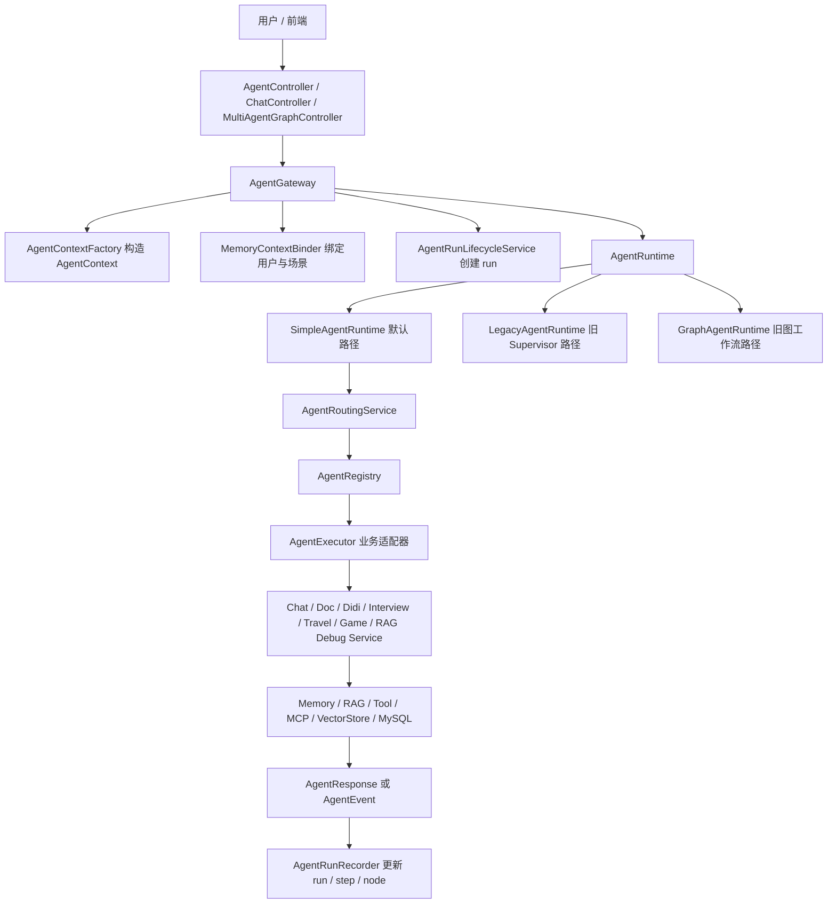
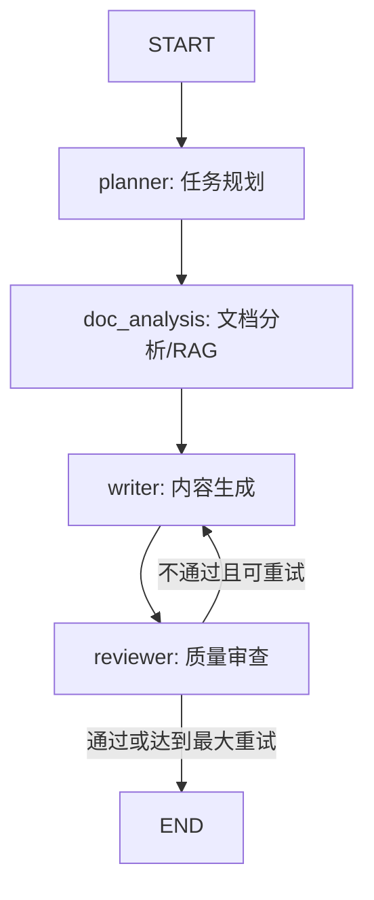

# 基于 Spring AI 的 AgentHub 多 Agent 编排平台源码深度解析

> 适用范围：`yudao-module-ordish-ai/yudao-module-ordish-ai-server`  
> 阅读目标：帮助你从“系统怎么跑起来”到“每个模块为什么这样设计”完整理解 AgentGateway、AgentRuntime、AgentExecutor、Graph Workflow、Memory、RAG、ToolGateway/MCP 与运行轨迹之间的协同关系。  
> 说明：本文按工作流和架构职责讲解，不逐个罗列所有 Java 文件。只有当某个代码块对理解关键机制很有帮助时，才点名说明。

---

## 目录

1. 项目整体定位
2. 模块总览：从用户请求到 Agent 输出
3. 统一入口 AgentGateway
4. AgentContext：贯穿全链路的运行上下文
5. AgentRuntime：Simple / Legacy / Graph 的演进关系
6. AgentRoutingService 与 RouterAgent：路由决策如何产生
7. AgentRegistry 与 AgentExecutor：业务 Agent 的统一抽象
8. 七类业务 Agent 的适配模式
9. Spring AI Alibaba Graph 多 Agent 编排链路
10. 旧 Graph Workflow 链路补充：WorkflowDispatchService + GraphExecutor + NodeHandler
11. run / step / node 三层执行轨迹
12. Memory 总体设计：短期会话记忆与长期偏好记忆
13. MySqlChatMemory：聊天历史如何落库、读取、去重和清洗
14. UserContextMemoryService：长期记忆如何被识别、分类、写入 VectorStore
15. ContextAugmentationService：RAG 上下文增强工作流
16. RetrievalOrchestrator 与混合检索在系统里的位置
17. ToolGateway：工具调用的注册、校验、策略、执行和记录
18. MCP / Function Calling：工具能力如何暴露给模型
19. 旅行规划与打车工具的业务链路
20. 控制器层如何接入统一 Agent 平台
21. 数据表设计与可观测性
22. 当前代码的设计亮点、历史包袱与后续演进建议
23. 一次完整请求的端到端时序

---

## 1. 项目整体定位

这个项目的 AI 模块不是一个单纯的“聊天接口”，而是在传统业务系统之上搭建的一层多 Agent 编排平台。它要解决的问题大致可以分成四类。

第一类是统一入口问题。系统里本来已经存在很多独立能力，例如通用聊天、文档问答、面试辅助、旅行规划、打车调度、游戏角色对话、RAG 调试等。如果每个能力都各自暴露入口、各自处理用户、会话、记忆、流式输出和运行记录，那么后续维护会非常困难。`AgentGateway` 的出现，就是为了把“请求进来后如何构造上下文、如何选择运行模式、如何触发执行、如何绑定记忆上下文、如何记录 run”这些横切逻辑集中起来。

第二类是多 Agent 抽象问题。不同业务能力背后依赖的服务完全不同：通用聊天依赖 `ChatApplicationService`，文档问答依赖 `DocApplicationService`，面试能力依赖 `InterviewApplicationService`，旅行规划依赖 `TravelPlanningApplicationService`，打车对话依赖 `DidiChatApplicationService`，RAG 调试依赖 `RedisSearchDebugService`。这些服务的输入输出结构不一样，业务语义不一样，但在 Agent 平台里都被包装成 `AgentExecutor`，对上层只暴露 `code()`、`execute()`、`stream()` 等统一方法。

第三类是编排问题。简单问题可以直接路由到一个 Agent 执行；复杂问题可能需要规划、RAG 分析、内容生成、质量审查、条件重试、最终答案沉淀等多个步骤。当前更值得放在简历主线里的是基于 Spring AI Alibaba Graph 的 `MultiAgentGraphService + MultiAgentGraphFactory`：它用 `StateGraph + CompiledGraph + OverAllState` 构建 `Planner -> DocAnalysis -> Writer -> Reviewer` 多 Agent 状态图，比早期轻量自研 `GraphExecutor + WorkflowGraph + GraphNodeHandler` 更接近真正的复杂 Agent 编排。

第四类是记忆、RAG 与工具能力。一个 Agent 平台如果只是把 prompt 发给模型，就很难真正完成复杂任务。你的项目在这方面做了三层增强：用 MySQL 保存会话历史，用 VectorStore 保存长期用户偏好和会话上下文，用 RAG 检索文档知识；同时通过 ToolRegistry、ToolGateway、Function Calling 和 MCP 让模型能调用打车、旅行规划、地图、天气等外部工具。

所以可以把这个系统概括成：

```text
用户请求
  -> Controller
  -> AgentGateway
  -> AgentContext
  -> AgentRuntime
  -> Routing
  -> AgentExecutor 或 Graph Workflow
  -> 业务服务 / RAG / Memory / Tool / MCP
  -> AgentResponse / AgentEvent
  -> run-step-node 轨迹记录
```

这个结构的关键不在“类很多”，而在于它试图把 AI 应用里最容易混乱的几件事拆清楚：入口归入口，路由归路由，执行归执行，业务能力归业务服务，记忆归记忆层，工具归工具层，轨迹归轨迹层。

---

## 2. 模块总览：从用户请求到 Agent 输出

先用一张逻辑图看整体协作：



这张图里有几个非常重要的边界。

`Controller` 层不应该理解复杂编排，它只负责接收 HTTP 请求、转换响应格式、处理 SSE。比如 `AgentController` 暴露 `/api/agent/chat`、`/api/agent/stream`、`/api/agent/runs/{runId}`，它并不判断用户到底要文档问答还是旅行规划，而是交给 `AgentGateway` 和后续路由层。

`AgentGateway` 层不应该写具体业务逻辑。它做的是“平台级运行管理”：构造上下文、绑定记忆、创建 run、选择 runtime、启动后台流式任务、结束时清理 ThreadLocal。它关心的是一次 Agent 运行的生命周期，而不是“怎么打车”“怎么检索 PDF”。

`AgentRuntime` 层决定执行模式。当前默认是 `SimpleAgentRuntime`，也就是“路由到一个 Agent，然后直接执行”。`LegacyAgentRuntime` 和 `GraphAgentRuntime` 仍然保留，但已经标记 `@Deprecated`，说明项目正在从早期的 Supervisor/Graph 混合路线向更简洁的 SimpleRuntime 和专门的 MultiAgentGraph 编排路线演进。

`AgentExecutor` 层是业务能力适配层。它的意义是把各种现有 ApplicationService 包装成统一 Agent。这样上层只需要知道 agentCode，而不必知道某个服务需要什么 DTO、返回什么对象、是否支持流式输出。

`Memory / RAG / Tool` 层不是 Agent 的附属小功能，而是 Agent 能力的基础设施。文档问答要用 RAG，通用聊天要用历史记忆，旅行规划要用 MCP 地图和天气工具，打车要用 Function Calling 或内部工具注册表。它们共同决定了 Agent 是否真的能做事。

---

## 3. 统一入口 AgentGateway

`AgentGateway` 是统一 Agent 入口。它的核心方法有三个：

```java
public AgentResponse chat(AgentRequest request)
public Flux<AgentEvent> stream(AgentRequest request)
public AiConversationTaskService.AiTaskHandle startStreamTask(AgentRequest request)
```

`chat()` 是同步调用入口。它的执行顺序非常清晰：

1. 调用 `buildContext(request)` 构造 `AgentContext`。
2. 调用 `memoryContextBinder.bind(context)` 绑定用户、会话、场景信息。
3. 调用 `runLifecycleService.createRun(context)` 创建 `agent_run` 记录。
4. 调用 `resolveRuntime(context)` 找到运行时。
5. 调用 `runtime.execute(context)` 执行。
6. finally 中清理 ThreadLocal。

这段流程说明，`AgentGateway` 不是业务执行者，而是运行生命周期的协调者。它把一次请求包装成一次“可追踪、可记忆、可路由、可切换运行时”的 Agent run。

流式入口更复杂一些。`stream()` 本身并不直接执行 runtime，而是调用 `startStreamTask()`，拿到后台任务的 SSE Flux 后，把字符串 chunk 包装成 `AgentEvent.chunk(...)`。这里有一个关键设计：后台 AI 任务和前端 SSE 连接被解耦。代码注释里也说明了“客户端断开不影响后台执行”。这对真实 AI 应用很重要，因为模型调用可能很慢，用户浏览器断开并不一定意味着服务端应该立刻杀掉任务。

`startStreamTask()` 的顺序是：

1. 构造 `AgentContext`。
2. 绑定 memory context。
3. 立刻清理当前线程 ThreadLocal。
4. 创建 run。
5. 解析 runtime。
6. 通过 `AiConversationTaskService.startStreamTask(...)` 启动后台任务。
7. 给 handle 设置 runId 和 agentCode。
8. 注册 onComplete 和 onError 回调，负责 finishRun。

这里有一个值得理解的点：为什么绑定后又立刻清理 ThreadLocal？因为流式任务会转移到后台线程执行，当前 HTTP 请求线程上的 ThreadLocal 如果一直保留，容易污染后续请求。真正执行时，相关上下文应该通过 `AgentContext`、缓存或后台任务内部绑定来传递，而不是依赖当前请求线程永久持有。

`resolveRuntime()` 当前优先选择 `RuntimeMode.SIMPLE`：

```java
AgentRuntime runtime = runtimes.get(RuntimeMode.SIMPLE);
if (runtime != null) {
    return runtime;
}
runtime = runtimes.get(RuntimeMode.LEGACY);
...
```

这说明截图或旧设计文档中提到的 `LEGACY | GRAPH` 双运行时切换已经发生演进：现在主路径是 SimpleRuntime。如果 SimpleRuntime 不存在，才 fallback 到 LegacyRuntime。`GraphAgentRuntime` 仍然存在，但不是这个方法里的优先路径。

这个变化很关键。它反映出项目架构已经从“统一入口后面直接挂 Legacy 或 Graph”转为“日常业务走简单直接路径，复杂工作流另有专门图编排接口”。这其实是更健康的设计：不是所有请求都应该进图，简单请求直接执行能降低复杂度、延迟和故障面。

---

## 4. AgentContext：贯穿全链路的运行上下文

`AgentContext` 是一次 Agent 运行的上下文载体。它包含：

```java
private String runId;
private Long tenantId;
private Long userId;
private String sessionId;
private String scene;
private String entryAgentCode;
private String routedAgentCode;
private String workflowCode;
private String workflowVersion;
private String runtimeMode;
private String traceId;
private String input;
private String fileId;
private Map<String, Object> variables;
private AgentRequest request;
private LocalDateTime createdAt;
```

这些字段可以分成几组理解。

第一组是身份与租户：`tenantId`、`userId`、`traceId`。它们来自 `EnterpriseContextResolver` 和 `LoginUserResolver`。这组字段决定了本次运行属于哪个租户、哪个用户，以及在企业系统里如何追踪链路。

第二组是会话与场景：`sessionId`、`scene`。`sessionId` 用于聊天历史、向量记忆、文档检索的会话隔离；`scene` 用于区分 chat、doc、didi、interview、game、travel 等业务场景。

第三组是 Agent 与工作流：`entryAgentCode`、`routedAgentCode`、`workflowCode`、`workflowVersion`、`runtimeMode`。`entryAgentCode` 表示请求入口指定或初始解析出的 Agent；`routedAgentCode` 表示真正路由后的目标 Agent；`workflowCode` 表示运行对应的工作流定义，例如 `general-chat-v1`、`doc-qa-rag-v1`、`travel-planning-v1`。

第四组是输入与扩展：`input`、`fileId`、`variables`、`request`。`input` 是用户原始问题；`fileId` 常用于文档问答；`variables` 是灵活扩展字段，例如面试 skillCode、旅行规划 DTO 字段、RAG 调试 mode/key/term、强制图执行 flag 等。

`AgentContextFactory` 负责创建它。创建逻辑包括：

1. request 为空时创建安全空对象。
2. 从 request.userId 或当前 HTTP 请求解析 userId。
3. 如果 request.sessionId 为空，则生成 `agent-session-UUID`。
4. 解析企业身份，得到 tenantId 和 traceId。
5. 根据 agentCode 解析 workflowCode。
6. 构造 runId，格式为 `run-UUID`。
7. 设置 runtimeMode 为 `"simple"`。

这个设计让 `AgentContext` 成为跨层协议。上层控制器不需要知道内部怎么路由；下层 AgentExecutor 也不需要重新解析用户身份、租户、会话、traceId。所有关键运行元数据都集中在 context 里。

不过它也有一个架构上的代价：当前 `AgentContext` 是可变对象，运行过程中会被多处修改，例如 `setRoutedAgentCode()`、`setUserId()`、`variables.put(...)`。这带来灵活性，也带来状态追踪难度。旧设计文档里提到过未来可以引入 `AgentState`，把运行状态和业务上下文拆开，这是合理方向。当前实现里需要特别注意：任何 Executor 或 NodeHandler 修改 context，都会影响后续节点和 run 记录。

---

## 5. AgentRuntime：Simple / Legacy / Graph 的演进关系

`AgentRuntime` 是运行时接口：

```java
public interface AgentRuntime {
    AgentResponse execute(AgentContext context);
    Flux<AgentEvent> stream(AgentContext context);
    RuntimeMode mode();
}
```

它抽象了“给定一个 AgentContext，如何产生 AgentResponse 或 AgentEvent”。项目里有三个实现：`SimpleAgentRuntime`、`LegacyAgentRuntime`、`GraphAgentRuntime`。

### 5.1 SimpleAgentRuntime：当前默认主路径

`SimpleAgentRuntime` 使用 `@ConditionalOnProperty(name = "ordish.ai.agent.runtime-mode", havingValue = "simple", matchIfMissing = true)`，说明如果没有显式配置，默认启用 simple。

它的 `execute()` 很直：

```java
String agentCode = agentRoutingService.resolveAgentCode(context);
context.setRoutedAgentCode(agentCode);
AgentExecutor executor = agentRegistry.getRequired(agentCode);
AgentResponse response = executor.execute(context);
```

这个路径没有 Supervisor，也没有 Graph。它依赖 `AgentRoutingService` 解析目标 Agent，然后从 `AgentRegistry` 拿到 executor，直接执行。

这条路径适合绝大多数单 Agent 任务：通用聊天、打车问答、面试问答、旅行规划、文档问答等。它的优点是低复杂度、低延迟、容易理解。它的缺点是没有内置多节点审查、重试、条件分支等能力。

流式方法也是类似逻辑，只是多了一个判断：

```java
if (executor instanceof StreamingAgentExecutor streamingExecutor) {
    return streamingExecutor.stream(context);
}
AgentResponse response = executor.execute(context);
return Flux.just(AgentEvent.finalAnswer(response));
```

这说明流式能力不是所有 Agent 必须实现的。支持真正流式输出的 Agent 实现 `StreamingAgentExecutor`；不支持的 Agent 退化为一次性 final event。

### 5.2 LegacyAgentRuntime：旧 Supervisor 路径

`LegacyAgentRuntime` 被标记为 `@Deprecated`。它内部只是委托 `SupervisorAgent`：

```java
return supervisorAgent.execute(context);
return supervisorAgent.stream(context);
```

这个 runtime 的价值在于保留旧链路兼容。`SupervisorAgent` 负责路由、绑定记忆上下文、调用目标 Agent、记录 step 和 finishRun。早期系统可能主要靠它完成统一编排。

但从当前代码看，Legacy 的职责已经和 SimpleRuntime、AgentRoutingService、AgentRunLifecycleService 等新抽象有重叠。比如路由既可以发生在 `SupervisorAgent.resolveTarget()`，也可以发生在 `AgentRoutingService.resolveAgentCode()`。这就是旧设计文档里提到的“职责重叠”问题。

### 5.3 GraphAgentRuntime：旧自研图路径

`GraphAgentRuntime` 也被标记为 `@Deprecated`，并且只有配置 `ordish.ai.agent.runtime-mode=graph` 时才启用。

它的执行流程是：

1. `resolveAgent(context)`：如果没有 entryAgentCode，则通过 `AgentRoutingService` 解析。
2. `workflowDispatchService.decide(context)`：判断走 SIMPLE 还是 GRAPH。
3. SIMPLE 时调用 `simpleWorkflowExecutor.execute(context)`。
4. GRAPH 时调用 `executeGraph(context)`。
5. 执行结束后 `agentRunRecorder.finishRun(...)`。

这条路径说明早期设计想把 simple 与 graph 都放在 GraphRuntime 内部分发。但现在 SimpleRuntime 已经独立出来，GraphAgentRuntime 也被废弃，说明架构正在调整。

### 5.4 三者关系总结

可以这样理解：

```text
SimpleAgentRuntime
  当前默认路径，适合单 Agent 直接执行。

LegacyAgentRuntime
  早期 Supervisor 编排路径，保留兼容。

GraphAgentRuntime
  早期自研 WorkflowGraph 路径，保留但已废弃。

MultiAgentGraphService
  当前更正统的复杂图编排入口，不挂在 AgentGateway 默认 runtime 后面，而是通过 /api/agent/graph 单独进入。
```

这个状态很真实：项目并不是一次性设计完成，而是在演进中逐步把旧职责拆出来。写架构文档时必须区分“设计理想态”和“当前实际运行态”。当前实际态是：普通 `/api/agent/chat` 走 AgentGateway -> SimpleAgentRuntime -> AgentRoutingService -> AgentExecutor；复杂 `/api/agent/graph/run` 走 MultiAgentGraphService。

---

## 6. AgentRoutingService 与 RouterAgent：路由决策如何产生

路由层解决的是“这次请求应该由哪个 Agent 处理”。

当前有两个相关组件：`RouterAgent` 和 `DefaultAgentRoutingService`。

`RouterAgent` 是规则路由器。它定义了几个 agentCode 常量：

```java
DOC_QA = "doc_qa"
TRAVEL = "travel"
INTERVIEW = "interview"
DIDI = "didi"
GAME = "game"
RAG_DEBUG = "rag_debug"
GENERAL_CHAT = "general_chat"
```

然后维护若干关键词列表。例如包含“文档、PDF、总结、资料、RAG、引用”时倾向 `doc_qa`；包含“旅行、行程、景点、天气、路线、预算、酒店”时倾向 `travel`；包含“打车、叫车、司机、车牌、机场、出发地、目的地”时倾向 `didi`。

`route(AgentRequest request)` 返回简单字符串 agentCode；`routeWithResult(...)` 返回结构化结果 `RoutingResult`，里面包含 agentCode、source、confidence、matchedKeywords。

但 RouterAgent 本身也实现了 `AgentExecutor`，同时 `supports()` 永远返回 false。这说明它不是业务 Agent，而是历史上为了复用 Agent 接口做出的折中。当前真正应该被上层使用的是 `AgentRoutingService`，而不是直接把 RouterAgent 当业务 executor。

`DefaultAgentRoutingService` 是统一路由服务，它的优先级更完整：

1. 如果 `context.routedAgentCode` 已经存在，直接使用。
2. 如果 `context.entryAgentCode` 存在，使用入口 Agent。
3. 如果 `request.agentCode` 存在，使用请求指定 Agent。
4. 如果 `variables["agentCode"]` 存在，使用变量覆盖。
5. 否则调用 `RouterAgent.routeWithResult()` 做关键词 / fileId 路由。
6. 全部失败时 fallback 到 `general_chat`。

这套优先级很重要。它保证显式指定永远优先于自动猜测。例如前端明确传 `agentCode=travel`，系统不会因为输入里有“文档”两个字就改路由到 doc_qa。只有当请求没有明确指定时，RouterAgent 才用关键词判断。

还有一个保护逻辑：RouterAgent 自己不能作为业务目标返回。如果路由结果是 `"router"`，会 fallback 到 general_chat。这避免出现“路由到路由器自己”导致递归或无意义执行。

路由完成后，`resolveAgentCode(context)` 会把结果写回 `context.routedAgentCode`，并打印日志，日志包括 runId、sessionId、source、agentCode、confidence、keywords、inputPreview。这对排查“为什么这个问题被分给某个 Agent”非常有价值。

---

## 7. AgentRegistry 与 AgentExecutor：业务 Agent 的统一抽象

`AgentExecutor` 是每个业务 Agent 必须实现的接口：

```java
String code();
String name();
String description();
List<String> capabilities();
boolean supports(AgentRequest request);
AgentResponse execute(AgentContext context);
default Flux<AgentEvent> stream(AgentContext context) { ... }
```

这个接口的设计有两个层面。

第一层是元信息：`code`、`name`、`description`、`capabilities`。这些信息不仅给后端路由使用，也可以给前端展示 Agent 卡片、能力标签、描述文案。

第二层是执行能力：`execute` 和 `stream`。`execute` 是同步执行；`stream` 默认把同步结果包装成 final event。如果某个 Agent 要真正流式输出，可以实现 `StreamingAgentExecutor` 并覆盖 stream。

`AgentRegistry` 的职责是收集所有 Spring 容器里的 `AgentExecutor` Bean，按 code 建立 Map。构造函数会做去重检查：

```java
AgentExecutor previous = map.putIfAbsent(executor.code(), executor);
if (previous != null) {
    throw new IllegalStateException("Duplicate agent code: " + executor.code());
}
```

这说明 agentCode 是平台级唯一标识。如果两个 Agent 使用相同 code，系统启动时就应该失败，而不是运行时随机挑一个。

`AgentRegistry` 还提供：

```java
getRequired(code)
find(code)
list()
listEnriched(definitionFactory)
match(request)
describe()
```

`listEnriched()` 会结合 `AgentDefinitionFactory`，把静态定义里的 icon、targetUrl、category、riskLevel、workflowCode、visible、enabled 等信息合并到 `AgentInfo`。这说明 Agent 平台不仅是后端执行系统，也支持前端工作台展示。

从架构上看，`AgentRegistry` 是“插件式 Agent 收集器”。你新增一个 Agent，只要实现 `AgentExecutor` 并注册为 Spring Bean，就能进入统一注册表。上层 runtime 不需要修改 switch-case，也不需要知道具体类名。

---

## 8. 七类业务 Agent 的适配模式

项目里当前主要有七个业务 Agent 适配器：

```text
GeneralChatAgent
DocQaAgent
DidiAgent
InterviewAgent
TravelAgent
GameAgent
RagDebugAgent
```

它们的共同模式是：对上实现 `AgentExecutor`，对下调用已有 ApplicationService。也就是说，它们不是重写业务逻辑，而是把已有能力接进 AgentHub。

### 8.1 GeneralChatAgent

`GeneralChatAgent` 对接 `ChatApplicationService`。它支持流式输出，所以实现了 `StreamingAgentExecutor`。

同步执行时，它调用：

```java
chatApplicationService.chat(context.getInput(), sessionId)
    .collectList()
    .map(chunks -> String.join("", chunks))
    .block(Duration.ofMillis(timeoutMs));
```

这里说明原始聊天服务本来就是 Flux chunk 形式。同步 Agent 需要把 chunk 收集起来拼成完整答案。它还使用 `OrdishAiTimeoutProperties` 做超时控制，如果 block 超时，会抛出 `LlmTimeoutException`，并把 runId、sessionId、agentCode、timeoutMs 写入错误信息。

流式执行时，它直接把 `chatApplicationService.chat(...)` 的 chunk 映射成 `AgentEvent.chunk(...)`，最后 concat 一个 finalAnswer。这个 finalAnswer 很重要，因为流式消费者不仅需要逐字输出，也需要知道完整响应何时结束、最终状态是什么。

### 8.2 DocQaAgent

`DocQaAgent` 对接 `DocApplicationService`：

```java
String answer = docApplicationService.chat(context.getInput(), context.getSessionId());
return AgentResponse.success(context, code(), answer, answer);
```

表面看它很薄，但背后 `DocApplicationService` 会进入文档 RAG、上下文增强、向量检索、模型调用等流程。适配器的价值是把复杂文档问答压缩成统一 Agent 执行入口。

### 8.3 DidiAgent

`DidiAgent` 对接 `DidiChatApplicationService`。它的能力标签包括 `didi_chat` 和 `function_calling`，说明它背后可能通过 Spring AI Function Calling 调用打车工具，例如创建订单、查询订单、取消订单。

它和 DocQaAgent 一样保持很薄：

```java
String answer = didiChatApplicationService.chat(context.getInput(), context.getSessionId());
return AgentResponse.success(context, code(), answer, answer);
```

这种设计让打车业务的工具调用、订单逻辑、提示词工程留在 Didi 应用服务内部，Agent 层只做统一接入。

### 8.4 InterviewAgent

`InterviewAgent` 对接 `InterviewApplicationService`。它会从 `context.variables` 中读取 `skillCode`：

```java
String skillCode = value(context, "skillCode");
InterviewChatResponse response =
    interviewApplicationService.chat(context.getInput(), context.getSessionId(), skillCode);
```

这说明 AgentContext.variables 是一个很重要的扩展点。对于通用 Agent，只要 input 和 sessionId 就够了；对于面试 Agent，还需要指定技能路线，比如 Java 基础、JVM 深挖、项目挑战、简历追问等。variables 避免了为每个 Agent 都扩展 AgentRequest 字段。

### 8.5 TravelAgent

`TravelAgent` 对接 `TravelPlanningApplicationService`，它比前几个更复杂，因为旅行规划需要结构化请求。

它先尝试把 `context.variables` 转成 `TravelPlanRequest`：

```java
request = objectMapper.convertValue(variables, TravelPlanRequest.class);
```

然后补齐 `userIntent`、`conversationId`、`source`：

```java
if (!StringUtils.hasText(request.getUserIntent())) {
    request.setUserIntent(context.getInput());
}
if (!StringUtils.hasText(request.getConversationId())) {
    request.setConversationId(context.getSessionId());
}
if (!StringUtils.hasText(request.getSource())) {
    request.setSource(context.getScene());
}
```

这体现了适配器的典型职责：把平台通用上下文转换成业务服务需要的 DTO。业务服务不需要知道 AgentContext，Agent 层也不需要理解旅行规划内部细节。

### 8.6 GameAgent

`GameAgent` 对接 `PersonaChatApplicationService`，支持角色对话和流式输出。它调用 `chatWithUserId(input, sessionId, userId)`，说明游戏场景下用户身份会影响个性化记忆或角色状态。

它的流式逻辑和 GeneralChatAgent 类似：累积 chunk，最后输出 finalAnswer。

### 8.7 RagDebugAgent

`RagDebugAgent` 对接 `RedisSearchDebugService`，用于检索调试。它从 variables 中读取 `mode`、`term`、`key`，根据模式调用：

```java
singleDocRepro(term)
inspectKey(key, term)
probe(sessionId, term)
```

这类 Agent 不一定面向普通用户，而是面向开发调试。把它也纳入统一 AgentRegistry 的好处是可以复用 run 记录、路由、上下文和统一接口。

### 8.8 适配器模式的意义

这些 Agent 的共同特点是“薄”。它们并不把业务重写一遍，而是把已有业务服务包装成标准 Agent。这样做有三个好处：

1. 旧业务服务可以继续被原控制器使用，不被 Agent 平台绑死。
2. AgentGateway 可以统一调度所有能力。
3. 未来要加图编排时，图节点只需要调用 AgentExecutor，不需要理解每个业务服务的 DTO 和异常。

这也是你截图里提到 `AgentGateway + AgentRuntime + AgentExecutor` 抽象多 Agent 统一入口的核心意义。

---

## 9. Spring AI Alibaba Graph 多 Agent 编排链路

这一块可以作为你简历里原来 “Graph Workflow 编排链路” 的升级版表述。推荐替换为：

> **实现 Spring AI Alibaba Graph 多 Agent 编排链路**：基于 `StateGraph` 构建 `Planner -> DocAnalysis -> Writer -> Reviewer` 状态图，支持 RAG 分析、质量审查、条件重试和 `run、node` 轨迹追踪。

这句话比原来的 `WorkflowDispatchService + GraphExecutor + NodeHandler` 更有含金量，因为它强调的是已经落地到 Spring AI Alibaba Graph 的状态图编排，而不是早期自研顺序图执行器。原来的链路更多是“把请求拆成 load_context、route、agent、final 几个节点顺序跑”；新的链路更像真正的多 Agent 协作：Planner 负责规划，DocAnalysis 负责 RAG 文档分析，Writer 负责生成草稿，Reviewer 负责质量审查和决定是否回到 Writer 重写。

---

项目里这套更现代的多 Agent 图编排主要由以下类组成：

```text
MultiAgentGraphController
MultiAgentGraphService
MultiAgentGraphFactory
PlannerNode
DocAnalysisNode
WriterNode
ReviewerNode
MultiAgentGraphRunRecorder
GraphEventPublisher
GraphStateSupport
```

入口是 `/api/agent/graph/run` 和 `/api/agent/graph/stream`。它不是通过 AgentGateway 默认 runtime 进入，而是有专门 Controller。这说明它被定位为“复杂工作流能力”，不是所有 Agent 请求的默认路径。

### 9.1 MultiAgentGraphService：运行图工作流

`MultiAgentGraphService.run(request)` 的流程：

1. 校验 request，要求 input 非空，workflowCode 必须是支持的 `doc-report-v1`。
2. 生成 runId，格式为 `graph-UUID`。
3. 创建 AgentContext，scene 为 workflow，entryAgentCode 和 routedAgentCode 都是 `multi_agent_graph`。
4. `runRecorder.startRun(context)` 创建 run。
5. 创建 `GraphExecutionObserver`。
6. 调用 `graphFactory.createGraph(observer)` 构建图。
7. 调用 `graph.invoke(initialState(...))` 执行。
8. 从最终 state 解析 finalAnswer。
9. finishRun，并返回 GraphRunResponse。

流式版本 `stream(request)` 则使用 `Flux.create` 和 `GraphEventPublisher`，在 boundedElastic 线程中执行图，并把节点开始、节点完成、运行结束等事件通过 SSE 发给前端。

这里的设计比旧 GraphExecutor 更完整，因为它有 StateGraph、条件边、最大迭代次数、事件发布和独立 run recorder。

### 9.2 MultiAgentGraphFactory：定义图结构

`MultiAgentGraphFactory.createGraph(observer)` 构建的图是：

```text
START
  -> planner
  -> doc_analysis
  -> writer
  -> reviewer
  -> 条件分支：
       如果 reviewPassed 或 retryCount 达到上限 -> END
       否则 -> writer
```

对应 Mermaid：



这个图已经是真正的多 Agent 协作。Planner 不直接回答，DocAnalysis 提供材料，Writer 生成草稿，Reviewer 判断质量，不通过时把反馈写回状态，Writer 根据反馈重写。

`compiledGraph.setMaxIterations(8)` 是安全保护，避免条件边循环导致无限执行。

### 9.3 StateGraph 的状态键

`stateFactory()` 注册了很多 key 的合并策略：

```java
RUN_ID, USER_ID, SESSION_ID, CHAT_ID, WORKFLOW_CODE, INPUT, FILE_ID, VARIABLES,
PLAN, DOC_ANALYSIS, DRAFT, REVIEW_RESULT, FINAL_ANSWER,
REVIEW_PASSED, RETRY_COUNT
```

每个 key 的策略都是新值覆盖旧值。也就是说，这个图的状态模型是“每个节点输出部分字段，写回全局 state”。Planner 写 PLAN，DocAnalysis 写 DOC_ANALYSIS，Writer 写 DRAFT，Reviewer 写 REVIEW_RESULT / REVIEW_PASSED / RETRY_COUNT / FINAL_ANSWER。

这比旧 AgentContext.variables 更清晰，因为状态键被集中定义，节点之间通过约定好的键传递信息。

### 9.4 PlannerNode

PlannerNode 是任务规划 Agent。它的职责不是回答用户，而是把复杂目标拆成执行计划。它调用 ChatClient：

```java
chatClientBuilder.defaultSystem(SYSTEM_PROMPT)
    .build()
    .prompt()
    .user("用户复杂任务：\n" + input)
    .call()
    .content();
```

输出写入 `GraphStateKeys.PLAN`。这一步的意义是把用户自然语言目标变成后续节点可参考的结构化任务理解。

### 9.5 DocAnalysisNode

DocAnalysisNode 是 RAG 分析节点。它读取 input、plan、chatId/sessionId，然后构造查询：

```text
请检索与以下任务相关的文档内容：{input}。任务计划：{plan}
```

它优先调用：

```java
retrievalOrchestrator.retrieveAsDocuments("doc", query, retrievalSessionId, null)
```

如果没有检索到结果，则 fallback 到：

```java
retrievalOrchestrator.retrieveAllChunksMultiDocType(retrievalSessionId)
```

然后把检索到的文档片段渲染成 RAG 上下文，再调用模型生成结构化分析，输出 `DOC_ANALYSIS`。

这个节点的关键价值是把“文档检索”和“文档理解”从 Writer 中拆出来。Writer 不需要自己检索文档，只需要读 `DOC_ANALYSIS`。

### 9.6 WriterNode

WriterNode 是内容生成 Agent。它读取：

1. 用户目标 INPUT
2. 执行计划 PLAN
3. 文档分析 DOC_ANALYSIS
4. 审查反馈 REVIEW_RESULT
5. 当前重试次数 RETRY_COUNT

然后生成草稿 DRAFT。

如果 Reviewer 不通过，图会回到 Writer，此时 REVIEW_RESULT 已经存在，Writer 的 prompt 会把审查反馈纳入生成。这形成了“生成-审查-修正”的闭环。

### 9.7 ReviewerNode

ReviewerNode 是质量审查 Agent。它要求模型只输出 JSON：

```json
{
  "passed": true,
  "reason": "...",
  "finalAnswer": "...",
  "revisionAdvice": "..."
}
```

它解析 JSON 后决定：

1. `REVIEW_RESULT`：保存审查结果。
2. `REVIEW_PASSED`：如果通过，或者达到最大重试次数，就置 true。
3. `RETRY_COUNT`：不通过时加一。
4. `FINAL_ANSWER`：通过或强制结束时写入最终答案。

`MAX_RETRY_COUNT = 1`，说明最多允许一次重写。这样既能提升质量，又不会无限消耗模型调用。

### 9.8 MultiAgentGraphRunRecorder

这套图编排也复用 `AgentRunRecorder` 创建和结束 run，但节点记录由 `MultiAgentGraphRunRecorder` 更细地处理。

节点开始时插入 `agent_node_execution`：

```java
nodeId = nodeCode
nodeType = PLANNER / RAG / AGENT / VERIFIER
status = RUNNING
inputJson = state input
startedAt = now
retryCount = state.retryCount
```

节点结束时根据之前保存的 id 更新：

```java
status = DONE 或 FAILED
outputJson = output
errorJson = error
finishedAt = now
latencyMs = latency
```

它用 `ConcurrentHashMap<String, Long> nodeExecutionIds` 维护 runId + nodeCode 到数据库 id 的映射。这样 nodeStarted 插入后，nodeFinished 能找到同一条记录更新。

这套机制就是 `run、node` 执行轨迹里的 node 层。对于图编排来说，node 层很关键，因为用户需要知道复杂任务卡在哪个节点、哪个节点耗时最长、哪个节点失败。

---

## 10. 旧 Graph Workflow 链路补充：WorkflowDispatchService + GraphExecutor + NodeHandler

旧图执行链路主要由这些类组成：

```text
WorkflowDispatchService
DefaultWorkflowDispatchService
GraphAgentRuntime
WorkflowGraphFactory
WorkflowGraph
WorkflowNode
WorkflowEdge
GraphExecutor
GraphNodeHandler
LoadContextNodeHandler
RouterNodeHandler
AgentNodeHandler
FinalNodeHandler
```

这些类大多已经标记 `@Deprecated`，但理解它们仍然很重要，因为它们体现了项目最初对 Graph Workflow 的设计思路。

### 10.1 WorkflowDispatchService：判断是否需要图执行

`DefaultWorkflowDispatchService.decide(context)` 根据几个规则决定 SIMPLE 还是 GRAPH：

1. `variables.forceGraph == true` 时走 GRAPH。
2. `variables.workflowType == "graph"` 时走 GRAPH。
3. workflowCode 在复杂工作流白名单中时走 GRAPH，例如 `rag-debug-v1`。
4. variables 中出现 `requireApproval`、`requireVerifier`、`requireToolNode`、`multiStep` 等复杂特性时走 GRAPH。
5. 默认走 SIMPLE。

这个设计很实用：不是所有请求都进图，而是用显式 flag 或复杂能力需求触发图模式。图编排虽然强大，但会引入更多节点、更多记录、更多失败点。如果简单聊天也强行进图，会浪费性能。

### 10.2 WorkflowGraphFactory：默认图结构

`WorkflowGraphFactory.createDefaultGraph(agentCode)` 生成一个固定四节点图：

```text
load_context -> route -> agent -> final
```

节点含义：

`load_context`：准备上下文，写入变量，例如 loadContextDone、graphStartTime、inputNormalized、sessionId、scene、hasFile。

`route`：调用路由服务解析目标 Agent，把路由来源、置信度、命中关键词写入 variables。

`agent`：找到 AgentExecutor 并执行。

`final`：标记 finalized、graphFinishedAt，并从 variables.agentOutput 提取最终输出。

这个图结构非常像一个可观测的“标准 Agent 执行链”。它不一定比 SimpleRuntime 更强，但它能把执行拆成多个节点，便于记录每个节点的耗时、状态、输入输出。

### 10.3 GraphExecutor：顺序执行图节点

`GraphExecutor.execute(graph, context)` 是自研图执行器。它从第一个节点开始，用 while 循环顺序执行：

```java
String currentNodeId = graph.getNodes().isEmpty() ? null : graph.getNodes().get(0).getNodeId();
while (currentNodeId != null) {
    WorkflowNode node = graph.getNode(currentNodeId);
    GraphNodeHandler handler = handlers.get(node.getNodeType());
    GraphNodeHandleResult result = handler.handle(node, context);
    recordNodeExecution(...);
    currentNodeId = graph.getNextNodeId(currentNodeId);
}
```

它目前只取第一条 outgoing edge，所以是顺序链路，不是真正复杂 DAG。条件分支、并行节点、循环重试等能力并不完整。这也是后来引入 Spring AI Alibaba Graph 的原因之一。

不过它有一个重要功能：每个节点执行后都会调用 `recordNodeExecution(...)` 写入 `agent_node_execution`。这让图执行具备节点级可观测性。

### 10.4 LoadContextNodeHandler

`LoadContextNodeHandler` 不调用 LLM、RAG 或 Memory，只做轻量上下文准备。它把一些派生信息写入 `context.variables`：

```java
vars.put("loadContextDone", true);
vars.put("graphStartTime", System.currentTimeMillis());
vars.put("inputNormalized", context.getInput().trim());
vars.put("sessionId", context.getSessionId());
vars.put("scene", context.getScene());
vars.put("hasFile", true);
```

这类节点的意义是把“上下文规范化”从业务 Agent 中拿出来。后续节点可以假设 variables 中已经有标准字段。

### 10.5 RouterNodeHandler

`RouterNodeHandler` 调用 `AgentRoutingService.route(context)`，把结果写回：

```java
context.setRoutedAgentCode(agentCode);
vars.put("routingSource", result.getSource());
vars.put("routingConfidence", result.getConfidence());
vars.put("matchedKeywords", result.getMatchedKeywords());
```

这说明 Graph 模式下的路由不仅要得到目标 Agent，还要沉淀路由解释信息。调试时可以知道为什么路由到某个 Agent。

### 10.6 AgentNodeHandler

`AgentNodeHandler` 负责真正执行业务 Agent。它从多个来源解析 agentCode：

1. node.agentCode
2. context.routedAgentCode
3. context.entryAgentCode
4. context.request.agentCode

然后从 `AgentRegistry` 找 executor，通过 `AgentExecutorNodeAdapter` 执行。执行结果写入：

```java
vars.put("agentOutput", response.getOutput());
vars.put("agentCode", agentCode);
context.setRoutedAgentCode(agentCode);
```

这里的关键思想是：图节点不直接依赖具体业务服务，而是依赖 AgentExecutor 抽象。这样图编排层和业务能力层解耦。

### 10.7 FinalNodeHandler

`FinalNodeHandler` 标记图结束：

```java
vars.put("finalized", true);
vars.put("graphFinishedAt", System.currentTimeMillis());
```

并从 `agentOutput` 提取最终输出。它不调用 LLM、不调用工具，只负责收尾。

### 10.8 旧图链路的价值与限制

价值：

1. 把 run 拆成 node，增强可观测性。
2. 让路由、上下文加载、Agent 执行有明确节点边界。
3. 为未来 approval、tool、memory、verifier 等节点预留模型。

限制：

1. 当前执行是线性链路，不是真正复杂图。
2. GraphAgentRuntime 已废弃，说明主线不再依赖它。
3. NodeHandler 修改同一个 AgentContext，状态隔离不强。
4. SIMPLE 和 GRAPH 分发逻辑与 SimpleRuntime 有重复。

所以旧图链路更像一个架构试验版本。它已经把 node 轨迹、节点类型、图执行器的基础概念搭起来，但复杂多 Agent 编排更适合交给后面的 Spring AI Alibaba Graph 链路。

---

## 11. run / step / node 三层执行轨迹

项目里执行轨迹主要围绕三张表：

```text
agent_run
agent_step
agent_node_execution
```

### 11.1 agent_run：一次完整运行

`agent_run` 对应一次用户请求或一次图工作流运行。由 `AgentRunRecorder.createRun(context)` 插入：

```java
runId
tenantId
userId
sessionId
entryAgentCode
workflowCode
workflowVersion
runtimeMode
routedAgentCode
scene
traceId
userInput
status = running
createdAt
updatedAt
```

执行结束后 `finishRun(...)` 更新：

```java
routedAgentCode
workflowCode
finalOutput
status
errorMessage
latencyMs
updatedAt
```

run 层回答的是：“这次运行是谁发起的、属于哪个会话、走了哪个 Agent/Workflow、最终成功还是失败、用了多久、最终输出是什么。”

### 11.2 agent_step：AgentExecutor 级步骤

`recordStep(...)` 写入：

```java
runId
tenantId
stepNo
agentCode
workflowCode
stepType
inputJson
outputJson
status
errorMessage
latencyMs
createdAt
```

在 Legacy Supervisor 中，每次 AgentExecutor 执行结束后会记录一个 step。step 层适合描述“第几步调用了哪个 Agent”。对于 SimpleRuntime 当前代码来说，默认 runtime 本身没有直接记录 step，这意味着当前 run 记录完整，但 step 记录可能依赖具体旧链路或后续补充。

### 11.3 agent_node_execution：图节点执行

`agent_node_execution` 记录图节点级别的信息：

```text
node_id
node_type
node_name
agent_code
tool_name
status
input_json
output_json
error_json
started_at
finished_at
latency_ms
parent_node_id
retry_count
```

旧 GraphExecutor 和新 MultiAgentGraphRunRecorder 都会写这张表。它回答的是：“图里的每个节点是否执行、输入是什么、输出是什么、失败原因是什么、耗时多少、是否重试。”

### 11.4 三层轨迹的设计意义

三层轨迹的粒度不同：

```text
run：一次用户请求或工作流整体
step：业务 Agent 执行步骤
node：图编排内部节点
```

对于普通单 Agent 请求，run 已经能说明大部分问题；对于 Supervisor 多步执行，step 能说明路由和执行；对于 Graph 工作流，node 能说明 planner、RAG、writer、reviewer 的细节。

这套设计非常适合做可观测性面板。未来可以基于 runId 展示一条时间线：

```text
run started
  node planner RUNNING -> DONE 1200ms
  node doc_analysis RUNNING -> DONE 2300ms
  node writer RUNNING -> DONE 1800ms
  node reviewer RUNNING -> FAILED 900ms
run failed
```

这样开发者和用户都能理解 Agent 不是一个黑箱。

---

## 12. Memory 总体设计：短期会话记忆与长期偏好记忆

项目里的 Memory 不是单一实现，而是两条互补链路：

第一条是 MySQL 聊天历史记忆。它由 `MySqlChatMemory` 实现 Spring AI 的 `ChatMemory` 接口，把 user/assistant 消息存入 `chat_history` 表，用于恢复最近对话。

第二条是 VectorStore 用户上下文记忆。它由 `UserContextMemoryService` 和 `UserContextRetrievalService` 负责，把用户长期偏好、会话上下文、任务上下文写入向量库，用于后续 RAG prompt 增强。

两者区别如下：

| 维度 | MySqlChatMemory | UserContextMemoryService |
|---|---|---|
| 存储 | MySQL `chat_history` | VectorStore |
| 内容 | 原始聊天消息 | 抽取后的偏好/上下文 |
| 粒度 | user/assistant 消息 | global/session/task memory |
| 用途 | 聊天历史回放 | 个性化上下文增强 |
| 写入时机 | ChatMemory.add | buildPrompt 时 trySave |
| 检索方式 | 按 userId + conversationId 查询 | similaritySearch + metadata filter |

### 12.1 ChatMemoryUserContext 的桥接作用

AI 流式任务经常跨线程执行，而 Spring MVC 的 request 上下文和 ThreadLocal 并不总是稳定可用。`ChatMemoryUserContext` 用三种方式保存和解析 userId、scene、skillCode：

1. request attribute
2. ThreadLocal
3. Caffeine conversation cache

例如 bind userId 时：

```java
THREAD_LOCAL_USER_ID.set(userId);
request.setAttribute("chat_memory_user_id", userId);
conversationUserIdCache.put(conversationId, userId);
```

解析时按 request -> ThreadLocal -> cache 的顺序找。这样即使后台线程没有原始 HTTP request，也可以通过 conversationId 找回 userId。

这在流式 AI 任务中非常重要。模型回调、ChatMemory 自动写入、后台任务完成保存 assistant 消息时，都可能不在原始请求线程中。如果没有这个桥接层，记忆写入就很容易因为拿不到 userId 而失败。

### 12.2 MemoryContextBinder

`AgentGateway` 在执行前调用 `MemoryContextBinder.bind(context)`。它把 AgentContext 里的 userId、sessionId、scene 绑定到 ChatMemoryUserContext。

如果 scene 为空，它使用 entryAgentCode 或 chat 作为默认场景：

```java
String scene = context.getScene();
if (!StringUtils.hasText(scene)) {
    scene = context.getEntryAgentCode() != null ? context.getEntryAgentCode() : "chat";
}
```

这个绑定让后续 MySqlChatMemory 写入时能知道当前会话属于哪个用户、哪个场景。

---

## 13. MySqlChatMemory：聊天历史如何落库、读取、去重和清洗

`MySqlChatMemory` 实现 Spring AI 的 `ChatMemory`：

```java
public class MySqlChatMemory implements ChatMemory {
    void add(String conversationId, List<Message> messages)
    List<Message> get(String conversationId, int lastN)
    void clear(String conversationId)
}
```

### 13.1 add：写入聊天消息

`add()` 先校验 conversationId：

```java
if (!StringUtils.hasText(conversationId)) throw ...
if ("default".equalsIgnoreCase(conversationId.trim())) throw ...
```

禁止 default conversationId 是一个很实际的保护。很多 demo 或默认配置会用 `"default"` 作为会话 id，如果真实系统里所有用户都写到 default，会造成严重串话。

然后解析 userId。如果解析不到 userId，不抛出异常中断主流程，而是记录 warn 后跳过写入：

```java
Long userId = resolveUserIdGracefully(conversationId);
if (userId == null) {
    log.warn("chat-memory add skipped...");
    return;
}
```

这体现了一个重要取舍：记忆失败不应该让 AI 主流程失败。用户可以继续得到答案，只是这轮对话无法落入历史。

接着过滤消息：

1. 跳过 null。
2. 跳过 SystemMessage。
3. 跳过 TOOL 类型消息。
4. 跳过空文本。

这说明 MySQL 只保存用户和助手的自然语言对话，不保存系统提示词和工具中间消息。这样能避免把内部 prompt、RAG 增强 prompt 或工具 payload 暴露到聊天历史里。

### 13.2 增强 prompt 清洗

`normalizeContentForPersistence(role, content)` 是非常关键的一段逻辑。对于 user 消息，如果传入的是 RAG 增强后的大 prompt，它会尝试提取 `[当前问题]` 后面的真实用户问题。如果识别到整个内容像增强 prompt，但提取不到问题，则返回空字符串，避免把超长拼装 prompt 存入聊天历史。

为什么需要这个？因为 RAG 流程通常会把用户问题包装成：

```text
[用户关键设定]
...
[会话关键摘要]
...
[相关知识片段]
...
[当前问题]
用户真正问的问题
回答要求...
```

如果把这个完整 prompt 存入历史，下一轮再取历史时会把大量知识片段、系统指令混进对话，造成污染和递归膨胀。`MySqlChatMemory` 通过 markers 识别增强 prompt，只保存真实问题。

### 13.3 去重

写入前构造 dedupKey：

```java
userId + "|" + conversationId + "|" + role + "|" + content.trim()
```

然后用 Caffeine `recentInsertCache` 判断短时间内是否重复。这个设计解决的是 Spring AI Advisor、手动保存、流式完成回调等多条路径可能重复写入同一条消息的问题。

去重是临时缓存级别，不是数据库唯一约束。这样不会过度限制用户重复说同一句话，只是避免同一轮执行中的重复插入。

### 13.4 get：读取聊天历史

`get(conversationId, lastN)` 先解析 userId，再查询：

```java
mapper.selectByUserIdAndConversationId(userId, conversationId)
```

它会把 role=user 转成 `UserMessage`，role=assistant 转成 `AssistantMessage`。如果历史 content 是 JSON，并且有 text 字段，会提取 text。这是兼容旧数据格式。

最后如果 lastN > 0，只返回最后 N 条：

```java
return result.subList(result.size() - lastN, result.size());
```

这就是短期上下文窗口。模型不需要每次读取全部历史，只读最近 N 条，避免 prompt 过长。

### 13.5 clear：清空会话历史

`clear()` 同样按 userId + conversationId 删除，避免用户之间互相影响。它会记录 affectedRows，帮助排查“为什么清空没效果”。

### 13.6 MySqlChatMemory 的设计意义

它不只是一个 DAO 包装。它解决了真实 AI 应用里的几个常见坑：

1. 后台任务拿不到 userId。
2. RAG 增强 prompt 污染历史。
3. System/Tool 消息进入用户可见历史。
4. 同一轮重复写入。
5. default 会话串话。
6. 记忆失败中断主流程。

这些细节说明它已经经过实际调试和性能观测，而不是简单 demo。

---

## 14. UserContextMemoryService：长期记忆如何被识别、分类、写入 VectorStore

`UserContextMemoryService` 负责把用户输入中有长期价值的信息抽取成向量记忆。它不是每句话都保存，而是经过门控、轻量过滤、分类和业务策略。

### 14.1 trySave 入口

入口方法：

```java
public void trySave(Long userId, String sessionId, String scene, String rawInput)
```

它先做基本过滤：userId 为空或输入为空就跳过。然后 normalize scene 和 content。

如果配置 `capture.enabled=false`，走旧逻辑：轻量过滤后同步调用 `MemoryIntentClassifierService.classify(...)`，再保存。

如果 capture enabled，走新逻辑：

1. `MemoryCaptureGate.decide(scene, content)` 轻量规则门控。
2. 如果 SKIP，直接跳过。
3. 如果 ASYNC_CANDIDATE，过轻量过滤后提交异步分类任务。
4. 如果 EXPLICIT_MEMORY，规则直接分类为 GLOBAL_PREFERENCE，同步保存，保证明确记忆不丢。
5. 如果配置允许，再额外提交异步任务补充元数据。

### 14.2 MemoryCaptureGate：规则门控

`MemoryCaptureGate` 的优先级是：

```text
EXPLICIT_MEMORY > SKIP > ASYNC_CANDIDATE
```

明确记忆关键词包括“记住、以后、下次、默认、我的偏好、我希望你、我的名字是、我主要做、我的项目是”等。这类输入不应该等后台异步慢慢判断，而应该同步保存。

明确跳过短语包括寒暄、普通文档问答、技术问题、临时生成任务等。比如用户问“这个文档讲了什么”，这不代表用户偏好，不应该写长期记忆。

既不是明确记忆，也不是明确跳过，则作为 `ASYNC_CANDIDATE`。这体现了一个谨慎策略：不要把所有话都进 LLM 分类，也不要完全丢弃模糊候选，而是异步处理。

### 14.3 轻量过滤 shouldPassLightFilter

即使门控通过，还会经过轻量过滤：

1. 文本长度太短跳过。
2. 纯寒暄跳过。
3. 简单噪声跳过。
4. 有记忆信号则通过。
5. 问句必须达到一定长度。
6. 普通陈述达到一定长度才通过。

这层过滤降低了向量库噪音。如果把“好的”“继续”“在吗”都写入 VectorStore，后续检索会被垃圾记忆干扰。

### 14.4 MemoryIntentClassifierService：LLM 分类器

分类器要求模型输出严格 JSON：

```json
{
  "memoryType": "GLOBAL_PREFERENCE|SESSION_CONTEXT|TASK_CONTEXT|IGNORE",
  "preferenceType": "response_style|language|coding_style|game_strategy|tone|other",
  "normalizedContent": "...",
  "reason": "..."
}
```

分类类型含义：

`GLOBAL_PREFERENCE`：跨会话长期偏好，例如“以后回答尽量简洁”“我喜欢中文解释”“我的技术栈是 Java”。

`SESSION_CONTEXT`：当前会话阶段性背景或约束，例如“这次我们只讨论 Redis”。

`TASK_CONTEXT`：当前任务一次性约束，例如“本轮先不要写代码，只分析原因”。

`IGNORE`：无记忆价值。

如果模型分类失败，会 fallback 到规则分类。这个很关键：记忆系统不能因为分类模型偶尔输出非 JSON 就整体不可用。

### 14.5 业务策略 applyBusinessPolicy

即使分类器判断为 GLOBAL_PREFERENCE，也不是所有场景都允许保存为全局偏好。当前代码只允许 `chat` 和 `game` 场景保留 global：

```java
private static final Set<String> GLOBAL_SCENES = Set.of("chat", "game");
```

如果其他场景分类为 GLOBAL_PREFERENCE，会降级为 SESSION_CONTEXT。原因很合理：旅行、打车、文档、面试场景里的“偏好”可能只是当前任务上下文，贸然写成全局偏好容易污染以后所有对话。

### 14.6 upsertGlobalPreference

保存全局偏好前，会先查同 userId、scene、preferenceType 的已有记忆：

```text
docType == 'user_context'
userId == '{userId}'
scope == 'global'
scene == '{scene}'
preferenceType == '{preferenceType}'
```

如果文本相同，跳过重复。否则删除旧记忆，再添加新 Document。metadata 包括：

```text
docType=user_context
scope=global
scene
userId
preferenceType
source=user_preference
topic=preferenceType
priority=high
sourceId=user_pref:{userId}:{scene}:{preferenceType}
createdAt
updatedAt
```

这就是“偏好覆盖”模型。比如用户先说“以后回答详细一点”，后来又说“以后回答简洁一点”，系统应该用新偏好替换旧偏好，而不是两个都保留。

### 14.7 saveScopedContext

session/task 记忆不会覆盖全局偏好，而是按 sessionId 保存：

```text
scope=session 或 task
sessionId
priority=medium
sourceId=ctx:{userId}:{sessionId}:{scope}:{now}
```

保存前也会查相似内容，避免重复写入。

### 14.8 UserContextRetrievalService：读取记忆

读取时按优先级：

1. chat/game 场景读取 global preference。
2. 读取当前 session 的 session context。
3. 读取当前 session 的 task context。
4. 按 sourceId 去重。

也就是说，长期偏好不是孤立存在的，它会在 RAG prompt 构建时作为 `[用户关键设定]` 部分注入模型。

---

## 15. ContextAugmentationService：RAG 上下文增强工作流

`ContextAugmentationService` 是文档问答和上下文增强的核心。它做的事情可以概括为：

```text
清洗问题
  -> 判断文档意图
  -> 如果是全文总结，走 overview 路径
  -> 否则判断是否需要增强
  -> 并行检索用户记忆、会话摘要、知识文档
  -> 合并去重
  -> 按预算裁剪
  -> 渲染结构化上下文
  -> 拼接最终 prompt
```

### 15.1 QueryCleaner

入口 `build(AugmentationRequest request)` 先清洗问题：

```java
String cleanedQuestion = queryCleaner.clean(request.question());
```

清洗的目的通常是去掉无意义符号、规范空白、减少检索噪声。干净问题既用于意图分类，也用于检索。

### 15.2 DocQueryIntentClassifier

然后调用：

```java
docQueryIntentClassifier.classify(cleanedQuestion, request.scene(), request.docTypeHint())
```

如果判断为 `DOCUMENT_SUMMARY`，就走全文总结路径 `buildOverviewResult(...)`。这说明系统区分“问某个具体问题”和“总结整个文档”。这两类 RAG 策略完全不同：

具体问题：需要 topK 检索最相关片段。

全文总结：需要尽可能覆盖全部 chunk，不能只取 topK。

### 15.3 overview 路径

全文总结路径会读取当前文档全部 chunks：

```java
retrieveAllChunks(sessionId, docType)
retrieveAllChunksMultiDocType(sessionId)
```

如果总字符数不超过 `OVERVIEW_DIRECT_MAX_CHARS = 30000`，直接拼接全部 chunks；否则走 map-reduce，把 chunks 分组生成局部摘要，再合并。

如果 chunks 为空，会 fallback 到普通混合检索。这很实用，因为用户可能问“总结一下”，但实际没有可用文档片段。

### 15.4 normalBuild 普通增强路径

普通路径先做 query normalize：

```java
String retrievalQuestion = retrievalQueryNormalizer.normalize(cleanedQuestion);
```

然后判断是否需要增强：

```java
if (!contextNeedJudgeService.shouldAugment(cleanedQuestion, request.scene())) {
    return AugmentationResult.skip(cleanedQuestion);
}
```

这一步避免所有问题都拼 RAG。比如普通闲聊或无需上下文的问题，可以直接用原问题，减少延迟和 prompt 污染。

### 15.5 并行三路检索

如果需要增强，系统并行检索三类上下文：

第一路：用户上下文

```java
userContextRetrievalService.retrieveByPriority(
    userId, sessionId, scene, effectiveQuestion, userTopK, userThreshold)
```

第二路：会话摘要

```java
conversationSummaryService.retrieveBySession(
    effectiveQuestion, sessionId, summaryTopK, summaryThreshold)
```

第三路：知识文档

```java
retrieveKnowledge(effectiveQuestion, sessionId, scene, docTypeHint, retrieval)
```

三路都用 `CompletableFuture.supplyAsync(..., aiIoExecutor)`，并设置 3000ms timeout。任何一路失败都会返回空列表，不影响其他检索。这是典型的 RAG 容错设计：检索增强可以部分失败，但主流程尽量继续。

### 15.6 合并、去重、预算裁剪

检索结果按优先级合并：

```java
addWithDedup(userContexts)
addWithDedup(summaries)
addWithDedup(knowledges)
```

去重 key 优先用 metadata.sourceId，没有则用 docId，再没有用文本。

然后根据 `RagContextProperties.Budget` 做裁剪。预算不是简单总长度限制，而是会区分 user、summary、knowledge 的字符预算。这样用户偏好不会被大量知识片段挤掉，会话摘要也能保留一定位置。

### 15.7 渲染结构化 prompt

渲染结构：

```text
[用户关键设定]
- ...
[会话关键摘要]
- ...
[相关知识片段]
- ...
[额外指令]
...
[当前问题]
...
回答要求...
```

这几个 section 常量在 `RagPromptSections` 中定义。虽然当前源码里部分中文因为编码显示为乱码，但从 markers 和 MySqlChatMemory 的清洗逻辑可以看出，它们对应用户设定、会话摘要、相关知识、额外指令、当前问题、回答要求。

这种结构化 prompt 的意义是让模型知道哪些内容是用户偏好，哪些是历史摘要，哪些是知识依据，哪些是当前问题。否则把所有文本混在一起，模型很难区分优先级。

---

## 16. AugmentedChatOrchestrator：RAG、记忆和模型调用如何串起来

`AugmentedChatOrchestrator` 是上下文增强和 ChatClient 调用之间的桥。

同步 call 流程：

1. `buildPrompt(...)` 构建最终 prompt。
2. `memoryService.saveUserMessage(sessionId, question)` 保存原始用户问题。
3. 调用 `chatClient.prompt().user(finalPrompt).call().content()`。
4. 保存 assistant 回复。
5. 返回内容。

流式 stream 流程：

1. 构建 prompt。
2. `doFirst()` 保存用户问题。
3. 模型 stream content。
4. `doOnNext()` 累积 assistantReply。
5. `doOnComplete()` 保存完整 assistant 回复。
6. `doFinally()` 清理 ThreadLocal。

最关键的是 `buildPrompt(...)`：

```java
Long userId = resolveCurrentUserId(sessionId);
userContextMemoryService.trySave(userId, sessionId, scene, question);
ContextAugmentationService.AugmentationResult result = contextAugmentationService.build(...);
```

也就是说，每次构建 prompt 前，会先尝试把当前用户输入抽取为长期/短期记忆，然后再检索上下文增强。这里要注意一个时序细节：当前输入如果被保存成记忆，理论上可能在同一轮检索中被检索出来。由于保存和检索都走向量库，异步候选通常不会立刻影响本轮；显式记忆同步保存则可能影响本轮或下一轮。这个设计偏向“尽早可用”，但也需要依赖去重和业务策略避免自我污染。

`resolveCurrentUserId(sessionId)` 先从当前 request 解析用户，再 fallback 到 `ChatMemoryUserContext.resolve(sessionId, request)`。这和前面说的后台任务上下文桥接一致。

---

## 17. ToolGateway：工具调用的注册、校验、策略、执行和记录

工具层由两组包构成：

```text
com.ordish.ai.ai.tool.core
com.ordish.ai.ai.tool.gateway
```

core 层定义工具基本模型：

```text
ToolDescriptor
ToolExecutor
ToolRequest
ToolResponse
ToolRegistry
InMemoryToolRegistry
ToolContext
ToolCategory
ToolError
```

gateway 层定义统一调用链：

```text
ToolGateway
DefaultToolGateway
ToolArgumentValidator
ToolPolicyEvaluator
ToolInvocationRecorder
ToolInvocationContext
ToolInvocationResult
ToolRiskLevel
```

### 17.1 ToolRegistry

`InMemoryToolRegistry` 在构造时收集所有 `ToolExecutor` Bean：

```java
for (ToolExecutor toolExecutor : toolExecutors) {
    executors.put(toolExecutor.descriptor().getName(), toolExecutor);
}
```

这和 AgentRegistry 很像。新增工具只要实现 ToolExecutor 并声明 descriptor，就会进入工具注册表。

`ToolDescriptor` 包含：

```java
name
description
category
modelVisible
inputSchema
outputSchema
```

它不仅给后端调用用，也可以给模型或 MCP 暴露工具说明。

### 17.2 DefaultToolGateway 调用链

`DefaultToolGateway.invokeWithPolicy(context)` 的顺序：

1. 参数校验 `ToolArgumentValidator.validate(...)`。
2. 风险评估 `ToolPolicyEvaluator.evaluateRisk(...)`。
3. 判断工具是否 allowed。
4. 如果 requiresApproval，记录日志。
5. 从 ToolRegistry 找 executor。
6. JSON arguments 转 Map。
7. 构造 ToolRequest。
8. 执行 executor。
9. 序列化 ToolResponse 成 resultJson。
10. 记录 invocation。
11. 异常时返回 failure 并记录。

这就是截图里说的 validate -> policy -> execute -> record。

### 17.3 ToolPolicyEvaluator

风险等级当前是静态 Map：

```java
"didi.call_car" -> HIGH
"didi.cancel_order" -> HIGH
"didi.query_order" -> LOW
"travel.build_plan" -> MEDIUM
"travel.estimate_multi_stop" -> MEDIUM
"travel.suggest_pois" -> LOW
```

`requiresApproval()` 对 HIGH 返回 true。当前代码只是记录“requires approval, but proceeding”，还没有真正拦截审批。这说明审批流是架构预留能力，还没有完全落地。

这里也暴露一个命名一致性问题：Function Calling 配置里使用的是 `create_didi_trip`、`query_didi_trip`、`cancel_didi_trip`，而风险 Map 里是 `didi.call_car`、`didi.cancel_order`。如果工具命名没有统一，风险策略可能无法命中。后续应该把 ToolDescriptor.name、FunctionToolCallback name、risk map key 统一。

### 17.4 当前工具调用没有完全统一

`DefaultToolGateway` 是完整调用链，但 `ToolGatewayApplicationService` 当前直接依赖 `ToolRegistry`：

```java
return toolRegistry.find(request.getToolName())
    .map(toolExecutor -> toolExecutor.execute(request))
```

这意味着有些入口会绕过 `DefaultToolGateway` 的校验、风险评估和记录。设计上更理想的是所有工具调用都经过 ToolGateway，MCP/Function Calling 入口也调用 gateway，而不是直接 registry。这样工具治理才真正统一。

---

## 18. MCP / Function Calling：工具能力如何暴露给模型

项目里有两类 MCP/Function Calling 相关实现。

### 18.1 Spring AI FunctionToolCallback

`McpDidiToolConfiguration` 定义了三个工具 callback：

```text
create_didi_trip
query_didi_trip
cancel_didi_trip
```

它们分别绑定 DTO：

```text
CreateDidiTripRequest
QueryDidiTripRequest
CancelDidiTripRequest
```

模型调用工具时，FunctionToolCallback 会执行 lambda，把 DTO 转成 Map，再构造内部 `ToolRequest`：

```java
ToolRequest request = ToolRequest.builder()
    .toolName(toolName)
    .arguments(args)
    .context(buildContext(mcpToolContext))
    .build();
```

然后调用 `ToolGatewayApplicationService.invoke(request)`，返回统一 Map：

```text
success
data
error
metadata
```

这就是 Spring AI Function Calling 和内部工具系统之间的桥。

### 18.2 RegistryBackedMcpToolAdapter

`RegistryBackedMcpToolAdapter` 实现 `McpToolAdapter`：

```java
listTools() -> toolRegistry.list()
invoke(request) -> toolRegistry.find(...).execute(...)
```

注释里说它是 “Stage-3 MCP-ready adapter”，现在保持 framework-agnostic，后续再绑定具体 MCP starter。也就是说，它是为 MCP Server/Client 标准协议预留的适配层。

### 18.3 TravelMcpIntegrationService

旅行规划链路里有更接近 MCP client 的实现。`TravelMcpIntegrationService` 可以通过 stdio 调用 MCP server：

1. 根据 toolName 找 server 配置。
2. 启动进程。
3. 发送 JSON-RPC initialize。
4. 发送 notifications/initialized。
5. 发送 tools/call。
6. 在 timeout 内读取响应。
7. 解析 structuredContent 或 content。
8. 失败时根据配置 mockOnFailure 返回 mock 数据。

它封装了地图 POI 搜索、路线规划、天气、地理编码等工具：

```text
maps_text_search
maps_search_detail
maps_direction_driving
maps_direction_walking
maps_direction_transit_integrated
maps_weather
maps_geo
```

这说明旅行规划的 MCP 是“应用服务主动调用外部 MCP 工具”，而 Didi Function Calling 是“模型在对话中调用内部工具”。两者方向不一样，但都属于工具增强。

---

## 19. 旅行规划与打车工具的业务链路

### 19.1 打车链路

打车能力可以分成三层。

第一层是对话 Agent：`DidiAgent -> DidiChatApplicationService`。用户说“帮我从 A 打车到 B”，模型理解意图并可能触发工具。

第二层是 Function Calling 工具：`McpDidiToolConfiguration` 暴露 create/query/cancel 三个工具。模型选择工具后，Spring AI 把结构化参数传进 DTO。

第三层是业务服务：`DidiToolApplicationService` 调用 `IDidiService`，最终操作模拟订单表 `didi_orders`，支持创建订单、查询订单、取消订单。

这条链路体现了 AI 与传统业务的结合：模型负责自然语言理解和工具选择，业务服务负责真实状态变更和校验。比如 createTrip 会校验 startAddr/endAddr；queryTrip 会校验 orderId 并检查订单存在；cancelTrip 会调用业务服务取消。

### 19.2 旅行规划链路

旅行规划入口是 `TravelAgent -> TravelPlanningApplicationService`。TravelAgent 将 AgentContext.variables 转成 `TravelPlanRequest`，补齐用户意图和会话 id。

旅行服务内部会调用 `TravelMcpIntegrationService` 获取外部信息，例如：

1. `resolvePlanningCity(destination)` 标准化城市。
2. `searchPoi(city, theme)` 搜索景点、美食、文化等 POI。
3. `planRoute(origin, destination, mode, city)` 规划路线。
4. `getWeatherForecast(city, days)` 获取天气。
5. `geocodeAddress(address, city)` 地理编码。

`TravelMcpIntegrationService` 做了大量数据归一化和 fallback。例如天气返回可能藏在 contentText、structuredContent、raw content 中，代码会尝试多种路径解析；失败时返回 `WEATHER_UNAVAILABLE` fallback，而不是直接让整个旅行规划失败。

这种设计适合 AI 应用，因为外部 MCP 工具返回经常不稳定。应用服务必须把脏数据、超时、空结果、mock fallback 都处理好，不能把这些复杂性暴露给 AgentGateway。

---

## 20. 控制器层如何接入统一 Agent 平台

### 20.1 AgentController

`AgentController` 是统一 Agent API：

```text
GET  /api/agent/agents
POST /api/agent/chat
POST /api/agent/stream
GET  /api/agent/runs/{runId}
```

`/agents` 返回 Agent 列表，使用 `agentRegistry.listEnriched(agentDefinitionFactory)`，说明前端可以展示启用状态、可见性、图标、目标 URL、风险等级等。

`/chat` 直接调用 `agentGateway.chat(request)`。

`/stream` 调用 `agentGateway.startStreamTask(request)`，再把 handle 的 `getSseFlux()` 包装成 `ServerSentEvent<AgentEvent>`。这里 runId 会作为 SSE id。

`/runs/{runId}` 查询运行记录，返回 run、steps、nodeExecutions。

### 20.2 ChatController

`ChatController` 是旧聊天入口，路径是 `/ai` 和 `/admin-api/ai`。它仍然直接依赖 `ChatApplicationService`，没有完全迁移到 AgentGateway。

这说明项目保留了旧 API 兼容。前端旧页面可能仍然调用 `/ai/chat`，新 AgentHub 工作台则调用 `/api/agent/*`。

### 20.3 MultiAgentGraphController

`MultiAgentGraphController` 是复杂图工作流入口：

```text
POST /api/agent/graph/run
POST /api/agent/graph/stream
```

它直接调用 `MultiAgentGraphService`，不经过 AgentGateway。这种设计让复杂工作流可以拥有自己的 request/response、SSE event 类型和状态图模型，不受普通 AgentRequest 限制。

---

## 21. 数据表设计与可观测性

项目 SQL 里能看到几类表。

### 21.1 chat_history

用于 MySQL 聊天历史：

```text
id
user_id
conversation_id
scene
skill_code
role
content
create_time
```

索引包括 `(user_id, conversation_id)` 和 `(user_id, create_time)`，适合按用户会话查询历史。

### 21.2 didi_orders / didi_price_rules / didi_mock_routes

用于打车模拟业务。AI 工具最终不是“假装调用”，而是能落到订单实体和价格规则上。这让 Didi Agent 更像一个真实业务 Agent。

### 21.3 agent_run / agent_step

v1 脚本创建了基础 run 和 step 表。v2 脚本增强了 tenant、workflow、runtime、trace、risk、approval、token usage、cost 等字段。这说明设计已经考虑企业级多租户、审批、成本观测。

### 21.4 agent_node_execution

v2 新增节点执行表，用于 Graph Workflow。节点类型包括：

```text
AGENT
TOOL
MEMORY
ROUTER
VERIFIER
SYNTHESIZER
APPROVAL
```

虽然当前代码实际写入的类型包括 `PLANNER`、`RAG`、`AGENT`、`VERIFIER`、`LEGACY` 等，但表设计已经为更丰富节点预留。

### 21.5 agent_workflow_definition

保存工作流定义：

```text
workflow_code
workflow_name
version
scene
entry_agent_code
definition_json
enabled
description
```

脚本里插入了默认工作流：

```text
general-chat-v1
didi-travel-v1
doc-qa-rag-v1
interview-coach-v1
game-interaction-v1
travel-planning-v1
rag-debug-v1
```

当前代码主要通过 `AgentWorkflowCodeResolver` 静态解析 workflowCode，还没有真正从 `agent_workflow_definition.definition_json` 动态加载图定义。也就是说，数据库工作流定义是未来动态化的基础。

---

## 22. 当前代码的设计亮点、历史包袱与后续演进建议

### 22.1 设计亮点

第一，统一入口已经成型。`AgentGateway` 把上下文构造、记忆绑定、run 创建、runtime 执行、流式任务管理集中起来，避免每个控制器重复写一套。

第二，业务 Agent 适配方式清晰。七个 Agent 都很薄，主要做上下文到业务 DTO 的转换。旧服务不用重构，就能接入统一平台。

第三，RAG 与 Memory 的边界比较清楚。MySQL 保存原始聊天历史，VectorStore 保存抽取后的用户上下文，ContextAugmentationService 负责检索和 prompt 拼装。

第四，图编排已经有两代实现。旧 GraphExecutor 提供了 node handler 和 node execution 记录的基础；新 MultiAgentGraphService 使用 Spring AI Alibaba Graph，具备条件边、审查重试和 SSE 事件。

第五，可观测性意识很强。run、step、node 三层记录，DocChatPerfTracker、AgentPerfTracker、各种 latencyMs 和日志，都说明系统不是黑箱。

第六，工具治理已经有雏形。ToolGateway 有参数校验、风险评估、审批预留、记录器；MCP 和 Function Calling 都有适配。

### 22.2 历史包袱

第一，运行时路径存在重叠。SimpleRuntime、LegacyRuntime、GraphRuntime、SupervisorAgent、WorkflowDispatchService 同时存在，部分职责重复。当前默认 SimpleRuntime，但旧文档仍强调 Legacy/Graph，容易让读者混淆。

第二，RouterAgent 实现 AgentExecutor 但 supports 返回 false，职责略混合。它更应该是纯 Router 组件，而不是 AgentExecutor。

第三，AgentContext 可变范围较大。多个组件会写 routedAgentCode、userId、variables。复杂图执行时状态变更不够显式。

第四，ToolGateway 没有成为所有工具调用的唯一入口。部分服务直接用 ToolRegistry，可能绕过策略和记录。

第五，工具命名存在不一致风险。风险策略里的工具名和 FunctionToolCallback 工具名不完全一致。

第六，部分源码中文注释或字符串显示乱码。这不一定影响运行，但影响维护和文档理解，建议统一源文件编码为 UTF-8 并修复乱码文本。

### 22.3 后续演进建议

第一，把普通 Agent 主路径明确为：

```text
AgentGateway -> SimpleAgentRuntime -> AgentRoutingService -> AgentExecutor
```

LegacyRuntime 和旧 GraphRuntime 可以保留一段时间，但文档和配置里标明 deprecated。

第二，把复杂工作流主路径明确为：

```text
MultiAgentGraphController -> MultiAgentGraphService -> Spring AI Alibaba StateGraph
```

后续如果希望 `/api/agent/chat` 也能触发复杂工作流，可以在 SimpleRuntime 前加 workflow dispatcher，但不要复活旧 GraphRuntime。

第三，让所有工具调用都经过 `DefaultToolGateway`。`ToolGatewayApplicationService` 应该依赖 `ToolGateway` 而不是 `ToolRegistry`，这样 validate/policy/record 才不会被绕过。

第四，把 `AgentRunRecorder` 作为唯一 run 写入口。`AgentRunTrackingService` 可以逐步废弃或内部委托给 AgentRunRecorder，避免两套 run 逻辑。

第五，引入更明确的状态对象。可以保留 AgentContext 作为不可变输入上下文，把运行状态放入 AgentState 或 Graph state，减少运行中随意 set 的情况。

第六，工作流定义可以逐步从硬编码迁移到 `agent_workflow_definition.definition_json`。这样新增 workflow 不必发版，只需配置。

---

## 23. 一次完整请求的端到端时序

以用户通过 `/api/agent/chat` 问“帮我规划一次杭州三日游”为例。

第一步，`AgentController.chat()` 接收 `AgentRequest`，调用 `agentGateway.chat(request)`。

第二步，`AgentContextFactory` 创建 context。如果 request 没有 agentCode，entryAgentCode 为空；如果有 sessionId 就使用，否则生成新的 agent-session；解析 userId、tenantId、traceId；runId 生成 `run-UUID`。

第三步，`MemoryContextBinder` 把 userId、sessionId、scene 绑定到 ChatMemoryUserContext。这样后续聊天记忆写入能知道用户身份。

第四步，`AgentRunLifecycleService.createRun()` 通过 `AgentRunRecorder` 插入 `agent_run`，状态为 running。

第五步，`AgentGateway.resolveRuntime()` 选择 SimpleAgentRuntime。

第六步，`SimpleAgentRuntime.execute()` 调用 `AgentRoutingService.resolveAgentCode(context)`。因为没有显式 agentCode，路由服务调用 RouterAgent 关键词匹配，发现“规划、三日游、杭州”可能命中旅行相关关键词，返回 `travel`。context.routedAgentCode 写成 travel。

第七步，`AgentRegistry.getRequired("travel")` 找到 `TravelAgent`。

第八步，`TravelAgent.execute(context)` 把 variables 转为 `TravelPlanRequest`，如果 userIntent 为空就用 context.input，conversationId 用 sessionId，source 用 scene。

第九步，`TravelPlanningApplicationService.plan(request, userId)` 执行业务旅行规划。它可能调用 `TravelIntentExtractionService` 提取目的地、天数、预算、偏好；调用 `TravelMcpIntegrationService` 搜索 POI、天气、路线；调用 `TravelPlanAssembler` 组装行程。

第十步，TravelAgent 把 `TravelPlanResponse.summary` 或 JSON 作为 output，包装成 `AgentResponse.success(...)`。

第十一步，SimpleRuntime 返回 response。当前 SimpleRuntime 本身只打印 latency 日志，不直接 finishRun；AgentGateway 的同步 chat 当前也没有在 finally 里 finishRun，这意味着默认 SimpleRuntime 路径的 run 完成记录可能依赖后续补齐。流式路径则在 handle.onComplete/onError 中 finishRun。这个点是当前代码需要重点关注的可观测性差异。

如果同样请求走 `/api/agent/stream`，第十一步会不同：AgentGateway 启动后台任务，streaming executor 逐步产生 AgentEvent chunk，onComplete 时构造 AgentResponse 并 finishRun。

如果请求走 `/api/agent/graph/run`，流程又不同：MultiAgentGraphService 创建 graph run，Planner 先规划，DocAnalysis 检索文档，Writer 生成草稿，Reviewer 审查，通过后写 finalAnswer，并记录每个 node 的执行情况。

---

## 结语

这个项目的核心价值在于：它已经从“几个 AI demo 接口”演进成了一个具备平台雏形的 AgentHub。`AgentGateway` 统一入口，`AgentRuntime` 承载运行模式，`AgentExecutor` 抽象业务 Agent，`AgentRegistry` 实现插件式收集，`Memory` 和 `RAG` 提供上下文能力，`ToolGateway/MCP` 提供行动能力，`AgentRunRecorder` 提供可观测性，`MultiAgentGraphService` 则把复杂任务推进到真正的多 Agent 图编排。

如果用一句话理解它的设计：**普通请求走轻量路由和单 Agent 执行，复杂请求走显式图编排；所有能力最终都围绕统一上下文、统一注册、统一记忆、统一工具和统一轨迹沉淀。**

这也是后续继续扩展的方向：少让业务代码重复处理平台问题，多让平台层提供稳定协议；少让模型凭空回答，多给它记忆、检索和工具；少让 Agent 运行成为黑箱，多沉淀 run、step、node 轨迹。这样 AgentHub 才会从“能聊”走向“能协作、能解释、能治理、能演进”。
