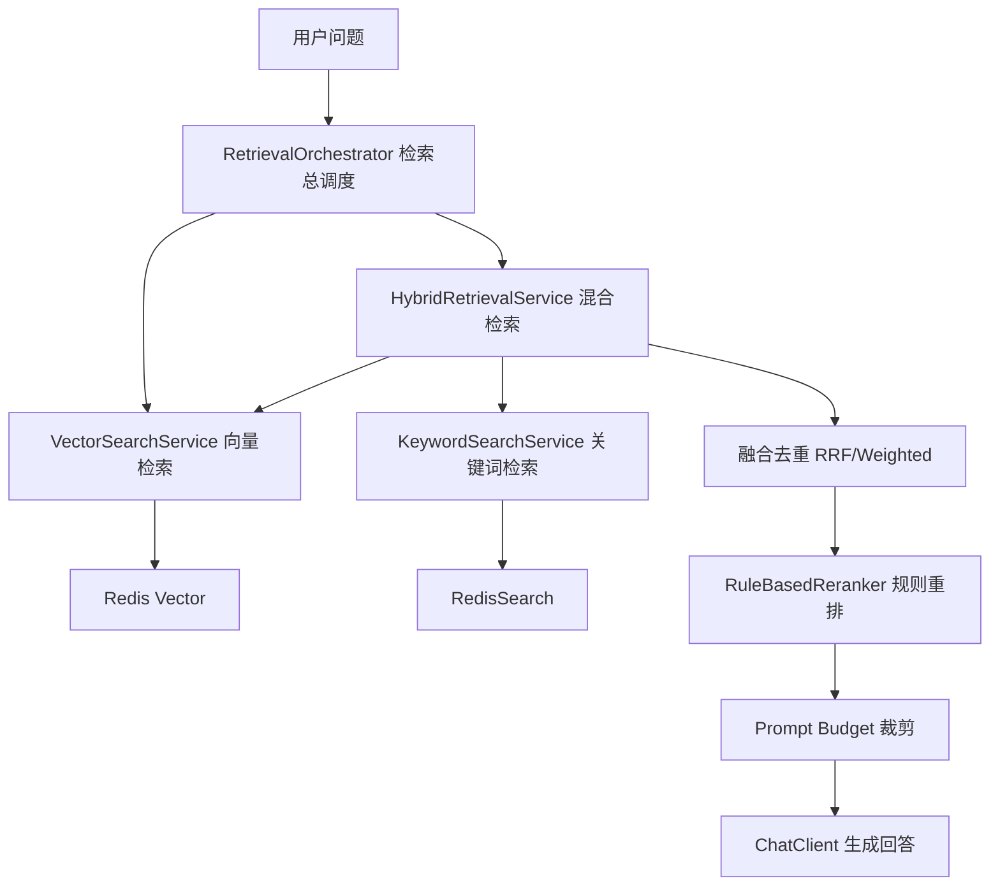

# Research Report: 这个文档最多描述的是啥？？

## 1. Executive Summary

Based on 5 evidence items, the research question '这个文档最多描述的是啥？？' points to a traceable information-gap opportunity. Key evidence: ### 4. 整体流程怎么走



按人话解释：

1. 用户问文档问题。
   比如：“这份文档的接口限制是什么？”

2. 文档问答 Agent 会先构造增强上下文。
   不是直接把问题丢给模型。

3. `RetrievalOrchestrator` 负责组织检索

## 2. Why This Matters

This research expands a FeedCard information gap into a traceable report grounded in available evidence.

## 3. Key Findings

- **Finding from rag**: ### 4. 整体流程怎么走

```mermaid
flowchart TD
  Q[用户问题] --> O[RetrievalOrchestrator 检索总调度]
  O --> V[VectorSearchService 向量检索]
  O --> H[HybridRetrievalService 混合检索]
  H --> V
  H --> K[KeywordSearchService 关键词检索]
  V --> RV[Redis Vector]
  K --> RS[RedisSearch]
  H --> F[融合去重 RRF/Weighted]
  F --> RR[Rul
- **Finding from rag**: ### 项目总述 2 分钟版

> 我这个项目叫 AgentHub，是一个基于 Spring AI 的多 Agent 编排平台。它不是简单封装 ChatClient，而是把文档问答、旅行规划、打车调度、面试辅助和通用聊天这些能力统一接到一个 Agent 运行时里。
>
> 我的主线可以这样讲：用户请求先进 AgentController，然后统一交给 AgentGateway。Gateway 会生成 AgentContext，里面有 runId、userId、sessionId、scene、agentCode、用户输入这些信息。之后系统会选择执行方式：简单场景走旧的 Legacy 链路，复杂或
- **Finding from rag**: ### 1. 这个点一句话到底在讲什么

这个点讲的是：模型回答文档问题前，先去资料库里查相关内容。
我没有只用一种查法，而是同时用“语义相似”和“关键词命中”两种方式查。
这样短问题、章节标题、专有名词这类场景更稳。
- **Finding from rag**: ### 1. 这个点一句话到底在讲什么

这个点讲的是：我把多个 AI 业务能力统一接到一个总入口里。
不管用户是问文档、做旅行规划、打车、面试辅助，还是普通聊天，后端都先走一套统一流程。
这样新增 Agent 不需要到处改 Controller，也方便统一做记录、记忆、流式返回和后续编排。
- **Finding from rag**: ### 2. 没有这个设计之前会有什么问题

如果文档问答只用向量检索，会有一些典型问题：

1. **短 Query 容易飘**
   比如用户只问“项目背景”“接口限制”“费用规则”，向量信息太少，可能召回到语义相近但不准确的段落。

2. **章节标题不一定语义最像**
   标题很短，但它可能是用户最想找的内容。纯向量可能不如关键词直接命中。

3. **专有名词容易漏**
   比如系统名、类名、工具名、业务名，关键词检索反而更可靠。

4. **召回太多会撑爆 Prompt**
   查到内容后还要控制长度，不然模型输入太长，成本高，也可能影响回答质量。

## 4. Evidence

- **AgentHub_多Agent编排平台_面试讲解融合版.md** (rag, score=0.5): ### 4. 整体流程怎么走

```mermaid
flowchart TD
  Q[用户问题] --> O[RetrievalOrchestrator 检索总调度]
  O --> V[VectorSearchService 向量检索]
  O --> H[HybridRetrievalService 混合检索]
  H --> V
  H --> K[KeywordSearchService 关键词检索]
  V --> RV[Redis Vector]
  K --> RS[RedisSearch]
  H --> F[融合去重 RRF/Weighted]
  F --> RR[RuleBasedReranker 规则重排]
  RR --> B[Prompt Budget 裁剪]
  B --> C[ChatClient 生成回答]
```

按人话解释：

1. 用户问文档问题。
   比如：“这份文档的接口限制是什么？”

2. 文档问答 Agent 会先构造增强上下文。
   不是直接把问题丢给模型。

3. `RetrievalOrchestrator` 负责组织检索
- **AgentHub_多Agent编排平台_面试讲解融合版.md** (rag, score=0.33333334): ### 项目总述 2 分钟版

> 我这个项目叫 AgentHub，是一个基于 Spring AI 的多 Agent 编排平台。它不是简单封装 ChatClient，而是把文档问答、旅行规划、打车调度、面试辅助和通用聊天这些能力统一接到一个 Agent 运行时里。
>
> 我的主线可以这样讲：用户请求先进 AgentController，然后统一交给 AgentGateway。Gateway 会生成 AgentContext，里面有 runId、userId、sessionId、scene、agentCode、用户输入这些信息。之后系统会选择执行方式：简单场景走旧的 Legacy 链路，复杂或指定场景走新的 Graph 编排链路。
>
> 在执行层，我把每个业务 Agent 抽成 AgentExecutor。文档问答、旅行、打车、面试、通用聊天都按这个接口接入，再由 AgentRegistry 统一管理。这样新增 Agent 不用到处改 Controller。
>
> Graph Workflow 这块，我把一次执行拆成 load_context、route、agent、final 四
- **AgentHub_多Agent编排平台_面试讲解融合版.md** (rag, score=0.32692307): ### 1. 这个点一句话到底在讲什么

这个点讲的是：模型回答文档问题前，先去资料库里查相关内容。
我没有只用一种查法，而是同时用“语义相似”和“关键词命中”两种方式查。
这样短问题、章节标题、专有名词这类场景更稳。
- **AgentHub_多Agent编排平台_面试讲解融合版.md** (rag, score=0.31111112): ### 1. 这个点一句话到底在讲什么

这个点讲的是：我把多个 AI 业务能力统一接到一个总入口里。
不管用户是问文档、做旅行规划、打车、面试辅助，还是普通聊天，后端都先走一套统一流程。
这样新增 Agent 不需要到处改 Controller，也方便统一做记录、记忆、流式返回和后续编排。
- **AgentHub_多Agent编排平台_面试讲解融合版.md** (rag, score=0.22916667): ### 2. 没有这个设计之前会有什么问题

如果文档问答只用向量检索，会有一些典型问题：

1. **短 Query 容易飘**
   比如用户只问“项目背景”“接口限制”“费用规则”，向量信息太少，可能召回到语义相近但不准确的段落。

2. **章节标题不一定语义最像**
   标题很短，但它可能是用户最想找的内容。纯向量可能不如关键词直接命中。

3. **专有名词容易漏**
   比如系统名、类名、工具名、业务名，关键词检索反而更可靠。

4. **召回太多会撑爆 Prompt**
   查到内容后还要控制长度，不然模型输入太长，成本高，也可能影响回答质量。

## 5. Information Gap Analysis

The key information gap is whether the observed signal is merely a news item or an actionable opportunity for the user.

## 6. Opportunities

- **Generate a focused report**: Convert the FeedCard signal into a concise research artifact for later comparison.
- **Create a reusable skill draft**: Capture the repeated workflow: load signal, gather evidence, build GSSC context, produce report.
- **Follow the strongest source**: Start from: AgentHub_多Agent编排平台_面试讲解融合版.md

## 7. Risks and Uncertainties

- **Low confidence source**: At least one source has low credibility or weak retrieval score.

## 8. Suggested Actions

- **Save report**: Keep the markdown artifact for later review.
- **Add memory**: Record this research run as episodic memory.
- **Review evidence**: Open sources manually before making product or investment decisions.

## 9. Sources

- AgentHub_多Agent编排平台_面试讲解融合版.md: no URL
- AgentHub_多Agent编排平台_面试讲解融合版.md: no URL
- AgentHub_多Agent编排平台_面试讲解融合版.md: no URL
- AgentHub_多Agent编排平台_面试讲解融合版.md: no URL
- AgentHub_多Agent编排平台_面试讲解融合版.md: no URL